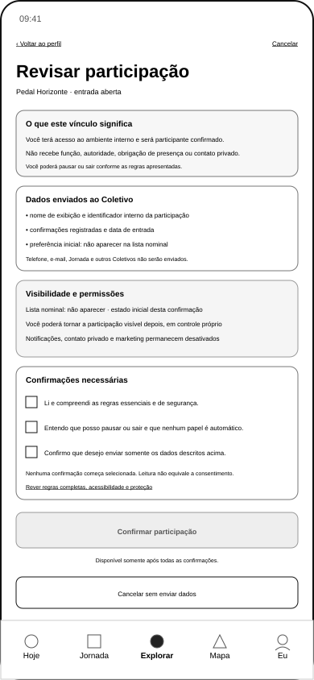
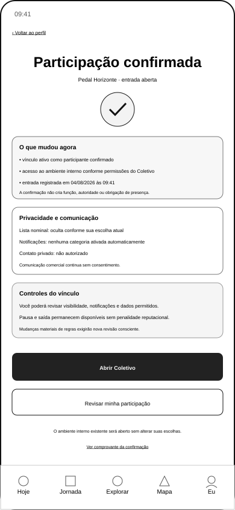
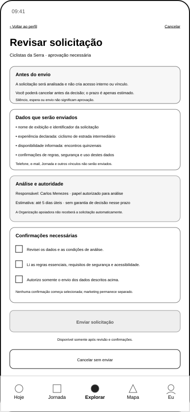
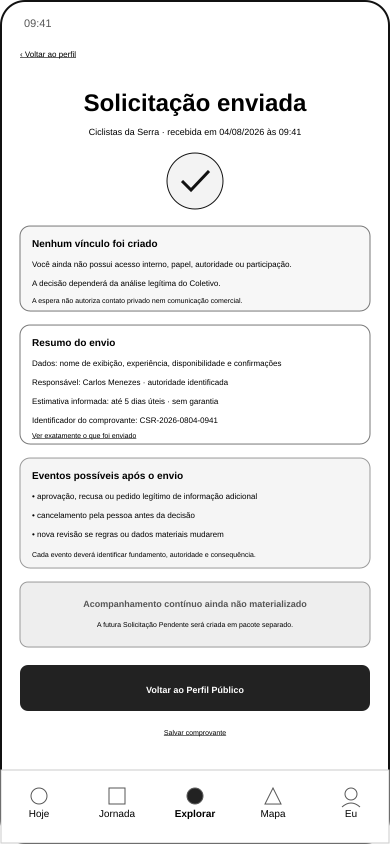
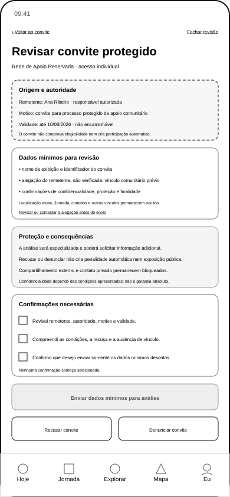
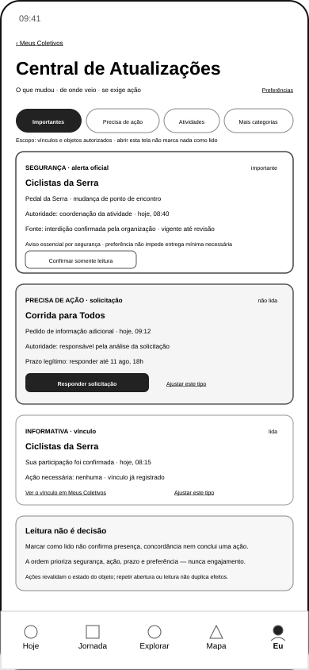
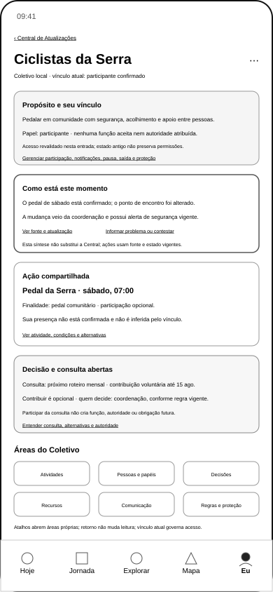

# Coletivos

[← Organização e Oportunidades](screen-gallery-opportunities-organization.md) · [Índice](screen-gallery.md) · [Matriz por SVG](screen-gallery-traceability-matrix.md) · [Próxima: Opportunity Boost — Exposição →](screen-gallery-opportunity-boost-exposure.md)

## 1. Ordem funcional de inspeção

```text
explorar e buscar
→ Perfil Público
→ revisão e solicitação
→ Solicitação Pendente
→ Visão Geral do Responsável
→ gestão completa de solicitações
→ resultado aprovado
→ Meus Coletivos
→ Central de Atualizações
→ Início do Participante
```

A galeria agora alcança visualmente `PER-108`. A UXA-095 reforma minimamente a Central para tornar `TRN-111` observável e materializa o novo Início; ambos aguardam validação específica.

## 2. Descoberta e busca

**Cobertura:** 5 SVGs · IDs: `GKR-SURF-PER-101`, `GKR-SURF-PER-102` · origem: `UXA-060` · validação: `UXA-061`

### `uxa-060-collective-discovery-origin-mobile.svg`
{ width="320" loading="lazy" }

### `uxa-060-collective-explore-mobile.svg`
{ width="320" loading="lazy" }

### `uxa-060-collective-search-filters-mobile.svg`
{ width="320" loading="lazy" }

### `uxa-060-collective-search-results-mobile.svg`
{ width="320" loading="lazy" }

### `uxa-060-collective-search-no-results-mobile.svg`
{ width="320" loading="lazy" }

## 3. Perfil Público do Coletivo

**Cobertura:** 4 SVGs · IDs: `GKR-SURF-PER-103`, `GKR-SURF-COL-001` · origem: `UXA-062` · validação: `UXA-063`

### `uxa-062-collective-public-profile-open-entry-mobile.svg`
{ width="320" loading="lazy" }

### `uxa-062-collective-public-profile-approval-entry-mobile.svg`
{ width="320" loading="lazy" }

### `uxa-062-collective-public-profile-closed-entry-mobile.svg`
{ width="320" loading="lazy" }

### `uxa-062-collective-public-profile-protected-mobile.svg`
{ width="320" loading="lazy" }

## 4. Revisão e solicitação

**Cobertura:** 5 SVGs · ID: `GKR-SURF-PER-104` · origem: `UXA-064` · validação: `UXA-065`

### `uxa-064-collective-participation-open-entry-review-mobile.svg`
{ width="320" loading="lazy" }

### `uxa-064-collective-participation-open-entry-confirmed-mobile.svg`
{ width="320" loading="lazy" }

### `uxa-064-collective-participation-approval-request-review-mobile.svg`
{ width="320" loading="lazy" }

### `uxa-064-collective-participation-approval-request-receipt-mobile.svg`
{ width="320" loading="lazy" }

### `uxa-064-collective-participation-protected-invite-review-mobile.svg`
{ width="320" loading="lazy" }

## 5. Solicitação Pendente

**Cobertura:** 8 SVGs · IDs: `GKR-SURF-PER-105`, `GKR-SURF-COL-003` · origem: `UXA-066`

### `uxa-066-collective-pending-request-awaiting-decision-mobile.svg`
{ width="320" loading="lazy" }

### `uxa-066-collective-pending-request-protected-analysis-mobile.svg`
{ width="320" loading="lazy" }

### `uxa-066-collective-pending-request-additional-information-required-mobile.svg`
{ width="320" loading="lazy" }

### `uxa-066-collective-pending-request-additional-information-review-mobile.svg`
{ width="320" loading="lazy" }

### `uxa-066-collective-pending-request-approved-mobile.svg`
{ width="320" loading="lazy" }

### `uxa-066-collective-pending-request-refused-mobile.svg`
{ width="320" loading="lazy" }

### `uxa-066-collective-pending-request-cancelled-mobile.svg`
{ width="320" loading="lazy" }

### `uxa-066-collective-pending-request-expired-mobile.svg`
{ width="320" loading="lazy" }

A família possui oito estados com validação funcional vigente; o estado aprovado corrente foi revalidado pela UXA-092.

## 6. Referência inicial do Coletivo

**Cobertura:** 1 SVG · ID: `GKR-SURF-COL-001` · origem: `UXA-016` · validação: `UXA-018`

### `uxa-016-collective-home-mobile.svg`
{ width="320" loading="lazy" }

## 7. Visão Geral do Responsável

**Cobertura:** 1 SVG · ID: `GKR-SURF-COL-002` · origem: `UXA-086` · reformulação e validação: **UXA-087**

### `uxa-086-collective-responsible-overview-desktop.svg`
{ width="720" loading="lazy" }

`GKR-TRN-112` está integralmente validada pela UXA-090.

## 8. Gestão de Solicitações do Responsável

**Cobertura:** 7 SVGs · ID: `GKR-SURF-COL-003` · origem: `UXA-088` · reformulação e validação: **UXA-089**

### `uxa-088-collective-request-management-queue-desktop.svg`
{ width="720" loading="lazy" }

### `uxa-088-collective-request-management-detail-desktop.svg`
{ width="720" loading="lazy" }

### `uxa-088-collective-request-management-protected-detail-desktop.svg`
{ width="720" loading="lazy" }

### `uxa-088-collective-request-management-additional-information-desktop.svg`
{ width="720" loading="lazy" }

### `uxa-088-collective-request-management-approve-confirmation-desktop.svg`
{ width="720" loading="lazy" }

### `uxa-088-collective-request-management-refuse-confirmation-desktop.svg`
{ width="720" loading="lazy" }

### `uxa-088-collective-request-management-insufficient-authority-desktop.svg`
{ width="720" loading="lazy" }

A UXA-090/092 validou os handoffs aplicáveis do fluxo de solicitação.

## 9. Meus Coletivos

**Cobertura:** 1 SVG · ID: `GKR-SURF-PER-106` · origem: `UXA-091` · validação corrente: **UXA-092/094**

### `uxa-091-my-collectives-mobile.svg`
{ width="320" loading="lazy" }

`GKR-TRN-108` e `GKR-TRN-110` permanecem integralmente validadas.

## 10. Central de Atualizações

**Cobertura:** 1 SVG · ID: `GKR-SURF-PER-107` · origem: `UXA-093` · validação anterior: UXA-094 · **versão corrente reformulada: UXA-095, pendente de revalidação**

### `uxa-093-collective-updates-center-mobile.svg`
{ width="320" loading="lazy" }

A UXA-095 adiciona somente `Abrir início do Coletivo` no contexto de vínculo já existente. Como o SVG foi alterado após UXA-094, a representação corrente não conserva validação por inferência.

## 11. Início do Participante

**Cobertura:** 1 SVG · ID: `GKR-SURF-PER-108` · origem/materialização: **UXA-095** · validação: **pendente**

### `uxa-095-collective-participant-home-mobile.svg`
{ width="320" loading="lazy" }

A referência sintetiza propósito, vínculo, momento, ação compartilhada, consulta e autonomia. Não replica a Central ou canais internos especializados e não infere presença, função ou autoridade.

`GKR-TRN-111` passa a **parcial**: os dois endpoints estão representados, mas a origem corrente, o novo destino e a ligação exigem validação integrada.

## 12. Dependências ainda sem SVG dedicado

`GKR-SURF-COL-004` a `GKR-SURF-COL-008` permanecem fora deste pacote. Estados alternativos P0B/P1 também permanecem separados.

## 13. Cobertura desta página

| Indicador | Resultado |
|---|---:|
| SVGs | **34** |
| validados na versão corrente | **32** |
| pendentes | **2: PER-107 corrente + PER-108** |

As outras dez pendências globais permanecem nos estados residuais da UXA-055.

## 14. Próximo gate

**UXA-096 — Validação Funcional do Início do Participante, Revalidação de PER-107 e Validação Integrada de GKR-TRN-111**, mediante autorização separada.

A UXA-096 não é iniciada pela UXA-095.

[← Organização e Oportunidades](screen-gallery-opportunities-organization.md) · [Índice](screen-gallery.md) · [Matriz por SVG](screen-gallery-traceability-matrix.md) · [Próxima: Opportunity Boost — Exposição →](screen-gallery-opportunity-boost-exposure.md)
