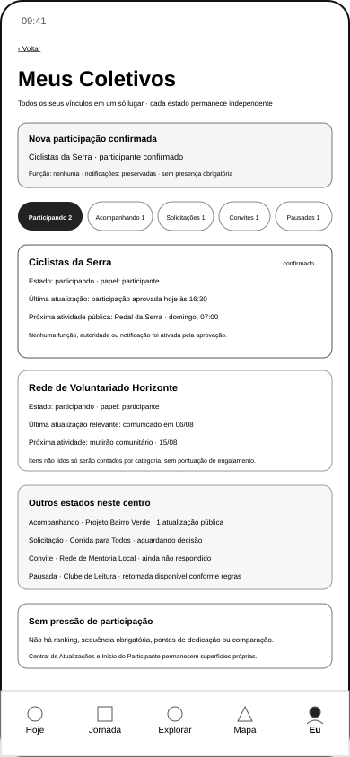

# Coletivos

[← Organização e Oportunidades](screen-gallery-opportunities-organization.md) · [Índice](screen-gallery.md) · [Matriz por SVG](screen-gallery-traceability-matrix.md) · [Próxima: Opportunity Boost — Exposição →](screen-gallery-opportunity-boost-exposure.md)

## 1. Ordem funcional de inspeção

```text
explorar e buscar
→ Perfil Público
→ revisão e solicitação
→ Solicitação Pendente
→ Visão Geral do Responsável
→ gestão completa de solicitações
→ resultado aprovado
→ Meus Coletivos
→ Central de Atualizações
→ Início do Participante
```

A galeria cobre visualmente a sequência até `Meus Coletivos`. `COL-002` e `COL-003` permanecem funcionalmente validadas em seus escopos. Os handoffs `105`, `106`, `107`, `109` e `112` permanecem integralmente validados pela UXA-090. `TRN-108` continua parcial e `PER-106` aguarda validação funcional.

## 2. Descoberta e busca

**Cobertura:** 5 SVGs · IDs: `GKR-SURF-PER-101`, `GKR-SURF-PER-102` · origem: `UXA-060` · validação: `UXA-061`

- `uxa-060-collective-discovery-origin-mobile.svg`
- `uxa-060-collective-explore-mobile.svg`
- `uxa-060-collective-search-filters-mobile.svg`
- `uxa-060-collective-search-results-mobile.svg`
- `uxa-060-collective-search-no-results-mobile.svg`

Todos permanecem disponíveis em `../assets/wireframes/` e associados individualmente na matriz.

## 3. Perfil Público do Coletivo

**Cobertura:** 4 SVGs · IDs: `GKR-SURF-PER-103`, `GKR-SURF-COL-001` · origem: `UXA-062` · validação: `UXA-063`

- `uxa-062-collective-public-profile-open-entry-mobile.svg`
- `uxa-062-collective-public-profile-approval-entry-mobile.svg`
- `uxa-062-collective-public-profile-closed-entry-mobile.svg`
- `uxa-062-collective-public-profile-protected-mobile.svg`

## 4. Revisão e solicitação

**Cobertura:** 5 SVGs · ID: `GKR-SURF-PER-104` · origem: `UXA-064` · validação: `UXA-065`

- `uxa-064-collective-participation-open-entry-review-mobile.svg`
- `uxa-064-collective-participation-open-entry-confirmed-mobile.svg`
- `uxa-064-collective-participation-approval-request-review-mobile.svg`
- `uxa-064-collective-participation-approval-request-receipt-mobile.svg`
- `uxa-064-collective-participation-protected-invite-review-mobile.svg`

## 5. Solicitação Pendente

**Cobertura:** 8 SVGs · ID principal: `GKR-SURF-PER-105` · origem: `UXA-066`

- `uxa-066-collective-pending-request-awaiting-decision-mobile.svg`
- `uxa-066-collective-pending-request-protected-analysis-mobile.svg`
- `uxa-066-collective-pending-request-additional-information-required-mobile.svg`
- `uxa-066-collective-pending-request-additional-information-review-mobile.svg`
- `uxa-066-collective-pending-request-approved-mobile.svg`
- `uxa-066-collective-pending-request-refused-mobile.svg`
- `uxa-066-collective-pending-request-cancelled-mobile.svg`
- `uxa-066-collective-pending-request-expired-mobile.svg`

A UXA-067 validou os oito estados na versão então vigente. A UXA-091 **reformulou apenas o estado aprovado**, substituindo a continuidade genérica por `Ver em Meus Coletivos`. Portanto:

- 7 estados permanecem com validação funcional vigente de UXA-067;
- o estado aprovado corrente aguarda revalidação em UXA-092;
- os handoffs `105`, `106`, `107` e `109` permanecem integralmente validados pela UXA-090 nos escopos que não dependem dessa nova continuidade.

### Estado aprovado corrente

{ width="320" loading="lazy" }

## 6. Referência inicial do Coletivo

**Cobertura:** 1 SVG · ID: `GKR-SURF-COL-001` · origem: `UXA-016` · validação: `UXA-018`

{ width="320" loading="lazy" }

## 7. Visão Geral do Responsável

**Cobertura:** 1 SVG · ID: `GKR-SURF-COL-002` · origem: `UXA-086` · reformulação e validação: `UXA-087`

{ width="720" loading="lazy" }

`GKR-TRN-112` permanece integralmente validada pela UXA-090.

## 8. Gestão de Solicitações do Responsável

**Cobertura:** 7 SVGs · ID: `GKR-SURF-COL-003` · origem: `UXA-088` · reformulação e validação: `UXA-089`

- `uxa-088-collective-request-management-queue-desktop.svg`
- `uxa-088-collective-request-management-detail-desktop.svg`
- `uxa-088-collective-request-management-protected-detail-desktop.svg`
- `uxa-088-collective-request-management-additional-information-desktop.svg`
- `uxa-088-collective-request-management-approve-confirmation-desktop.svg`
- `uxa-088-collective-request-management-refuse-confirmation-desktop.svg`
- `uxa-088-collective-request-management-insufficient-authority-desktop.svg`

Os sete estados permanecem funcionalmente validados por UXA-089. A UXA-090 mantém `TRN-105`, `106`, `107`, `109` e `112` integralmente validadas.

## 9. Meus Coletivos

**Cobertura:** 1 SVG · ID: `GKR-SURF-PER-106` · origem: `UXA-091` · validação: **pendente**

### `uxa-091-my-collectives-mobile.svg`

{ width="320" loading="lazy" }

A referência organiza Participando, Acompanhando, Solicitações, Convites e Pausadas sem converter esses estados em progressão, ranking ou pontuação. O vínculo recém-aprovado aparece com função, notificações e presença preservadas, sem atribuição automática.

`PER-106` não substitui a Central de Atualizações nem o Início do Participante. `TRN-108` continua parcial e `TRN-110` possui somente a origem materializada.

## 10. Dependências sem SVG dedicado

```text
GKR-SURF-PER-107 — Central de Atualizações
→ GKR-SURF-PER-108 — Início do Participante
```

`GKR-SURF-COL-004` a `GKR-SURF-COL-008` também permanecem fora deste pacote.

## 11. Cobertura desta página

| Indicador | Resultado |
|---|---:|
| SVGs de Coletivos nesta página | 32 |
| novo SVG na UXA-091 | 1 |
| SVG existente reformulado na UXA-091 | 1 |
| validações vigentes nesta página | 30 |
| pendentes nesta página | 2 |

As duas pendências são o estado aprovado corrente de `PER-105` e `PER-106`.

## 12. Próximo gate

A próxima frente possível é **UXA-092 — Validação Funcional de Meus Coletivos e Revalidação da Continuidade Pós-Aprovação**. Ela não é iniciada pela UXA-091.

[← Organização e Oportunidades](screen-gallery-opportunities-organization.md) · [Índice](screen-gallery.md) · [Matriz por SVG](screen-gallery-traceability-matrix.md) · [Próxima: Opportunity Boost — Exposição →](screen-gallery-opportunity-boost-exposure.md)
