# Coletivos

[← Organização e Oportunidades](screen-gallery-opportunities-organization.md) · [Índice](screen-gallery.md) · [Matriz por SVG](screen-gallery-traceability-matrix.md) · [Próxima: Opportunity Boost — Exposição →](screen-gallery-opportunity-boost-exposure.md)

## 1. Ordem funcional de inspeção

```text
explorar e buscar
→ Perfil Público
→ revisão e solicitação
→ Solicitação Pendente
→ Visão Geral do Responsável
→ gestão completa de solicitações
→ Meus Coletivos
→ Central de Atualizações
→ Início do Participante
```

A galeria cobre visualmente a sequência até a gestão de solicitações do responsável. `COL-002` está validada pela UXA-087; a família de `COL-003` foi materializada pela UXA-088 e permanece com validação funcional pendente.

## 2. Descoberta e busca

**Cobertura:** 5 SVGs · IDs: `GKR-SURF-PER-101`, `GKR-SURF-PER-102` · origem: `UXA-060` · validação: `UXA-061`

- `uxa-060-collective-discovery-origin-mobile.svg`
- `uxa-060-collective-explore-mobile.svg`
- `uxa-060-collective-search-filters-mobile.svg`
- `uxa-060-collective-search-results-mobile.svg`
- `uxa-060-collective-search-no-results-mobile.svg`

## 3. Perfil Público do Coletivo

**Cobertura:** 4 SVGs · IDs: `GKR-SURF-PER-103`, `GKR-SURF-COL-001` · origem: `UXA-062` · validação: `UXA-063`

- `uxa-062-collective-public-profile-open-entry-mobile.svg`
- `uxa-062-collective-public-profile-approval-entry-mobile.svg`
- `uxa-062-collective-public-profile-closed-entry-mobile.svg`
- `uxa-062-collective-public-profile-protected-mobile.svg`

## 4. Revisão e solicitação

**Cobertura:** 5 SVGs · ID: `GKR-SURF-PER-104` · origem: `UXA-064` · validação: `UXA-065`

- `uxa-064-collective-participation-open-entry-review-mobile.svg`
- `uxa-064-collective-participation-open-entry-confirmed-mobile.svg`
- `uxa-064-collective-participation-approval-request-review-mobile.svg`
- `uxa-064-collective-participation-approval-request-receipt-mobile.svg`
- `uxa-064-collective-participation-protected-invite-review-mobile.svg`

## 5. Solicitação Pendente — perspectiva da Pessoa

**Cobertura:** 8 SVGs · ID principal: `GKR-SURF-PER-105` · origem: `UXA-066` · validação: `UXA-067`

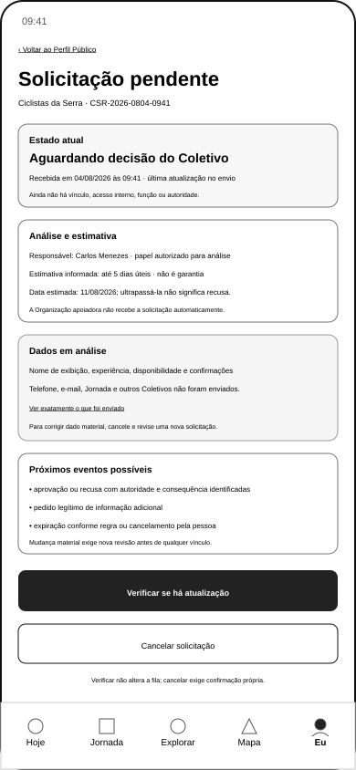{ width="320" loading="lazy" }
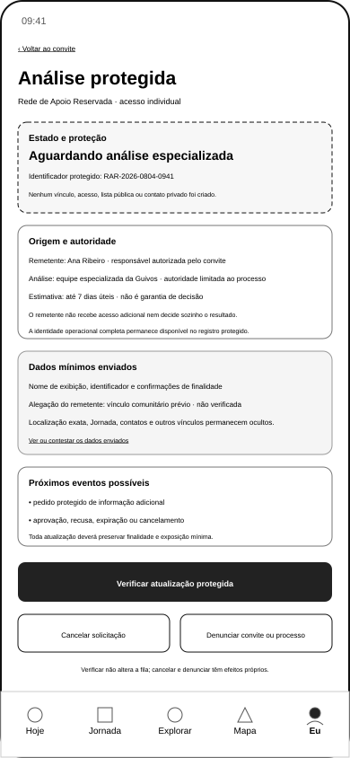{ width="320" loading="lazy" }
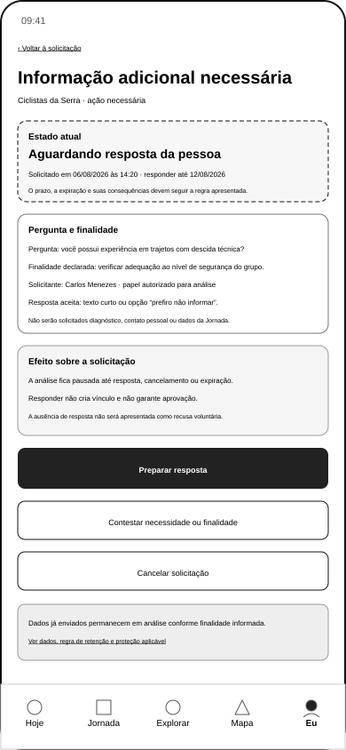{ width="320" loading="lazy" }
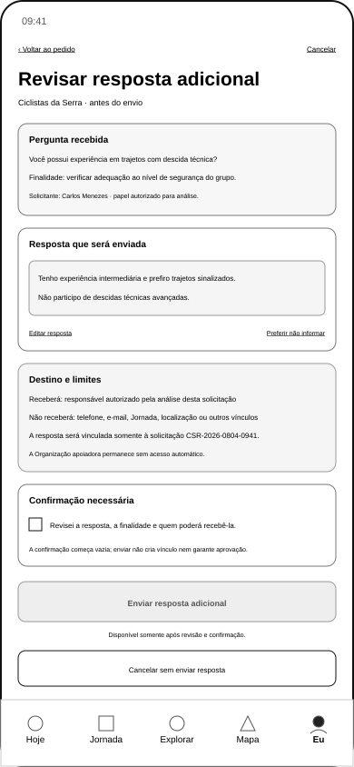{ width="320" loading="lazy" }
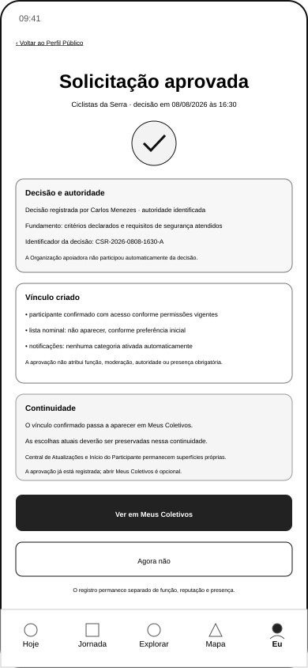{ width="320" loading="lazy" }
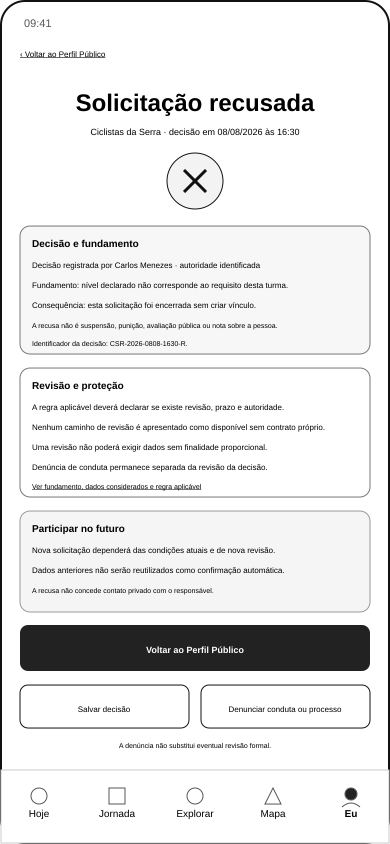{ width="320" loading="lazy" }
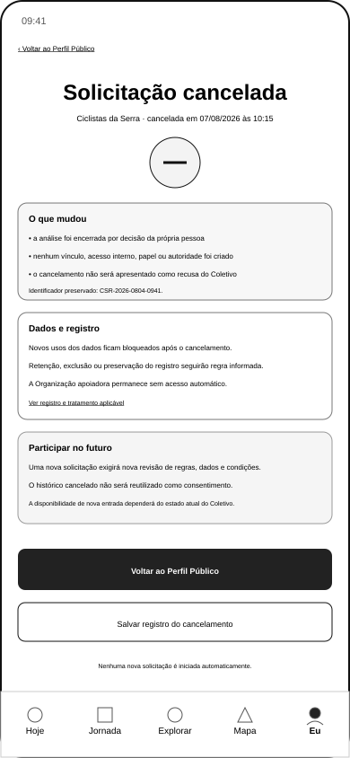{ width="320" loading="lazy" }
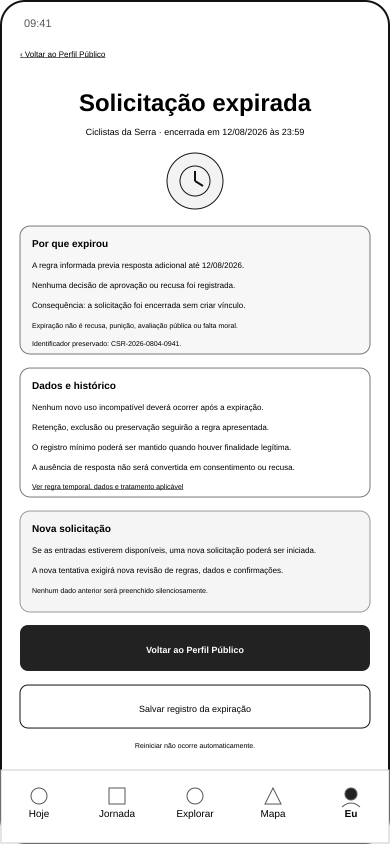{ width="320" loading="lazy" }

Os oito estados estão validados somente na perspectiva da Pessoa. A UXA-088 não altera essa validação.

## 6. Referência inicial do Coletivo

**Cobertura:** 1 SVG · ID: `GKR-SURF-COL-001` · origem: `UXA-016` · validação: `UXA-018`

{ width="320" loading="lazy" }

## 7. Visão Geral do Responsável

**Cobertura:** 1 SVG · ID: `GKR-SURF-COL-002` · origem: `UXA-086` · reformulação e validação: `UXA-087`

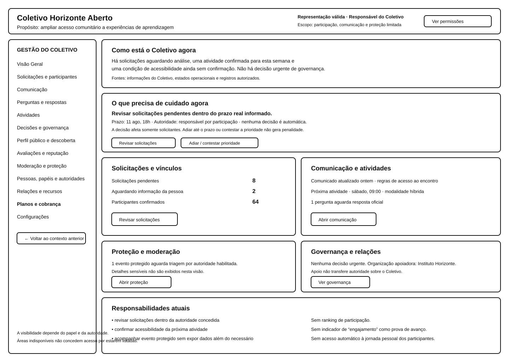{ width="720" loading="lazy" }

`COL-002` está funcionalmente validada no escopo da superfície. A continuidade para `COL-003` continua não validada como conjunto.

## 8. Gestão de Solicitações do Responsável

**Cobertura:** 7 SVGs · ID: `GKR-SURF-COL-003` · origem: `UXA-088` · validação: **pendente de pacote específico**

### Fila operacional
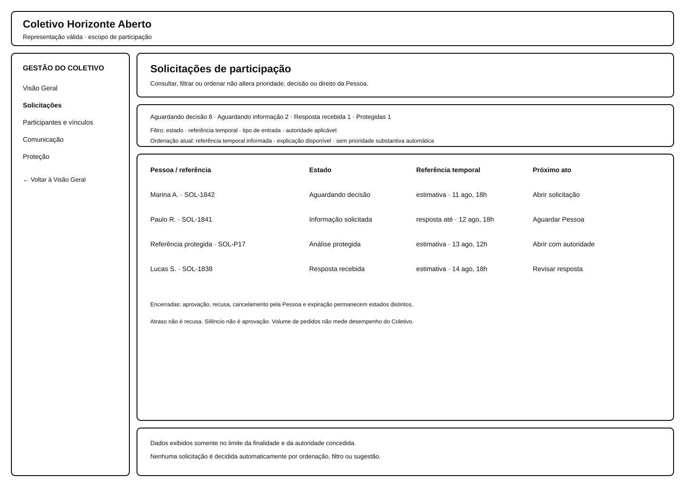{ width="720" loading="lazy" }

### Detalhe comum
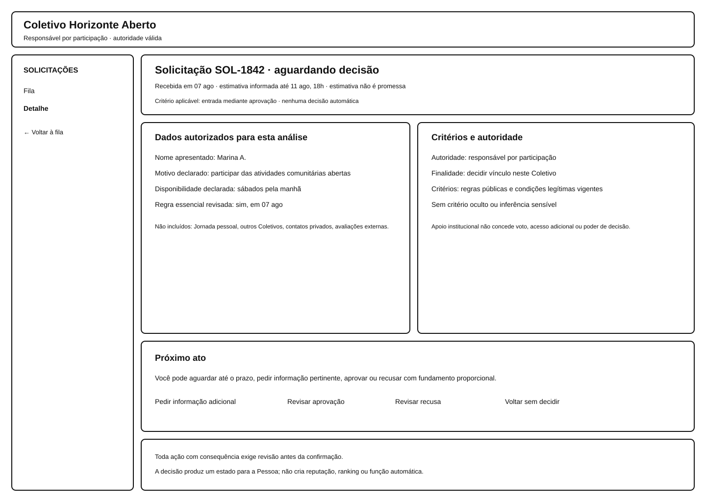{ width="720" loading="lazy" }

### Análise protegida
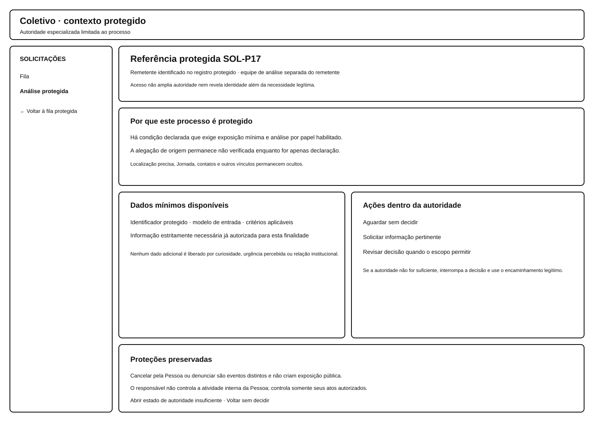{ width="720" loading="lazy" }

### Pedido adicional
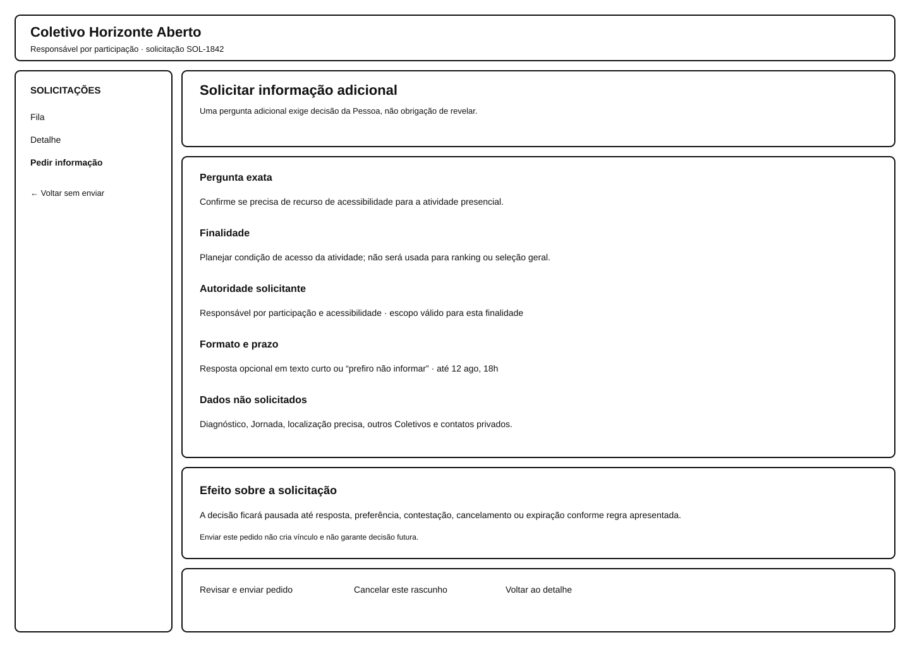{ width="720" loading="lazy" }

### Confirmação de aprovação
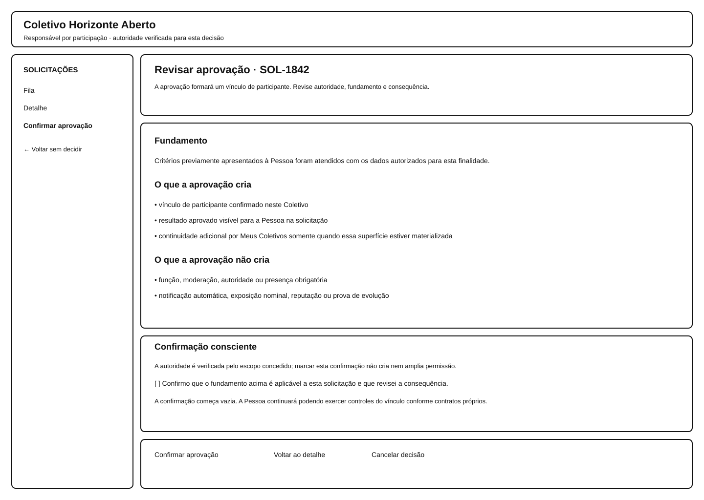{ width="720" loading="lazy" }

### Confirmação de recusa
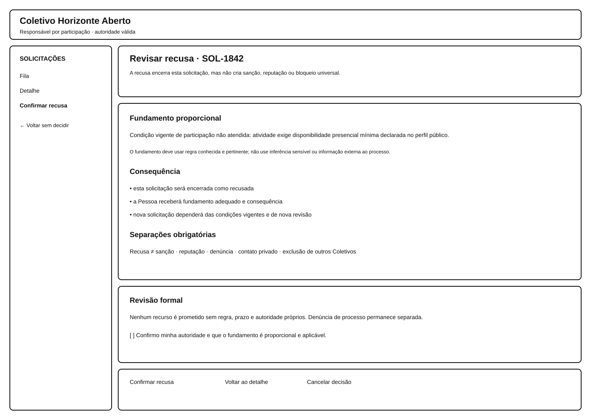{ width="720" loading="lazy" }

### Autoridade insuficiente
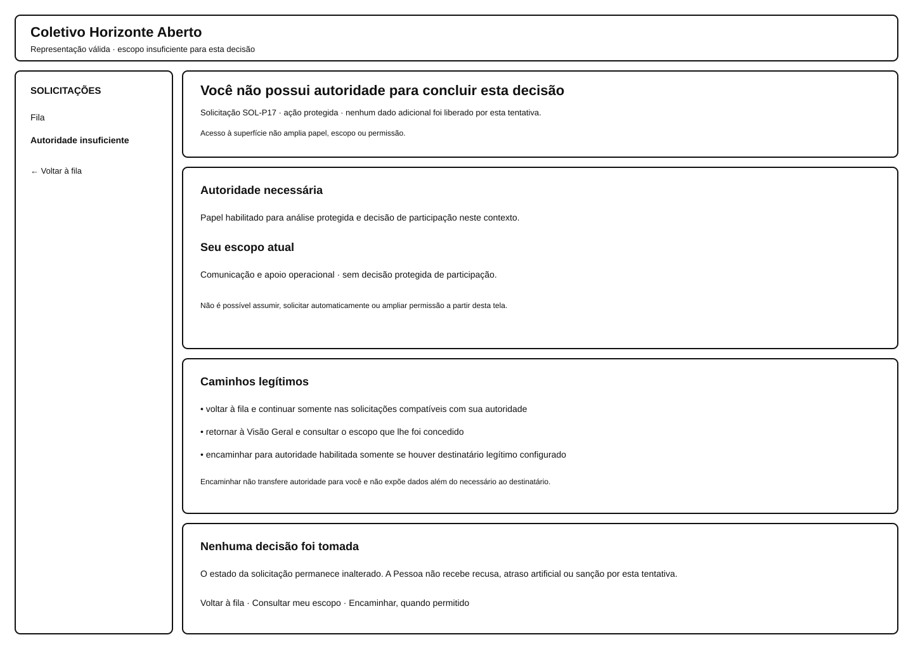{ width="720" loading="lazy" }

A família materializa a operação responsável dos handoffs `TRN-105` a `TRN-109` e o destino de `TRN-112`, mas não valida essas transições ponta a ponta. Cancelamento pela Pessoa e expiração são eventos refletidos, não decisões equivalentes do responsável.

## 9. Dependências ainda sem SVG dedicado

```text
GKR-SURF-PER-106 — Meus Coletivos
→ GKR-SURF-PER-107 — Central de Atualizações
→ GKR-SURF-PER-108 — Início do Participante
```

`GKR-SURF-COL-003` deixa de estar visualmente ausente, mas permanece com validação funcional pendente. `COL-004` a `COL-008` também permanecem fora deste pacote.

[← Organização e Oportunidades](screen-gallery-opportunities-organization.md) · [Índice](screen-gallery.md) · [Matriz por SVG](screen-gallery-traceability-matrix.md) · [Próxima: Opportunity Boost — Exposição →](screen-gallery-opportunity-boost-exposure.md)
