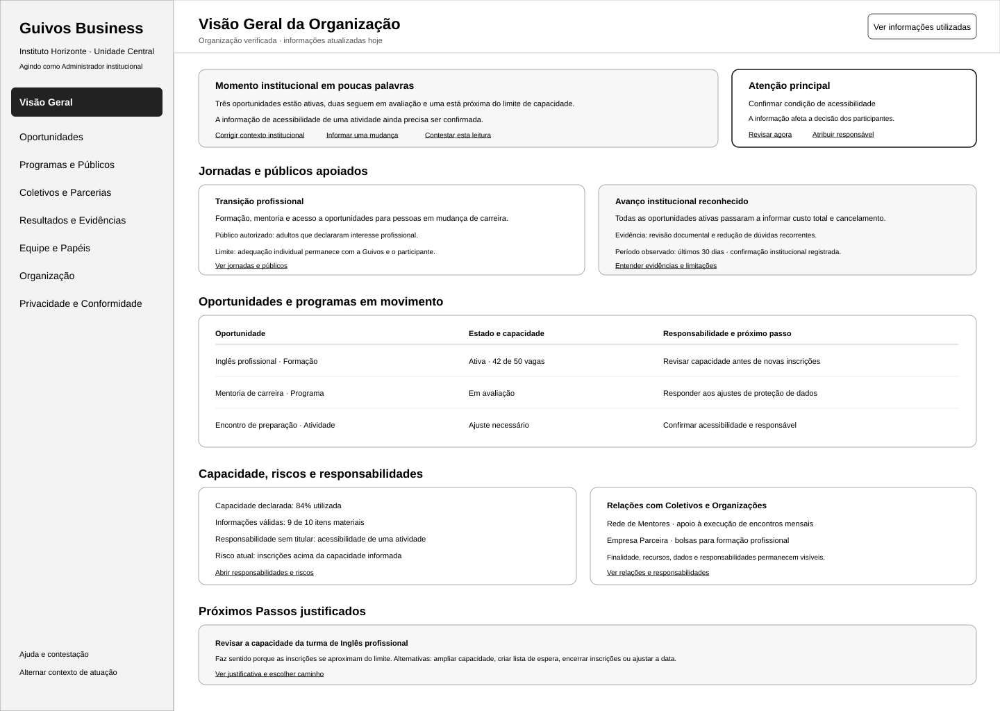
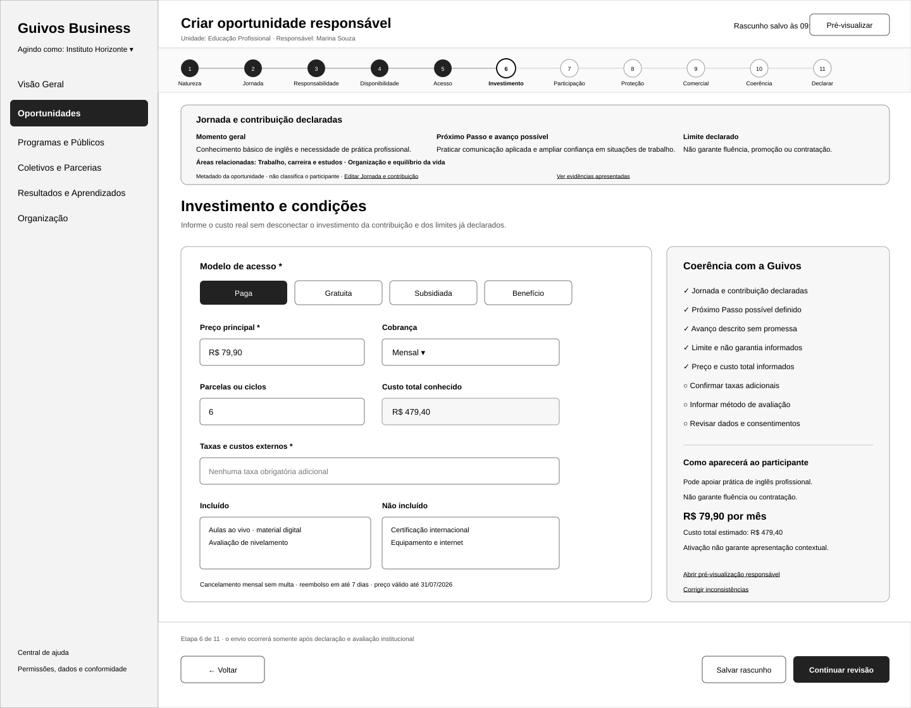
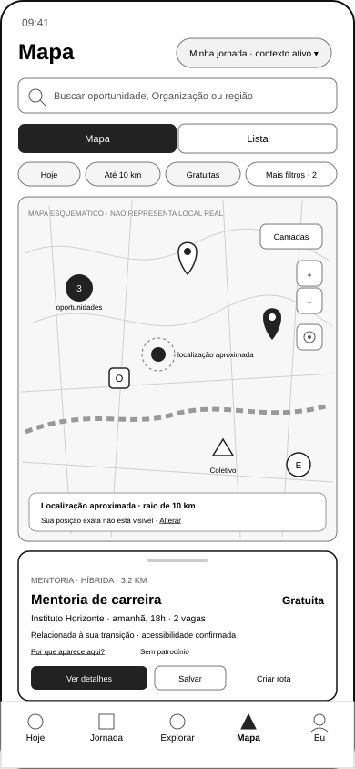
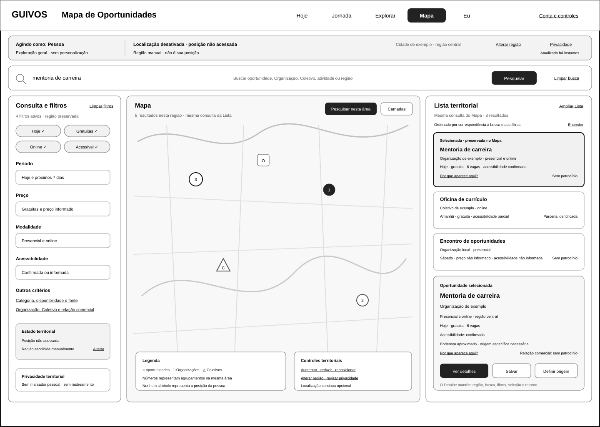
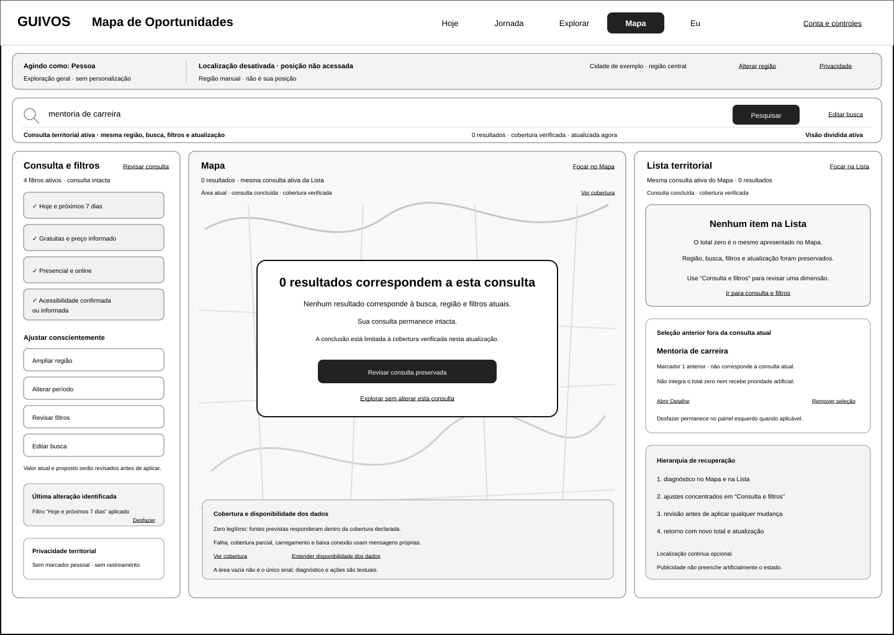
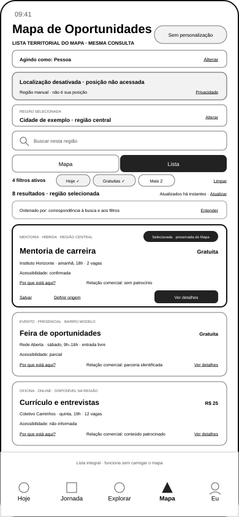

# Organização e Oportunidades

[← Pessoa](screen-gallery-person.md) · [Índice](screen-gallery.md) · [Matriz por SVG](screen-gallery-traceability-matrix.md) · [Próxima: Coletivos →](screen-gallery-collectives.md)

## 1. Ordem funcional de inspeção

```text
Visão Geral da Organização
→ cadastro e ativação institucional
→ mapa de oportunidades
↔ lista sincronizada
→ detalhe
→ revisão consciente de saída no próprio detalhe
→ fronteira externa identificada
```

A UXA-098 valida `GKR-TRN-203`, `204`, `210` e `211`. A UXA-101 valida `GKR-TRN-205` até `GKR-SURF-BND-001`, preservando o destino externo fora da autoridade da Guivos.

## 2. Organização

**Cobertura:** 2 SVGs · IDs: `GKR-SURF-ORG-001`, `GKR-SURF-ORG-002`, `GKR-SURF-ORG-003` · origem: `UXA-015`, `UXA-008` · validação: `UXA-017`, `UXA-013`; continuidade de publicação: `UXA-098`

### `uxa-015-organization-overview-desktop.svg`

{ width="320" loading="lazy" }

### `uxa-008-organization-opportunity-registration-desktop.svg`

{ width="320" loading="lazy" }

## 3. Mapa de Oportunidades

**Cobertura:** 5 SVGs · ID: `GKR-SURF-PER-201` · validações locais: `UXA-025`, `UXA-027`, `UXA-031`, `UXA-033`; integração: `UXA-098`

### `uxa-024-opportunity-map-mobile.svg`

{ width="320" loading="lazy" }

### `uxa-026-opportunity-map-location-disabled-mobile.svg`

{ width="320" loading="lazy" }

### `uxa-030-opportunity-map-no-results-mobile.svg`

{ width="320" loading="lazy" }

### `uxa-032-opportunity-map-desktop.svg`

{ width="320" loading="lazy" }

### `uxa-032-opportunity-map-no-results-desktop.svg`

{ width="320" loading="lazy" }

## 4. Lista de Oportunidades

**Cobertura:** 1 SVG · ID: `GKR-SURF-PER-202` · validação local: `UXA-029`; integração com Mapa e Detalhe: `UXA-098`

### `uxa-028-opportunity-map-list-mobile.svg`

{ width="320" loading="lazy" }

## 5. Detalhe e revisão consciente de saída

**Cobertura:** 1 SVG · ID: `GKR-SURF-PER-203` · validação original: `UXA-012`; entradas integradas: `UXA-098`; reformulação/revalidação de saída: `UXA-101`

### `uxa-007-opportunity-detail-mobile.svg`

{ width="320" loading="lazy" }

O mesmo SVG agora mostra dois estados da mesma responsabilidade `PER-203`: o Detalhe e a revisão acionada por `Ver como participar`. A revisão identifica que a próxima etapa é externa, quem responde por ela, o tratamento de dados/contexto, os limites da Guivos e as opções de continuar ou voltar.

Nenhum SVG é criado para `BND-001`.

## 6. Limite

A continuidade orgânica `publicação → descoberta → Mapa/Lista → Detalhe → fronteira externa` está documentalmente validada nos limites de autoridade definidos pelas UXA-098 e UXA-101.

Isso **não** valida inscrição, reserva, compra, contratação, disponibilidade, autenticação ou qualquer outro processo executado pelo terceiro depois de `BND-001`. Integrações patrocinadas `TRN-304/306` permanecem parciais.

O status `active` registra o instrumento de inspeção e não inicia protótipo ou Engenharia de Produto.

[← Pessoa](screen-gallery-person.md) · [Índice](screen-gallery.md) · [Matriz por SVG](screen-gallery-traceability-matrix.md) · [Próxima: Coletivos →](screen-gallery-collectives.md)