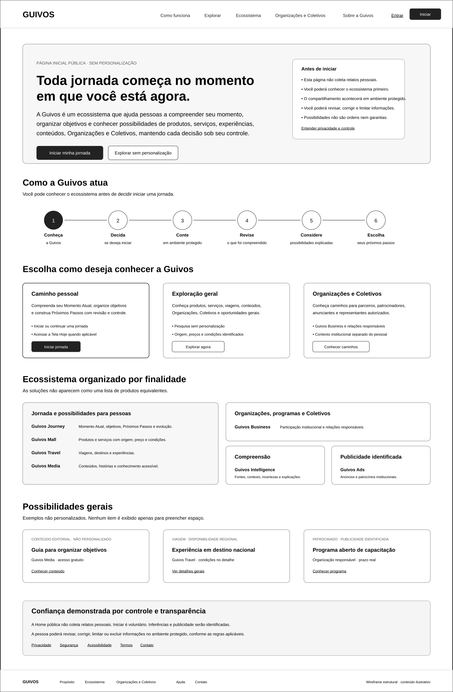
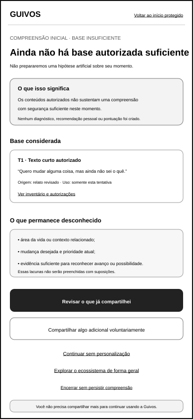
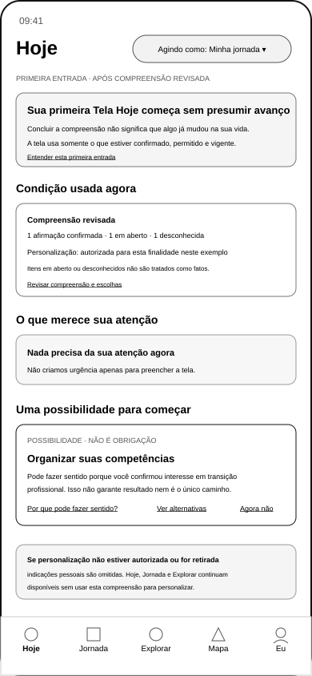

# Pessoa — Fundação, Entrada, Compreensão e Recorrência

[← Índice da galeria](screen-gallery.md) · [Matriz por SVG](screen-gallery-traceability-matrix.md) · [Próxima: Oportunidades e Organização →](screen-gallery-opportunities-organization.md)

## 1. Ordem funcional de inspeção

```text
Home pública
→ início protegido
→ expressão guiada
→ compreensão inicial
→ primeira Tela Hoje
→ Tela Hoje recorrente
```

A UXA-097 valida `GKR-TRN-007` entre a compreensão inicial e a primeira Tela Hoje. Isso não valida os handoffs pessoais anteriores ainda parciais.

## 2. Home pública

**Cobertura:** 1 SVG · ID: `GKR-SURF-PER-001` · origem: `UXA-022` · validação: `UXA-021`

### `uxa-022-public-home-desktop.svg`

{ width="320" loading="lazy" }

## 3. Início protegido

**Cobertura:** 4 SVGs · IDs: `GKR-SURF-PER-002`, `GKR-SURF-PER-003`, `GKR-SURF-PER-005` · origem: `UXA-034` · validação: `UXA-035`

### `uxa-034-protected-entry-access-mobile.svg`

{ width="320" loading="lazy" }

### `uxa-034-protected-entry-explanation-mobile.svg`

{ width="320" loading="lazy" }

### `uxa-034-protected-entry-sharing-mobile.svg`

{ width="320" loading="lazy" }

### `uxa-034-protected-entry-review-mobile.svg`

{ width="320" loading="lazy" }

## 4. Expressão Guiada do Momento Atual

**Cobertura:** 8 SVGs · ID: `GKR-SURF-PER-004` · origem: `UXA-068` · validação: `UXA-069`

### `uxa-068-guided-current-moment-orientation-mobile.svg`

{ width="320" loading="lazy" }

### `uxa-068-guided-current-moment-text-draft-mobile.svg`

{ width="320" loading="lazy" }

### `uxa-068-guided-current-moment-voice-preparation-mobile.svg`

{ width="320" loading="lazy" }

### `uxa-068-guided-current-moment-voice-recording-mobile.svg`

{ width="320" loading="lazy" }

### `uxa-068-guided-current-moment-voice-transcription-review-mobile.svg`

{ width="320" loading="lazy" }

### `uxa-068-guided-current-moment-focus-separation-mobile.svg`

{ width="320" loading="lazy" }

### `uxa-068-guided-current-moment-adaptive-clarification-mobile.svg`

{ width="320" loading="lazy" }

### `uxa-068-guided-current-moment-structured-summary-mobile.svg`

{ width="320" loading="lazy" }

## 5. Compreensão inicial

**Cobertura:** 5 SVGs · IDs: `GKR-SURF-PER-006`, `GKR-SURF-PER-007` · origem: `UXA-036` · validação: `UXA-037`; estado de decisão corrente revalidado por `UXA-097`

### `uxa-036-initial-understanding-processing-mobile.svg`

{ width="320" loading="lazy" }

### `uxa-036-initial-understanding-presentation-mobile.svg`

{ width="320" loading="lazy" }

### `uxa-036-initial-understanding-review-mobile.svg`

{ width="320" loading="lazy" }

### `uxa-036-initial-understanding-decision-mobile.svg`

{ width="320" loading="lazy" }

### `uxa-036-initial-understanding-insufficient-basis-mobile.svg`

{ width="320" loading="lazy" }

## 6. Tela Hoje — primeira entrada

**Cobertura:** 1 SVG · ID: `GKR-SURF-PER-008` · origem e validação: `UXA-097` · entrada: `GKR-TRN-007` integralmente validada

### `uxa-097-first-today-after-initial-understanding-mobile.svg`

{ width="320" loading="lazy" }

A primeira variante não presume avanço, mudança anterior, urgência ou preenchimento comercial. Sem autorização de personalização, os blocos pessoais são omitidos.

## 7. Tela Hoje — experiência recorrente

**Cobertura:** 1 SVG · ID: `GKR-SURF-PER-008` · origem: `UXA-006` · validação local: `UXA-010`

### `uxa-006-hoje-mobile.svg`

{ width="320" loading="lazy" }

## 8. Limite

A Home e a Tela Hoje permanecem separadas. `TRN-007` está integralmente validada, mas `TRN-001`, `TRN-003`, `TRN-004` e `TRN-005` continuam parciais; portanto a Jornada da Pessoa permanece `draft`.

O status `active` registra o instrumento de inspeção e não inicia protótipo ou Engenharia de Produto.

[← Índice da galeria](screen-gallery.md) · [Matriz por SVG](screen-gallery-traceability-matrix.md) · [Próxima: Oportunidades e Organização →](screen-gallery-opportunities-organization.md)