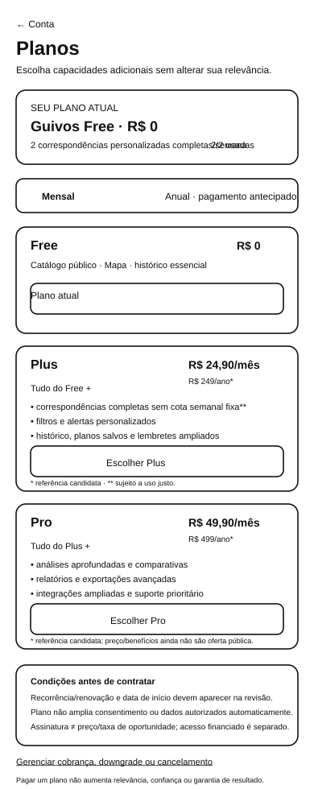
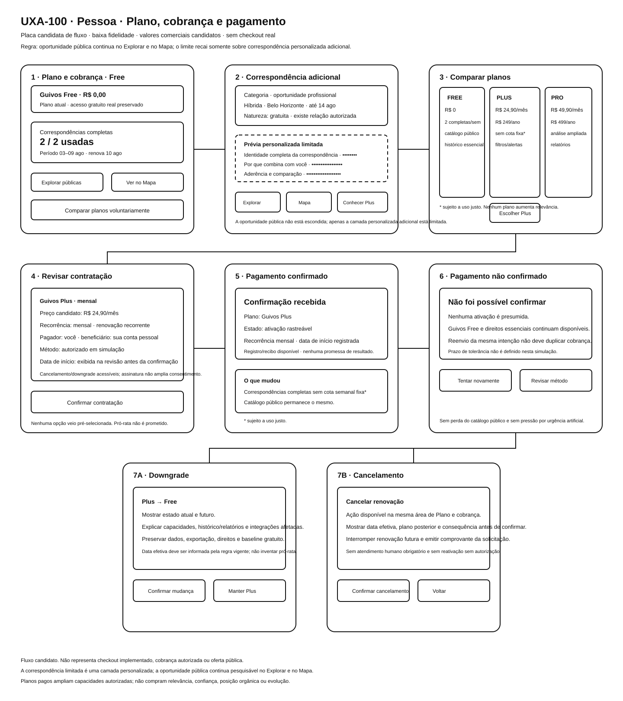
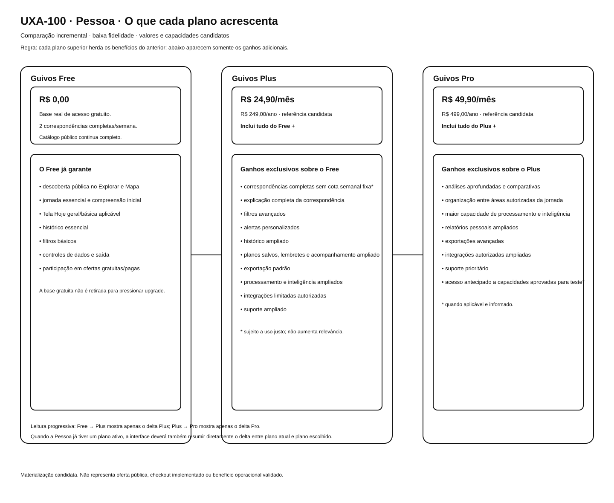
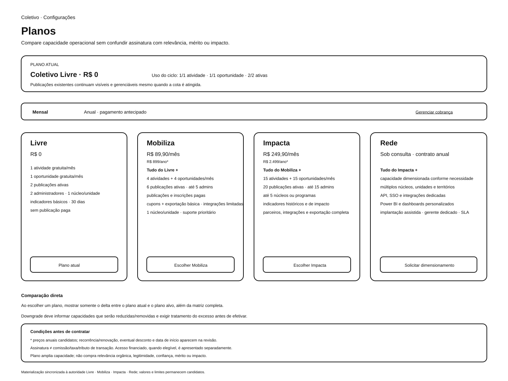
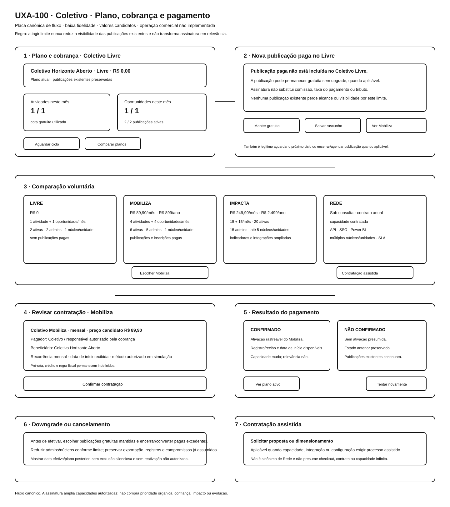
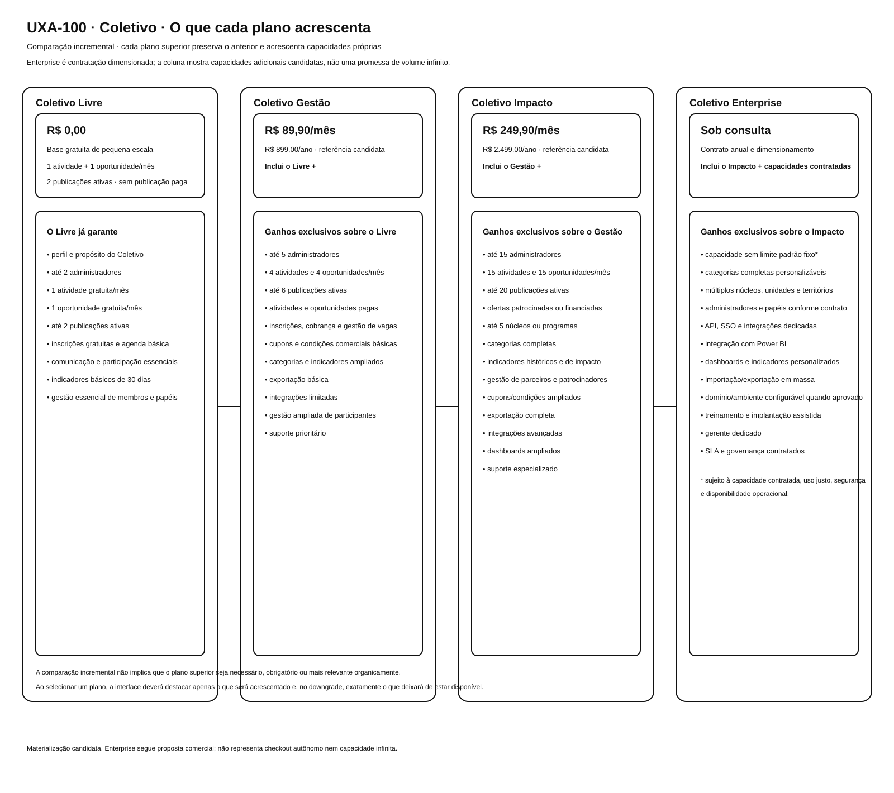
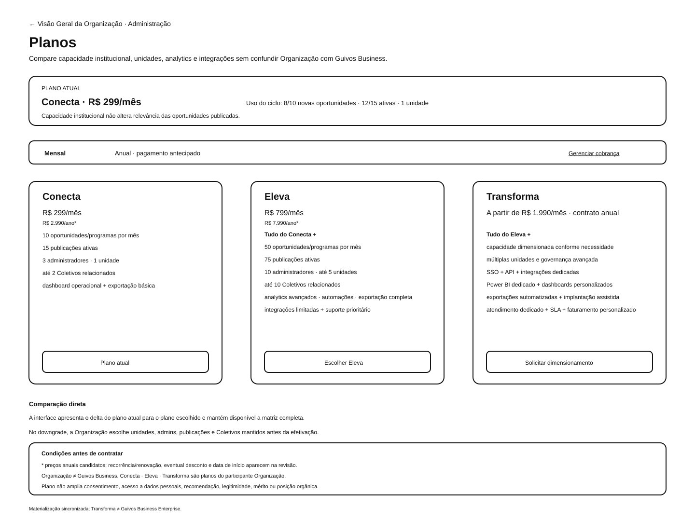
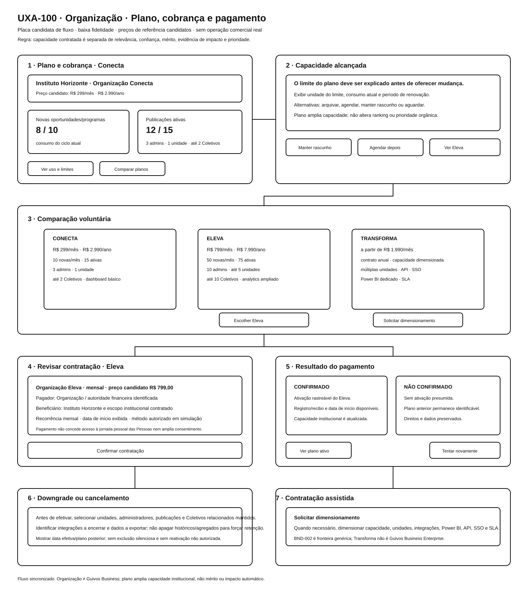
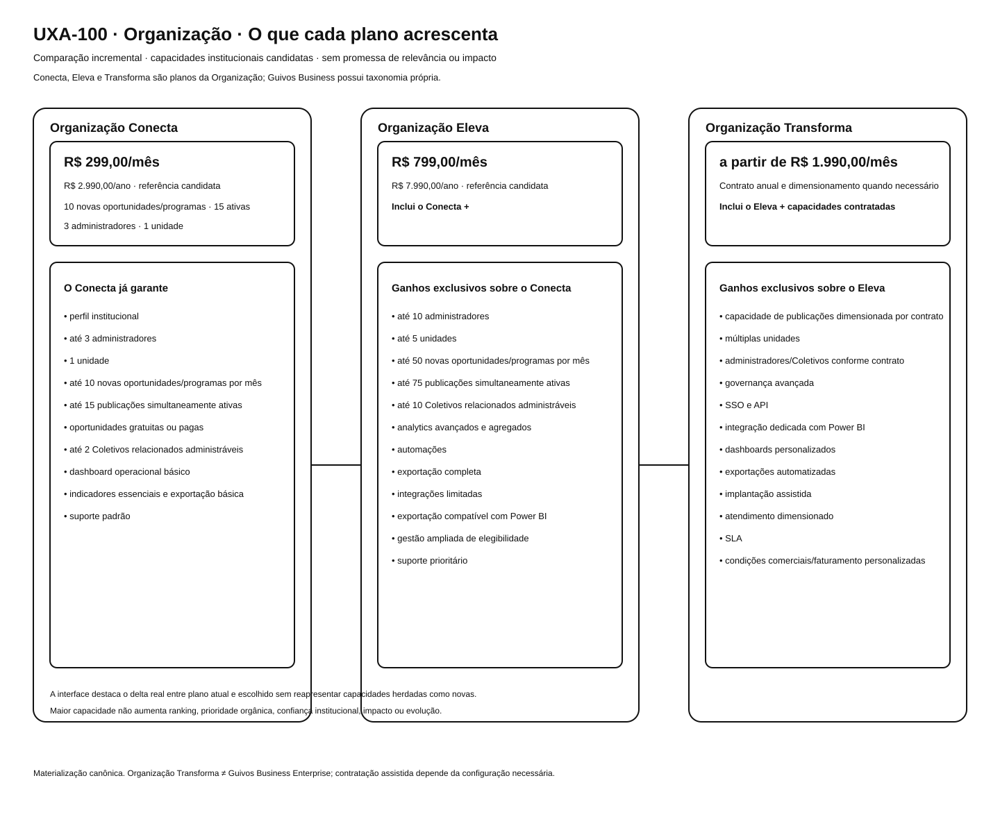

# Planos, Comparação e Cobrança — Galeria Canônica

## 1. Finalidade

Esta galeria reúne as nove referências visuais de Planos da UXA-100 para **Pessoa, Coletivo e Organização**.

A UXA-100-A2 aprovou funcionalmente os nove ativos, após reforma controlada de seis deles. A UXA-100-A3 promove esses nove SVGs ao conjunto canônico e os associa a superfícies e transições estáveis, sem transformar cada estado interno dos boards em tela independente.

## 2. Pessoa — perfil R29

Superfícies canônicas relacionadas: `PER-301` a `PER-304`.

### 2.1 Tela dedicada de Planos



[Visualizar SVG](../assets/wireframes/uxa-100-person-plans-screen-mobile.svg)

### 2.2 Fluxo de plano, cobrança e pagamento



[Visualizar SVG](../assets/wireframes/uxa-100-person-plans-payments-flow-board.svg)

### 2.3 Comparação incremental



[Visualizar SVG](../assets/wireframes/uxa-100-person-plan-incremental-benefits-comparison.svg)

## 3. Coletivo — perfil R30

Superfícies canônicas relacionadas: `COL-301` a `COL-304`.

### 3.1 Tela dedicada de Planos



[Visualizar SVG](../assets/wireframes/uxa-100-collective-plans-screen-desktop.svg)

### 3.2 Fluxo de plano, cobrança e pagamento



[Visualizar SVG](../assets/wireframes/uxa-100-collective-plans-payments-flow-board.svg)

### 3.3 Comparação incremental



[Visualizar SVG](../assets/wireframes/uxa-100-collective-plan-incremental-benefits-comparison.svg)

## 4. Organização — perfil R31

Superfícies canônicas relacionadas: `ORG-301` a `ORG-304`.

### 4.1 Tela dedicada de Planos



[Visualizar SVG](../assets/wireframes/uxa-100-organization-plans-screen-desktop.svg)

### 4.2 Fluxo de plano, cobrança e pagamento



[Visualizar SVG](../assets/wireframes/uxa-100-organization-plans-payments-flow-board.svg)

### 4.3 Comparação incremental



[Visualizar SVG](../assets/wireframes/uxa-100-organization-plan-incremental-benefits-comparison.svg)

## 5. Fragmentação canônica

```text
*-301 Planos e comparação
├── upgrade → *-302 revisão de contratação → *-304 resultado/recuperação → *-301
├── downgrade/cancelamento → *-303 gestão do ciclo → *-304 → *-301
└── Enterprise/Scale → BND-002 quando aplicável
```

A comparação incremental permanece estado de `*-301`. O processamento de pagamento permanece transitório e não recebe superfície própria. Sucesso e falha são estados distintos de `*-304` porque compartilham a mesma responsabilidade de resultado/recuperação sem compartilhar a consequência.

## 6. Contagem canônica da frente

| Participante | Tela Planos | Board de fluxo | Comparação incremental | Total canônico | Perfil |
|---|---:|---:|---:|---:|---|
| Pessoa | 1 | 1 | 1 | 3 | R29 |
| Coletivo | 1 | 1 | 1 | 3 | R30 |
| Organização | 1 | 1 | 1 | 3 | R31 |
| **Total** | **3** | **3** | **3** | **9** | **3 perfis** |

Com a UXA-100-A3, a galeria global passa de **109 para 118 SVGs canônicos**, todos com validação funcional documental vigente.

## 7. Maturidade das transições

- `TRN-401` a `405`: localmente validadas;
- `TRN-411` a `415`: localmente validadas;
- `TRN-416`: parcial, pois o processo após `BND-002` não foi materializado;
- `TRN-421` a `425`: localmente validadas;
- `TRN-426`: parcial, pela mesma fronteira comercial.

Nenhuma transição de Planos é apresentada como implementação técnica ou cobrança real.

## 8. Proteções

- plano pago não compra relevância, confiança, legitimidade, impacto ou evolução;
- oportunidade pública não é escondida para vender plano;
- benefícios herdados não aparecem como novidades;
- Enterprise/Scale não simulam checkout autônomo definitivo;
- falha de pagamento não presume ativação;
- data de início e recorrência aparecem antes da confirmação;
- downgrade/cancelamento exibem consequências e tratam capacidades excedentes antes da efetivação;
- assinatura permanece separada de transação, comissão, taxa de pagamento e tributo;
- validação funcional e promoção documental não equivalem a implementação.