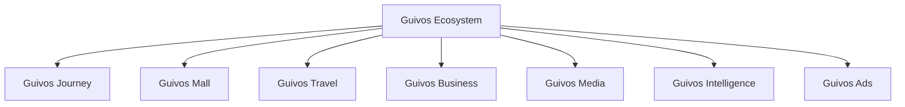

# Arquitetura de Produtos da Guivos

A Arquitetura de Produtos descreve como o Ecossistema Guivos organiza suas ofertas, interfaces e unidades de valor.

Ela não substitui o Guivos Ecosystem Blueprint. O GEB explica como o ecossistema funciona; a Arquitetura de Produtos explica como a Guivos entrega valor por meio de produtos distintos e integrados.

## Estrutura oficial

## Princípio de organização

O Ecossistema Guivos está acima de todos os produtos.

Os produtos compartilham identidade, participantes, conhecimento, inteligência, infraestrutura e governança, mas cada um possui responsabilidade própria.

## Produtos oficiais

| Produto | Responsabilidade principal | Status |
|---|---|---|
| Guivos Journey | Apoiar a jornada contínua do participante | Consolidado |
| Guivos Mall | Comercializar produtos, serviços, gift cards, assinaturas e outros ativos com curadoria | Consolidado |
| Guivos Travel | Organizar viagens e experiências | Consolidado |
| Guivos Business | Entregar soluções para organizações | Consolidado |
| Guivos Media | Produzir e distribuir conteúdo editorial e institucional | Consolidado |
| Guivos Intelligence | Transformar dados e conhecimento em inteligência aplicada | Consolidado |
| Guivos Ads | Operar publicidade e mídia patrocinada | Consolidado |

## Regras arquiteturais

1. Nenhum produto representa sozinho todo o Ecossistema Guivos.
2. Um produto deve possuir responsabilidade principal clara.
3. Funcionalidades compartilhadas devem utilizar capacidades comuns do ecossistema.
4. Sobreposições entre produtos devem ser resolvidas pela responsabilidade predominante.
5. Guivos Mall substitui Guivos Marketplace como nome oficial do produto comercial.
6. “Comunidade Guivos”, “Guivos Podcast” e “Guivos Insights” não são nomes oficiais de produtos.

## Documentos do domínio

- [Guivos Journey](journey.md)
- [Guivos Mall](mall.md)
- [Guivos Travel](travel.md)
- [Guivos Business](business.md)
- [Guivos Media](media.md)
- [Guivos Intelligence](intelligence.md)
- [Guivos Ads](ads.md)