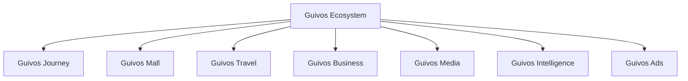
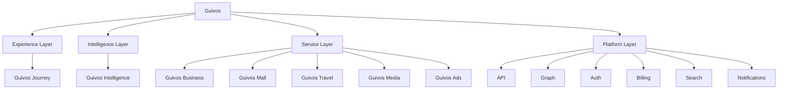

# Arquitetura de Produtos da Guivos

A Arquitetura de Produtos descreve como o Ecossistema Guivos organiza suas ofertas, interfaces, capacidades especializadas, inteligência e unidades de valor.

Ela não substitui o Guivos Ecosystem Blueprint. O GEB explica como o ecossistema funciona; a Arquitetura de Produtos explica como a Guivos entrega valor por meio de componentes integrados.

## Estrutura oficial de componentes

Para fins de construção, operação e evolução funcional, a Guivos adota também a `GLPA-001 — Guivos Layered Product Architecture`.

## Arquitetura funcional em camadas

## Princípio de organização

O Ecossistema Guivos está acima de todos os componentes.

- **Guivos Journey** é a Experience Layer;
- **Guivos Intelligence** é a Intelligence Layer;
- **Guivos Business, Mall, Travel, Media e Ads** são Service Layers;
- capacidades comuns pertencem à Platform Layer.

## Componentes oficiais

| Componente | Natureza | Responsabilidade principal | Status |
|---|---|---|---|
| Guivos Journey | Experience Layer | Orquestrar a experiência unificada do participante | Consolidado |
| Guivos Intelligence | Intelligence Layer | Transformar dados, conhecimento e contexto em inteligência aplicada | Consolidado |
| Guivos Business | Service Layer | Entregar soluções para organizações | Consolidado |
| Guivos Mall | Service Layer | Comercializar produtos e serviços de múltiplos fornecedores | Consolidado |
| Guivos Travel | Service Layer | Organizar viagens e experiências | Consolidado |
| Guivos Media | Service Layer | Produzir e distribuir conteúdo editorial e institucional | Consolidado |
| Guivos Ads | Service Layer | Operar publicidade e mídia patrocinada | Consolidado |

## Especificação vigente do Journey

O `PAS-001 — Guivos Journey 0.5.0` é a especificação-base da Experience Layer.

### Capacidade 02 — Contexto Vivo

As oito extensões normativas `STATE`, `UPDATE`, `CONFLICT`, `VIEW`, `EVENT`, `INTEGRATION`, `KPI` e `CONTRACT`, todas em `1.0.0`, concluíram funcionalmente a Capacidade 02.

### Capacidade 03 — Objetivos

As sete extensões normativas de Objetivos concluíram fundamentos, ciclo de vida, progresso, visão, eventos, integrações, KPIs, cenários e contrato final.

O `PAS-001-OBJ-CONTRACT-001 1.0.0` substitui normativamente o estado `In progress` da linha da Capacidade 03 na seção 7 do `PAS-001 0.5.0`.

A Capacidade 03 está **Functionally complete**.

### Capacidade 04 — Eventos de Vida

As seis extensões normativas `FOUNDATION`, `LIFECYCLE`, `VIEW`, `EVENT`, `INTEGRATION` e `CONTRACT`, todas em `1.0.0`, concluíram fundamentos, ciclo de vida, visualização, eventos funcionais, integrações, 60 KPIs, 18 guardrails, cenários e contrato final.

A Capacidade 04 está **Functionally complete**, com progresso editorial de referência de `100%`.

### Capacidade 05 — Próximos Passos

As seis extensões normativas `FOUNDATION`, `LIFECYCLE`, `VIEW`, `EVENT`, `INTEGRATION` e `CONTRACT`, todas em `1.0.0`, concluíram fundamentos, ciclo de vida, visualização, eventos funcionais, integrações, 68 KPIs, 20 guardrails, cenários e contrato final.

A Capacidade 05 está **Functionally complete**, com progresso editorial de referência de `100%`.

### Capacidade 06 — Oportunidades Ativas

As extensões normativas vigentes são:

- `PAS-001-OA-FOUNDATION-001 1.0.0` — pergunta central, objetivo, singularidade, definição, distinções, titularidade, autoridade, tipos, elegibilidade, disponibilidade, relevância, custos, riscos, relações comerciais, entradas, saídas e controle;
- `PAS-001-OA-LIFECYCLE-001 1.0.0` — estados independentes, identificação, candidatura, avaliação, ativação, apresentação, relação do participante, atualizações, encerramentos, revogação, idempotência e falha segura;
- `PAS-001-OA-VIEW-001 1.0.0` — `Minhas Oportunidades`, descoberta, busca, filtros, ordenação, cartões, detalhamento, comparação, transparência comercial, privacidade, acessibilidade e controles;
- `PAS-001-OA-EVENT-001 1.0.0` — estrutura comum dos eventos, autoridade, temporalidade, 19 famílias contratuais, correção compensatória, revogação, propagação, idempotência, ordenação, concorrência e reconstrução.
- `PAS-001-OA-INTEGRATION-001 1.0.0` — contrato comum de integração, identidade, autoridade, finalidade, minimização, proveniência, sincronização, prevenção de ciclos, revogação, produtos especializados, sistemas externos, observabilidade e falha segura.
- `PAS-001-OA-CONTRACT-001 1.0.0` — 75 KPIs em 15 famílias, 24 guardrails, baseline, painel de saúde, níveis de desempenho, cenários, critérios de conclusão, lacunas, reabertura e contrato final.

O ciclo de vida consolida:

- estado funcional da oportunidade separado do estado da informação;
- disponibilidade, elegibilidade e relevância com ciclos próprios;
- relação individual do participante e situação transacional externa como dimensões independentes;
- transições válidas e proibidas;
- identificação por sinais e fontes sem ativação automática;
- candidatura, rejeição preliminar, avaliação, validação da fonte e limite de autoridade;
- disponibilidade atual, futura, limitada, sob consulta e lista de espera;
- elegibilidade sensível, condicionada e não confirmada;
- relevância contextual, condicionada e sujeita a revisão;
- risco, sensibilidade e verificação de relações comerciais;
- ativação simples e condicionada sem equivaler a apresentação ou recomendação;
- manutenção, atualização, pausa, retomada e indisponibilidade;
- expiração, encerramento e cancelamento como estados distintos;
- contestação, correção compensatória, arquivamento e reabertura;
- duplicidade, unificação, substituição, alternativas e comparação explicável;
- ordem neutra de apresentação;
- visualização, salvamento, interesse, descarte, ocultação, inscrição, aceitação, contratação e participação como estados distintos;
- efeitos controlados sobre Próximos Passos, Intervenções Contextuais, Objetivos e Eventos de Vida;
- oportunidades recorrentes, coletivas, institucionais e patrocinadas;
- revogação de contexto, propagação, retroatividade, idempotência, ordenação, concorrência e falha segura.

A visualização e o controle consolidam:

- `Minhas Oportunidades` como superfície funcional, sem operar como feed publicitário, catálogo infinito, ranking social ou vitrine definida por comissão;
- visão geral, oportunidades para considerar, busca, filtros, oportunidades salvas, interesses, processos iniciados, histórico, fontes e permissões;
- ausência legítima de oportunidade sem preenchimento por anúncios ou opções incompatíveis;
- descoberta contextual com explicação dos recortes e da finalidade;
- busca direta e proteção reforçada de buscas sensíveis;
- filtros funcionais e comerciais, incluindo controle de oportunidades patrocinadas e opções sem comissão;
- ordenação neutra, separada de ordenação comercial identificada;
- visualizações por lista, cartões, mapa, calendário, comparação e agrupamentos;
- cartões minimizados, títulos funcionais e títulos neutros;
- indicadores textuais de disponibilidade, elegibilidade, risco, patrocínio, comissão e relação individual;
- separação entre estado funcional, informação, disponibilidade, elegibilidade, relevância e relação do participante;
- explicação de relevância, limitações, incertezas, fonte e relação comercial;
- disponibilidade com última verificação, validade e ausência de garantia;
- elegibilidade com requisitos, pendências e autoridade decisória externa;
- custo total, gratuidade, riscos e limitações;
- transparência de patrocínio, comissão, afiliação, promoção paga, exclusividade e participação na receita;
- área publicitária identificada e separada da lista funcional;
- detalhamento progressivo, proveniência e histórico compreensível;
- comparação não simplificadora, critérios ajustáveis e preservação de alternativas não patrocinadas;
- salvamento, interesse, retirada, descarte, ocultação, contestação e correção;
- vínculo consciente com Próximos Passos sem criação automática;
- proteção de oportunidades sensíveis, de saúde, financeiras, profissionais, sociais, religiosas, institucionais e coletivas;
- mudanças materiais, indisponibilidade, pausa, expiração, encerramento e novas edições;
- acompanhamento de processos externos sem absorção da transação;
- fila de atenção, notificações funcionais e comerciais separadas e prevenção de fadiga;
- controles de categorias, fontes, contexto, localização, compartilhamento e revogação;
- acessibilidade técnica e cognitiva, consistência entre canais, conflitos de informação e falha segura.

Os contratos dos eventos funcionais consolidam:

- comando, proposta e evento como conceitos distintos;
- publicação somente após persistência funcional suficiente;
- agregado `Registro de Oportunidade` e estrutura comum versionada;
- titular, participante, ator, papel, autoridade, fonte, proveniência, finalidade e sensibilidade;
- temporalidades de fato, declaração, registro externo, conhecimento, reconhecimento, persistência, aplicação, propagação e correção;
- correlação e causalidade funcional sem inferência por proximidade temporal;
- 19 famílias de eventos de identificação, fonte, avaliação, disponibilidade, elegibilidade, relevância, risco, transparência comercial, ativação, apresentação, interação, fatos externos, vínculos, manutenção, correção, permissões, propagação, visualização e falhas;
- disponibilidade confirmada somente por fonte autorizada e sem garantia de acesso;
- elegibilidade estimada separada de confirmação e decisão externa;
- relevância explicável sem comissão, patrocínio, clique, tempo de tela ou vulnerabilidade;
- apresentação governada por Intervenções Contextuais;
- visualização, salvamento, interesse, inscrição, aceitação, contratação, participação e resultado como fatos separados;
- correção compensatória, contestação e histórico imutável;
- revogação concluída somente após propagação suficiente;
- recortes mínimos e decisões próprias das capacidades consumidoras;
- idempotência, duplicidade semântica, ordenação, concorrência, atomicidade funcional e reconstrução;
- retenção e logs minimizados para conteúdo sensível;
- responsabilidades de produtores e consumidores;
- explicabilidade, auditoria e métricas sistêmicas.

As integrações funcionais consolidam:

- integração como intercâmbio governado de sinais, fatos, propostas, comandos, evidências, recortes e solicitações de reavaliação;
- contrato funcional comum com produtor, consumidor, participante, finalidade, modo, autoridade, escopo, sensibilidade, proveniência, qualidade, confiança, validade, frequência, retenção, relação comercial, sincronização e revogação;
- identidade e associação seguras, com efeitos pessoais bloqueados diante de incerteza;
- autoridade limitada ao que cada fonte pode legitimamente confirmar;
- separação entre qualidade técnica, confiança funcional e autoridade;
- temporalidades de fato, registro externo, publicação, sincronização, conhecimento, processamento, aplicação, propagação e correção;
- transformações permitidas e proibição de fabricar disponibilidade, elegibilidade, aprovação, interesse, prioridade, causalidade, progresso, transformação ou precisão inexistente;
- sincronização com versão, idempotência, sequência, conflitos, atualização parcial, reconciliação e degradação controlada;
- prevenção de ciclos entre oportunidades, Próximos Passos e capacidades consumidoras;
- finalidade específica, minimização, permissões granulares, pausa, desconexão, revogação e propagação confirmada;
- integrações com todas as capacidades do Journey, preservando responsabilidades e decisões próprias;
- limites da Guivos Intelligence e da Platform Layer;
- integrações com Guivos Business, Mall, Travel, Media e Ads, sem transferência de relevância ou decisão;
- contratos com organizações, fornecedores, serviços profissionais, fontes públicas, calendários, localização, esportes e sistemas externos;
- proteção de integrações pessoais, temporárias, compartilhadas, sensíveis e de terceiros;
- conflitos entre fontes, correções externas, retroatividade, reconstrução, observabilidade, explicabilidade e auditoria.

O contrato final consolida:

- 75 KPIs em 15 famílias sistêmicas;
- baseline segmentada antes de metas permanentes;
- painel de saúde e níveis Crítico, Instável, Adequado, Confiável e Maduro;
- 24 guardrails de tolerância zero;
- cenários funcionalmente ideais, alternativos e limite;
- critérios de conclusão e reabertura;
- lacunas bloqueantes e não bloqueantes;
- titularidade, singularidade, responsabilidades, limites, entradas, admissão e saídas;
- neutralidade comercial, proteção sensível, confiabilidade, explicabilidade e auditoria.

A Capacidade 06 está **Functionally complete**, com progresso editorial de referência de `100%`.

### Capacidade 07 — Intervenções Contextuais

As extensões normativas vigentes são:

- `PAS-001-IC-FOUNDATION-001 1.0.0` — finalidade, pergunta central, singularidade, decisões possíveis, oportunidade de intervenção, silêncio, atenção, interruptibilidade, urgência, sensibilidade, fadiga, canais, autonomia, controles, relações, estados e eventos iniciais.
- `PAS-001-IC-LIFECYCLE-001 1.0.0` — dimensões independentes, estados, transições, identificação, avaliação, admissão, programação, entrega, resposta, silêncio, frequência, revogação, idempotência e falha segura.
- `PAS-001-IC-VIEW-001 1.0.0` — Central de Intervenções, Fila de Atenção, cartões, justificativas, histórico, controles, preferências, acessibilidade, privacidade, relações comerciais, consistência entre canais e falha segura.
- `PAS-001-IC-EVENT-001 1.0.0` — agregado funcional, estrutura comum, 19 famílias de eventos, autoridade, finalidade, temporalidade, proveniência, sensibilidade, correção, revogação, idempotência, ordenação, concorrência, reconstrução e falha segura.
- `PAS-001-IC-INTEGRATION-001 1.0.0` — contrato comum, titularidade, finalidade, minimização, proveniência, sincronização, prevenção de ciclos, revogação, capacidades, produtos, organizações, canais, observabilidade e falha segura.
- `PAS-001-IC-CONTRACT-001 1.0.0` — 80 KPIs, 16 famílias, 28 guardrails, baseline, painel de saúde, cenários, critérios de conclusão, lacunas, reabertura e contrato final.

Os fundamentos iniciais consolidam:

- Intervenção Contextual como manifestação deliberada, proporcional e explicável;
- singularidade centrada na decisão responsável entre manifestar-se ou permanecer em silêncio;
- decisões de agir, perguntar, informar, sugerir, lembrar, alertar, confirmar, aguardar, observar ou silenciar;
- silêncio como resultado funcional legítimo;
- oportunidade candidata e oportunidade admitida de intervenção;
- fluxo canônico de sinal ou solicitação até intervenção, silêncio e reavaliação;
- distinção entre intervenção, notificação, publicidade, comando, tarefa, oportunidade, transação e conteúdo editorial;
- reatividade, proatividade, gatilhos legítimos e não gatilhos comerciais;
- contexto mínimo, atenção, interruptibilidade, importância, urgência e temporalidade;
- sensibilidade, fadiga, frequência, repetição, intensidade, escalonamento e desescalonamento;
- seleção e consistência de canais;
- explicabilidade por motivo, momento, dados, fontes, autoridade, incertezas e controles;
- autonomia, autoridade limitada e papéis funcionais distintos;
- horários protegidos, adiamento, recusa, ocultação, bloqueio e silêncio;
- proteção de saúde, finanças, jurídico, religião, voluntariado, organizações, coletivos e terceiros;
- separação entre intervenções funcionais, comerciais e institucionais;
- relações governadas com as capacidades concluídas do Journey;
- limites da Guivos Intelligence, Platform Layer, produtos especializados e Guivos Ads;
- estados, eventos, responsabilidades, limites e comportamentos proibidos iniciais.

O ciclo de vida consolida:

- dimensões independentes de estado funcional, informação, autorização, temporalidade, entrega, relação do participante, atenção, fadiga, sensibilidade e operação externa;
- estados funcionais desde identificação e candidatura até entrega, resposta, silêncio, correção, falha e encerramento;
- transições válidas e proibição de atalhos e estados impossíveis;
- identificação por solicitação, sinal, mudança contextual, prazo, risco e sistema externo;
- deduplicação, candidatura, rejeição preliminar e início da avaliação;
- avaliação de finalidade, autoridade, relevância, temporalidade, atenção, interruptibilidade, urgência, importância, sensibilidade, fadiga, frequência, canal, reversibilidade, risco e alternativas;
- conclusão da avaliação, admissão simples e condicionada, rejeição e seleção de comportamento principal;
- programação, reprogramação, janela de entrega, prontidão, bloqueio, espera e retomada;
- entrega, entrega parcial, confirmação técnica, falha e apresentação;
- resposta, ausência de resposta, adiamento, recusa, ocultação e bloqueio;
- silêncio pós-avaliação, solicitado, por fadiga e por sensibilidade;
- cancelamento, expiração, encerramento, contestação, correção, reabertura e nova intervenção;
- escalonamento, desescalonamento e encaminhamento humano;
- repetição, recorrência, agrupamento, supressão de duplicidade e controles globais, por categoria e por canal;
- horários protegidos, mudanças materiais, intervenções sensíveis, compartilhamento, revogação e propagação;
- retroatividade, idempotência, ordenação, concorrência, falha segura e reconstrução.

A visualização e o controle consolidam:

- `Central de Intervenções` como superfície principal de compreensão, decisão e controle;
- `Fila de Atenção` como recorte temporal do que pode exigir atenção atual ou próxima;
- ausência legítima sem preenchimento por anúncios, recomendações artificiais ou mensagens de engajamento;
- agrupamentos e ordenação por risco, prazo, confirmação, reversibilidade, impacto e sensibilidade, sem influência comercial;
- cartões minimizados, títulos funcionais e títulos neutros;
- estados e dimensões independentes de informação, autorização, temporalidade, entrega, resposta, atenção, fadiga, sensibilidade e operação externa;
- perguntas, informações, sugestões, lembretes, alertas, confirmações, ações, espera, observação e silêncio com contratos visuais próprios;
- detalhamento progressivo e explicações `Por que estou vendo isto?` e `Por que agora?`;
- fonte, autoridade, incerteza, validade, importância, urgência e relações comerciais visíveis;
- histórico imutável, correções compensatórias, busca, filtros e controles principais;
- resposta, adiamento, silêncio, recusa, ocultação, bloqueio, contestação, correção e revogação;
- preferências de frequência, horários protegidos, canais, categorias, intensidade, resumos e fadiga;
- notificações, e-mail, canais conversacionais, calendário e superfícies de produtos com consistência de estado;
- acessibilidade técnica e cognitiva, linguagem proporcional, ambiente, dispositivo e privacidade visual;
- proteção de terceiros e de intervenções de saúde, finanças, jurídico, religião, voluntariado, institucionais, coletivas e comerciais;
- falha segura, sincronização pendente, conflitos, operação sem conexão e auditoria compreensível.

Os contratos dos eventos funcionais consolidam:

- distinção entre comando, proposta e evento funcional reconhecido;
- persistência funcional suficiente antes da publicação de eventos materiais;
- agregado `Registro de Intervenção Contextual` e estrutura comum versionada;
- identidade, participante, ator, destinatário, papel, autoridade, fonte, finalidade e proveniência;
- temporalidades de fato, solicitação, observação, conhecimento, avaliação, reconhecimento, persistência, publicação, aplicação, entrega, resposta, propagação e correção;
- correlação e causalidade funcional sem fabricação de relação causal;
- classificação de sensibilidade, minimização de payload e retenção proporcional;
- declaração obrigatória de publicidade, patrocínio, comissão, afiliação e demais relações comerciais;
- 19 famílias de eventos funcionais de identificação, avaliação, admissão, comportamento, programação, entrega, resposta, preferências, execução externa, correção, revogação, integração e falhas;
- deduplicação semântica e versão esperada do agregado;
- avaliação de atenção, interruptibilidade, urgência, fadiga e frequência sem inferência de consentimento;
- admissão separada de apresentação, entrega, visualização, resposta e transação;
- comportamento principal explícito entre agir, perguntar, informar, sugerir, lembrar, alertar, confirmar, aguardar, observar e silenciar;
- programação, prontidão e revalidação anterior à entrega;
- apresentação, entrega técnica, visualização, resposta e ausência de resposta como fatos distintos;
- adiamento, silêncio, recusa, ocultação, bloqueio e preferências com contratos próprios;
- execução externa sob autoridade do produto ou sistema executor;
- contestação, correção compensatória, cancelamento, expiração, encerramento e reabertura;
- revogação concluída somente após propagação suficiente;
- idempotência, ordenação, concorrência, atomicidade, reconstrução, compatibilidade, explicabilidade, auditoria e falha segura.

As integrações funcionais consolidam:

- integração como relação governada entre produtor e consumidor, sem acesso irrestrito à jornada;
- titularidade, responsabilidade e autoridade preservadas por domínio;
- contrato comum com produtor, consumidor, participante, destinatário, finalidade, modo, autoridade, escopo, sensibilidade, fonte, proveniência, temporalidades, qualidade, confiança, retenção, permissões, relação comercial, sincronização, revogação e falha;
- identidade confiável, associações incertas limitadas e correção auditável de associações incorretas;
- separação entre qualidade técnica, confiança funcional e autoridade da fonte;
- transformações permitidas e proibição de fabricar disponibilidade, urgência, elegibilidade, aprovação, intenção, prioridade, resultado, progresso, transformação ou diagnóstico;
- finalidade específica, minimização, recortes funcionais, consentimento granular e retenção proporcional;
- pausa, desconexão, revogação, propagação e retenção pós-revogação;
- estados de sincronização, divergência, ordenação, concorrência e reconciliação;
- prevenção de ciclos, restrição de tempo real, processamento em lote e retentativas idempotentes;
- falha segura e degradação controlada;
- integrações com Captura de Contexto, Contexto Vivo, Objetivos, Eventos de Vida, Próximos Passos, Oportunidades Ativas, Experiências e Evolução Contínua;
- limites da Guivos Intelligence e da Platform Layer;
- integrações com Mall, Travel, Business, Media, Ads, organizações, profissionais, saúde, finanças, jurídico, educação, trabalho, religião, voluntariado e serviços públicos;
- contratos para canais internos, conversacionais, notificações, e-mail, calendários, localização, fontes públicas e sistemas externos;
- proteção de terceiros, coletivos, dispositivos compartilhados e integrações temporárias;
- observabilidade, explicabilidade, auditoria e reconstrução.

O contrato final consolida:

- 80 KPIs organizados em 16 famílias;
- baseline funcional segmentada antes de metas permanentes;
- painel de saúde com 17 visões e cinco níveis de desempenho;
- 28 guardrails de tolerância zero;
- cenários funcionalmente ideais, alternativos e limite;
- critérios de conclusão, lacunas bloqueantes e não bloqueantes;
- singularidade centrada na decisão responsável entre manifestar-se e permanecer em silêncio;
- contrato final de titularidade, responsabilidades, limites, entradas, admissão e saídas;
- atenção e interruptibilidade separadas de consentimento;
- importância, urgência e temporalidade como dimensões independentes;
- silêncio, espera, adiamento e recusa como resultados legítimos;
- neutralidade comercial, proteção sensível, confiabilidade, explicabilidade e auditoria;
- critérios formais de reabertura normativa.

A Capacidade 07 está **Functionally complete**, com progresso editorial de referência de `100%`.

## Capacidade 08 concluída

### Capacidade 08 — Experiências

As extensões normativas vigentes são:

- `PAS-001-EXP-FOUNDATION-001 1.0.0` — finalidade, pergunta central, definição canônica, singularidade, distinções, Registro de Experiência, titularidade, participantes, temporalidades, sensibilidade, entregas, resultados, evidências, memórias, significado, relações, estados, eventos, controles e limites iniciais;
- `PAS-001-EXP-LIFECYCLE-001 1.0.0` — estados, transições, identificação, validação da ocorrência, planejamento, preparação, início, participação, recorrência, resultados, percepção, satisfação, evidências, memórias, significado, contestação, correção, revogação, propagação e falha segura;
- `PAS-001-EXP-VIEW-001 1.0.0` — Minhas Experiências, áreas funcionais, cartões, linha do tempo, calendário, séries, episódios, estados independentes, privacidade, explicabilidade, compartilhamento, contestação, correção, revogação, acessibilidade e falha segura;
- `PAS-001-EXP-EVENT-001 1.0.0` — agregado funcional, estrutura comum, 19 famílias de eventos, autoridade, finalidade, temporalidades, proveniência, sensibilidade, correção, revogação, idempotência, ordenação, concorrência, reconstrução e auditoria.
- `PAS-001-EXP-INTEGRATION-001 1.0.0` — contrato comum, identidade, associação, autoridade, finalidade, minimização, proveniência, sincronização, prevenção de ciclos, revogação, capacidades, produtos, organizações, dispositivos, canais, observabilidade e falha segura.
- `PAS-001-EXP-CONTRACT-001 1.0.0` — 85 KPIs em 17 famílias, 32 guardrails, baseline, painel de saúde, níveis de desempenho, cenários, critérios de conclusão, lacunas, reabertura e contrato final.

Os fundamentos consolidam:

- Experiência como vivência efetivamente situada no tempo;
- distinção entre atividade, presença, participação, entrega, resultado, satisfação, evidência, memória, significado, transformação e Evento de Vida;
- `Registro de Experiência` como unidade funcional;
- identidade, titularidade, papéis e autoridade;
- experiências compartilhadas, coletivas, institucionais, físicas, digitais e híbridas;
- origem, intenção, candidatura e validação proporcional da ocorrência;
- temporalidades, duração, intensidade, recorrência, episódios e continuidade;
- presença, envolvimento, agência, autonomia e expectativas;
- contexto mínimo, sensibilidade, privacidade, acessibilidade, segurança e proteção de terceiros;
- entregas, resultados, satisfação, evidências, memórias, significado e reflexão;
- limites para transformação, Eventos de Vida e Evolução Contínua;
- relações com as capacidades do Journey, Intelligence, Platform Layer, produtos, organizações e profissionais;
- neutralidade comercial, estados, eventos, controles, explicabilidade, responsabilidades e comportamentos proibidos.

O ciclo de vida consolida:

- dimensões independentes do estado da experiência;
- estados funcionais e transições válidas, proibidas e retrospectivas;
- identificação, fontes, deduplicação, candidatura, rejeição e validação da ocorrência;
- planejamento, preparação, prontidão, início, presença, participação, envolvimento e acompanhamento proporcional;
- pausa, retomada, conclusão, interrupção, cancelamento e expiração;
- recorrência, séries, episódios e continuidade;
- entrega, resultado, percepção, satisfação e efeitos ambivalentes;
- evidências, memórias, significado e reflexão opcionais;
- contestação, correção compensatória, revogação e propagação;
- idempotência, duplicidade semântica, ordenação, concorrência, atomicidade, reconstrução, retenção, auditoria e falha segura.

`PAS-001-EXP-VIEW-001 1.0.0` consolida:

- `Minhas Experiências` como superfície principal de compreensão, acompanhamento, revisão e controle;
- áreas Agora, Próximas, Linha do tempo, Séries e episódios, Para validar e Arquivo;
- lista, cartões, calendário, linha do tempo, séries, episódios e mapa opcional;
- títulos funcionais, títulos neutros, privacidade visual e detalhamento progressivo;
- representação separada dos estados funcionais, ocorrência, participação, entrega, resultado, percepção, satisfação, evidências, memória, significado, autorização, contestação e propagação;
- experiências compartilhadas, coletivas e institucionais com autoridade limitada;
- entregas, resultados, efeitos positivos, negativos, neutros e ambivalentes;
- percepção e satisfação opcionais, evidências, memórias, significado e reflexão;
- explicabilidade por `Por que esta experiência está aqui?` e explicação de reconstrução retrospectiva;
- controles de confirmação, negação, incerteza, visibilidade, compartilhamento, contestação, correção e revogação;
- acessibilidade, consistência entre canais, dispositivos compartilhados, operação offline e falha segura;
- 30 comportamentos proibidos e 70 critérios de aceite.

`PAS-001-EXP-EVENT-001 1.0.0` consolida:

- distinção entre sinal, comando, proposta, declaração, evento e efeito;
- `Registro de Experiência` como agregado funcional principal;
- estrutura comum versionada com titular, ator, autoridade, finalidade, temporalidades, proveniência, sensibilidade, permissões, incerteza e retenção;
- 19 famílias de eventos cobrindo identificação, ocorrência, planejamento, participação, encerramento, resultados, percepção, evidências, memórias, significado, privacidade, compartilhamento, correção, revogação, sincronização e reconstrução;
- persistência anterior à publicação e consumo limitado à semântica do evento;
- idempotência, duplicidade semântica, ordenação, concorrência, atomicidade, compatibilidade e falha segura;
- correção compensatória, revogação propagada, retenção proporcional, explicabilidade e auditoria;
- 30 comportamentos proibidos e 60 critérios de aceite.

`PAS-001-EXP-INTEGRATION-001 1.0.0` consolida:

- integração funcional como intercâmbio governado sem reconhecimento automático da experiência;
- titularidade, produtores, consumidores, modos, finalidade, autoridade, escopo, sensibilidade, proveniência, temporalidades, permissões, retenção e relação comercial;
- identidade e associação confiáveis, com limitação de efeitos diante de incerteza e correção auditável de associações incorretas;
- qualidade técnica, confiança funcional, completude e autoridade como dimensões independentes;
- transformações permitidas e proibição de fabricar ocorrência, participação, percepção, satisfação, memória, significado, transformação ou evolução;
- minimização, recortes funcionais, consentimento granular, proteção de terceiros e neutralidade comercial;
- séries, episódios, experiências compartilhadas, operação offline e sincronização reconciliável;
- pausa, desconexão, revogação, propagação e retenção residual justificada;
- ordenação, concorrência, prevenção de ciclos, tempo real limitado, lote, retentativas e falha segura;
- integrações com todas as capacidades do Journey, Guivos Intelligence e Platform Layer;
- integrações com Mall, Travel, Business, Media, Ads, organizações, profissionais, setores sensíveis, esportes, dispositivos, calendários, localização, mídias, fontes públicas e sistemas externos;
- observabilidade, explicabilidade, auditoria, reconstrução, 30 comportamentos proibidos e 52 critérios de aceite.

`PAS-001-EXP-CONTRACT-001 1.0.0` consolida:

- 85 KPIs em 17 famílias sistêmicas;
- baseline funcional segmentada;
- painel de saúde com 18 visões e cinco níveis de desempenho;
- 32 guardrails de tolerância zero;
- cenários funcionalmente ideais, alternativos e limite;
- critérios de conclusão, lacunas bloqueantes e não bloqueantes;
- finalidade, singularidade, titularidade, responsabilidades, limites, entradas, admissão, saídas e dimensões preservadas;
- neutralidade comercial, privacidade, confiabilidade, explicabilidade, auditoria, critérios de reabertura e contrato final;
- ausência de lacuna funcional bloqueante conhecida.

A Capacidade 08 está **Functionally complete**, com progresso editorial de referência de `100%`.

A Capacidade 09 — Evolução Contínua está `In progress`, com progresso editorial de referência de `20%`, por meio de `PAS-001-EC-FOUNDATION-001 1.0.0`.

## Capacidade 09 ativa

### Capacidade 09 — Evolução Contínua

`PAS-001-EC-FOUNDATION-001 1.0.0` consolida:

- finalidade, pergunta central, definição canônica, singularidade e valor entregue;
- Evolução Contínua como trajetória governada de mudanças humanas observadas, declaradas ou sustentadas por evidências ao longo do tempo;
- distinções entre mudança, evolução, progresso, resultado, satisfação, Experiência, Evento de Vida, Objetivo, identidade, produtividade, mérito e diagnóstico;
- `Trajetória de Evolução` como unidade funcional, com participante, dimensão, direção, baseline, período, estados, mudanças, evidências, interpretações, confiança, incertezas e histórico;
- direção declarada, ausência legítima de direção e baseline centrada na trajetória do próprio participante;
- temporalidades, duração, sustentação, estabilidade, oscilação, regressão, pausa, reorientação e não linearidade;
- observação e interpretação como dimensões distintas;
- evidências, autoridade das fontes, correlação, causalidade e fatores contribuintes com limites explícitos;
- evolução individual, coletiva e institucional como trajetórias distintas;
- proteção reforçada de espiritualidade, religião, saúde, bem-estar, sensibilidade e terceiros;
- estados e eventos funcionais iniciais, controles, explicabilidade, responsabilidades, limites e neutralidade comercial;
- 30 comportamentos proibidos e 52 critérios de aceite.

A Capacidade 09 está `In progress`, com progresso editorial de referência de `20%`.

O próximo bloco normativo é o ciclo de vida da Evolução Contínua.

## Regras arquiteturais

1. Nenhum componente representa sozinho todo o Ecossistema Guivos.
2. Um componente deve possuir responsabilidade principal clara.
3. Funcionalidades compartilhadas devem utilizar capacidades comuns do ecossistema.
4. Sobreposições devem ser resolvidas pela responsabilidade predominante.
5. Guivos Journey não deve absorver integralmente responsabilidades dos serviços especializados.
6. Guivos Intelligence é camada transversal.
7. Business, Mall, Travel, Media e Ads preservam responsabilidades especializadas.
8. Guivos Mall substitui Guivos Marketplace como nome oficial do produto comercial.
9. “Comunidade Guivos”, “Guivos Podcast” e “Guivos Insights” não são nomes oficiais de produtos.
10. Objetivos pertencem ao participante e não podem ser ativados apenas por inferência, comportamento ou interesse comercial.
11. Confirmação, ativação, prioridade, atualidade e estado funcional são dimensões distintas do objetivo.
12. Envelhecimento não representa falsidade, pausa não representa fracasso e bloqueio não representa incapacidade pessoal.
13. Atividade, resultado, evidência, progresso, marco e conclusão são conceitos funcionalmente distintos.
14. Percentuais somente podem ser utilizados com base legítima e objetivos pessoais não podem ser concluídos apenas por inferência.
15. `Meus Objetivos` é uma superfície de clareza e controle, não de cobrança, ranking ou comparação pessoal.
16. Objetivos pessoais, institucionais, coletivos e compartilhados devem preservar titularidade, autoridade e permissões próprias.
17. Objetivos sensíveis exigem privacidade visual, minimização e controle reforçado.
18. Comando, proposta e evento funcional são conceitos distintos.
19. Eventos reconhecidos devem preservar origem, autoridade, temporalidade, correlação, versão e idempotência.
20. O reprocessamento não pode duplicar efeitos e falhas devem reduzir automação.
21. Capacidades consumidoras devem receber somente recortes autorizados e reavaliar suas próprias decisões.
22. Integrações não transferem titularidade nem ampliam autoridade funcional.
23. Finalidade explícita e minimização devem preceder todo compartilhamento.
24. Contexto Vivo, Objetivos, Eventos de Vida, Próximos Passos, Oportunidades, Intervenções, Experiências e Evolução preservam responsabilidades distintas.
25. Platform Layer aplica contratos técnicos, mas não redefine significado funcional.
26. Serviços especializados e receita comercial não podem alterar prioridade, relevância, confirmação ou conclusão funcional.
27. Revogações devem interromper novos usos e falhas de integração devem produzir degradação controlada.
28. Indicadores devem avaliar a capacidade, não o valor ou desempenho humano do participante.
29. Guardrails críticos possuem tolerância zero e prevalecem sobre médias agregadas.
30. Uma capacidade funcionalmente concluída somente deverá ser reaberta por fundamento formal.
31. Evento de Vida representa mudança relevante, não qualquer ocorrência, atividade ou experiência.
32. Evento de Vida governa a mudança; Contexto Vivo governa o estado resultante.
33. Evento planejado não equivale a ocorrido e sinal não equivale a confirmado.
34. Estado do evento e estado da informação são dimensões distintas.
35. Confirmação do evento não confirma automaticamente seus impactos.
36. Impactos devem ser avaliados por unidade afetada.
37. Relevância é contextual, explicável e revisável.
38. Causalidade não pode ser presumida por proximidade temporal.
39. Correções preservam o histórico e contestações limitam efeitos críticos.
40. Conclusão do evento não encerra automaticamente impactos persistentes.
41. Propagação utiliza recortes mínimos e reprocessamento não duplica efeitos.
42. Eventos sensíveis exigem minimização, proteção visual e ausência de exploração comercial.
43. Eventos de Vida não criam objetivos pessoais ativos nem impõem prioridade.
44. A linha do tempo de Eventos de Vida não é feed social, diário integral ou instrumento de avaliação pessoal.
45. Sinais, propostas, planejamentos e fatos ocorridos devem permanecer distintos.
46. Impactos propostos não podem ser apresentados como aplicados.
47. Contratos de Eventos de Vida representam fatos reconhecidos, não comandos pendentes.
48. Eventos históricos são imutáveis; correções devem produzir eventos compensatórios.
49. Tempo do fato, conhecimento, reconhecimento e aplicação permanecem separados.
50. Titular, ator e fonte permanecem distintos e limitados por autoridade.
51. Eventos e impactos possuem ciclos próprios.
52. Ordenação, versão, concorrência e idempotência impedem estados impossíveis e duplicidades.
53. Revogação somente pode ser concluída após propagação efetiva.
54. Métricas dos contratos avaliam o sistema, não o participante.
55. Integrações de Eventos de Vida exigem finalidade, minimização, identidade e autoridade.
56. Disponibilidade técnica de dados não autoriza uso ou confirmação.
57. Transformações não podem fabricar precisão, causalidade, significado emocional ou diagnóstico.
58. Capacidades consumidoras recebem solicitações e recortes, não decisões impostas.
59. Guivos Business somente confirma fatos institucionais e não recebe a jornada pessoal integral.
60. Compra, reserva, calendário, localização ou atividade não confirmam mudança humana.
61. Guivos Ads não utiliza Eventos de Vida sensíveis para publicidade.
62. Pausa interrompe coleta e revogação interrompe novos usos sem apagar fatos legítimos.
63. Ausência de dado não equivale a ausência de Evento de Vida.
64. Falhas preservam o último estado válido e reduzem automação.
65. O participante deve compreender fontes, transformações, recortes, consumidores, pausa e revogação.
66. Maior volume de Eventos de Vida não representa melhor qualidade.
67. Uma boa média não compensa violação de guardrail.
68. A ausência de Eventos de Vida registrados é legítima.
69. Eventos de Vida não atribuem automaticamente diagnóstico, significado emocional, sucesso, fracasso ou valor humano.
70. Os 60 KPIs e 18 guardrails constituem a baseline normativa da Capacidade 04.
71. Próximo Passo representa movimento possível, não objetivo, tarefa ou oportunidade.
72. Próximo Passo proposto é hipótese, não decisão assumida.
73. Próximo Passo confirmado não representa execução iniciada.
74. “Próximo” é contextual, não apenas cronológico.
75. Poderão existir múltiplos Próximos Passos ou nenhum passo ativo.
76. Titular, proponente, decisor, responsável e executor são papéis distintos.
77. Responsabilidade não pode ser atribuída silenciosamente.
78. Organização somente governa passos dentro de sua autoridade.
79. Guivos Intelligence produz hipóteses, alternativas e sugestões, não compromissos.
80. Prioridade operacional é distinta de urgência, importância, prontidão, esforço e valor humano.
81. Bloqueio não representa incapacidade e pausa não representa fracasso.
82. Esperar pode constituir movimento legítimo.
83. Conclusão de Próximo Passo não conclui automaticamente o objetivo.
84. Oportunidade é meio e sua disponibilidade não cria automaticamente um passo.
85. Atividade realizada não confirma adequação, conclusão ou progresso.
86. Datas, prazos e precisão temporal não podem ser fabricados.
87. Passos sensíveis exigem finalidade, minimização, privacidade e controle.
88. Receita, patrocínio ou publicidade não podem determinar prioridade.
89. A capacidade não deve criar listas ou ações artificiais para maximizar engajamento.
90. O participante permanece no controle da criação, confirmação, alteração, priorização, execução, cancelamento e compartilhamento.
91. Possibilidade, proposta, confirmação, ativação, prontidão, agendamento, execução, resultado, progresso e conclusão são dimensões distintas.
92. Confirmação condicionada não produz ativação antes do atendimento da condição.
93. Prontidão não equivale a prioridade, obrigação imediata ou início.
94. Desbloqueio não inicia automaticamente a execução.
95. Prazo vencido não representa conclusão, cancelamento, abandono ou fracasso.
96. Ausência de atualização não representa interrupção ou abandono.
97. Resultado imediato não equivale a progresso do objetivo.
98. Um passo pode ser concluído mesmo quando o resultado esperado não ocorrer, desde que o movimento delimitado tenha sido realizado.
99. Conclusão automática exige fato objetivo, fonte autorizada e possibilidade de contestação.
100. Cancelamento, substituição e expiração possuem significados distintos e não representam julgamento pessoal.
101. Recorrência não comprova hábito, aderência, identidade ou evolução.
102. Confirmação compartilhada ocorre individualmente por participante ou papel.
103. Delegação transfere execução dentro de escopo autorizado, não titularidade ou decisão.
104. Revogação interrompe novos acessos e usos e deve propagar recortes recompostos.
105. Reprocessamento não pode duplicar passo, confirmação, prioridade, agendamento, conclusão, notificação ou responsabilidade.
106. Mensagens fora de ordem e alterações concorrentes não podem gerar estados impossíveis ou sobrescrita silenciosa.
107. Falha parcial não pode ser apresentada como sucesso integral.
108. Acompanhamento deve ser proporcional e não constituir vigilância excessiva.
109. O ciclo deve apoiar ação real, não maximizar listas, notificações ou tempo de tela.
110. O participante permanece no controle do ciclo de vida.
111. `Meus Próximos Passos` é uma superfície de clareza e controle, não uma lista infinita de tarefas.
112. A visão geral não pode utilizar contagem de passos como pontuação de produtividade.
113. Propostas, possibilidades futuras e passos confirmados devem permanecer visualmente distintos.
114. Cartões devem utilizar minimização e detalhamento progressivo.
115. Estado funcional e estado da informação devem ser apresentados separadamente quando necessário.
116. Prioridade, urgência, prazo, prontidão, esforço e risco não podem ser colapsados em um único indicador.
117. Alternativas recomendadas devem manter critérios, incerteza e relações comerciais visíveis.
118. Data sugerida não representa compromisso confirmado.
119. Passos sem prazo e períodos sem passos ativos são estados legítimos.
120. Dependências externas devem mostrar o limite de controle do participante.
121. Tarefas e subpassos são detalhamento opcional e não determinam automaticamente a conclusão de movimentos qualitativos.
122. Execução e resultado devem permanecer visualmente separados.
123. Recorrência não pode utilizar punição, sequência quebrada, ranking ou julgamento de disciplina.
124. Responsabilidades compartilhadas não podem surgir por silêncio.
125. Conteúdo sensível exige títulos neutros, modo discreto e notificações minimizadas.
126. A fila de atenção não deve tratar todos os itens como urgentes.
127. A interface deve oferecer acessibilidade técnica e cognitiva e alternativa a interações de arrastar e soltar.
128. Falha ou sincronização pendente não pode ser apresentada como sucesso integral.
129. Oportunidades e conteúdo comercial devem permanecer separados da prioridade funcional.
130. A visão deve apoiar ação no mundo real e manter o participante no controle.
131. Comandos de Próximos Passos não representam fatos reconhecidos.
132. Propostas de Próximos Passos não representam decisões assumidas.
133. Eventos de Próximos Passos somente podem ser publicados após persistência funcional suficiente.
134. Eventos históricos de Próximos Passos são imutáveis e correções devem ser compensatórias.
135. Titular, ator, papel e autoridade devem permanecer explícitos e distintos.
136. Tempos da intenção, decisão, execução, resultado, conhecimento e processamento devem permanecer separados.
137. A mesma solicitação não pode duplicar estado, prioridade, responsabilidade, notificação ou compartilhamento.
138. Eventos fora de ordem e conflitos de versão devem ser reconciliados sem sobrescrita silenciosa.
139. Revogação de compartilhamento somente é concluída após propagação efetiva.
140. Consumidores recebem recortes e solicitações, não decisões impostas.
141. Eventos de leitura e interação não alteram confirmação, execução ou conclusão.
142. Falha parcial não equivale a operação funcionalmente concluída.
143. Logs devem minimizar conteúdo sensível e manter auditoria suficiente.
144. Platform Layer sustenta armazenamento, publicação, filas e reconstrução sem redefinir semântica.
145. As métricas dos contratos avaliam o sistema, não o participante.
146. O participante permanece no controle dos eventos funcionais da capacidade.
147. Integração de Próximos Passos não representa decisão do participante.
148. Disponibilidade técnica de dado não representa autorização de uso.
149. Fonte somente confirma fatos dentro de sua autoridade.
150. Finalidade deve preceder acesso e minimização deve preceder compartilhamento.
151. Titularidade não é transferida por integração.
152. A capacidade consumidora governa sua própria decisão e não recebe decisões impostas.
153. Informação externa não cria compromisso pessoal.
154. Calendário não confirma execução e compra não confirma conclusão.
155. Localização não confirma ação e atividade não confirma progresso.
156. Participação não confirma transformação humana.
157. Organização não recebe a jornada pessoal integral.
158. Receita e patrocínio não alteram prioridade ou recomendação funcional.
159. Conteúdo sensível não pode alimentar publicidade.
160. Transformações não podem fabricar precisão, causalidade, intenção, responsabilidade ou diagnóstico.
161. Sincronização não pode duplicar efeitos.
162. Mensagens fora de ordem não podem criar estados impossíveis.
163. Revogação interrompe novos usos e exige propagação efetiva.
164. Falha de integração reduz automação e preserva o último estado válido.
165. Falha parcial não representa sucesso integral.
166. Ausência de dado não representa ausência de necessidade.
167. Informação pública não representa uso irrestrito.
168. Integrações temporárias devem possuir expiração.
169. Informações de terceiros não devem formar perfis independentes.
170. Qualidade técnica, confiança funcional e autoridade são dimensões distintas.
171. Proveniência e cadeia de transformação devem permanecer reconstruíveis.
172. Pausa e revogação devem permanecer controláveis pelo participante.
173. Guivos Intelligence pode sugerir, explicar e comparar, mas não confirmar decisões pessoais.
174. Platform Layer sustenta integração, sincronização e auditoria sem redefinir semântica.
175. Métricas das integrações avaliam o sistema, não o participante.
176. O participante permanece no controle das integrações funcionais.
177. Os 68 KPIs e 20 guardrails constituem a baseline normativa da Capacidade 05.
178. Indicadores de Próximos Passos avaliam o sistema e a capacidade, não produtividade, mérito, disciplina ou valor humano.
179. Nenhuma média positiva compensa violação de guardrail de tolerância zero.
180. A baseline real deve preceder metas permanentes e não pode ser copiada de aplicativos de tarefas ou engajamento.
181. A ausência de Próximos Passos ativos é um estado legítimo.
182. Guardrails devem interromper fluxos afetados, limitar efeitos, produzir correção e validar recuperação.
183. Conclusão funcional não significa implementação, validação em produção ou baseline quantitativa concluída.
184. A Capacidade 05 somente pode ser reaberta por fundamento formal.
185. Oportunidade Ativa é a próxima capacidade oficial e permanece distinta de Próximo Passo.
186. Disponibilidade de oportunidade não representa relevância, elegibilidade, decisão ou compromisso.
187. Patrocínio, comissão, estoque ou relação comercial não podem fabricar relevância funcional.
188. Relações comerciais devem permanecer identificadas e separadas da decisão do participante.
189. O contrato final de Próximos Passos preserva ação no mundo real sem transformar a jornada em cobrança, vigilância ou publicidade.
190. O participante permanece no controle da capacidade concluída.
191. Oportunidade Ativa é meio atualmente relevante e admissível, não direção, movimento, recomendação definitiva ou compromisso.
192. Oportunidade candidata permanece em avaliação até atender ao limiar funcional de ativação.
193. O termo `ativa` não significa visualização, interesse, aceitação, contratação, participação ou benefício recebido.
194. Disponibilidade, elegibilidade, relevância e relação do participante são dimensões distintas.
195. Disponibilidade de mercado isolada não cria Oportunidade Ativa.
196. Fornecedor, patrocinador, anunciante ou parceiro não determinam relevância pessoal.
197. Oferta e anúncio podem originar candidatura, mas não substituem avaliação funcional.
198. Publicidade e Oportunidade Ativa devem permanecer funcional e visualmente separadas.
199. Patrocínio, comissão, afiliação e participação na receita devem permanecer transparentes.
200. Relação comercial não pode alterar compatibilidade, prioridade ou ordem neutra de apresentação.
201. Alternativas não patrocinadas não podem ser ocultadas por interesse comercial.
202. Escassez comercial não fabrica urgência pessoal.
203. Popularidade, probabilidade de clique e tempo de tela não determinam relevância.
204. Elegibilidade não representa aprovação, aceitação ou acesso garantido.
205. Disponibilidade não representa benefício garantido.
206. Visualização não representa interesse e interesse não representa compromisso.
207. Inscrição não representa aceitação e aceitação não representa experiência.
208. Experiência não representa automaticamente transformação, Evento de Vida ou progresso.
209. Oportunidade não cria objetivo nem Próximo Passo automaticamente.
210. Oportunidade indisponível não cancela Próximo Passo quando outro meio puder cumprir a função.
211. Contexto Vivo fornece recortes mínimos e não autoriza perfil comercial paralelo.
212. Objetivos governa direção; Próximos Passos governa movimento; Oportunidades Ativas governa meios compatíveis.
213. Intervenções Contextuais governa quando, como ou se uma oportunidade será apresentada.
214. Guivos Intelligence pode descobrir, comparar e explicar, mas não declarar interesse ou decidir pelo participante.
215. Platform Layer sustenta catálogos, busca, eventos e segurança sem definir relevância por critérios técnicos ou comerciais.
216. Guivos Mall governa transação e entrega, não relevância humana.
217. Guivos Travel governa reservas e serviços de viagem, não transformação.
218. Guivos Business confirma oportunidades institucionais dentro de autoridade legítima, sem acesso integral à jornada pessoal.
219. Guivos Media deve identificar conteúdo patrocinado e não tratar consumo como aprendizado ou progresso.
220. Guivos Ads opera publicidade identificada e não substitui a Capacidade de Oportunidades Ativas.
221. Oportunidades sensíveis exigem finalidade, minimização, proteção reforçada e ausência de exploração comercial.
222. Saúde, finanças, trabalho, religião, assistência social e situações jurídicas exigem autoridade e transparência proporcionais.
223. Participação religiosa não mede fé, proximidade com Deus ou valor moral.
224. Recompensas em ações sociais não substituem o significado social da participação.
225. Ausência de oportunidade compatível é um estado legítimo.
226. O sistema não deve preencher lacunas com anúncios ou opções incompatíveis.
227. Estado da oportunidade e estado da informação devem permanecer separados.
228. Estado da oportunidade e relação individual do participante devem permanecer separados.
229. Revogação do uso de contexto interrompe novos usos e preserva fatos históricos legítimos.
230. O participante permanece no controle da pesquisa, visualização, comparação, ocultação, contestação, interesse e decisão.
231. Identificação de oportunidade não representa candidatura.
232. Candidatura não representa ativação.
233. Avaliação não representa recomendação.
234. Ativação não representa apresentação.
235. Apresentação não representa visualização.
236. Salvamento não representa prioridade.
237. Interesse não representa compromisso.
238. Inscrição iniciada não representa inscrição enviada.
239. Inscrição enviada não representa aceitação.
240. Aceitação não representa contratação.
241. Contratação não representa participação.
242. Participação não representa resultado ou evolução.
243. Estado funcional, informação, disponibilidade, elegibilidade, relevância e relação individual permanecem independentes.
244. Situação transacional externa não redefine a jornada.
245. Fonte somente confirma fatos dentro de sua autoridade.
246. Disponibilidade não pode ser presumida por publicação, catálogo, preço ou página ativa.
247. Elegibilidade sensível exige necessidade, autorização, proteção e contestação.
248. Relevância condicionada deve expor sua condição.
249. Risco elevado exige transparência, autoridade adequada e efeitos automáticos limitados.
250. Alteração comercial não altera relevância por si mesma.
251. Oportunidade ativa pode permanecer não apresentada.
252. Intervenções Contextuais decide o momento e a forma da apresentação.
253. Informação desatualizada reduz confiança e automação.
254. Atualização material deve ser apresentada quando afetar preço, elegibilidade, disponibilidade, risco ou compromisso iniciado.
255. Pausa suspende novas apresentações e preserva histórico.
256. Indisponibilidade não representa encerramento.
257. Oportunidade indisponível não pode ser apresentada como disponível.
258. Expiração preserva relações e fatos históricos.
259. Cancelamento, encerramento, expiração, indisponibilidade e pausa possuem significados distintos.
260. Contestação material limita apresentação e automações.
261. Correção deve ser compensatória e não reescrever histórico.
262. Reabertura exige nova avaliação e nova versão funcional.
263. Oportunidades materialmente diferentes não devem ser unificadas.
264. Comparações devem manter critérios visíveis e não reduzir complexidade sem fundamento.
265. Comissão, patrocínio, valor transacional, clique e tempo de tela não ordenam oportunidades funcionalmente.
266. Revogação de contexto interrompe novas avaliações e recortes personalizados.
267. Revogação somente se conclui após propagação efetiva.
268. Reprocessamento não duplica oportunidade, ativação, apresentação, interesse, inscrição ou vínculo.
269. Eventos fora de ordem e conflitos concorrentes não podem criar estados impossíveis ou sobrescrita silenciosa.
270. Falha parcial não representa sucesso integral e o participante permanece no controle do ciclo.
271. `Minhas Oportunidades` é uma superfície de descoberta e controle, não feed publicitário ou catálogo infinito.
272. A ausência de oportunidades compatíveis deve permanecer visível e legítima.
273. Busca sensível não pode alimentar publicidade ou sugestões públicas no dispositivo.
274. Ordenação funcional deve permanecer separada de ordenação comercial identificada.
275. Comissão, patrocínio, margem, valor de compra, clique e tempo de tela não podem elevar a ordem funcional.
276. Cartões devem utilizar minimização e detalhamento progressivo.
277. Títulos sensíveis devem permitir formulação neutra e modo discreto.
278. Estado funcional, informação, disponibilidade, elegibilidade, relevância e relação individual não podem ser colapsados em um único selo.
279. Relevância deve responder `Por que estou vendo isto?` com critérios, limitações, incertezas, fonte e relação comercial.
280. Disponibilidade deve apresentar fonte, última verificação, validade e ausência de garantia.
281. Elegibilidade incerta deve permanecer incerta e a autoridade externa de decisão deve ser indicada.
282. Custo principal não pode ocultar taxas, materiais, deslocamento, renovação, cancelamento ou outros custos materiais.
283. Riscos devem ser apresentados antes de ações de alto impacto.
284. Patrocínio, comissão, afiliação, promoção paga, exclusividade e participação na receita devem permanecer visíveis.
285. Conteúdo de Guivos Ads deve permanecer em área identificada e fora da lista funcional neutra.
286. Comparação não pode produzir vencedor universal quando critérios forem subjetivos ou incompletos.
287. Alternativas públicas, gratuitas e não patrocinadas devem permanecer elegíveis para apresentação.
288. Salvamento não pode gerar contato, inscrição, compartilhamento ou publicidade adicional automática.
289. Manifestação de interesse ao fornecedor exige autorização, finalidade e visualização dos dados enviados.
290. Descarte e ocultação devem ser respeitados e não gerar penalidade.
291. Contestação material deve limitar afirmações e automações até resolução.
292. Vínculo com Próximo Passo deve ser consciente e não criar ou confirmar movimento automaticamente.
293. Eventos de Vida sensíveis não podem fundamentar pressão, aumento de preço ou publicidade.
294. Oportunidades sensíveis exigem títulos neutros, busca protegida, notificações minimizadas e retenção limitada.
295. Processos de inscrição, contratação, pagamento e participação devem ser identificados como externos quando governados por outro produto ou fornecedor.
296. Fila de atenção deve considerar impacto, prazo real, risco e reversibilidade, nunca receita.
297. Notificações comerciais e funcionais devem permanecer separadas.
298. O participante deve controlar categorias, fontes, contexto, localização, compartilhamento e revogação.
299. Conflitos de informação devem expor versões, fontes, temporalidade e estado provisório sem escolha comercial silenciosa.
300. A visualização deve operar com acessibilidade, prevenção de fadiga, falha segura e controle do participante.
301. Comando de Oportunidades Ativas não representa fato reconhecido.
302. Proposta de oportunidade não representa decisão nem ativação.
303. Evento material somente pode ser publicado após persistência funcional suficiente.
304. Eventos históricos são imutáveis e correções devem ser compensatórias.
305. Titular, participante, ator, papel, fonte e autoridade devem permanecer explícitos e distintos.
306. Finalidade e minimização precedem publicação e propagação.
307. Tempo do fato, declaração, conhecimento, reconhecimento, persistência, aplicação e correção permanecem separados.
308. Correlação não representa causalidade funcional.
309. Fonte somente confirma fatos dentro de sua autoridade.
310. Disponibilidade confirmada não garante reserva, acesso, elegibilidade ou benefício.
311. Elegibilidade estimada não representa confirmação, aprovação ou decisão externa.
312. Relevância não pode utilizar comissão, patrocínio, margem, clique, tempo de tela ou vulnerabilidade como fundamento positivo.
313. Ativação não representa apresentação e apresentação permanece decisão de Intervenções Contextuais.
314. Visualização e eventos de leitura não alteram interesse, prioridade, elegibilidade, disponibilidade ou contratação.
315. Interesse exige manifestação inequívoca e escopo autorizado.
316. Inscrição, aceitação, contratação, participação, resultado e evolução permanecem fatos distintos.
317. Produtos especializados governam transações e entregas e fornecem apenas recortes necessários.
318. Alterações de oportunidades vinculadas podem solicitar reavaliação, mas não cancelar ou concluir Próximos Passos.
319. Contestação material limita apresentação e automações até resolução.
320. Correção preserva valor anterior, fonte, motivo, autoridade e consumidores afetados.
321. Revogação interrompe novas avaliações, recortes, compartilhamentos e apresentações incompatíveis.
322. Revogação somente é concluída após propagação suficiente.
323. Capacidades consumidoras recebem recortes e governam suas próprias decisões.
324. Eventos sensíveis exigem payload minimizado, retenção proporcional e logs sem narrativas excessivas.
325. Notificações publicitárias possuem contratos distintos das notificações funcionais.
326. Reprocessamento não duplica candidatura, ativação, apresentação, interesse, inscrição, vínculo, notificação, contestação, revogação ou arquivamento.
327. Duplicidade semântica deve ser detectada mesmo quando eventos possuem identificadores diferentes.
328. Eventos fora de ordem não podem criar estados impossíveis.
329. Alterações concorrentes exigem versão esperada e reconciliação sem sobrescrita silenciosa.
330. Operações compostas devem declarar atomicidade e tornar falhas intermediárias explícitas.
331. Reconstrução utiliza eventos válidos, versões, correções, permissões, revogações e decisões de reconciliação.
332. Eventos desconhecidos devem ser preservados e rejeitados de forma segura, permitindo reprocessamento posterior.
333. Produtores validam identidade, autoridade, finalidade, contrato, temporalidade, proveniência e sensibilidade.
334. Consumidores validam versão, permissões, idempotência, ordenação e finalidade sem ampliar autoridade.
335. Relações comerciais ocultadas devem limitar apresentação e produzir incidente de governança.
336. Publicidade não pode produzir evento funcional neutro de relevância.
337. Falha de propagação deve identificar consumidores pendentes.
338. Sincronização pendente preserva o último estado válido e reduz automação.
339. Falha parcial não representa processamento integralmente concluído.
340. Auditoria deve reconstruir o fluxo desde sinal ou comando até evento, recorte, consumidor, processamento, correção ou revogação.
341. Métricas dos contratos avaliam o sistema, não o participante.
342. O participante permanece no controle dos eventos funcionais de Oportunidades Ativas.
343. Integração não representa decisão do participante.
344. Disponibilidade técnica não representa autorização de uso.
345. Fonte somente confirma fatos dentro de sua autoridade.
346. Titularidade não é transferida por integração.
347. Finalidade deve preceder acesso e minimização deve preceder compartilhamento.
348. Qualidade técnica, confiança funcional e autoridade permanecem dimensões distintas.
349. Informação externa não representa relevância automática.
350. Catálogo não representa Oportunidade Ativa.
351. Publicidade não representa relevância funcional.
352. Compra não representa progresso e inscrição não representa aceitação.
353. Aceitação não representa participação e participação não representa transformação.
354. Calendário não confirma execução e localização não confirma ação.
355. Interesse não pode ser inferido por visualização.
356. Organizações não recebem a jornada pessoal integral.
357. Contexto sensível não pode alimentar publicidade.
358. Comissão não altera relevância e patrocínio não altera prioridade.
359. Alternativas não patrocinadas não podem ser ocultadas.
360. Transformações não fabricam precisão, causalidade, intenção, interesse, progresso ou diagnóstico.
361. Integrações não criam objetivos nem Próximos Passos confirmados.
362. Capacidades consumidoras governam suas próprias decisões.
363. Guivos Intelligence sugere, compara e explica, mas não decide.
364. Platform Layer sustenta contratos técnicos sem redefinir semântica.
365. Produtos especializados governam transações e entregas.
366. Informação pública não representa uso irrestrito.
367. Dados de terceiros não formam perfis paralelos.
368. Integrações temporárias devem possuir expiração.
369. Pausa interrompe novas coletas e atualizações.
370. Revogação interrompe novos usos e somente termina após propagação suficiente.
371. Sincronização deve preservar versão, idempotência, ordenação e reconciliação.
372. Reprocessamento não duplica efeitos.
373. Eventos fora de ordem não criam estados impossíveis.
374. Conflitos entre fontes não são resolvidos silenciosamente.
375. Não existe hierarquia universal absoluta entre fontes.
376. Correções externas preservam o valor anterior e produzem efeitos compensatórios.
377. Associação incerta bloqueia efeitos pessoais e apresentação.
378. Associação incorreta exige interrupção, recomposição de recortes e reavaliação.
379. Integrações sensíveis exigem finalidade estrita, minimização reforçada e acesso restrito.
380. Integrações pessoais devem permitir controle de campos, frequência, consumidores, retenção e notificações.
381. Integrações compartilhadas preservam estados e confirmações individuais.
382. Silêncio não representa aceitação de interesse, inscrição, compartilhamento ou responsabilidade.
383. Falha externa preserva o último estado válido e impede falsa confirmação.
384. Degradação controlada deve permanecer visível.
385. Observabilidade e auditoria devem reconstruir a cadeia desde a fonte até o consumidor.
386. Métricas das integrações avaliam o sistema, não o participante.
387. O participante permanece no controle das integrações funcionais de Oportunidades Ativas.
388. Existência não representa relevância.
389. Catálogo não representa Oportunidade Ativa.
390. Candidatura, ativação, apresentação, visualização e interesse permanecem estados distintos.
391. Disponibilidade, elegibilidade e relevância permanecem dimensões independentes.
392. Inscrição, aceitação, contratação, participação, resultado e evolução permanecem fatos distintos.
393. Fonte somente confirma fatos dentro de sua autoridade.
394. Comissão não altera relevância e patrocínio não altera prioridade.
395. Publicidade permanece separada da lista funcional.
396. Alternativas públicas, gratuitas e não patrocinadas permanecem elegíveis.
397. Custos, riscos e condições materiais permanecem visíveis.
398. Contexto sensível não alimenta publicidade.
399. Escassez comercial não fabrica urgência pessoal.
400. Ausência de oportunidade é estado legítimo.
401. Organizações não recebem a jornada pessoal integral.
402. Dados de terceiros não formam perfis paralelos.
403. Integrações não transferem decisão.
404. Produtos especializados governam transações e entregas.
405. Intervenções Contextuais governa o momento da apresentação.
406. Próximos Passos governa movimentos e Objetivos governa direção e progresso.
407. Experiências governa o vivido e Evolução Contínua governa mudança humana.
408. Revogação interrompe novos usos e somente termina após propagação suficiente.
409. Reprocessamento não duplica efeitos e eventos fora de ordem não criam estados impossíveis.
410. Conflitos não são resolvidos silenciosamente e correções não reescrevem histórico.
411. Falha parcial não representa sucesso integral.
412. Métricas avaliam o sistema, não o participante.
413. Nenhuma média positiva compensa violação de guardrail.
414. A Capacidade 06 está funcionalmente concluída por seis extensões normativas.
415. A Capacidade 07 foi iniciada normativamente por sua primeira extensão.
416. O participante permanece no controle do contrato final de Oportunidades Ativas.
417. Intervenções Contextuais governa se, quando, como e com qual intensidade a Guivos se manifesta.
418. Sinal não representa necessidade, urgência, autorização ou intervenção.
419. Oportunidade de intervenção exige utilidade legítima superior ao custo provável da interrupção.
420. Silêncio é resultado funcional legítimo e não representa falha.
421. Agir, perguntar, informar, sugerir, lembrar, alertar, confirmar, aguardar, observar e silenciar possuem significados distintos.
422. Ação material exige autorização e permanece sob responsabilidade do produto executor.
423. Pergunta solicita o mínimo necessário e permite recusa ou resposta posterior.
424. Informação deve distinguir fato, estimativa, hipótese, fonte, validade e limitação.
425. Sugestão não cria compromisso, prioridade, Objetivo, Próximo Passo ou transação.
426. Lembrete recupera algo conhecido e não cria novo compromisso.
427. Alerta exige risco, prazo ou mudança material e não pode operar como promoção.
428. Confirmação deve preceder compartilhamento sensível, inscrição, contratação, pagamento ou efeito irreversível.
429. Aguardar e observar são decisões legítimas, distintas de abandono e vigilância.
430. Intervenção proativa exige controles reforçados de finalidade, relevância, atenção, frequência, sensibilidade e silêncio.
431. Clique, rolagem, tempo de tela, popularidade, comissão, margem, patrocínio e estoque não são gatilhos funcionais.
432. Contexto de decisão deve ser mínimo, autorizado e temporalmente adequado.
433. Atenção não representa consentimento.
434. Interruptibilidade avalia adequação de interromper, não disponibilidade técnica do canal.
435. Importância e urgência permanecem dimensões distintas.
436. Urgência somente pode decorrer de risco, prazo real, perda objetiva, segurança, obrigação ou necessidade declarada.
437. Escassez promocional, meta comercial e pressão social não fabricam urgência.
438. Sensibilidade governa conteúdo, título, prévia, canal, autenticação, horário, retenção e compartilhamento.
439. Fadiga elevada reduz frequência, agrupa, adia, simplifica, suspende ou silencia.
440. Repetição exige mudança material, prazo real, solicitação, regra autorizada ou falha de entrega.
441. Intensidade crítica exige fundamento forte e nunca pode ser utilizada para publicidade.
442. Canal deve considerar finalidade, urgência, sensibilidade, acessibilidade, preferência e ambiente.
443. Toda intervenção deve explicar por que ocorreu e por que naquele momento.
444. Autonomia exige adiamento, recusa, ocultação, controle de frequência, escolha de canal, revogação e silêncio.
445. Intervenções Contextuais decide a manifestação, não Objetivos, Próximos Passos, interesse, transações, progresso ou transformação.
446. O participante controla categorias, canais, frequência, horários, intensidade, fontes, organizações, localização e silêncio.
447. Horários protegidos devem ser respeitados, salvo exceção legítima previamente definida.
448. Adiamento não representa recusa e recusa não produz penalidade ou julgamento.
449. Conteúdo sensível exige título neutro, canal protegido, ausência de prévia pública e retenção limitada.
450. Intervenções comerciais devem permanecer identificadas e separadas das funcionais.
451. Contexto sensível não pode alimentar publicidade ou pressão comercial.
452. Organizações somente originam comunicações dentro de sua autoridade.
453. Intervenções coletivas preservam contexto coletivo e confirmação individual.
454. Informações de terceiros não formam perfis independentes.
455. Capacidades do Journey fornecem recortes e solicitações sem transferir decisão.
456. Oportunidades Ativas fornece relevância e janela; Intervenções Contextuais decide quando, como ou se apresentar.
457. Guivos Intelligence pode detectar, estimar, resumir, justificar e propor silêncio, mas não impor intervenção.
458. Platform Layer sustenta filas, canais, entrega e observabilidade sem definir urgência humana.
459. Produtos especializados executam ações autorizadas e não determinam prioridade pessoal.
460. Guivos Ads opera contratos próprios e permanece separado de alertas, lembretes, perguntas e intervenções sensíveis.
461. Falha parcial não representa entrega integral.
462. Métricas futuras avaliarão o sistema, não o valor, mérito, fé, disciplina ou produtividade do participante.
463. Os fundamentos de Intervenções Contextuais estão consolidados por `PAS-001-IC-FOUNDATION-001 1.0.0`.
464. O participante permanece no controle dos fundamentos de Intervenções Contextuais.
465. Estado funcional, informação, autorização, temporalidade, entrega, relação, atenção, fadiga, sensibilidade e operação externa permanecem dimensões independentes.
466. Sinal não representa necessidade confirmada.
467. Identificação não representa candidatura.
468. Candidatura não representa admissão.
469. Admissão não representa apresentação.
470. Programação não representa entrega.
471. Entrega não representa visualização.
472. Visualização não representa compreensão.
473. Compreensão não representa concordância.
474. Resposta não representa progresso.
475. Atenção não representa consentimento.
476. Disponibilidade técnica não representa interruptibilidade.
477. Importância não representa urgência.
478. Urgência comercial não representa urgência funcional.
479. Silêncio e espera são decisões funcionais legítimas.
480. Adiamento não representa recusa e recusa não representa fracasso.
481. Ausência de resposta não representa desinteresse definitivo.
482. Repetição exige fundamento novo, prazo real, solicitação, regra autorizada ou falha confirmada.
483. Fadiga reduz frequência e intensidade e nunca autoriza aumento de pressão.
484. Horários protegidos prevalecem sobre manifestações não críticas.
485. Conteúdo sensível exige minimização, título neutro, canal protegido e retenção limitada.
486. Publicidade permanece separada da intervenção funcional.
487. Comissão não altera relevância e patrocínio não aumenta prioridade.
488. Escassez comercial não fabrica urgência.
489. Produtos especializados executam suas próprias operações.
490. Intervenções governa o momento da manifestação, não o objetivo do participante.
491. Guivos Intelligence pode sugerir e explicar, mas não impor manifestação.
492. Platform Layer entrega mensagens sem definir relevância humana.
493. Ação material exige autoridade e autorização.
494. Admissão exige finalidade, autoridade, relevância, temporalidade, risco, sensibilidade, frequência e canal compatíveis.
495. Mudança material exige reavaliação antes da entrega.
496. Confirmação técnica de entrega não representa leitura, compreensão, concordância, interesse ou consentimento.
497. Contestação limita efeitos materiais e correção não reescreve histórico.
498. Revogação interrompe novos usos e somente termina após propagação suficiente.
499. Reprocessamento não duplica candidatura, admissão, programação, entrega, alerta, lembrete, resposta, contestação ou revogação.
500. Eventos fora de ordem não criam estados impossíveis.
501. Conflitos concorrentes não são sobrescritos silenciosamente.
502. Falha preserva o último estado válido e impede falsa entrega.
503. Falha parcial não representa sucesso integral.
504. Terceiros não formam perfis paralelos.
505. Intervenções recorrentes exigem finalidade, frequência, limite, janela, expiração, revisão e controle.
506. Agrupamento não oculta urgências, sensibilidades ou relações comerciais distintas.
507. Métricas futuras avaliam o sistema, não o participante.
508. O ciclo apoia decisões reais e não maximiza notificações ou tempo de tela.
509. O ciclo de vida das Intervenções Contextuais está consolidado por `PAS-001-IC-LIFECYCLE-001 1.0.0`.
510. O participante permanece no controle do ciclo de vida das Intervenções Contextuais.
511. Central de Intervenções não é caixa de entrada infinita.
512. Fila de Atenção não representa todas as intervenções existentes.
513. Nem toda intervenção requer atenção imediata.
514. Ausência de intervenção é estado legítimo.
515. Contagem não representa qualidade, produtividade ou evolução.
516. Ordenação funcional não utiliza receita, patrocínio ou clique.
517. Cartões utilizam minimização e detalhamento progressivo.
518. Conteúdo sensível exige título neutro.
519. Estado funcional, informação, autorização, temporalidade, entrega e resposta permanecem distintos.
520. Pergunta não representa obrigação.
521. Sugestão não cria compromisso.
522. Lembrete não cria compromisso novo.
523. Alerta exige fundamento material.
524. Confirmação precede efeitos relevantes.
525. Entrega não representa visualização.
526. Visualização não representa compreensão.
527. Compreensão não representa concordância.
528. Atenção não representa consentimento.
529. Ausência de resposta não representa recusa.
530. Adiamento não representa rejeição.
531. Silêncio não representa falha.
532. Recusa não gera penalidade.
533. Importância não representa urgência.
534. Prazo promocional não representa prazo funcional.
535. Escassez comercial não fabrica urgência.
536. Relações comerciais permanecem visíveis.
537. Guivos Ads permanece separado de intervenções funcionais.
538. O participante controla frequência, canais, horários, categorias e intensidade.
539. Horários protegidos prevalecem sobre intervenções não críticas.
540. Fadiga reduz frequência e intensidade.
541. Fadiga não autoriza pressão adicional.
542. Intervenções sensíveis não expõem conteúdo em prévias públicas.
543. Terceiros não formam perfis paralelos.
544. Intervenções coletivas preservam decisões individuais.
545. Processos externos permanecem sob autoridade do executor.
546. Conflitos não são ocultados.
547. Correções preservam histórico.
548. Revogação permanece visível até propagação suficiente.
549. Falha parcial não representa sucesso integral.
550. Sincronização pendente não representa estado definitivo.
551. Acessibilidade técnica e cognitiva são obrigatórias.
552. Métricas avaliam a capacidade.
553. A interface não maximiza notificações ou tempo de tela.
554. O silêncio deve ser tão acessível quanto a resposta.
555. A visualização e o controle das Intervenções Contextuais estão consolidados por `PAS-001-IC-VIEW-001 1.0.0`.
556. Comando, proposta e evento funcional permanecem conceitos distintos.
557. Evento material somente é publicado após persistência funcional suficiente.
558. O Registro de Intervenção Contextual preserva identidade, estado, decisões, preferências, correções, revogações e falhas.
559. Mudança material de finalidade, destinatário, comportamento ou impacto exige novo agregado ou ciclo.
560. Todo evento declara tipo, versão contratual, agregado, versões, autoridade, finalidade, temporalidades, proveniência, sensibilidade e idempotência.
561. Identificadores de eventos são únicos, imutáveis e não reutilizáveis.
562. Consumidores rejeitam versões incompatíveis de forma segura e preservam eventos desconhecidos.
563. Versão do agregado impede sobrescrita silenciosa, regressão, duplicidade e concorrência não detectada.
564. Participante, ator, destinatário, terceiro, organização e executor externo permanecem distintos.
565. Acesso técnico e presença de dados não ampliam autoridade.
566. Finalidades genéricas de engajamento, conversão, receita ou retenção não justificam contexto pessoal ou sensível.
567. Tempo do fato, solicitação, conhecimento, avaliação, persistência, publicação, entrega, resposta, propagação e correção permanecem distintos.
568. Correlação não representa causalidade funcional.
569. A causalidade não pode ser inferida por clique, proximidade temporal, abertura de aplicativo ou localização.
570. Proveniência reconstrói a cadeia desde a fonte até o consumidor e o efeito.
571. Sensibilidade governa payload, logs, consumidores, retenção, visualização, notificação e compartilhamento.
572. Payloads são minimizados e não carregam narrativas integrais quando recortes funcionais forem suficientes.
573. Relações comerciais são declaradas e não elevam relevância, urgência ou prioridade.
574. As 19 famílias de eventos preservam responsabilidades e significados próprios.
575. Identificação não representa candidatura e candidatura não autoriza entrega, notificação, execução ou compartilhamento.
576. Duplicidade semântica deve ser reconhecida mesmo com identificadores distintos.
577. Mudança material de finalidade exige nova avaliação e pode exigir novo agregado.
578. Excesso de autoridade bloqueia novos efeitos, limita automação e exige correção auditável.
579. Avaliação contextual declara critérios, contexto utilizado, exclusões, limitações, incerteza, alternativas e custo de interrupção.
580. Atenção avaliada não representa consentimento ou intenção.
581. Disponibilidade técnica do canal não representa interruptibilidade.
582. Promoção, comissão, estoque, campanha e meta comercial não fundamentam urgência funcional.
583. Fadiga elevada reduz pressão, frequência e intensidade.
584. Admissão não representa apresentação, entrega, visualização, resposta ou autorização transacional.
585. Um comportamento principal deve permanecer explícito em cada decisão de intervenção.
586. Agir exige autorização vigente, executor identificado, escopo delimitado, risco compatível e reversibilidade suficiente.
587. Programação declara janela, fuso, canal, validade, reavaliação, cancelamento e horários protegidos.
588. Autorização, validade, canal, sensibilidade, fadiga, preferências, revogações e conflitos são revalidados antes da entrega.
589. Apresentação, entrega técnica, visualização, resposta e ação externa permanecem fatos distintos.
590. Confirmação técnica de entrega não representa leitura, compreensão, concordância, interesse, consentimento ou execução.
591. Resposta ambígua não produz efeito material sem esclarecimento.
592. Ausência de resposta não representa recusa, desinteresse ou julgamento.
593. Adiamento não representa recusa e silêncio é evento funcional legítimo.
594. Preferências produzem efeitos dentro de seu escopo e não reescrevem eventos anteriores.
595. Relação comercial oculta limita apresentação e gera incidente de governança.
596. Execução externa permanece sob autoridade do produto ou sistema executor.
597. Contestação material limita efeitos, preserva evidências e pode exigir avaliação humana.
598. Correções são compensatórias e não apagam eventos históricos.
599. Revogação somente se conclui após bloqueio e propagação suficiente aos consumidores relevantes.
600. Os contratos dos eventos funcionais estão consolidados por `PAS-001-IC-EVENT-001 1.0.0`.
601. Integração não transfere titularidade.
602. Integração não amplia autoridade.
603. Acesso técnico não representa legitimidade funcional.
604. Finalidade deve ser específica.
605. Dados devem ser minimizados.
606. Fonte e proveniência devem permanecer identificáveis.
607. Momento do fato e momento do registro permanecem distintos.
608. Correlação não representa causalidade.
609. Qualidade técnica não representa autoridade.
610. Confiança funcional não representa certeza.
611. Relação comercial não eleva relevância.
612. Patrocínio não aumenta prioridade.
613. Comissão não cria urgência.
614. Integração sensível não alimenta publicidade.
615. Consentimento é granular e revogável.
616. Pausa não representa desconexão.
617. Desconexão não representa apagamento integral.
618. Revogação interrompe novos usos.
619. Revogação somente termina após propagação suficiente.
620. Retenção pós-revogação deve possuir fundamento.
621. Sincronização parcial não representa conclusão.
622. Divergências permanecem visíveis.
623. Conflitos não são sobrescritos silenciosamente.
624. Reprocessamento não duplica efeitos.
625. Eventos fora de ordem não criam estados impossíveis.
626. Alterações concorrentes exigem reconciliação.
627. Ciclos automáticos devem ser impedidos.
628. Tempo real não autoriza vigilância.
629. Localização não representa intenção.
630. Visualização não representa interesse.
631. Atenção não representa consentimento.
632. Resposta não representa progresso.
633. Produto executor confirma suas próprias operações.
634. Intervenções Contextuais decide a manifestação, não a transação.
635. Contexto Vivo fornece recortes, não acesso integral.
636. Objetivos não são criados por integração.
637. Próximos Passos não são confirmados por integração.
638. Oportunidades não são apresentadas apenas por existirem.
639. Experiências não são declaradas automaticamente.
640. Evolução humana não deve alimentar segmentação comercial.
641. Guivos Intelligence pode sugerir, mas não impor.
642. Platform Layer transporta, mas não define relevância humana.
643. Falha parcial não representa sucesso integral.
644. Métricas avaliam o sistema.
645. As integrações funcionais estão consolidadas por `PAS-001-IC-INTEGRATION-001 1.0.0`.
646. Sinal não representa necessidade.
647. Identificação não representa candidatura.
648. Candidatura não representa admissão.
649. Admissão não representa apresentação.
650. Programação não representa entrega.
651. Envio não representa entrega.
652. Entrega não representa visualização.
653. Visualização não representa compreensão.
654. Compreensão não representa concordância.
655. Atenção não representa consentimento.
656. Disponibilidade técnica não representa interruptibilidade.
657. Importância não representa urgência.
658. Urgência comercial não representa urgência funcional.
659. Pergunta não representa obrigação.
660. Sugestão não cria compromisso.
661. Lembrete não cria compromisso novo.
662. Alerta exige fundamento material.
663. Ação material exige autorização.
664. Silêncio é resultado funcional legítimo.
665. Espera não representa abandono.
666. Ausência de resposta não representa recusa.
667. Adiamento não representa rejeição.
668. Recusa não representa fracasso.
669. Fadiga reduz pressão.
670. Horários protegidos prevalecem sobre intervenções não críticas.
671. Conteúdo sensível exige proteção reforçada.
672. Publicidade permanece separada.
673. Comissão não cria urgência.
674. Patrocínio não aumenta prioridade.
675. Contexto sensível não alimenta publicidade.
676. Organizações não recebem a jornada integral.
677. Terceiros não formam perfis paralelos.
678. Produtos especializados governam suas operações.
679. Intervenções Contextuais governa a manifestação, não a transação.
680. Guivos Intelligence pode sugerir, mas não impor.
681. Platform Layer transporta, mas não define relevância humana.
682. Integrações não transferem titularidade.
683. Reprocessamento não duplica efeitos.
684. Eventos fora de ordem não criam estados impossíveis.
685. Conflitos não são sobrescritos silenciosamente.
686. Correções não reescrevem o passado.
687. Revogação somente termina após propagação suficiente.
688. Falha parcial não representa sucesso integral.
689. Métricas avaliam o sistema.
690. `PAS-001-IC-CONTRACT-001 1.0.0` conclui funcionalmente a Capacidade 07, com progresso editorial de referência de `100%`, e o participante permanece no controle.
691. Experiência representa o vivido, não a atividade prevista ou a transação.
692. Compra, reserva, contratação, entrega e presença não comprovam experiência concluída.
693. Atividade, presença, participação, percepção, resultado, satisfação, memória, significado e transformação permanecem distintos.
694. Uma atividade pode produzir experiências diferentes para participantes diferentes.
695. Participação não comprova percepção, aprendizagem, satisfação ou transformação.
696. Entrega não representa utilização, benefício, resultado ou experiência positiva.
697. Resultado não esgota a experiência.
698. Satisfação não representa benefício objetivo, segurança ou transformação.
699. Evidência sustenta afirmações, mas não representa a experiência integral.
700. Memória é revisável e não constitui reprodução exata e imutável do ocorrido.
701. Significado pertence ao participante ou coletivo autorizado e não pode ser imposto.
702. Experiência não representa transformação automaticamente.
703. Experiência somente origina Evento de Vida após avaliação própria da capacidade competente.
704. Objetivos governam progresso, prioridade, revisão e conclusão.
705. Próximos Passos governam movimentos e não são concluídos pela experiência.
706. Oportunidade, interesse, inscrição, contratação, participação e experiência permanecem distintos.
707. Intervenções Contextuais pode apoiar, mas não declarar a vivência sem fundamento.
708. Consumo de conteúdo não comprova atenção, compreensão, aprendizagem ou aplicação.
709. Produto executor governa transação, entrega, atendimento e operação.
710. O Registro de Experiência preserva identidade, contexto, temporalidades, participantes, percepções, resultados, evidências, memórias, significados, correções e permissões.
711. Mudança material pode exigir novo episódio, ciclo ou Registro de Experiência.
712. A experiência pertence a quem a viveu; pagamento, patrocínio ou registro técnico não transferem titularidade.
713. Experiências compartilhadas preservam percepções, memórias e significados individuais.
714. Registros coletivos não substituem registros pessoais.
715. Organizações confirmam fatos institucionais, não percepção ou transformação pessoal.
716. Modalidade física, digital ou híbrida não determina intensidade, qualidade ou significado.
717. Classificações de experiência são funcionais e não avaliativas.
718. Origem não representa autoria total ou controle sobre a experiência.
719. Experiências involuntárias exigem proteção reforçada.
720. Convite, inscrição, presença confirmada e experiência iniciada permanecem distintos.
721. Candidatura de experiência não representa ocorrência confirmada.
722. Ocorrência deve preservar incerteza quando as evidências forem insuficientes.
723. Momentos previsto, inicial, de participação, percepção, encerramento, resultado, memória e significado permanecem distintos.
724. Duração não representa intensidade, qualidade ou significado.
725. Intensidade não representa valor, impacto ou transformação.
726. Recorrência não comprova hábito, compromisso, identidade ou evolução.
727. Baixa autonomia limita inferências e automações.
728. Contexto utilizado deve ser mínimo, autorizado e proporcional.
729. Experiências sensíveis exigem privacidade, minimização e proteção de terceiros.
730. Relações comerciais não alteram a interpretação do vivido nem fabricam transformação.
731. Guivos Intelligence organiza e propõe, mas não impõe significado, emoção ou transformação.
732. `PAS-001-EXP-FOUNDATION-001 1.0.0` inicia normativamente a Capacidade 08, com progresso editorial de referência de `20%`, e o participante permanece no controle.
733. O ciclo de vida separa estado funcional, informação, ocorrência, temporalidade, relação individual, presença, participação, envolvimento, entrega, resultado, percepção, satisfação, evidência, memória, significado, autorização, contestação e propagação.
734. Identificação não representa candidatura aceita ou ocorrência.
735. Candidatura não representa experiência vivida.
736. Planejamento não representa início.
737. Preparação não representa prontidão.
738. Prontidão não representa presença ou participação.
739. Início técnico isolado não representa início funcional.
740. Presença não representa participação.
741. Participação não representa envolvimento integral.
742. Envolvimento não representa satisfação, resultado ou transformação.
743. Conclusão não representa satisfação ou significado.
744. Interrupção preserva resultados e percepções parciais.
745. Cancelamento anterior ao início não deve ser apresentado como experiência vivida.
746. Expiração exige nova validação antes de eventual reativação.
747. Experiências recorrentes devem possuir séries e episódios distinguíveis.
748. Episódios podem possuir participantes e estados diferentes.
749. Continuidade não pode ser presumida apenas por repetição técnica.
750. Entrega permanece separada da experiência e do resultado.
751. Resultado preserva fonte, período, limitações e incerteza causal.
752. Percepção pertence ao participante.
753. Satisfação é opcional e não pode ser pressionada.
754. Efeitos negativos, neutros e ambivalentes devem permanecer registráveis.
755. Evidência somente sustenta afirmações dentro de seu escopo.
756. Memória preserva autoria, privacidade, terceiros e revisões.
757. Significado não pode ser imposto por fornecedor, patrocinador ou sistema.
758. Reflexão é opcional e sua ausência não torna a experiência incompleta.
759. Experiência somente envia candidatura para Evento de Vida, sem confirmá-lo.
760. Possível transformação permanece sob avaliação de capacidade competente.
761. Contestação pode atingir ocorrência, datas, participantes, entrega, resultado, percepção, evidência, memória, significado, uso e propagação.
762. Correções são compensatórias e auditáveis.
763. Revogação bloqueia novos usos e depende de propagação suficiente.
764. Capacidades consumidoras recebem apenas recortes necessários e decidem dentro de sua própria autoridade.
765. Reprocessamento idempotente não duplica experiências, episódios, resultados, memórias ou propagações.
766. Duplicidade semântica deve ser avaliada mesmo sem identificador técnico comum.
767. Eventos fora de ordem preservam momento do fato, declaração, conhecimento e persistência.
768. Atualizações concorrentes preservam versão, autoridade, conflitos e histórico.
769. Percepção do participante não pode ser sobrescrita por fornecedor.
770. Falha parcial não produz sucesso integral aparente.
771. Estado funcional deve ser reconstruível a partir do histórico válido.
772. Ausência de informação suficiente produz estado desconhecido ou validação pendente.
773. Falha segura reduz automação, propagação e exposição sensível.
774. Retenção é proporcional à finalidade, sensibilidade, autorização e necessidade legítima.
775. Arquivamento não autoriza publicidade ou exposição indefinida.
776. O participante compreende origem, validação, inferências, incertezas e propagação.
777. O participante pode confirmar, negar, corrigir, ocultar, compartilhar, contestar e revogar.
778. A capacidade não avalia mérito, fé, valor humano ou evolução pela quantidade de experiências.
779. Visualização posterior deverá preservar dimensões independentes, privacidade, explicabilidade e controle.
780. `PAS-001-EXP-LIFECYCLE-001 1.0.0` eleva a Capacidade 08 para `40%`, mantém `In progress` e preserva o participante no controle.
781. `Minhas Experiências` é superfície de compreensão e controle, não feed social.
782. Ausência legítima de experiências não deve ser preenchida com publicidade.
783. Planejamento e ocorrência devem possuir representação visual distinta.
784. Cartões exibem recortes mínimos e não atribuem emoção ou transformação.
785. Experiências sensíveis suportam título neutro, prévia protegida e modo discreto.
786. Linha do tempo preserva momentos do fato, declaração, conhecimento e persistência.
787. Reconstrução retrospectiva exibe proveniência, lacunas e incerteza.
788. Calendário preserva precisão temporal e distingue previsão de ocorrência.
789. Séries e episódios mantêm identidades, participantes e estados próprios.
790. Localização é opcional, minimizada e proporcional.
791. Estados independentes não podem ser condensados em rótulo enganoso.
792. Confirmação de um participante não confirma os demais.
793. Organizações confirmam fatos institucionais, não percepção ou significado pessoal.
794. Entrega, resultado, percepção e satisfação permanecem visualmente distintos.
795. Efeitos negativos, neutros e ambivalentes permanecem registráveis.
796. Satisfação é opcional e ausência de resposta não produz inferência.
797. Evidência apresenta fonte, autoridade, escopo e limitações.
798. Memória permanece distinta de evidência e preserva autoria.
799. Significado e reflexão são opcionais e privados por padrão.
800. Experiência não confirma Evento de Vida ou transformação.
801. Relações comerciais são declaradas e não alteram ordenação funcional.
802. Publicidade permanece separada da linha do tempo funcional.
803. Todo registro oferece `Por que esta experiência está aqui?`.
804. Controles de ocultação, arquivamento, exclusão e revogação permanecem distintos.
805. Compartilhamento é granular, explicado e revogável.
806. Contestação material limita efeitos incompatíveis.
807. Correções são compensatórias, auditáveis e propagadas.
808. Revogação somente se conclui após propagação suficiente.
809. Retenção residual é explicada ao participante.
810. Busca sensível não alimenta publicidade ou perfis paralelos.
811. Canais limitados mostram menos informação, não informação incompatível.
812. Dispositivos compartilhados recebem proteção visual reforçada.
813. Operação offline distingue registro local de confirmação sincronizada.
814. Conflitos preservam versões, autoridade e histórico.
815. Retentativas não criam cartões, memórias ou compartilhamentos duplicados.
816. Inferências são identificadas, explicáveis e contestáveis.
817. Guivos Intelligence organiza e explica sem impor narrativa ou significado.
818. Produtos especializados preservam estados canônicos e controles equivalentes.
819. Métricas avaliam a interface, não o valor humano do participante.
820. `PAS-001-EXP-VIEW-001 1.0.0` eleva a Capacidade 08 para `60%`, mantém `In progress` e preserva o participante no controle.
821. Sinal, comando, proposta, declaração, evento e efeito permanecem distintos.
822. Evento material somente é publicado após persistência funcional suficiente.
823. `Registro de Experiência` é o agregado funcional principal dos eventos.
824. Eventos possuem identidade imutável, versão contratual e versão do agregado.
825. Titular, participante, ator, fonte, executor e terceiro afetado permanecem distintos.
826. Autoridade técnica não amplia autoridade funcional.
827. Finalidade genérica ou comercial não justifica contexto pessoal ou sensível.
828. Temporalidades do fato, declaração, conhecimento, reconhecimento e registro permanecem distintas.
829. Correlação não representa causalidade.
830. Proveniência permite reconstruir fonte, transformações, decisão, evento, consumidor e efeito.
831. Sensibilidade governa payload, logs, retenção, visualização e consumidores.
832. Payload é minimizado à finalidade declarada.
833. Relações comerciais são declaradas e não alteram semântica funcional.
834. Incerteza é explícita, preservada e contestável.
835. Identificação e candidatura não representam ocorrência.
836. Ocorrência não representa presença ou participação.
837. Planejamento, reserva, inscrição e compra não representam início.
838. Presença e participação permanecem eventos individuais distintos.
839. Envolvimento, agência e autonomia não são inferidos silenciosamente.
840. Conclusão não representa resultado, satisfação, significado ou transformação.
841. Séries e episódios preservam identidades e estados próprios.
842. Recorrência não representa evolução.
843. Entrega, uso, resultado e efeito permanecem distintos.
844. Percepção e satisfação são opcionais e pertencem ao participante.
845. Evidência declara escopo, autoridade, limites e validade.
846. Memória permanece distinta de evidência e preserva autoria.
847. Significado e reflexão são opcionais e privados por padrão.
848. Candidaturas a Evento de Vida e transformação não confirmam seus objetos.
849. Estado coletivo não substitui estados individuais.
850. Visualização não representa interesse, satisfação ou significado.
851. Compartilhamento é granular, finalístico, temporário e revogável.
852. Proteção de terceiros é aplicada antes da publicação e do consumo.
853. Executor externo confirma somente fatos dentro da própria autoridade.
854. Contestação limita efeitos incompatíveis.
855. Correções são compensatórias e eventos históricos não são reescritos.
856. Revogação somente se conclui após propagação suficiente.
857. Retentativas e reprocessamentos não duplicam efeitos.
858. Eventos fora de ordem e conflitos de versão são reconciliados com segurança.
859. Recuperação reconstrói versões, correções e revogações preservando lacunas.
860. `PAS-001-EXP-EVENT-001 1.0.0` eleva a Capacidade 08 para `80%`, mantém `In progress` e preserva o participante no controle.

## Documentos do domínio

- [GLPA-001 — Guivos Layered Product Architecture](layered-product-architecture.md)
- [PAS-001 — Guivos Journey](pas-001-guivos-journey.md)
- [PAS-001-CV-CONTRACT-001 — Cenários e Contrato Final do Contexto Vivo](pas-001-contexto-vivo-cenarios-contrato-final.md)
- [PAS-001-OBJ-CONTRACT-001 — KPIs, Cenários e Contrato Final da Capacidade de Objetivos](pas-001-objetivos-kpis-cenarios-contrato-final.md)
- [PAS-001-EV-CONTRACT-001 — KPIs, Guardrails, Cenários e Contrato Final de Eventos de Vida](pas-001-eventos-de-vida-kpis-cenarios-contrato-final.md)
- [PAS-001-PP-CONTRACT-001 — KPIs, Guardrails, Cenários e Contrato Final dos Próximos Passos](pas-001-proximos-passos-kpis-cenarios-contrato-final.md)
- [PAS-001-OA-FOUNDATION-001 — Fundamentos Iniciais da Capacidade de Oportunidades Ativas](pas-001-oportunidades-ativas-fundamentos-iniciais.md)
- [PAS-001-OA-LIFECYCLE-001 — Regras do Ciclo de Vida das Oportunidades Ativas](pas-001-oportunidades-ativas-ciclo-de-vida.md)
- [PAS-001-OA-VIEW-001 — Visualização e Controle das Oportunidades Ativas](pas-001-oportunidades-ativas-visualizacao-controle.md)
- [PAS-001-OA-EVENT-001 — Eventos Funcionais das Oportunidades Ativas](pas-001-oportunidades-ativas-eventos-funcionais.md)
- [PAS-001-OA-INTEGRATION-001 — Integrações Funcionais das Oportunidades Ativas](pas-001-oportunidades-ativas-integracoes-funcionais.md)
- [PAS-001-OA-CONTRACT-001 — Contrato Final das Oportunidades Ativas](pas-001-oportunidades-ativas-kpis-cenarios-contrato-final.md)
- [PAS-001-IC-FOUNDATION-001 — Fundamentos Iniciais de Intervenções Contextuais](pas-001-intervencoes-contextuais-fundamentos-iniciais.md)
- [PAS-001-IC-LIFECYCLE-001 — Ciclo de Vida das Intervenções Contextuais](pas-001-intervencoes-contextuais-ciclo-de-vida.md)
- [PAS-001-IC-VIEW-001 — Visualização e Controle das Intervenções Contextuais](pas-001-intervencoes-contextuais-visualizacao-controle.md)
- [PAS-001-IC-EVENT-001 — Eventos Funcionais das Intervenções Contextuais](pas-001-intervencoes-contextuais-eventos-funcionais.md)
- [PAS-001-IC-INTEGRATION-001 — Integrações Funcionais das Intervenções Contextuais](pas-001-intervencoes-contextuais-integracoes-funcionais.md)
- [PAS-001-IC-CONTRACT-001 — Contrato Final das Intervenções Contextuais](pas-001-intervencoes-contextuais-kpis-cenarios-contrato-final.md)
- [PAS-001-EXP-FOUNDATION-001 — Fundamentos Iniciais da Capacidade de Experiências](pas-001-experiencias-fundamentos-iniciais.md)
- [PAS-001-EXP-LIFECYCLE-001 — Regras do Ciclo de Vida das Experiências](pas-001-experiencias-ciclo-de-vida.md)
- [PAS-001-EXP-VIEW-001 — Visualização e Controle da Capacidade de Experiências](pas-001-experiencias-visualizacao-controle.md)
- [PAS-001-EXP-EVENT-001 — Contratos dos Eventos Funcionais da Capacidade de Experiências](pas-001-experiencias-eventos-funcionais.md)
- [Guivos Journey](journey.md)
- [Guivos Mall](mall.md)
- [Guivos Travel](travel.md)
- [Guivos Business](business.md)
- [Guivos Media](media.md)
- [Guivos Intelligence](intelligence.md)
- [Guivos Ads](ads.md)