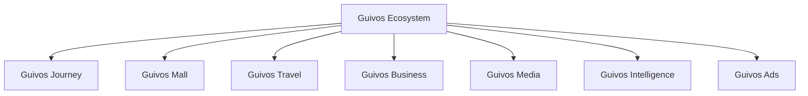
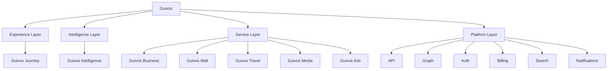

# Arquitetura de Produtos da Guivos

A Arquitetura de Produtos descreve como o Ecossistema Guivos organiza suas ofertas, interfaces, capacidades especializadas, inteligência e unidades de valor.

Ela não substitui o Guivos Ecosystem Blueprint. O GEB explica como o ecossistema funciona; a Arquitetura de Produtos explica como a Guivos entrega valor por meio de componentes integrados.

## Estrutura oficial de componentes

Para fins de construção, operação e evolução funcional, a Guivos adota também a `GLPA-001 — Guivos Layered Product Architecture`.

## Arquitetura funcional em camadas

## Princípio de organização

O Ecossistema Guivos está acima de todos os componentes.

- **Guivos Journey** é a Experience Layer;
- **Guivos Intelligence** é a Intelligence Layer;
- **Guivos Business, Mall, Travel, Media e Ads** são Service Layers;
- capacidades comuns pertencem à Platform Layer.

## Componentes oficiais

| Componente | Natureza | Responsabilidade principal | Status |
|---|---|---|---|
| Guivos Journey | Experience Layer | Orquestrar a experiência unificada do participante | Consolidado |
| Guivos Intelligence | Intelligence Layer | Transformar dados, conhecimento e contexto em inteligência aplicada | Consolidado |
| Guivos Business | Service Layer | Entregar soluções para organizações | Consolidado |
| Guivos Mall | Service Layer | Comercializar produtos e serviços de múltiplos fornecedores | Consolidado |
| Guivos Travel | Service Layer | Organizar viagens e experiências | Consolidado |
| Guivos Media | Service Layer | Produzir e distribuir conteúdo editorial e institucional | Consolidado |
| Guivos Ads | Service Layer | Operar publicidade e mídia patrocinada | Consolidado |

## Especificação vigente do Journey

O `PAS-001 — Guivos Journey 0.5.0` é a especificação-base da Experience Layer.

### Capacidade 02 — Contexto Vivo

As oito extensões normativas `STATE`, `UPDATE`, `CONFLICT`, `VIEW`, `EVENT`, `INTEGRATION`, `KPI` e `CONTRACT`, todas em `1.0.0`, concluíram funcionalmente a Capacidade 02.

### Capacidade 03 — Objetivos

As sete extensões normativas de Objetivos concluíram fundamentos, ciclo de vida, progresso, visão, eventos, integrações, KPIs, cenários e contrato final.

O `PAS-001-OBJ-CONTRACT-001 1.0.0` substitui normativamente o estado `In progress` da linha da Capacidade 03 na seção 7 do `PAS-001 0.5.0`.

A Capacidade 03 está **Functionally complete**.

### Capacidade 04 — Eventos de Vida

As extensões normativas ativas são:

- `PAS-001-EV-FOUNDATION-001` — pergunta central, objetivo funcional, valor, singularidade, definição de Evento de Vida, distinções conceituais, tipos, titularidade, origem, autoridade, temporalidade, estados, impacto, responsabilidades, limites, entradas, integrações iniciais, sensibilidade, explicabilidade e controle do participante;
- `PAS-001-EV-LIFECYCLE-001` — identificação, sinalização, proposição, declaração, confirmação, estados, transições, temporalidade, relevância, impactos, relações, eventos compostos, correção, contestação, encerramento, arquivamento, reabertura, propagação, idempotência e falha segura;
- `PAS-001-EV-VIEW-001` — visão geral, linha do tempo, cartões, detalhamento, impactos, revisões, eventos planejados, conteúdo sensível, histórico, acessibilidade e ações do participante;
- `PAS-001-EV-EVENT-001` — comandos, propostas e fatos reconhecidos, estrutura comum, temporalidades, autoridade, famílias e contratos de eventos, impactos, relações, correções, contestações, permissões, propagação, idempotência, ordenação, versionamento, auditoria e falha segura.

A primeira extensão substitui normativamente o estado `Planned / concept consolidated` da linha da Capacidade 04 na seção 7 do `PAS-001 0.5.0`. A capacidade permanece `In progress`, com progresso editorial de referência de `80%`.

O próximo bloco deverá detalhar as integrações funcionais da Capacidade de Eventos de Vida com as demais capacidades do Journey, Guivos Intelligence, Platform Layer, serviços especializados e fontes externas.

## Regras arquiteturais

1. Nenhum componente representa sozinho todo o Ecossistema Guivos.
2. Um componente deve possuir responsabilidade principal clara.
3. Funcionalidades compartilhadas devem utilizar capacidades comuns do ecossistema.
4. Sobreposições devem ser resolvidas pela responsabilidade predominante.
5. Guivos Journey não deve absorver integralmente responsabilidades dos serviços especializados.
6. Guivos Intelligence é camada transversal.
7. Business, Mall, Travel, Media e Ads preservam responsabilidades especializadas.
8. Guivos Mall substitui Guivos Marketplace como nome oficial do produto comercial.
9. “Comunidade Guivos”, “Guivos Podcast” e “Guivos Insights” não são nomes oficiais de produtos.
10. Objetivos pertencem ao participante e não podem ser ativados apenas por inferência, comportamento ou interesse comercial.
11. Confirmação, ativação, prioridade, atualidade e estado funcional são dimensões distintas do objetivo.
12. Envelhecimento não representa falsidade, pausa não representa fracasso e bloqueio não representa incapacidade pessoal.
13. Atividade, resultado, evidência, progresso, marco e conclusão são conceitos funcionalmente distintos.
14. Percentuais somente podem ser utilizados com base legítima e objetivos pessoais não podem ser concluídos apenas por inferência.
15. `Meus Objetivos` é uma superfície de clareza e controle, não de cobrança, ranking ou comparação pessoal.
16. Objetivos pessoais, institucionais, coletivos e compartilhados devem preservar titularidade, autoridade e permissões próprias.
17. Objetivos sensíveis exigem privacidade visual, minimização e controle reforçado de compartilhamento e notificações.
18. Comando, proposta e evento funcional são conceitos distintos.
19. Eventos reconhecidos devem preservar origem, autoridade, temporalidade, causalidade, correlação, versão e idempotência.
20. O reprocessamento não pode duplicar efeitos e falhas devem reduzir automação em vez de ampliar suposições.
21. Capacidades consumidoras devem receber somente recortes autorizados e reavaliar suas próprias decisões.
22. Integrações não transferem titularidade nem ampliam autoridade funcional.
23. Finalidade explícita e minimização devem preceder todo compartilhamento de objetivos.
24. Contexto Vivo, Objetivos, Próximos Passos, Oportunidades, Experiências e Evolução preservam responsabilidades distintas.
25. Platform Layer aplica contratos técnicos, mas não redefine o significado funcional dos objetivos.
26. Serviços especializados e receita comercial não podem alterar prioridade, relevância ou conclusão funcional.
27. Revogações devem interromper novos usos e falhas de integração devem produzir degradação controlada.
28. Indicadores devem avaliar a capacidade, não o valor ou desempenho humano do participante.
29. Guardrails críticos de autoria, ativação, privacidade, finalidade, conclusão e neutralidade comercial possuem tolerância zero.
30. Uma capacidade funcionalmente concluída somente deverá ser reaberta por lacuna crítica, evidência operacional, incidente, alteração arquitetural ou decisão formal.
31. Evento de Vida representa mudança relevante, não qualquer ocorrência, atividade ou experiência.
32. Evento de Vida governa a mudança e sua temporalidade; Contexto Vivo governa o estado resultante.
33. Evento planejado não equivale a evento ocorrido, e sinal não equivale a evento confirmado.
34. Estado do evento e estado da informação são dimensões distintas.
35. Confirmação do evento não confirma automaticamente seus impactos.
36. Impactos de Eventos de Vida devem ser avaliados por dimensão e objetivo, sem aplicação indiscriminada.
37. Relevância é contextual, explicável e revisável.
38. Causalidade não pode ser presumida apenas pela proximidade temporal.
39. Correções preservam o histórico e contestações limitam efeitos críticos.
40. Conclusão do evento não encerra automaticamente impactos persistentes.
41. Propagação utiliza recortes mínimos e reprocessamento não pode duplicar efeitos.
42. Eventos sensíveis exigem minimização, proteção visual, finalidade específica e ausência de exploração comercial.
43. Eventos de Vida não criam objetivos pessoais ativos nem impõem prioridade.
44. A linha do tempo de Eventos de Vida não é feed social, diário integral, ranking ou instrumento de avaliação pessoal.
45. Sinais, propostas, eventos planejados e fatos ocorridos devem permanecer visualmente distintos.
46. Impactos propostos não podem ser apresentados como aplicados.
47. Contratos de Eventos de Vida representam fatos reconhecidos e não comandos ou propostas pendentes.
48. Eventos históricos são imutáveis; correções devem produzir novos eventos compensatórios.
49. Tempo do fato, do conhecimento, do reconhecimento e da aplicação devem permanecer separados.
50. Titular, ator e fonte devem permanecer distintos e limitados por autoridade explícita.
51. Eventos e impactos possuem ciclos próprios e conclusão do evento não encerra impactos persistentes.
52. Ordenação, versão esperada, concorrência e idempotência devem impedir estados impossíveis, sobrescrita silenciosa e efeitos duplicados.
53. Revogação somente poderá ser apresentada como concluída após propagação efetiva aos consumidores necessários.
54. Métricas dos contratos devem avaliar o sistema, não o participante.

## Documentos do domínio

- [GLPA-001 — Guivos Layered Product Architecture](layered-product-architecture.md)
- [PAS-001 — Guivos Journey](pas-001-guivos-journey.md)
- [PAS-001-CV-CONTRACT-001 — Cenários e Contrato Final do Contexto Vivo](pas-001-contexto-vivo-cenarios-contrato-final.md)
- [PAS-001-OBJ-CONTRACT-001 — KPIs, Cenários e Contrato Final da Capacidade de Objetivos](pas-001-objetivos-kpis-cenarios-contrato-final.md)
- [PAS-001-EV-FOUNDATION-001 — Fundamentos Iniciais da Capacidade de Eventos de Vida](pas-001-eventos-de-vida-fundamentos-iniciais.md)
- [PAS-001-EV-LIFECYCLE-001 — Regras do Ciclo de Vida dos Eventos de Vida](pas-001-eventos-de-vida-ciclo-de-vida.md)
- [PAS-001-EV-VIEW-001 — Visualização e Controle dos Eventos de Vida](pas-001-eventos-de-vida-visualizacao-controle.md)
- [PAS-001-EV-EVENT-001 — Contratos dos Eventos Funcionais de Eventos de Vida](pas-001-eventos-de-vida-eventos-funcionais.md)
- [Guivos Journey](journey.md)
- [Guivos Mall](mall.md)
- [Guivos Travel](travel.md)
- [Guivos Business](business.md)
- [Guivos Media](media.md)
- [Guivos Intelligence](intelligence.md)
- [Guivos Ads](ads.md)
