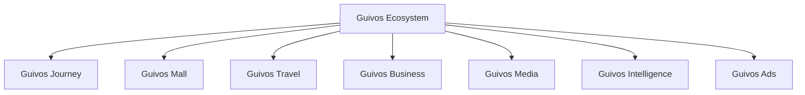
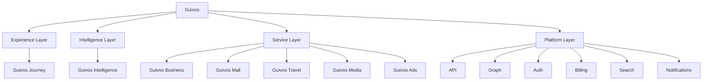

# Arquitetura de Produtos da Guivos

A Arquitetura de Produtos descreve como o Ecossistema Guivos organiza suas ofertas, interfaces, capacidades especializadas, inteligência e unidades de valor.

Ela não substitui o Guivos Ecosystem Blueprint. O GEB explica como o ecossistema funciona; a Arquitetura de Produtos explica como a Guivos entrega valor por meio de componentes integrados.

## Estrutura oficial de componentes

Para fins de construção, operação e evolução funcional, a Guivos adota também a `GLPA-001 — Guivos Layered Product Architecture`.

## Arquitetura funcional em camadas

## Princípio de organização

O Ecossistema Guivos está acima de todos os componentes.

- **Guivos Journey** é a Experience Layer;
- **Guivos Intelligence** é a Intelligence Layer;
- **Guivos Business, Mall, Travel, Media e Ads** são Service Layers;
- capacidades comuns pertencem à Platform Layer.

## Componentes oficiais

| Componente | Natureza | Responsabilidade principal | Status |
|---|---|---|---|
| Guivos Journey | Experience Layer | Orquestrar a experiência unificada do participante | Consolidado |
| Guivos Intelligence | Intelligence Layer | Transformar dados, conhecimento e contexto em inteligência aplicada | Consolidado |
| Guivos Business | Service Layer | Entregar soluções para organizações | Consolidado |
| Guivos Mall | Service Layer | Comercializar produtos e serviços de múltiplos fornecedores | Consolidado |
| Guivos Travel | Service Layer | Organizar viagens e experiências | Consolidado |
| Guivos Media | Service Layer | Produzir e distribuir conteúdo editorial e institucional | Consolidado |
| Guivos Ads | Service Layer | Operar publicidade e mídia patrocinada | Consolidado |

## Especificação vigente do Journey

O `PAS-001 — Guivos Journey 0.5.0` é a especificação-base da Experience Layer.

### Capacidade 02 — Contexto Vivo

As oito extensões normativas `STATE`, `UPDATE`, `CONFLICT`, `VIEW`, `EVENT`, `INTEGRATION`, `KPI` e `CONTRACT`, todas em `1.0.0`, concluíram funcionalmente a Capacidade 02.

### Capacidade 03 — Objetivos

As extensões normativas ativas são:

- `PAS-001-OBJ-FOUNDATION-001` — pergunta central, objetivo funcional, valor, princípios, distinções conceituais, tipos de objetivo, responsabilidades, limites, entradas, estados, relações, conflitos, critérios de sucesso, integrações, saídas e eventos iniciais;
- `PAS-001-OBJ-LIFECYCLE-001` — unidade funcional, origens, criação, confirmação, ativação, duplicidade, reformulação, prioridade, portfólio, conflitos, revisão, envelhecimento, pausa, bloqueio, conclusão, retirada, substituição, arquivamento, reativação e propagação;
- `PAS-001-OBJ-PROGRESS-001` — critérios de sucesso, linhas de base, progresso, marcos, evidências, resultados parciais, conclusão, contestação, reabertura e efeitos funcionais;
- `PAS-001-OBJ-VIEW-001` — visão `Meus Objetivos`, portfólio, detalhamento, controles, explicações, revisões, alertas, privacidade visual, proteção de objetivos sensíveis, consistência entre canais e histórico compreensível;
- `PAS-001-OBJ-EVENT-001` — comandos, propostas, eventos reconhecidos, autoridade, temporalidade, causalidade, correlação, idempotência, contratos das famílias de eventos, propagação, correção, auditoria e falha segura;
- `PAS-001-OBJ-INTEGRATION-001` — integrações com capacidades do Journey, Guivos Intelligence, Platform Layer, serviços especializados, organizações, profissionais e fontes externas, com finalidade, minimização, revogação, explicabilidade e degradação segura.

A primeira extensão substitui normativamente o estado `Planned` da linha da Capacidade 03 na seção 7 do `PAS-001 0.5.0`. A capacidade permanece `In progress`.

## Regras arquiteturais

1. Nenhum componente representa sozinho todo o Ecossistema Guivos.
2. Um componente deve possuir responsabilidade principal clara.
3. Funcionalidades compartilhadas devem utilizar capacidades comuns do ecossistema.
4. Sobreposições devem ser resolvidas pela responsabilidade predominante.
5. Guivos Journey não deve absorver integralmente responsabilidades dos serviços especializados.
6. Guivos Intelligence é camada transversal.
7. Business, Mall, Travel, Media e Ads preservam responsabilidades especializadas.
8. Guivos Mall substitui Guivos Marketplace como nome oficial do produto comercial.
9. “Comunidade Guivos”, “Guivos Podcast” e “Guivos Insights” não são nomes oficiais de produtos.
10. Objetivos pertencem ao participante e não podem ser ativados apenas por inferência, comportamento ou interesse comercial.
11. Confirmação, ativação, prioridade, atualidade e estado funcional são dimensões distintas do objetivo.
12. Envelhecimento não representa falsidade, pausa não representa fracasso e bloqueio não representa incapacidade pessoal.
13. Atividade, resultado, evidência, progresso, marco e conclusão são conceitos funcionalmente distintos.
14. Percentuais somente podem ser utilizados com base legítima e objetivos pessoais não podem ser concluídos apenas por inferência.
15. `Meus Objetivos` é uma superfície de clareza e controle, não de cobrança, ranking ou comparação pessoal.
16. Objetivos pessoais, institucionais, coletivos e compartilhados devem preservar titularidade, autoridade e permissões próprias.
17. Objetivos sensíveis exigem privacidade visual, minimização e controle reforçado de compartilhamento e notificações.
18. Comando, proposta e evento funcional são conceitos distintos.
19. Eventos reconhecidos devem preservar origem, autoridade, temporalidade, causalidade, correlação, versão e idempotência.
20. O reprocessamento não pode duplicar efeitos e falhas devem reduzir automação em vez de ampliar suposições.
21. Capacidades consumidoras devem receber somente recortes autorizados e reavaliar suas próprias decisões.
22. Integrações não transferem titularidade nem ampliam autoridade funcional.
23. Finalidade explícita e minimização devem preceder todo compartilhamento de objetivos.
24. Contexto Vivo, Objetivos, Próximos Passos, Oportunidades, Experiências e Evolução preservam responsabilidades distintas.
25. Platform Layer aplica contratos técnicos, mas não redefine o significado funcional dos objetivos.
26. Serviços especializados e receita comercial não podem alterar prioridade, relevância ou conclusão funcional.
27. Revogações devem interromper novos usos e falhas de integração devem produzir degradação controlada.

## Documentos do domínio

- [GLPA-001 — Guivos Layered Product Architecture](layered-product-architecture.md)
- [PAS-001 — Guivos Journey](pas-001-guivos-journey.md)
- [PAS-001-CV-CONTRACT-001 — Cenários e Contrato Final do Contexto Vivo](pas-001-contexto-vivo-cenarios-contrato-final.md)
- [PAS-001-OBJ-FOUNDATION-001 — Fundamentos Iniciais da Capacidade de Objetivos](pas-001-objetivos-fundamentos-iniciais.md)
- [PAS-001-OBJ-LIFECYCLE-001 — Regras do Ciclo de Vida dos Objetivos](pas-001-objetivos-ciclo-de-vida.md)
- [PAS-001-OBJ-PROGRESS-001 — Critérios de Sucesso, Progresso, Evidências e Conclusão](pas-001-objetivos-progresso-e-conclusao.md)
- [PAS-001-OBJ-VIEW-001 — Comportamentos Funcionais de Meus Objetivos](pas-001-meus-objetivos.md)
- [PAS-001-OBJ-EVENT-001 — Contratos dos Eventos Funcionais de Objetivos](pas-001-objetivos-eventos-funcionais.md)
- [PAS-001-OBJ-INTEGRATION-001 — Integrações Funcionais da Capacidade de Objetivos](pas-001-objetivos-integracoes-funcionais.md)
- [Guivos Journey](journey.md)
- [Guivos Mall](mall.md)
- [Guivos Travel](travel.md)
- [Guivos Business](business.md)
- [Guivos Media](media.md)
- [Guivos Intelligence](intelligence.md)
- [Guivos Ads](ads.md)