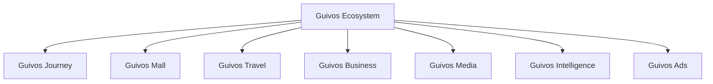
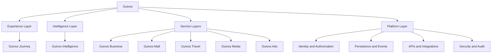

# Arquitetura de Produtos da Guivos

A Arquitetura de Produtos descreve como o Ecossistema Guivos organiza suas ofertas, interfaces, capacidades especializadas, inteligência e unidades de valor.

Ela não substitui o Guivos Ecosystem Blueprint. O GEB explica como o ecossistema funciona; a Arquitetura de Produtos explica como a Guivos entrega valor por meio de componentes integrados.

## Estrutura oficial de componentes

## Arquitetura funcional em camadas

## Princípio de organização

- **Guivos Journey** é a Experience Layer;
- **Guivos Intelligence** é a Intelligence Layer;
- **Guivos Business, Mall, Travel, Media e Ads** são Service Layers;
- capacidades comuns pertencem à Platform Layer;
- nenhuma camada técnica redefine significado funcional;
- nenhuma relação comercial amplia autoridade normativa.

## Componentes oficiais

| Componente | Natureza | Responsabilidade principal | Estado arquitetural |
|---|---|---|---|
| Guivos Journey | Experience Layer | Orquestrar a experiência unificada do participante | PAS-001 1.0.0 publicado |
| Guivos Intelligence | Intelligence Layer | Transformar dados, conhecimento e contexto em inteligência aplicada | GIA-000 1.3.0 ativo |
| Guivos Business | Service Layer | Entregar soluções para organizações | Consolidado em nível de produto |
| Guivos Mall | Service Layer | Comercializar produtos e serviços de múltiplos fornecedores | Consolidado em nível de produto |
| Guivos Travel | Service Layer | Organizar viagens e experiências | Consolidado em nível de produto |
| Guivos Media | Service Layer | Produzir e distribuir conteúdo editorial e institucional | Consolidado em nível de produto |
| Guivos Ads | Service Layer | Operar publicidade e mídia patrocinada | Consolidado em nível de produto |

## Guivos Journey — especificação vigente

O [`PAS-001 — Guivos Journey 1.0.0`](pas-001-guivos-journey.md) é a especificação arquitetural canônica e ativa da Experience Layer.

### Ciclo de publicação concluído

| Etapa | Documento | Estado |
|---|---|---|
| Reconciliação | `PAS-001-RECON-001 1.0.0` | Concluída |
| Auditoria final | `PAS-001-AUDIT-001 1.0.0` | 15 gates aprovados |
| Edição candidata | `PAS-001-CANDIDATE-001 1.0.0-rc.1` | Histórica — promoted |
| Validação de release | `PAS-001-RELEASE-VALIDATION-001 1.0.0` | 25 gates aprovados |
| Publicação controlada | `PAS-001-PUBLICATION-001 1.0.0` | PAS-001 ativo |
| Mapa Final | [`PAS-001-CAPABILITY-MAP-001 1.0.1`](pas-001-guivos-journey-mapa-final-capacidades.md) | Ativo e navegável |
| Reconciliação pós-publicação | [`GE2-SYNC-008 1.0.0`](../project/GE2-SYNC-008-post-publication-continuity-and-engineering-handoff-readiness.md) | Concluída |

Todas as nove capacidades estão funcionalmente concluídas. Os nove contratos finais e as 54 extensões normativas permanecem autoridades especializadas.

## Mapa das capacidades

| Nº | Capacidade | Responsabilidade | Estado | Contrato final |
|---:|---|---|---|---|
| 01 | Captura de Contexto | Iniciar compreensão autorizada | Functionally complete | [`PAS-001-CC-CONTRACT-001`](pas-001-captura-de-contexto-kpis-cenarios-contrato-final.md) |
| 02 | Contexto Vivo | Manter representação contextual atual | Functionally complete | [`PAS-001-CV-CONTRACT-001`](pas-001-contexto-vivo-cenarios-contrato-final.md) |
| 03 | Objetivos | Governar direções assumidas | Functionally complete | [`PAS-001-OBJ-CONTRACT-001`](pas-001-objetivos-kpis-cenarios-contrato-final.md) |
| 04 | Eventos de Vida | Governar mudanças relevantes | Functionally complete | [`PAS-001-EV-CONTRACT-001`](pas-001-eventos-de-vida-kpis-cenarios-contrato-final.md) |
| 05 | Próximos Passos | Governar movimentos possíveis | Functionally complete | [`PAS-001-PP-CONTRACT-001`](pas-001-proximos-passos-kpis-cenarios-contrato-final.md) |
| 06 | Oportunidades Ativas | Governar meios admissíveis | Functionally complete | [`PAS-001-OA-CONTRACT-001`](pas-001-oportunidades-ativas-kpis-cenarios-contrato-final.md) |
| 07 | Intervenções Contextuais | Governar manifestação, espera ou silêncio | Functionally complete | [`PAS-001-IC-CONTRACT-001`](pas-001-intervencoes-contextuais-kpis-cenarios-contrato-final.md) |
| 08 | Experiências | Governar aquilo que foi vivido | Functionally complete | [`PAS-001-EXP-CONTRACT-001`](pas-001-experiencias-kpis-cenarios-contrato-final.md) |
| 09 | Evolução Contínua | Governar trajetórias de mudança | Functionally complete | [`PAS-001-EC-CONTRACT-001`](pas-001-evolucao-continua-kpis-cenarios-contrato-final.md) |

## Fronteiras entre camadas

### Experience Layer

Governa contexto apresentado, direções assumidas, mudanças relevantes, movimentos possíveis, oportunidades, manifestações, experiências, evolução e controles visíveis.

### Intelligence Layer

Pode interpretar, classificar, comparar, estimar confiança, detectar divergências, produzir candidatos e explicar. Não confirma em nome do participante, não cria compromisso, não decide manifestação e não reconhece automaticamente experiência ou evolução.

### Service Layers

Fornecem produtos, serviços, conteúdo, fatos operacionais e oportunidades. Não determinam objetivo, prioridade humana, relevância final, experiência, evolução ou valor do participante.

### Platform Layer

Sustenta identidade, autenticação, autorização, persistência, eventos, APIs, filas, criptografia, auditoria, versionamento, idempotência e observabilidade. Não redefine significado, relevância ou autoridade normativa.

## Frente vigente — Product Engineering

O próximo documento é:

> **`PAS-001-ENGINEERING-HANDOFF-001 — Handoff Arquitetural do Guivos Journey para Product Engineering`**

O Handoff deverá traduzir a arquitetura funcional em:

- agregados e autoridades de domínio;
- superfícies e componentes;
- comandos, eventos e schemas;
- persistência, busca e grafo;
- integrações;
- identidade, autorização, privacidade e segurança;
- observabilidade;
- estratégias de teste;
- dependências e ordem recomendada;
- protótipos, prontidão e backlog técnico.

## Regras da tradução técnica

- capacidade não equivale a tela;
- capacidade não equivale a microsserviço;
- ordem canônica não equivale a pipeline obrigatório;
- tecnologia não redefine conceito funcional;
- Intelligence apoia, mas não assume decisão;
- Platform sustenta, mas não assume autoridade normativa;
- conflito técnico com regra funcional retorna ao contrato competente;
- o Handoff não reabre automaticamente o `PAS-001`.

## Estado resultante

| Ativo | Estado |
|---|---|
| PAS-001 | Active 1.0.0 |
| Mapa Final | Active 1.0.1 |
| Capacidades 01–09 | Functionally complete |
| Contratos finais | Nove ativos em 1.0.0 |
| Extensões normativas | 54 vigentes |
| Marco vigente | M5.10 |
| Frente operacional | Product Engineering |
| Próxima especificação | PAS-001-ENGINEERING-HANDOFF-001 |
