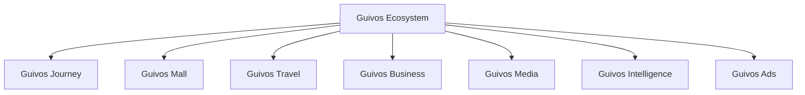
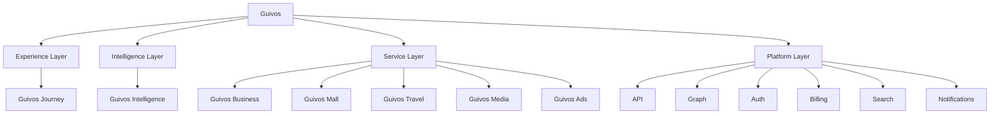

# Arquitetura de Produtos da Guivos

A Arquitetura de Produtos descreve como o Ecossistema Guivos organiza suas ofertas, interfaces, capacidades especializadas, inteligência e unidades de valor.

Ela não substitui o Guivos Ecosystem Blueprint. O GEB explica como o ecossistema funciona; a Arquitetura de Produtos explica como a Guivos entrega valor por meio de componentes integrados.

## Estrutura oficial de componentes

Para fins de construção, operação e evolução funcional, a Guivos adota também a `GLPA-001 — Guivos Layered Product Architecture`.

## Arquitetura funcional em camadas

## Princípio de organização

O Ecossistema Guivos está acima de todos os componentes.

- **Guivos Journey** é a Experience Layer;
- **Guivos Intelligence** é a Intelligence Layer;
- **Guivos Business, Mall, Travel, Media e Ads** são Service Layers;
- capacidades comuns pertencem à Platform Layer.

## Componentes oficiais

| Componente | Natureza | Responsabilidade principal | Status |
|---|---|---|---|
| Guivos Journey | Experience Layer | Orquestrar a experiência unificada do participante | Consolidado |
| Guivos Intelligence | Intelligence Layer | Transformar dados, conhecimento e contexto em inteligência aplicada | Consolidado |
| Guivos Business | Service Layer | Entregar soluções para organizações | Consolidado |
| Guivos Mall | Service Layer | Comercializar produtos e serviços de múltiplos fornecedores | Consolidado |
| Guivos Travel | Service Layer | Organizar viagens e experiências | Consolidado |
| Guivos Media | Service Layer | Produzir e distribuir conteúdo editorial e institucional | Consolidado |
| Guivos Ads | Service Layer | Operar publicidade e mídia patrocinada | Consolidado |

## Especificação vigente do Journey

O `PAS-001 — Guivos Journey 0.5.0` é a especificação-base da Experience Layer.

### Capacidade 02 — Contexto Vivo

As oito extensões normativas `STATE`, `UPDATE`, `CONFLICT`, `VIEW`, `EVENT`, `INTEGRATION`, `KPI` e `CONTRACT`, todas em `1.0.0`, concluíram funcionalmente a Capacidade 02.

### Capacidade 03 — Objetivos

As sete extensões normativas de Objetivos concluíram fundamentos, ciclo de vida, progresso, visão, eventos, integrações, KPIs, cenários e contrato final.

O `PAS-001-OBJ-CONTRACT-001 1.0.0` substitui normativamente o estado `In progress` da linha da Capacidade 03 na seção 7 do `PAS-001 0.5.0`.

A Capacidade 03 está **Functionally complete**.

### Capacidade 04 — Eventos de Vida

As seis extensões normativas `FOUNDATION`, `LIFECYCLE`, `VIEW`, `EVENT`, `INTEGRATION` e `CONTRACT`, todas em `1.0.0`, concluíram fundamentos, ciclo de vida, visualização, eventos funcionais, integrações, 60 KPIs, 18 guardrails, cenários e contrato final.

A Capacidade 04 está **Functionally complete**, com progresso editorial de referência de `100%`.

### Capacidade 05 — Próximos Passos

As seis extensões normativas `FOUNDATION`, `LIFECYCLE`, `VIEW`, `EVENT`, `INTEGRATION` e `CONTRACT`, todas em `1.0.0`, concluíram fundamentos, ciclo de vida, visualização, eventos funcionais, integrações, 68 KPIs, 20 guardrails, cenários e contrato final.

A Capacidade 05 está **Functionally complete**, com progresso editorial de referência de `100%`.

### Capacidade 06 — Oportunidades Ativas

`PAS-001-OA-FOUNDATION-001 1.0.0` é a primeira extensão normativa da Capacidade 06 e substitui `Planned / concept consolidated` por `In progress`.

A extensão consolida:

- pergunta central, objetivo funcional, valor entregue e singularidade;
- Oportunidade Ativa como meio suficientemente disponível, legítimo, contextual e potencialmente compatível;
- distinção entre oportunidade candidata, Oportunidade Ativa, oferta, anúncio, recomendação, Próximo Passo, experiência e transação;
- titularidade, papéis, origens e autoridade das fontes;
- tipos, classificações, elegibilidade e disponibilidade;
- temporalidade, localização, modalidade, custos e condições econômicas;
- patrocínio, comissão, afiliação e demais relações comerciais;
- risco, segurança, sensibilidade e escassez;
- relevância contextual, fatores legítimos e fatores proibidos;
- limiar de ativação, estados funcionais, estado da informação e relação individual do participante;
- ausência legítima de oportunidades compatíveis;
- entradas, admissão, estrutura do registro, saídas e eventos iniciais;
- relações com as capacidades do Journey, Guivos Intelligence, Platform Layer e produtos especializados;
- neutralidade comercial, controle do participante, responsabilidades e limites.

A Capacidade 06 está **In progress**, com progresso editorial de referência de `20%`.

O próximo bloco deverá consolidar o ciclo de vida das Oportunidades Ativas.

## Regras arquiteturais

1. Nenhum componente representa sozinho todo o Ecossistema Guivos.
2. Um componente deve possuir responsabilidade principal clara.
3. Funcionalidades compartilhadas devem utilizar capacidades comuns do ecossistema.
4. Sobreposições devem ser resolvidas pela responsabilidade predominante.
5. Guivos Journey não deve absorver integralmente responsabilidades dos serviços especializados.
6. Guivos Intelligence é camada transversal.
7. Business, Mall, Travel, Media e Ads preservam responsabilidades especializadas.
8. Guivos Mall substitui Guivos Marketplace como nome oficial do produto comercial.
9. “Comunidade Guivos”, “Guivos Podcast” e “Guivos Insights” não são nomes oficiais de produtos.
10. Objetivos pertencem ao participante e não podem ser ativados apenas por inferência, comportamento ou interesse comercial.
11. Confirmação, ativação, prioridade, atualidade e estado funcional são dimensões distintas do objetivo.
12. Envelhecimento não representa falsidade, pausa não representa fracasso e bloqueio não representa incapacidade pessoal.
13. Atividade, resultado, evidência, progresso, marco e conclusão são conceitos funcionalmente distintos.
14. Percentuais somente podem ser utilizados com base legítima e objetivos pessoais não podem ser concluídos apenas por inferência.
15. `Meus Objetivos` é uma superfície de clareza e controle, não de cobrança, ranking ou comparação pessoal.
16. Objetivos pessoais, institucionais, coletivos e compartilhados devem preservar titularidade, autoridade e permissões próprias.
17. Objetivos sensíveis exigem privacidade visual, minimização e controle reforçado.
18. Comando, proposta e evento funcional são conceitos distintos.
19. Eventos reconhecidos devem preservar origem, autoridade, temporalidade, correlação, versão e idempotência.
20. O reprocessamento não pode duplicar efeitos e falhas devem reduzir automação.
21. Capacidades consumidoras devem receber somente recortes autorizados e reavaliar suas próprias decisões.
22. Integrações não transferem titularidade nem ampliam autoridade funcional.
23. Finalidade explícita e minimização devem preceder todo compartilhamento.
24. Contexto Vivo, Objetivos, Eventos de Vida, Próximos Passos, Oportunidades, Intervenções, Experiências e Evolução preservam responsabilidades distintas.
25. Platform Layer aplica contratos técnicos, mas não redefine significado funcional.
26. Serviços especializados e receita comercial não podem alterar prioridade, relevância, confirmação ou conclusão funcional.
27. Revogações devem interromper novos usos e falhas de integração devem produzir degradação controlada.
28. Indicadores devem avaliar a capacidade, não o valor ou desempenho humano do participante.
29. Guardrails críticos possuem tolerância zero e prevalecem sobre médias agregadas.
30. Uma capacidade funcionalmente concluída somente deverá ser reaberta por fundamento formal.
31. Evento de Vida representa mudança relevante, não qualquer ocorrência, atividade ou experiência.
32. Evento de Vida governa a mudança; Contexto Vivo governa o estado resultante.
33. Evento planejado não equivale a ocorrido e sinal não equivale a confirmado.
34. Estado do evento e estado da informação são dimensões distintas.
35. Confirmação do evento não confirma automaticamente seus impactos.
36. Impactos devem ser avaliados por unidade afetada.
37. Relevância é contextual, explicável e revisável.
38. Causalidade não pode ser presumida por proximidade temporal.
39. Correções preservam o histórico e contestações limitam efeitos críticos.
40. Conclusão do evento não encerra automaticamente impactos persistentes.
41. Propagação utiliza recortes mínimos e reprocessamento não duplica efeitos.
42. Eventos sensíveis exigem minimização, proteção visual e ausência de exploração comercial.
43. Eventos de Vida não criam objetivos pessoais ativos nem impõem prioridade.
44. A linha do tempo de Eventos de Vida não é feed social, diário integral ou instrumento de avaliação pessoal.
45. Sinais, propostas, planejamentos e fatos ocorridos devem permanecer distintos.
46. Impactos propostos não podem ser apresentados como aplicados.
47. Contratos de Eventos de Vida representam fatos reconhecidos, não comandos pendentes.
48. Eventos históricos são imutáveis; correções devem produzir eventos compensatórios.
49. Tempo do fato, conhecimento, reconhecimento e aplicação permanecem separados.
50. Titular, ator e fonte permanecem distintos e limitados por autoridade.
51. Eventos e impactos possuem ciclos próprios.
52. Ordenação, versão, concorrência e idempotência impedem estados impossíveis e duplicidades.
53. Revogação somente pode ser concluída após propagação efetiva.
54. Métricas dos contratos avaliam o sistema, não o participante.
55. Integrações de Eventos de Vida exigem finalidade, minimização, identidade e autoridade.
56. Disponibilidade técnica de dados não autoriza uso ou confirmação.
57. Transformações não podem fabricar precisão, causalidade, significado emocional ou diagnóstico.
58. Capacidades consumidoras recebem solicitações e recortes, não decisões impostas.
59. Guivos Business somente confirma fatos institucionais e não recebe a jornada pessoal integral.
60. Compra, reserva, calendário, localização ou atividade não confirmam mudança humana.
61. Guivos Ads não utiliza Eventos de Vida sensíveis para publicidade.
62. Pausa interrompe coleta e revogação interrompe novos usos sem apagar fatos legítimos.
63. Ausência de dado não equivale a ausência de Evento de Vida.
64. Falhas preservam o último estado válido e reduzem automação.
65. O participante deve compreender fontes, transformações, recortes, consumidores, pausa e revogação.
66. Maior volume de Eventos de Vida não representa melhor qualidade.
67. Uma boa média não compensa violação de guardrail.
68. A ausência de Eventos de Vida registrados é legítima.
69. Eventos de Vida não atribuem automaticamente diagnóstico, significado emocional, sucesso, fracasso ou valor humano.
70. Os 60 KPIs e 18 guardrails constituem a baseline normativa da Capacidade 04.
71. Próximo Passo representa movimento possível, não objetivo, tarefa ou oportunidade.
72. Próximo Passo proposto é hipótese, não decisão assumida.
73. Próximo Passo confirmado não representa execução iniciada.
74. “Próximo” é contextual, não apenas cronológico.
75. Poderão existir múltiplos Próximos Passos ou nenhum passo ativo.
76. Titular, proponente, decisor, responsável e executor são papéis distintos.
77. Responsabilidade não pode ser atribuída silenciosamente.
78. Organização somente governa passos dentro de sua autoridade.
79. Guivos Intelligence produz hipóteses, alternativas e sugestões, não compromissos.
80. Prioridade operacional é distinta de urgência, importância, prontidão, esforço e valor humano.
81. Bloqueio não representa incapacidade e pausa não representa fracasso.
82. Esperar pode constituir movimento legítimo.
83. Conclusão de Próximo Passo não conclui automaticamente o objetivo.
84. Oportunidade é meio e sua disponibilidade não cria automaticamente um passo.
85. Atividade realizada não confirma adequação, conclusão ou progresso.
86. Datas, prazos e precisão temporal não podem ser fabricados.
87. Passos sensíveis exigem finalidade, minimização, privacidade e controle.
88. Receita, patrocínio ou publicidade não podem determinar prioridade.
89. A capacidade não deve criar listas ou ações artificiais para maximizar engajamento.
90. O participante permanece no controle da criação, confirmação, alteração, priorização, execução, cancelamento e compartilhamento.
91. Possibilidade, proposta, confirmação, ativação, prontidão, agendamento, execução, resultado, progresso e conclusão são dimensões distintas.
92. Confirmação condicionada não produz ativação antes do atendimento da condição.
93. Prontidão não equivale a prioridade, obrigação imediata ou início.
94. Desbloqueio não inicia automaticamente a execução.
95. Prazo vencido não representa conclusão, cancelamento, abandono ou fracasso.
96. Ausência de atualização não representa interrupção ou abandono.
97. Resultado imediato não equivale a progresso do objetivo.
98. Um passo pode ser concluído mesmo quando o resultado esperado não ocorrer, desde que o movimento delimitado tenha sido realizado.
99. Conclusão automática exige fato objetivo, fonte autorizada e possibilidade de contestação.
100. Cancelamento, substituição e expiração possuem significados distintos e não representam julgamento pessoal.
101. Recorrência não comprova hábito, aderência, identidade ou evolução.
102. Confirmação compartilhada ocorre individualmente por participante ou papel.
103. Delegação transfere execução dentro de escopo autorizado, não titularidade ou decisão.
104. Revogação interrompe novos acessos e usos e deve propagar recortes recompostos.
105. Reprocessamento não pode duplicar passo, confirmação, prioridade, agendamento, conclusão, notificação ou responsabilidade.
106. Mensagens fora de ordem e alterações concorrentes não podem gerar estados impossíveis ou sobrescrita silenciosa.
107. Falha parcial não pode ser apresentada como sucesso integral.
108. Acompanhamento deve ser proporcional e não constituir vigilância excessiva.
109. O ciclo deve apoiar ação real, não maximizar listas, notificações ou tempo de tela.
110. O participante permanece no controle do ciclo de vida.
111. `Meus Próximos Passos` é uma superfície de clareza e controle, não uma lista infinita de tarefas.
112. A visão geral não pode utilizar contagem de passos como pontuação de produtividade.
113. Propostas, possibilidades futuras e passos confirmados devem permanecer visualmente distintos.
114. Cartões devem utilizar minimização e detalhamento progressivo.
115. Estado funcional e estado da informação devem ser apresentados separadamente quando necessário.
116. Prioridade, urgência, prazo, prontidão, esforço e risco não podem ser colapsados em um único indicador.
117. Alternativas recomendadas devem manter critérios, incerteza e relações comerciais visíveis.
118. Data sugerida não representa compromisso confirmado.
119. Passos sem prazo e períodos sem passos ativos são estados legítimos.
120. Dependências externas devem mostrar o limite de controle do participante.
121. Tarefas e subpassos são detalhamento opcional e não determinam automaticamente a conclusão de movimentos qualitativos.
122. Execução e resultado devem permanecer visualmente separados.
123. Recorrência não pode utilizar punição, sequência quebrada, ranking ou julgamento de disciplina.
124. Responsabilidades compartilhadas não podem surgir por silêncio.
125. Conteúdo sensível exige títulos neutros, modo discreto e notificações minimizadas.
126. A fila de atenção não deve tratar todos os itens como urgentes.
127. A interface deve oferecer acessibilidade técnica e cognitiva e alternativa a interações de arrastar e soltar.
128. Falha ou sincronização pendente não pode ser apresentada como sucesso integral.
129. Oportunidades e conteúdo comercial devem permanecer separados da prioridade funcional.
130. A visão deve apoiar ação no mundo real e manter o participante no controle.
131. Comandos de Próximos Passos não representam fatos reconhecidos.
132. Propostas de Próximos Passos não representam decisões assumidas.
133. Eventos de Próximos Passos somente podem ser publicados após persistência funcional suficiente.
134. Eventos históricos de Próximos Passos são imutáveis e correções devem ser compensatórias.
135. Titular, ator, papel e autoridade devem permanecer explícitos e distintos.
136. Tempos da intenção, decisão, execução, resultado, conhecimento e processamento devem permanecer separados.
137. A mesma solicitação não pode duplicar estado, prioridade, responsabilidade, notificação ou compartilhamento.
138. Eventos fora de ordem e conflitos de versão devem ser reconciliados sem sobrescrita silenciosa.
139. Revogação de compartilhamento somente é concluída após propagação efetiva.
140. Consumidores recebem recortes e solicitações, não decisões impostas.
141. Eventos de leitura e interação não alteram confirmação, execução ou conclusão.
142. Falha parcial não equivale a operação funcionalmente concluída.
143. Logs devem minimizar conteúdo sensível e manter auditoria suficiente.
144. Platform Layer sustenta armazenamento, publicação, filas e reconstrução sem redefinir semântica.
145. As métricas dos contratos avaliam o sistema, não o participante.
146. O participante permanece no controle dos eventos funcionais da capacidade.
147. Integração de Próximos Passos não representa decisão do participante.
148. Disponibilidade técnica de dado não representa autorização de uso.
149. Fonte somente confirma fatos dentro de sua autoridade.
150. Finalidade deve preceder acesso e minimização deve preceder compartilhamento.
151. Titularidade não é transferida por integração.
152. A capacidade consumidora governa sua própria decisão e não recebe decisões impostas.
153. Informação externa não cria compromisso pessoal.
154. Calendário não confirma execução e compra não confirma conclusão.
155. Localização não confirma ação e atividade não confirma progresso.
156. Participação não confirma transformação humana.
157. Organização não recebe a jornada pessoal integral.
158. Receita e patrocínio não alteram prioridade ou recomendação funcional.
159. Conteúdo sensível não pode alimentar publicidade.
160. Transformações não podem fabricar precisão, causalidade, intenção, responsabilidade ou diagnóstico.
161. Sincronização não pode duplicar efeitos.
162. Mensagens fora de ordem não podem criar estados impossíveis.
163. Revogação interrompe novos usos e exige propagação efetiva.
164. Falha de integração reduz automação e preserva o último estado válido.
165. Falha parcial não representa sucesso integral.
166. Ausência de dado não representa ausência de necessidade.
167. Informação pública não representa uso irrestrito.
168. Integrações temporárias devem possuir expiração.
169. Informações de terceiros não devem formar perfis independentes.
170. Qualidade técnica, confiança funcional e autoridade são dimensões distintas.
171. Proveniência e cadeia de transformação devem permanecer reconstruíveis.
172. Pausa e revogação devem permanecer controláveis pelo participante.
173. Guivos Intelligence pode sugerir, explicar e comparar, mas não confirmar decisões pessoais.
174. Platform Layer sustenta integração, sincronização e auditoria sem redefinir semântica.
175. Métricas das integrações avaliam o sistema, não o participante.
176. O participante permanece no controle das integrações funcionais.
177. Os 68 KPIs e 20 guardrails constituem a baseline normativa da Capacidade 05.
178. Indicadores de Próximos Passos avaliam o sistema e a capacidade, não produtividade, mérito, disciplina ou valor humano.
179. Nenhuma média positiva compensa violação de guardrail de tolerância zero.
180. A baseline real deve preceder metas permanentes e não pode ser copiada de aplicativos de tarefas ou engajamento.
181. A ausência de Próximos Passos ativos é um estado legítimo.
182. Guardrails devem interromper fluxos afetados, limitar efeitos, produzir correção e validar recuperação.
183. Conclusão funcional não significa implementação, validação em produção ou baseline quantitativa concluída.
184. A Capacidade 05 somente pode ser reaberta por fundamento formal.
185. Oportunidade Ativa é a próxima capacidade oficial e permanece distinta de Próximo Passo.
186. Disponibilidade de oportunidade não representa relevância, elegibilidade, decisão ou compromisso.
187. Patrocínio, comissão, estoque ou relação comercial não podem fabricar relevância funcional.
188. Relações comerciais devem permanecer identificadas e separadas da decisão do participante.
189. O contrato final de Próximos Passos preserva ação no mundo real sem transformar a jornada em cobrança, vigilância ou publicidade.
190. O participante permanece no controle da capacidade concluída.
191. Oportunidade Ativa é meio atualmente relevante e admissível, não direção, movimento, recomendação definitiva ou compromisso.
192. Oportunidade candidata permanece em avaliação até atender ao limiar funcional de ativação.
193. O termo `ativa` não significa visualização, interesse, aceitação, contratação, participação ou benefício recebido.
194. Disponibilidade, elegibilidade, relevância e relação do participante são dimensões distintas.
195. Disponibilidade de mercado isolada não cria Oportunidade Ativa.
196. Fornecedor, patrocinador, anunciante ou parceiro não determinam relevância pessoal.
197. Oferta e anúncio podem originar candidatura, mas não substituem avaliação funcional.
198. Publicidade e Oportunidade Ativa devem permanecer funcional e visualmente separadas.
199. Patrocínio, comissão, afiliação e participação na receita devem permanecer transparentes.
200. Relação comercial não pode alterar compatibilidade, prioridade ou ordem neutra de apresentação.
201. Alternativas não patrocinadas não podem ser ocultadas por interesse comercial.
202. Escassez comercial não fabrica urgência pessoal.
203. Popularidade, probabilidade de clique e tempo de tela não determinam relevância.
204. Elegibilidade não representa aprovação, aceitação ou acesso garantido.
205. Disponibilidade não representa benefício garantido.
206. Visualização não representa interesse e interesse não representa compromisso.
207. Inscrição não representa aceitação e aceitação não representa experiência.
208. Experiência não representa automaticamente transformação, Evento de Vida ou progresso.
209. Oportunidade não cria objetivo nem Próximo Passo automaticamente.
210. Oportunidade indisponível não cancela Próximo Passo quando outro meio puder cumprir a função.
211. Contexto Vivo fornece recortes mínimos e não autoriza perfil comercial paralelo.
212. Objetivos governa direção; Próximos Passos governa movimento; Oportunidades Ativas governa meios compatíveis.
213. Intervenções Contextuais governa quando, como ou se uma oportunidade será apresentada.
214. Guivos Intelligence pode descobrir, comparar e explicar, mas não declarar interesse ou decidir pelo participante.
215. Platform Layer sustenta catálogos, busca, eventos e segurança sem definir relevância por critérios técnicos ou comerciais.
216. Guivos Mall governa transação e entrega, não relevância humana.
217. Guivos Travel governa reservas e serviços de viagem, não transformação.
218. Guivos Business confirma oportunidades institucionais dentro de autoridade legítima, sem acesso integral à jornada pessoal.
219. Guivos Media deve identificar conteúdo patrocinado e não tratar consumo como aprendizado ou progresso.
220. Guivos Ads opera publicidade identificada e não substitui a Capacidade de Oportunidades Ativas.
221. Oportunidades sensíveis exigem finalidade, minimização, proteção reforçada e ausência de exploração comercial.
222. Saúde, finanças, trabalho, religião, assistência social e situações jurídicas exigem autoridade e transparência proporcionais.
223. Participação religiosa não mede fé, proximidade com Deus ou valor moral.
224. Recompensas em ações sociais não substituem o significado social da participação.
225. Ausência de oportunidade compatível é um estado legítimo.
226. O sistema não deve preencher lacunas com anúncios ou opções incompatíveis.
227. Estado da oportunidade e estado da informação devem permanecer separados.
228. Estado da oportunidade e relação individual do participante devem permanecer separados.
229. Revogação do uso de contexto interrompe novos usos e preserva fatos históricos legítimos.
230. O participante permanece no controle da pesquisa, visualização, comparação, ocultação, contestação, interesse e decisão.

## Documentos do domínio

- [GLPA-001 — Guivos Layered Product Architecture](layered-product-architecture.md)
- [PAS-001 — Guivos Journey](pas-001-guivos-journey.md)
- [PAS-001-CV-CONTRACT-001 — Cenários e Contrato Final do Contexto Vivo](pas-001-contexto-vivo-cenarios-contrato-final.md)
- [PAS-001-OBJ-CONTRACT-001 — KPIs, Cenários e Contrato Final da Capacidade de Objetivos](pas-001-objetivos-kpis-cenarios-contrato-final.md)
- [PAS-001-EV-CONTRACT-001 — KPIs, Guardrails, Cenários e Contrato Final de Eventos de Vida](pas-001-eventos-de-vida-kpis-cenarios-contrato-final.md)
- [PAS-001-PP-CONTRACT-001 — KPIs, Guardrails, Cenários e Contrato Final dos Próximos Passos](pas-001-proximos-passos-kpis-cenarios-contrato-final.md)
- [PAS-001-OA-FOUNDATION-001 — Fundamentos Iniciais da Capacidade de Oportunidades Ativas](pas-001-oportunidades-ativas-fundamentos-iniciais.md)
- [Guivos Journey](journey.md)
- [Guivos Mall](mall.md)
- [Guivos Travel](travel.md)
- [Guivos Business](business.md)
- [Guivos Media](media.md)
- [Guivos Intelligence](intelligence.md)
- [Guivos Ads](ads.md)