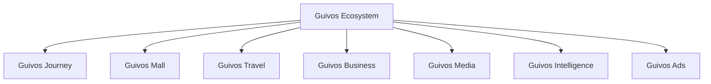
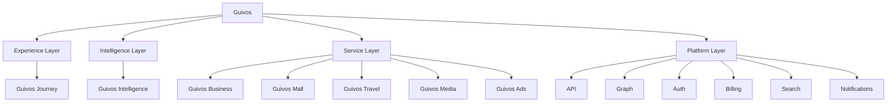

# Arquitetura de Produtos da Guivos

A Arquitetura de Produtos descreve como o Ecossistema Guivos organiza suas ofertas, interfaces, capacidades especializadas, inteligência e unidades de valor.

Ela não substitui o Guivos Ecosystem Blueprint. O GEB explica como o ecossistema funciona; a Arquitetura de Produtos explica como a Guivos entrega valor por meio de componentes integrados.

## Estrutura oficial de componentes

A estrutura institucional da Guivos reconhece os seguintes componentes oficiais:

Para fins de construção, operação e evolução funcional, a Guivos adota também a `GLPA-001 — Guivos Layered Product Architecture`.

## Arquitetura funcional em camadas

## Princípio de organização

O Ecossistema Guivos está acima de todos os componentes.

- **Guivos Journey** é a Experience Layer;
- **Guivos Intelligence** é a Intelligence Layer;
- **Guivos Business, Mall, Travel, Media e Ads** são Service Layers;
- capacidades comuns pertencem à Platform Layer.

## Componentes oficiais

| Componente | Natureza | Responsabilidade principal | Status |
|---|---|---|---|
| Guivos Journey | Experience Layer | Orquestrar a experiência unificada do participante | Consolidado |
| Guivos Intelligence | Intelligence Layer | Transformar dados, conhecimento e contexto em inteligência aplicada | Consolidado |
| Guivos Business | Service Layer | Entregar soluções para organizações | Consolidado |
| Guivos Mall | Service Layer | Comercializar produtos e serviços de múltiplos fornecedores | Consolidado |
| Guivos Travel | Service Layer | Organizar viagens e experiências | Consolidado |
| Guivos Media | Service Layer | Produzir e distribuir conteúdo editorial e institucional | Consolidado |
| Guivos Ads | Service Layer | Operar publicidade e mídia patrocinada | Consolidado |

## Especificação vigente do Journey

O `PAS-001 — Guivos Journey 0.5.0` é a especificação-base da Experience Layer.

### Capacidade 02 — Contexto Vivo

As oito extensões normativas `STATE`, `UPDATE`, `CONFLICT`, `VIEW`, `EVENT`, `INTEGRATION`, `KPI` e `CONTRACT`, todas em `1.0.0`, concluíram funcionalmente a Capacidade 02.

### Capacidade 03 — Objetivos

A extensão normativa ativa é:

- `PAS-001-OBJ-FOUNDATION-001` — pergunta central, objetivo funcional, valor, princípios, distinções entre intenção, sonho, possibilidade, objetivo e prioridade, tipos de objetivo, responsabilidades, limites, entradas, estados, relações, conflitos, critérios de sucesso, integrações, saídas e eventos iniciais.

A extensão substitui normativamente o estado `Planned` da linha da Capacidade 03 na seção 7 do `PAS-001 0.5.0`. A capacidade permanece `In progress`.

## Regras arquiteturais

1. Nenhum componente representa sozinho todo o Ecossistema Guivos.
2. Um componente deve possuir responsabilidade principal clara.
3. Funcionalidades compartilhadas devem utilizar capacidades comuns do ecossistema.
4. Sobreposições devem ser resolvidas pela responsabilidade predominante.
5. Guivos Journey não deve absorver integralmente responsabilidades dos serviços especializados.
6. Guivos Intelligence é camada transversal.
7. Business, Mall, Travel, Media e Ads preservam responsabilidades especializadas.
8. Guivos Mall substitui Guivos Marketplace como nome oficial do produto comercial.
9. “Comunidade Guivos”, “Guivos Podcast” e “Guivos Insights” não são nomes oficiais de produtos.
10. Objetivos pertencem ao participante e não podem ser ativados apenas por inferência, comportamento ou interesse comercial.

## Documentos do domínio

- [GLPA-001 — Guivos Layered Product Architecture](layered-product-architecture.md)
- [PAS-001 — Guivos Journey](pas-001-guivos-journey.md)
- [PAS-001-CV-CONTRACT-001 — Cenários e Contrato Final do Contexto Vivo](pas-001-contexto-vivo-cenarios-contrato-final.md)
- [PAS-001-OBJ-FOUNDATION-001 — Fundamentos Iniciais da Capacidade de Objetivos](pas-001-objetivos-fundamentos-iniciais.md)
- [Guivos Journey](journey.md)
- [Guivos Mall](mall.md)
- [Guivos Travel](travel.md)
- [Guivos Business](business.md)
- [Guivos Media](media.md)
- [Guivos Intelligence](intelligence.md)
- [Guivos Ads](ads.md)
