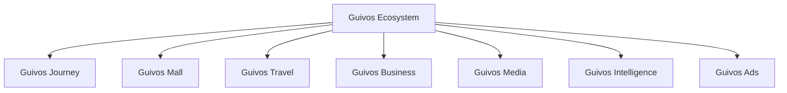
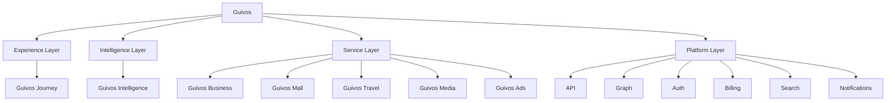

# Arquitetura de Produtos da Guivos

A Arquitetura de Produtos descreve como o Ecossistema Guivos organiza suas ofertas, interfaces, capacidades especializadas, inteligência e unidades de valor.

Ela não substitui o Guivos Ecosystem Blueprint. O GEB explica como o ecossistema funciona; a Arquitetura de Produtos explica como a Guivos entrega valor por meio de componentes integrados.

## Estrutura oficial de componentes

Para fins de construção, operação e evolução funcional, a Guivos adota também a `GLPA-001 — Guivos Layered Product Architecture`.

## Arquitetura funcional em camadas

## Princípio de organização

O Ecossistema Guivos está acima de todos os componentes.

- **Guivos Journey** é a Experience Layer;
- **Guivos Intelligence** é a Intelligence Layer;
- **Guivos Business, Mall, Travel, Media e Ads** são Service Layers;
- capacidades comuns pertencem à Platform Layer.

## Componentes oficiais

| Componente | Natureza | Responsabilidade principal | Status |
|---|---|---|---|
| Guivos Journey | Experience Layer | Orquestrar a experiência unificada do participante | Consolidado |
| Guivos Intelligence | Intelligence Layer | Transformar dados, conhecimento e contexto em inteligência aplicada | Consolidado |
| Guivos Business | Service Layer | Entregar soluções para organizações | Consolidado |
| Guivos Mall | Service Layer | Comercializar produtos e serviços de múltiplos fornecedores | Consolidado |
| Guivos Travel | Service Layer | Organizar viagens e experiências | Consolidado |
| Guivos Media | Service Layer | Produzir e distribuir conteúdo editorial e institucional | Consolidado |
| Guivos Ads | Service Layer | Operar publicidade e mídia patrocinada | Consolidado |

## Especificação vigente do Journey

O `PAS-001 — Guivos Journey 0.5.0` é a especificação-base da Experience Layer.

### Capacidade 02 — Contexto Vivo

As oito extensões normativas `STATE`, `UPDATE`, `CONFLICT`, `VIEW`, `EVENT`, `INTEGRATION`, `KPI` e `CONTRACT`, todas em `1.0.0`, concluíram funcionalmente a Capacidade 02.

### Capacidade 03 — Objetivos

As sete extensões normativas de Objetivos concluíram fundamentos, ciclo de vida, progresso, visão, eventos, integrações, KPIs, cenários e contrato final.

O `PAS-001-OBJ-CONTRACT-001 1.0.0` substitui normativamente o estado `In progress` da linha da Capacidade 03 na seção 7 do `PAS-001 0.5.0`.

A Capacidade 03 está **Functionally complete**.

### Capacidade 04 — Eventos de Vida

As extensões normativas vigentes são:

- `PAS-001-EV-FOUNDATION-001` — fundamentos, definição, distinções, tipos, titularidade, autoridade, temporalidade, impacto, responsabilidades, limites e controle;
- `PAS-001-EV-LIFECYCLE-001` — identificação, proposição, confirmação, estados, relevância, impactos, relações, correção, contestação, encerramento e propagação;
- `PAS-001-EV-VIEW-001` — linha do tempo, detalhamento, impactos, ações, privacidade, histórico e acessibilidade;
- `PAS-001-EV-EVENT-001` — comandos, propostas, fatos reconhecidos, contratos, idempotência, ordenação, versionamento e auditoria;
- `PAS-001-EV-INTEGRATION-001` — finalidade, identidade, autoridade, proveniência, transformações, integrações, revogação e neutralidade comercial;
- `PAS-001-EV-CONTRACT-001` — 60 KPIs, 13 famílias, 18 guardrails, baseline, painel de saúde, cenários e contrato final.

O `PAS-001-EV-CONTRACT-001 1.0.0` substitui normativamente o estado `In progress` da linha da Capacidade 04 na seção 7 do `PAS-001 0.5.0`.

A Capacidade 04 está **Functionally complete**, com progresso editorial de referência de `100%`.

### Capacidade 05 — Próximos Passos

As extensões normativas vigentes são:

- `PAS-001-PP-FOUNDATION-001` — pergunta central, objetivo, valor, singularidade, conceito, acionabilidade, distinções, titularidade, papéis, tipos, estados iniciais, prioridade, temporalidade, dependências, limites, entradas, relações e controle;
- `PAS-001-PP-LIFECYCLE-001` — possibilidade, formulação, proposta, confirmação, prontidão, ativação, prioridade, sequenciamento, dependências, bloqueios, pausa, agendamento, execução, resultados, conclusão, cancelamento, substituição, expiração, contestação, correção, recorrência, delegação, compartilhamento, propagação, idempotência e falha segura.

`PAS-001-PP-FOUNDATION-001 1.0.0` substitui normativamente o estado `Planned` da linha da capacidade no `PAS-001 0.5.0` por `In progress`.

`PAS-001-PP-LIFECYCLE-001 1.0.0` consolida o ciclo completo, mantendo separadas as dimensões de:

- possibilidade;
- proposta;
- confirmação;
- ativação;
- prontidão;
- prioridade;
- agendamento;
- execução;
- resultado;
- progresso;
- conclusão.

O ciclo também formaliza:

- confirmação proporcional, condicionada, parcial e compartilhada;
- reformulação, desdobramento, unificação e alternativas;
- portfólio ativo e limites contextuais de simultaneidade;
- dependências e bloqueios com estados próprios;
- pausa distinta de bloqueio e retomada com reavaliação;
- acompanhamento proporcional sem vigilância excessiva;
- conclusão automática somente para fatos objetivos autorizados;
- cancelamento, substituição e expiração sem julgamento pessoal;
- recorrência sem equivalência automática a hábito ou evolução;
- passos compartilhados, delegação e responsabilidades individualizadas;
- revogação, propagação mínima, prevenção de ciclos e idempotência;
- retroatividade, concorrência, falha segura, privacidade e prevenção de fadiga.

A Capacidade 05 está **In progress**, com progresso editorial de referência de `40%`.

O próximo bloco deverá consolidar a visualização e o controle dos Próximos Passos.

## Regras arquiteturais

1. Nenhum componente representa sozinho todo o Ecossistema Guivos.
2. Um componente deve possuir responsabilidade principal clara.
3. Funcionalidades compartilhadas devem utilizar capacidades comuns do ecossistema.
4. Sobreposições devem ser resolvidas pela responsabilidade predominante.
5. Guivos Journey não deve absorver integralmente responsabilidades dos serviços especializados.
6. Guivos Intelligence é camada transversal.
7. Business, Mall, Travel, Media e Ads preservam responsabilidades especializadas.
8. Guivos Mall substitui Guivos Marketplace como nome oficial do produto comercial.
9. “Comunidade Guivos”, “Guivos Podcast” e “Guivos Insights” não são nomes oficiais de produtos.
10. Objetivos pertencem ao participante e não podem ser ativados apenas por inferência, comportamento ou interesse comercial.
11. Confirmação, ativação, prioridade, atualidade e estado funcional são dimensões distintas do objetivo.
12. Envelhecimento não representa falsidade, pausa não representa fracasso e bloqueio não representa incapacidade pessoal.
13. Atividade, resultado, evidência, progresso, marco e conclusão são conceitos funcionalmente distintos.
14. Percentuais somente podem ser utilizados com base legítima e objetivos pessoais não podem ser concluídos apenas por inferência.
15. `Meus Objetivos` é uma superfície de clareza e controle, não de cobrança, ranking ou comparação pessoal.
16. Objetivos pessoais, institucionais, coletivos e compartilhados devem preservar titularidade, autoridade e permissões próprias.
17. Objetivos sensíveis exigem privacidade visual, minimização e controle reforçado.
18. Comando, proposta e evento funcional são conceitos distintos.
19. Eventos reconhecidos devem preservar origem, autoridade, temporalidade, correlação, versão e idempotência.
20. O reprocessamento não pode duplicar efeitos e falhas devem reduzir automação.
21. Capacidades consumidoras devem receber somente recortes autorizados e reavaliar suas próprias decisões.
22. Integrações não transferem titularidade nem ampliam autoridade funcional.
23. Finalidade explícita e minimização devem preceder todo compartilhamento.
24. Contexto Vivo, Objetivos, Eventos de Vida, Próximos Passos, Oportunidades, Intervenções, Experiências e Evolução preservam responsabilidades distintas.
25. Platform Layer aplica contratos técnicos, mas não redefine significado funcional.
26. Serviços especializados e receita comercial não podem alterar prioridade, relevância, confirmação ou conclusão funcional.
27. Revogações devem interromper novos usos e falhas de integração devem produzir degradação controlada.
28. Indicadores devem avaliar a capacidade, não o valor ou desempenho humano do participante.
29. Guardrails críticos possuem tolerância zero e prevalecem sobre médias agregadas.
30. Uma capacidade funcionalmente concluída somente deverá ser reaberta por fundamento formal.
31. Evento de Vida representa mudança relevante, não qualquer ocorrência, atividade ou experiência.
32. Evento de Vida governa a mudança; Contexto Vivo governa o estado resultante.
33. Evento planejado não equivale a ocorrido e sinal não equivale a confirmado.
34. Estado do evento e estado da informação são dimensões distintas.
35. Confirmação do evento não confirma automaticamente seus impactos.
36. Impactos devem ser avaliados por unidade afetada.
37. Relevância é contextual, explicável e revisável.
38. Causalidade não pode ser presumida por proximidade temporal.
39. Correções preservam o histórico e contestações limitam efeitos críticos.
40. Conclusão do evento não encerra automaticamente impactos persistentes.
41. Propagação utiliza recortes mínimos e reprocessamento não duplica efeitos.
42. Eventos sensíveis exigem minimização, proteção visual e ausência de exploração comercial.
43. Eventos de Vida não criam objetivos pessoais ativos nem impõem prioridade.
44. A linha do tempo de Eventos de Vida não é feed social, diário integral ou instrumento de avaliação pessoal.
45. Sinais, propostas, planejamentos e fatos ocorridos devem permanecer distintos.
46. Impactos propostos não podem ser apresentados como aplicados.
47. Contratos de Eventos de Vida representam fatos reconhecidos, não comandos pendentes.
48. Eventos históricos são imutáveis; correções devem produzir eventos compensatórios.
49. Tempo do fato, conhecimento, reconhecimento e aplicação permanecem separados.
50. Titular, ator e fonte permanecem distintos e limitados por autoridade.
51. Eventos e impactos possuem ciclos próprios.
52. Ordenação, versão, concorrência e idempotência impedem estados impossíveis e duplicidades.
53. Revogação somente pode ser concluída após propagação efetiva.
54. Métricas dos contratos avaliam o sistema, não o participante.
55. Integrações de Eventos de Vida exigem finalidade, minimização, identidade e autoridade.
56. Disponibilidade técnica de dados não autoriza uso ou confirmação.
57. Transformações não podem fabricar precisão, causalidade, significado emocional ou diagnóstico.
58. Capacidades consumidoras recebem solicitações e recortes, não decisões impostas.
59. Guivos Business somente confirma fatos institucionais e não recebe a jornada pessoal integral.
60. Compra, reserva, calendário, localização ou atividade não confirmam mudança humana.
61. Guivos Ads não utiliza Eventos de Vida sensíveis para publicidade.
62. Pausa interrompe coleta e revogação interrompe novos usos sem apagar fatos legítimos.
63. Ausência de dado não equivale a ausência de Evento de Vida.
64. Falhas preservam o último estado válido e reduzem automação.
65. O participante deve compreender fontes, transformações, recortes, consumidores, pausa e revogação.
66. Maior volume de Eventos de Vida não representa melhor qualidade.
67. Uma boa média não compensa violação de guardrail.
68. A ausência de Eventos de Vida registrados é legítima.
69. Eventos de Vida não atribuem automaticamente diagnóstico, significado emocional, sucesso, fracasso ou valor humano.
70. Os 60 KPIs e 18 guardrails constituem a baseline normativa da Capacidade 04.
71. Próximo Passo representa movimento possível, não objetivo, tarefa ou oportunidade.
72. Próximo Passo proposto é hipótese, não decisão assumida.
73. Próximo Passo confirmado não representa execução iniciada.
74. “Próximo” é contextual, não apenas cronológico.
75. Poderão existir múltiplos Próximos Passos ou nenhum passo ativo.
76. Titular, proponente, decisor, responsável e executor são papéis distintos.
77. Responsabilidade não pode ser atribuída silenciosamente.
78. Organização somente governa passos dentro de sua autoridade.
79. Guivos Intelligence produz hipóteses, alternativas e sugestões, não compromissos.
80. Prioridade operacional é distinta de urgência, importância, prontidão, esforço e valor humano.
81. Bloqueio não representa incapacidade e pausa não representa fracasso.
82. Esperar pode constituir movimento legítimo.
83. Conclusão de Próximo Passo não conclui automaticamente o objetivo.
84. Oportunidade é meio e sua disponibilidade não cria automaticamente um passo.
85. Atividade realizada não confirma adequação, conclusão ou progresso.
86. Datas, prazos e precisão temporal não podem ser fabricados.
87. Passos sensíveis exigem finalidade, minimização, privacidade e controle.
88. Receita, patrocínio ou publicidade não podem determinar prioridade.
89. A capacidade não deve criar listas ou ações artificiais para maximizar engajamento.
90. O participante permanece no controle da criação, confirmação, alteração, priorização, execução, cancelamento e compartilhamento.
91. Possibilidade, proposta, confirmação, ativação, prontidão, agendamento, execução, resultado, progresso e conclusão são dimensões distintas.
92. Confirmação condicionada não produz ativação antes do atendimento da condição.
93. Prontidão não equivale a prioridade, obrigação imediata ou início.
94. Desbloqueio não inicia automaticamente a execução.
95. Prazo vencido não representa conclusão, cancelamento, abandono ou fracasso.
96. Ausência de atualização não representa interrupção ou abandono.
97. Resultado imediato não equivale a progresso do objetivo.
98. Um passo pode ser concluído mesmo quando o resultado esperado não ocorrer, desde que o movimento delimitado tenha sido realizado.
99. Conclusão automática exige fato objetivo, fonte autorizada e possibilidade de contestação.
100. Cancelamento, substituição e expiração possuem significados distintos e não representam julgamento pessoal.
101. Recorrência não comprova hábito, aderência, identidade ou evolução.
102. Confirmação compartilhada ocorre individualmente por participante ou papel.
103. Delegação transfere execução dentro de escopo autorizado, não titularidade ou decisão.
104. Revogação interrompe novos acessos e usos e deve propagar recortes recompostos.
105. Reprocessamento não pode duplicar passo, confirmação, prioridade, agendamento, conclusão, notificação ou responsabilidade.
106. Mensagens fora de ordem e alterações concorrentes não podem gerar estados impossíveis ou sobrescrita silenciosa.
107. Falha parcial não pode ser apresentada como sucesso integral.
108. Acompanhamento deve ser proporcional e não constituir vigilância excessiva.
109. O ciclo deve apoiar ação real, não maximizar listas, notificações ou tempo de tela.
110. O participante permanece no controle do ciclo de vida.

## Documentos do domínio

- [GLPA-001 — Guivos Layered Product Architecture](layered-product-architecture.md)
- [PAS-001 — Guivos Journey](pas-001-guivos-journey.md)
- [PAS-001-CV-CONTRACT-001 — Cenários e Contrato Final do Contexto Vivo](pas-001-contexto-vivo-cenarios-contrato-final.md)
- [PAS-001-OBJ-CONTRACT-001 — KPIs, Cenários e Contrato Final da Capacidade de Objetivos](pas-001-objetivos-kpis-cenarios-contrato-final.md)
- [PAS-001-EV-CONTRACT-001 — KPIs, Guardrails, Cenários e Contrato Final de Eventos de Vida](pas-001-eventos-de-vida-kpis-cenarios-contrato-final.md)
- [PAS-001-PP-FOUNDATION-001 — Fundamentos Iniciais da Capacidade de Próximos Passos](pas-001-proximos-passos-fundamentos-iniciais.md)
- [PAS-001-PP-LIFECYCLE-001 — Regras do Ciclo de Vida dos Próximos Passos](pas-001-proximos-passos-ciclo-de-vida.md)
- [Guivos Journey](journey.md)
- [Guivos Mall](mall.md)
- [Guivos Travel](travel.md)
- [Guivos Business](business.md)
- [Guivos Media](media.md)
- [Guivos Intelligence](intelligence.md)
- [Guivos Ads](ads.md)