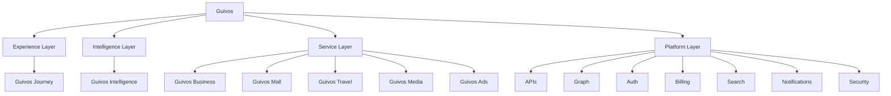

# GLPA-001 — Guivos Layered Product Architecture

## 1. Finalidade

A Guivos Layered Product Architecture (GLPA) define a organização funcional do Ecossistema Guivos por camadas de responsabilidade.

Seu objetivo é evitar a interpretação de que todos os componentes da Guivos possuem a mesma natureza funcional.

A GLPA estabelece que o ecossistema não é apenas uma lista horizontal de produtos, mas uma arquitetura integrada composta por experiência, inteligência, serviços especializados e plataforma comum.

## 2. Decisão estrutural

A estrutura institucional de apresentação da Guivos pode listar Journey, Mall, Business, Travel, Media, Intelligence e Ads como componentes oficiais.

Entretanto, para fins de construção, operação e evolução funcional da plataforma, esses componentes devem ser organizados por camadas.

## 3. Arquitetura em camadas

## 4. Experience Layer

A Experience Layer é a camada responsável pela experiência unificada do participante.

Ela organiza como a pessoa acessa, percebe e utiliza o Ecossistema Guivos.

### Componente principal

- Guivos Journey.

### Responsabilidades

- experiência do usuário;
- jornadas;
- objetivos;
- descoberta;
- recomendações visíveis;
- feed ou superfície principal de interação;
- perfil do participante;
- acompanhamento da evolução;
- gamificação;
- comunicação direta com o usuário.

O Journey não executa todas as capacidades do ecossistema. Ele orquestra a experiência visível que integra capacidades fornecidas pelas demais camadas.

## 5. Intelligence Layer

A Intelligence Layer é a camada transversal responsável pela interpretação contextual e pela inteligência aplicada ao ecossistema.

### Componente principal

- Guivos Intelligence.

### Responsabilidades

- interpretação de contexto;
- recomendações;
- personalização;
- aprendizagem com evidências autorizadas;
- apoio a decisões;
- inteligência aplicada para produtos, organizações e participantes;
- relacionamento com o Grafo Global da Guivos.

A Intelligence Layer não pertence ao Journey. Ela serve toda a Guivos.

## 6. Service Layer

A Service Layer concentra os produtos especializados que entregam capacidades específicas do ecossistema.

### Componentes principais

- Guivos Business;
- Guivos Mall;
- Guivos Travel;
- Guivos Media;
- Guivos Ads.

### Responsabilidades

| Componente | Responsabilidade |
|---|---|
| Guivos Business | Relação com organizações, oportunidades institucionais, soluções B2B e programas corporativos |
| Guivos Mall | Produtos, serviços, compras, assinaturas, gift cards, pagamentos e ativos comerciais |
| Guivos Travel | Viagens, experiências presenciais, reservas, roteiros e deslocamentos |
| Guivos Media | Conteúdos, histórias, materiais editoriais, formação e comunicação institucional |
| Guivos Ads | Publicidade, patrocínios, campanhas, mídia paga e ativações comerciais |

## 7. Platform Layer

A Platform Layer reúne capacidades comuns utilizadas pelas demais camadas.

### Responsabilidades

- APIs;
- autenticação;
- autorização;
- billing;
- pagamentos;
- busca;
- notificações;
- infraestrutura de dados;
- segurança;
- privacidade;
- logs;
- integrações;
- observabilidade;
- armazenamento;
- recursos compartilhados de IA;
- Grafo Global em sua implementação técnica futura.

Essa camada não representa um produto público, mas a base técnica e operacional que sustenta todos os componentes da Guivos.

## 8. Regras de responsabilidade

1. O que pertence à experiência visível do participante pertence à Experience Layer.
2. O que interpreta contexto, recomenda, aprende ou personaliza pertence à Intelligence Layer.
3. O que entrega uma capacidade especializada de negócio pertence à Service Layer.
4. O que é infraestrutura comum pertence à Platform Layer.
5. Nenhuma camada deve assumir responsabilidades permanentes de outra camada.
6. Sobreposições devem ser resolvidas pela responsabilidade predominante.
7. O Journey deve orquestrar a experiência sem absorver a execução integral dos serviços especializados.
8. A Intelligence deve apoiar todo o ecossistema, não apenas o Journey.

## 9. Exemplos de decisão funcional

| Pergunta | Camada responsável |
|---|---|
| Onde fica a tela de recomendações? | Experience Layer / Journey |
| Onde fica o algoritmo de recomendação? | Intelligence Layer / Intelligence |
| Onde fica uma compra? | Service Layer / Mall |
| Onde fica o cadastro de empresas? | Service Layer / Business |
| Onde fica uma campanha patrocinada? | Service Layer / Ads |
| Onde fica um artigo ou história? | Service Layer / Media |
| Onde fica uma reserva de viagem? | Service Layer / Travel |
| Onde ficam login, billing e notificações? | Platform Layer |

## 10. Organização pública sugerida

Para comunicação institucional, a Guivos poderá apresentar seus componentes por natureza:

### Experiência

- Guivos Journey.

### Inteligência

- Guivos Intelligence.

### Soluções

- Guivos Business;
- Guivos Mall;
- Guivos Travel;
- Guivos Media;
- Guivos Ads.

Essa organização evita tratar componentes de naturezas diferentes como produtos equivalentes.

## 11. Relação com a Arquitetura de Produtos

A GLPA complementa a Arquitetura de Produtos da Guivos.

A Arquitetura de Produtos registra os componentes oficiais do ecossistema.

A GLPA registra como esses componentes são organizados funcionalmente para construção, operação e evolução da plataforma.

## 12. Ponto de aplicação

A GLPA deverá orientar:

- `PAS-001 — Guivos Journey`;
- especificações futuras de Mall, Business, Travel, Media, Intelligence e Ads;
- arquitetura funcional da plataforma;
- organização de times;
- decisões de UX;
- limites entre produtos;
- roadmap técnico futuro.

## 13. Estado

Esta arquitetura encontra-se aprovada como referência da fase de especificação funcional da Guivos.

Ela poderá ser revisada quando novos produtos, capacidades ou necessidades técnicas demonstrarem limitações relevantes.