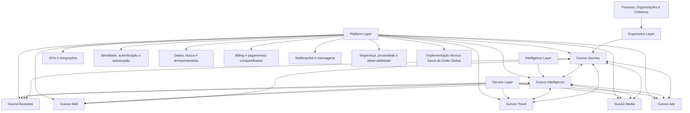

# GLPA-001 — Guivos Layered Product Architecture

## 1. Finalidade

A Guivos Layered Product Architecture (GLPA) define a organização funcional do Ecossistema Guivos por camadas de responsabilidade.

Seu objetivo é evitar a interpretação de que todos os componentes da Guivos possuem a mesma natureza funcional.

A GLPA estabelece que o ecossistema não é apenas uma lista horizontal de produtos, mas uma arquitetura integrada composta por experiência, inteligência, serviços especializados e plataforma comum.

## 2. Decisão estrutural

A estrutura institucional pode apresentar Journey, Mall, Business, Travel, Media, Intelligence e Ads como componentes oficiais.

Para fins de construção, operação e evolução, esses componentes são organizados por camadas.

## 3. Arquitetura em camadas

O diagrama representa responsabilidades funcionais, não topologia técnica definitiva nem dependência obrigatória entre microserviços.

## 4. Experience Layer

A Experience Layer é responsável pela experiência unificada do participante.

Ela organiza como Pessoas, Organizações e Coletivos acessam, compreendem e utilizam o Ecossistema Guivos.

### Componente principal

- Guivos Journey.

### Responsabilidades

- experiência unificada do participante;
- superfície principal de experiência;
- organização das jornadas;
- objetivos e Próximos Passos;
- descoberta contextual;
- apresentação de recomendações e oportunidades;
- visão autorizada do contexto do participante;
- acompanhamento da evolução;
- comunicação e intervenções visíveis;
- gamificação e incentivos apresentados ao participante;
- orquestração experiencial das capacidades das demais camadas.

A Experience Layer não possui como responsabilidade permanente um formato específico de interface. Feed, conversa, mapa, painel ou outras superfícies podem ser utilizados quando adequados, mas nenhum deles define o Journey.

A expressão `perfil do participante` deixa de ser usada como responsabilidade arquitetural. A formulação vigente é `visão autorizada do contexto do participante`, coerente com o Contexto Vivo do PAS-001.

## 5. Intelligence Layer

A Intelligence Layer é a camada transversal responsável pela interpretação contextual e pela inteligência aplicada ao ecossistema.

### Componente principal

- Guivos Intelligence.

### Responsabilidades

- interpretar entradas e sinais autorizados;
- apoiar a construção de compreensão contextual;
- recomendar e priorizar possibilidades;
- personalizar experiências;
- aprender com resultados e evidências autorizadas;
- apoiar decisões sem substituir a autonomia humana;
- fornecer inteligência para Journey e serviços especializados;
- relacionar conhecimento e contexto ao Grafo Global da Guivos.

A Intelligence Layer não pertence ao Journey. Ela serve todo o ecossistema.

A Intelligence propõe interpretações, recomendações e atualizações. A Experience Layer decide como essas capacidades são apresentadas e controladas pelo participante.

## 6. Service Layer

A Service Layer concentra os produtos especializados que entregam capacidades específicas do ecossistema.

### Componentes principais

- Guivos Business;
- Guivos Mall;
- Guivos Travel;
- Guivos Media;
- Guivos Ads.

### Responsabilidades

| Componente | Responsabilidade predominante |
|---|---|
| Guivos Business | Relações com organizações, oportunidades institucionais, soluções B2B e programas corporativos |
| Guivos Mall | Produtos, serviços, compras, assinaturas, gift cards, pagamentos comerciais e ativos transacionáveis |
| Guivos Travel | Viagens, experiências presenciais, reservas, roteiros e deslocamentos |
| Guivos Media | Conteúdos, histórias, materiais editoriais, formação e comunicação institucional |
| Guivos Ads | Publicidade, patrocínios, campanhas, mídia paga e ativações comerciais responsáveis |

Os serviços especializados podem utilizar Intelligence e Platform diretamente conforme sua responsabilidade. O Journey não é intermediário técnico obrigatório para todas as relações entre camadas.

## 7. Platform Layer

A Platform Layer reúne capacidades técnicas e operacionais comuns utilizadas pelas demais camadas.

### Responsabilidades

- APIs e integrações;
- identidade, autenticação e autorização;
- billing e capacidades compartilhadas de pagamento;
- busca;
- notificações e mensageria;
- infraestrutura de dados;
- segurança e privacidade;
- logs, auditoria e observabilidade;
- armazenamento;
- recursos técnicos compartilhados;
- implementação técnica futura do Grafo Global.

A Platform Layer não representa produto público independente. Ela sustenta os componentes oficiais sem definir sua experiência ou sua lógica de negócio especializada.

## 8. Limites entre as camadas

| Pergunta | Responsabilidade predominante |
|---|---|
| Onde o participante visualiza uma recomendação? | Experience Layer / Journey |
| Onde contexto é interpretado e a recomendação é calculada? | Intelligence Layer / Intelligence |
| Onde o participante revisa e controla a compreensão apresentada? | Experience Layer / Journey |
| Onde a compra de um produto é executada? | Service Layer / Mall |
| Onde relações e programas B2B são administrados? | Service Layer / Business |
| Onde uma campanha patrocinada é operada? | Service Layer / Ads |
| Onde conteúdo editorial é produzido e governado? | Service Layer / Media |
| Onde uma reserva de viagem é executada? | Service Layer / Travel |
| Onde ficam identidade, APIs, segurança e observabilidade comuns? | Platform Layer |

## 9. Regras de responsabilidade

1. O que pertence à experiência visível e ao controle do participante pertence à Experience Layer.
2. O que interpreta, recomenda, aprende ou personaliza pertence à Intelligence Layer.
3. O que entrega uma capacidade especializada de negócio pertence à Service Layer.
4. O que é infraestrutura comum pertence à Platform Layer.
5. Nenhuma camada deve assumir responsabilidade permanente de outra.
6. Sobreposições devem ser resolvidas pela responsabilidade predominante.
7. O Journey orquestra a experiência sem absorver a execução integral dos serviços especializados.
8. A Intelligence apoia todo o ecossistema, não apenas o Journey.
9. Os serviços especializados podem consumir capacidades de Intelligence e Platform sem depender de mediação técnica do Journey.
10. Diagramas da GLPA representam organização funcional e não prescrevem arquitetura técnica definitiva.

## 10. Organização pública

Para comunicação institucional, a Guivos apresenta:

### Experiência

- Guivos Journey.

### Inteligência

- Guivos Intelligence.

### Soluções especializadas

- Guivos Business;
- Guivos Mall;
- Guivos Travel;
- Guivos Media;
- Guivos Ads.

### Base comum

- Platform Layer, apresentada apenas quando necessário para explicar a sustentação do ecossistema.

## 11. Relação com o PAS-001

A GLPA define limites permanentes entre camadas.

O PAS-001 detalha como o Guivos Journey cumpre suas responsabilidades na Experience Layer por meio de capacidades funcionais.

O Contexto Vivo pertence ao PAS como responsabilidade experiencial de representação, visualização e controle. A interpretação algorítmica que o alimenta pertence à Intelligence Layer. Identidade, persistência, segurança e auditoria pertencem à Platform Layer.

## 12. Ponto de aplicação

A GLPA orienta:

- `PAS-001 — Guivos Journey`;
- especificações futuras de Mall, Business, Travel, Media, Intelligence e Ads;
- arquitetura funcional da plataforma;
- organização de times;
- decisões de UX;
- contratos entre produtos;
- limites de responsabilidade;
- roadmap técnico futuro.

## 13. Estado

Esta arquitetura permanece aprovada como referência da fase de Product Engineering.

A versão 1.1.0 substitui terminologia legada de `perfil` e `feed` como responsabilidades permanentes, esclarece relações transversais e preserva a distinção entre arquitetura funcional e implementação técnica.