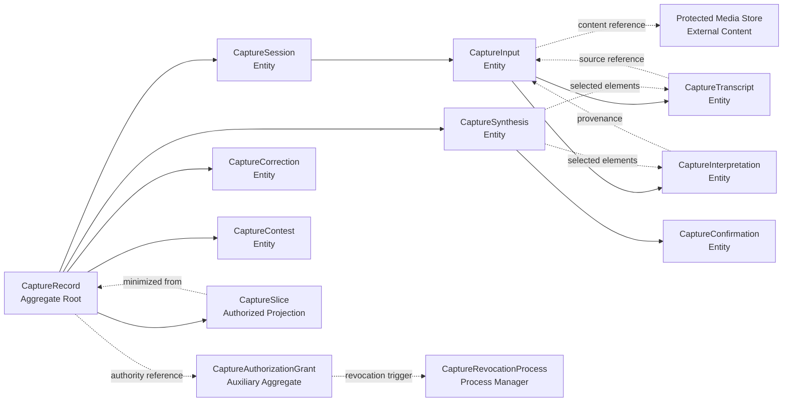
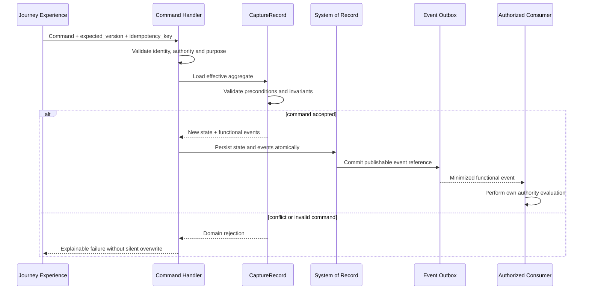
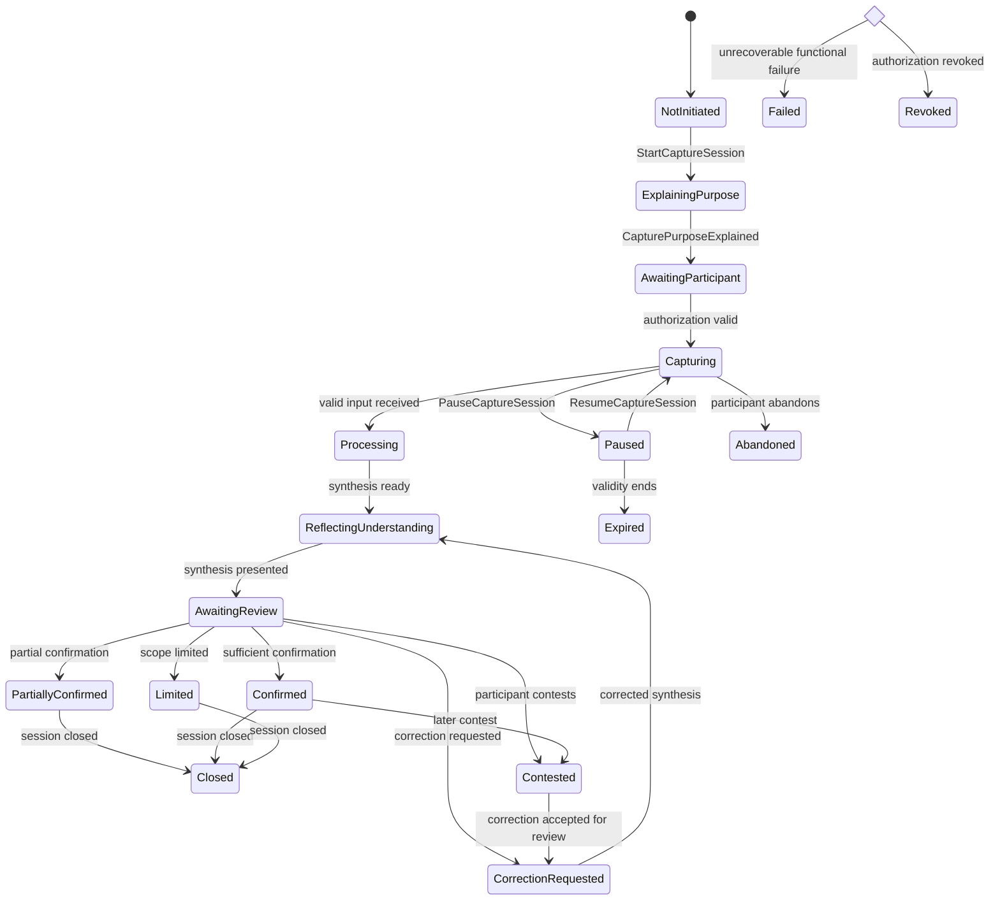
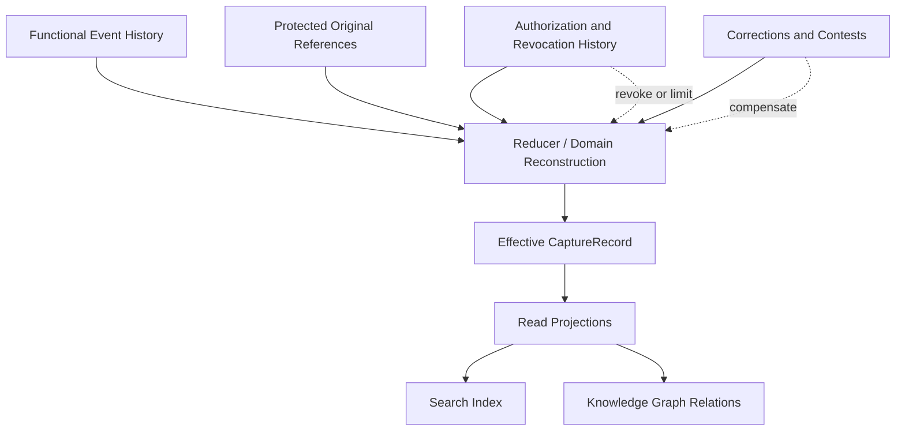
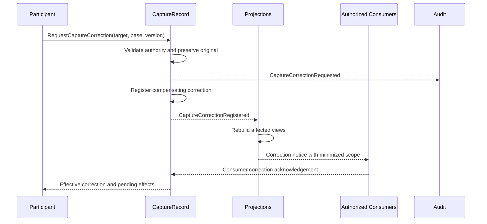
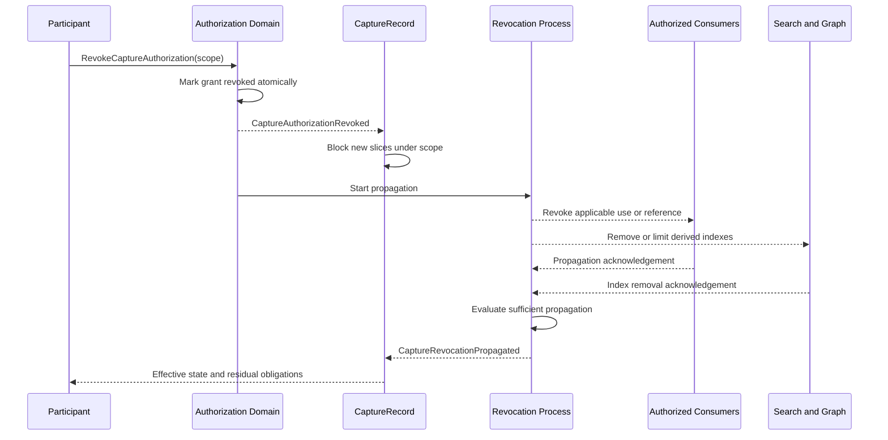

# PAS-001-CC-UIC-DOMAIN-001 — Modelo de Domínio da Unidade de Implementação da Captura de Contexto

> **Estado:** `Draft 0.1.0 — Domain model proposed`.
>
> Este documento confirma os limites dos agregados, as identidades, as classificações de domínio, as invariantes por comando, a consistência, a concorrência e a reconstrução da `UIC-01`. Ele resolve `UIC01-GAP-001` e `UIC01-GAP-002` sem escolher linguagem, framework, banco, broker, nuvem ou topologia final de serviços.

# 7101. Pergunta central

> Como estruturar o domínio técnico da Captura de Contexto para preservar uma fonte original, várias sessões relacionadas, derivados versionados, confirmação delimitada, autorização por finalidade, correção compensatória e revogação propagada sem transformar uma sessão técnica ou uma inferência em verdade integral sobre o participante?

# 7102. Autoridade e alcance

## 7102.1 Ordem normativa

A interpretação deverá respeitar:

1. Foundation e Princípios Permanentes;
2. `GIA-000`;
3. `GLPA-001`;
4. `PAS-001 1.0.0`;
5. `PAS-001-CAPABILITY-MAP-001 1.0.1`;
6. `PAS-001-CC-LIFECYCLE-001 1.0.0`;
7. `PAS-001-CC-EVENT-INTEGRATION-001 1.0.0`;
8. `PAS-001-CC-CONTRACT-001 1.0.0`;
9. `PAS-001-ENGINEERING-HANDOFF-001` e seu estado efetivo;
10. `PAS-001-CC-UIC-001` e seu estado efetivo;
11. este modelo de domínio;
12. especificações técnicas derivadas;
13. código, schemas, infraestrutura e configuração.

Nenhuma conveniência técnica poderá inverter essa ordem.

## 7102.2 Decisões efetivamente encerradas

Este documento encerra as seguintes decisões:

- `CaptureRecord` é a raiz principal do agregado funcional da Captura de Contexto;
- `CaptureSession` é entidade temporal e operacional interna ao `CaptureRecord`;
- sessão e registro possuem identidades próprias e não equivalentes;
- um registro pode conter uma ou mais sessões relacionadas;
- `CaptureInput` possui identidade própria, permanente e independente da representação física;
- entradas, transcrições, interpretações, sínteses e confirmações são entidades distintas;
- conteúdo multimodal pesado permanece fora do agregado, representado por referência protegida;
- autorização possui ciclo de vida próprio e não é inferida do estado da sessão;
- revogação é coordenada por processo explícito e não por alteração silenciosa de campo;
- projeções, índices, caches e grafos nunca são sistemas de registro.

## 7102.3 Decisões ainda abertas

Permanecem abertas:

- tecnologia de persistência;
- event sourcing integral, parcial ou inexistente;
- frequência de snapshots;
- tecnologia de objetos multimodais;
- tecnologia de busca;
- tecnologia de mensageria;
- topologia de implantação;
- particionamento físico;
- estratégia final de sharding;
- algoritmo específico de geração de identificadores.

# 7103. Linguagem ubíqua técnica

| Termo | Definição normativa |
|---|---|
| Registro de Captura | Unidade funcional principal que preserva identidade, finalidade, sessões relacionadas, fonte, derivados, controles e histórico |
| Sessão de Captura | Unidade temporal e operacional de interação dentro de um registro |
| Entrada | Expressão ou material recebido com identidade própria |
| Fonte original | Representação preservada do material recebido antes das derivações |
| Transcrição | Representação textual derivada de uma entrada |
| Interpretação | Leitura proposta, incerta e contestável sobre entradas ou transcrições |
| Síntese | Organização versionada apresentada ao participante |
| Confirmação | Manifestação delimitada sobre versão e escopo apresentados |
| Autorização | Permissão explícita vinculada a finalidade, escopo, temporalidade e consumidor |
| Recorte | Projeção minimizada e autorizada para avaliação de consumidor |
| Correção | Fato compensatório que preserva o histórico e altera o estado efetivo |
| Contestação | Suspensão ou questionamento explícito de associação, conteúdo ou efeito |
| Revogação | Invalidação de autorização ou uso, com bloqueio e propagação aplicável |
| Projeção | Modelo de leitura reconstruível e não autoritativo |
| Evento funcional | Fato reconhecido pelo agregado e persistido com autoridade |
| Evento técnico | Fato operacional sem autoridade para redefinir significado humano |

# 7104. Decisão de fronteira do agregado

## 7104.1 Raiz principal

`CaptureRecord` é a raiz principal porque a autoridade funcional exige uma identidade permanente capaz de preservar:

- participante ou modo de identidade;
- finalidade;
- conjunto relacionado de sessões;
- entradas originais;
- derivações;
- confirmações;
- autorizações;
- correções;
- limitações;
- contestações;
- revogações;
- recortes emitidos;
- histórico de versões;
- proveniência.

Somente a raiz poderá reconhecer alterações materiais no estado funcional do registro.

## 7104.2 Papel de `CaptureSession`

`CaptureSession` é entidade interna porque:

- representa um ciclo temporal e operacional;
- depende de uma finalidade pertencente ao registro;
- não pode confirmar contexto fora do registro;
- não pode emitir recorte sem autoridade do registro;
- não possui autoridade independente para persistência definitiva;
- deve compartilhar histórico, correções e revogações com o registro;
- pode ser pausada, retomada, abandonada, expirada ou encerrada sem encerrar o registro completo.

A sessão possui identidade globalmente única, porém sua consistência funcional permanece subordinada ao `CaptureRecord`.

## 7104.3 Cardinalidade

```text
CaptureRecord 1 ─── 1..N CaptureSession
CaptureSession 1 ─── 0..N CaptureInput
CaptureInput 1 ─── 0..N CaptureTranscript
CaptureInput 1 ─── 0..N CaptureInterpretation
CaptureRecord 1 ─── 0..N CaptureSynthesis
CaptureSynthesis 1 ─── 0..N CaptureConfirmation
CaptureRecord 1 ─── 0..N CaptureAuthorization
CaptureRecord 1 ─── 0..N CaptureCorrection
CaptureRecord 1 ─── 0..N CaptureContest
CaptureRecord 1 ─── 0..N CaptureRevocation
CaptureRecord 1 ─── 0..N CaptureSlice
```

## 7104.4 Fronteiras auxiliares

Dois limites auxiliares poderão existir sem competir com o agregado principal:

### `CaptureAuthorizationGrant`

Agregado auxiliar para:

- concessão;
- escopo;
- validade;
- consumidores;
- finalidade;
- limitação;
- expiração;
- revogação.

Sua existência separada é permitida para garantir concorrência e revogação seguras. Ele nunca poderá confirmar conteúdo.

### `CaptureRevocationProcess`

Process manager ou saga para:

- bloquear novos usos;
- identificar consumidores afetados;
- emitir solicitações de revogação;
- acompanhar confirmações;
- registrar falhas;
- concluir propagação suficiente.

Ele coordena efeitos, mas não redefine a decisão funcional de revogar.

# 7105. Mapa de agregados



# 7106. Classificação dos elementos de domínio

| Elemento | Classificação confirmada | Identidade própria | Mutabilidade | Sistema de registro |
|---|---|---:|---|---|
| `CaptureRecord` | Aggregate Root | Sim | Versionada | Journey Domain |
| `CaptureSession` | Entidade interna | Sim | Versionada | `CaptureRecord` |
| `CapturePurpose` | Objeto de valor versionado | Não isolada | Substituição versionada | `CaptureRecord` |
| `CaptureInput` | Entidade interna | Sim | Fonte imutável; estado versionado | `CaptureRecord` |
| `CaptureMediaReference` | Objeto de valor | Não isolada | Referência versionada | `CaptureRecord` |
| `CaptureTranscript` | Entidade derivada | Sim | Nova versão, nunca sobrescrita | `CaptureRecord` |
| `CaptureInterpretation` | Entidade derivada | Sim | Nova versão | `CaptureRecord` |
| `CaptureSynthesis` | Entidade versionada | Sim | Nova versão | `CaptureRecord` |
| `CaptureConfirmation` | Entidade de evidência | Sim | Imutável; correção compensatória | `CaptureRecord` |
| `CaptureAuthorizationGrant` | Aggregate Root auxiliar | Sim | Versionada | Authorization Domain |
| `CaptureSlice` | Projeção autorizada materializada | Sim | Nova emissão | Integration Boundary |
| `CaptureCorrection` | Entidade compensatória | Sim | Imutável | `CaptureRecord` |
| `CaptureContest` | Entidade de controle | Sim | Estado versionado | `CaptureRecord` |
| `CaptureRevocationProcess` | Process manager | Sim | Versionado | Integration Boundary |
| `CaptureProcessingAttempt` | Registro técnico | Sim | Append-only | Operations |
| `CaptureDeliveryRecord` | Registro técnico | Sim | Append-only | Integration Boundary |
| `CaptureProjection` | Projeção de leitura | Derivada | Reconstruível | Nunca é fonte primária |

# 7107. Objetos de valor obrigatórios

| Objeto de valor | Conteúdo mínimo | Regra |
|---|---|---|
| `CaptureRecordId` | identificador opaco | Permanente e não reutilizável |
| `CaptureSessionId` | identificador opaco | Único e subordinado ao registro |
| `CaptureInputId` | identificador opaco | Permanente e independente da mídia |
| `PurposeDescriptor` | código, descrição, versão | Específico e compreensível |
| `ActorReference` | ator, papel, autoridade | Acesso técnico não cria autoridade |
| `ParticipantReference` | titular, modo de identidade | Pode ser provisório ou pseudonimizado |
| `ChannelDescriptor` | canal, capacidades, proteção | Canal não é autoridade |
| `SourceReference` | origem, autor, temporalidade | Preserva proveniência |
| `ContentReference` | localização protegida, digest, tipo | Não expõe conteúdo sensível em eventos |
| `ContentDigest` | algoritmo, valor | Detecta integridade sem definir identidade humana |
| `SensitivityClassification` | classe, justificativa, versão | Controla acesso e retenção |
| `ConfidenceAssessment` | valor, faixa, método | Não equivale a verdade |
| `UncertaintySet` | pontos incertos | Deve permanecer explicável |
| `ConfirmationScope` | elementos, versão, finalidade | Impede confirmação genérica |
| `AuthorizationScope` | ações, consumidores, prazo | Impede ampliação silenciosa |
| `TemporalValidity` | início, expiração, condição | Temporalidades distintas são preservadas |
| `ProvenanceChain` | fontes e transformações | Obrigatória para derivados |
| `IdempotencyKey` | chave e escopo | Evita repetição material |
| `AggregateVersion` | inteiro monotônico | Controla concorrência otimista |
| `SequenceNumber` | ordem dentro do registro | Ordena eventos funcionais |

# 7108. Política de identidades

## 7108.1 Propriedades comuns

Todo identificador funcional deverá ser:

- globalmente único dentro do domínio;
- opaco;
- imutável;
- não reutilizável;
- independente de banco, fila, URL ou dispositivo;
- preservado em retentativas;
- resistente a colisão;
- gerado sem incorporar conteúdo pessoal;
- rastreável por correlação, não por significado embutido.

O algoritmo poderá ser decidido por ADR, desde que preserve essas propriedades.

## 7108.2 Identidade do registro

`capture_record_id`:

- nasce quando a primeira finalidade válida é aceita para iniciar uma captura persistível;
- pode existir em modo temporário;
- permanece estável entre sessões relacionadas;
- não muda com canal, conta, dispositivo ou autenticação progressiva;
- não é substituído por `participant_id`;
- não é exposto como identificador público previsível.

## 7108.3 Identidade da sessão

`capture_session_id`:

- identifica um ciclo temporal específico;
- pertence a exatamente um `CaptureRecord`;
- pode ser retomado enquanto válido;
- não é reutilizado após expiração ou encerramento definitivo;
- mudança de canal não exige nova sessão se a continuidade for validada;
- nova finalidade material exige nova sessão ou novo registro conforme avaliação da raiz.

## 7108.4 Identidade da entrada original

`capture_input_id` é criado para cada unidade material recebida.

A identidade:

- pertence a exatamente uma sessão;
- permanece estável mesmo quando o conteúdo físico muda de localização;
- não é o hash da mídia;
- não é o nome do arquivo;
- não é o ID do upload;
- não é o ID da mensagem do broker;
- não muda após transcrição, interpretação ou correção;
- referencia o conteúdo original por `ContentReference`;
- preserva autoria, origem, canal e momento de ocorrência;
- admite chave de idempotência do produtor para deduplicação.

Correção da entrada não reescreve `capture_input_id`; cria `CaptureCorrection` e, quando necessário, nova entrada relacionada por `supersedes_input_id`.

## 7108.5 Identidades derivadas

Cada transcrição, interpretação, síntese e confirmação possui ID próprio.

A derivação deve declarar:

- elemento de origem;
- versão de origem;
- método;
- ator ou componente;
- data;
- confiança;
- incerteza;
- propósito;
- modelo e versão, quando houver IA.

## 7108.6 Matriz de identidades

| Identificador | Escopo | Criador autorizado | Pode ser regenerado | Pode ser reutilizado |
|---|---|---|---:|---:|
| `capture_record_id` | Registro | Journey Domain | Não | Não |
| `capture_session_id` | Sessão | Journey Domain | Não | Não |
| `capture_input_id` | Entrada | Journey Domain após deduplicação | Não | Não |
| `transcript_id` | Versão de transcrição | Serviço autorizado | Não | Não |
| `interpretation_id` | Interpretação | Intelligence ou regra autorizada | Não | Não |
| `synthesis_id` | Versão de síntese | Journey Domain | Não | Não |
| `confirmation_id` | Manifestação | Journey Domain | Não | Não |
| `authorization_id` | Concessão | Authorization Domain | Não | Não |
| `correction_id` | Correção | Journey Domain | Não | Não |
| `contest_id` | Contestação | Journey Domain | Não | Não |
| `revocation_id` | Revogação | Authorization Domain | Não | Não |
| `slice_id` | Recorte emitido | Integration Boundary | Não | Não |
| `event_id` | Evento | Sistema de registro competente | Não | Não |

# 7109. Estrutura do `CaptureRecord`

O estado mínimo da raiz deverá conter referências ou índices funcionais para:

```text
CaptureRecord
├── capture_record_id
├── participant_reference
├── identity_mode
├── purposes[]
├── sessions[]
├── input_index[]
├── synthesis_index[]
├── confirmation_index[]
├── authorization_references[]
├── correction_index[]
├── contest_index[]
├── revocation_references[]
├── slice_index[]
├── effective_limitations[]
├── sensitivity_summary
├── propagation_state
├── aggregate_version
└── last_functional_sequence
```

Conteúdo multimodal, texto integral sensível e payloads extensos não precisam residir no estado carregado da raiz. Eles poderão ser preservados em armazenamento protegido, mediante referência, digest e política de retenção.

# 7110. Estrutura da sessão

```text
CaptureSession
├── capture_session_id
├── capture_record_id
├── purpose_version
├── identity_mode
├── channel_history[]
├── state
├── started_at
├── paused_at
├── resumed_at
├── expires_at
├── closed_at
├── input_ids[]
├── active_synthesis_id
├── confirmation_state
├── persistence_state
├── technical_health
└── session_version
```

A sessão controla operação, não autoridade universal.

# 7111. Invariantes estruturais confirmadas

## 7111.1 Registro e sessão

1. Todo `CaptureSession` pertence a exatamente um `CaptureRecord`.
2. Nenhuma sessão poderá alterar o participante titular do registro sem processo explícito de correção de identidade.
3. Finalidade materialmente diferente não poderá ser incorporada silenciosamente à mesma sessão.
4. Encerramento de uma sessão não encerra automaticamente o registro.
5. Expiração de uma sessão não elimina fatos legitimamente preservados.
6. Sessão temporária não autoriza persistência permanente.
7. Canal não define identidade do registro ou da sessão.
8. Estado técnico não substitui estado funcional.

## 7111.2 Entrada original

9. Toda entrada possui `capture_input_id` permanente.
10. Toda entrada referencia exatamente uma sessão.
11. Entrada original e conteúdo físico são vinculados por referência e digest, não por identidade equivalente.
12. Transcrição, interpretação e síntese nunca substituem a entrada original.
13. Falha de upload não poderá produzir `CaptureInputReceived`.
14. Retentativa com mesma chave e mesmo digest deverá devolver o mesmo resultado funcional.
15. Mesma chave com digest diferente deverá produzir conflito de idempotência.
16. Exclusão legítima do conteúdo deverá preservar tombstone mínimo quando necessário para auditoria e propagação.

## 7111.3 Derivados

17. Toda transcrição referencia entrada e versão de origem.
18. Toda interpretação declara proveniência, confiança e incerteza.
19. Toda síntese referencia versões exatas dos elementos selecionados.
20. Nova versão de síntese não invalida silenciosamente confirmações anteriores; ela altera seu estado efetivo conforme regras explícitas.
21. Confirmação somente pode atingir versão apresentada ao ator autorizado.
22. Confirmação parcial deverá registrar elementos confirmados, recusados, limitados e pendentes.
23. Resultado de IA nunca poderá criar confirmação.

## 7111.4 Autorização, correção e revogação

24. Autorização pertence a finalidade e escopo definidos.
25. Confirmação de conteúdo não implica autorização universal de persistência.
26. Correção material cria registro compensatório e nova versão efetiva.
27. Contestação material bloqueia novos efeitos incompatíveis.
28. Revogação efetiva bloqueia novos recortes sob o escopo revogado.
29. Revogação não é concluída antes da propagação suficiente.
30. Consumidor nunca poderá ampliar autorização recebida.
31. Recorte emitido referencia autorização e versão do registro.

# 7112. Limites de consistência

## 7112.1 Consistência imediata no `CaptureRecord`

Exigem consistência imediata:

- criação de sessão;
- mudança de estado funcional da sessão;
- registro de entrada recebida;
- seleção da síntese ativa;
- confirmação total ou parcial;
- registro de correção;
- abertura de contestação;
- emissão autorizada de recorte;
- fechamento da sessão;
- avanço de `aggregate_version`;
- avanço da sequência funcional.

## 7112.2 Consistência imediata no `CaptureAuthorizationGrant`

Exigem consistência imediata:

- concessão;
- limitação;
- expiração;
- revogação;
- validação de escopo;
- bloqueio de novo uso.

## 7112.3 Consistência eventual permitida

Podem operar com consistência eventual:

- transcrição;
- interpretação;
- construção de síntese;
- atualização de projeções;
- indexação;
- atualização de grafo;
- confirmação de entrega;
- propagação de correção;
- propagação de revogação;
- remoção de índices;
- eliminação física de dados temporários.

A consistência eventual não autoriza exposição de estado incorreto como concluído.

# 7113. Concorrência

## 7113.1 Controle otimista

Toda alteração material deverá declarar:

- `capture_record_id`;
- `expected_version`;
- `idempotency_key`;
- `actor_id`;
- `authority_scope`;
- `correlation_id`;
- `causation_id`.

Se `expected_version` divergir, o comando deverá:

1. ser rejeitado como conflito;
2. recuperar o estado efetivo;
3. reavaliar precondições;
4. ser reapresentado conscientemente ou abandonado;
5. nunca sobrescrever silenciosamente.

## 7113.2 Entradas simultâneas

Entradas simultâneas são permitidas quando:

- pertencem a sessão em `Capturing`;
- possuem IDs e chaves de idempotência distintos;
- preservam ordem funcional por sequência;
- não encerram ou revogam a sessão;
- não excedem limites de canal ou finalidade.

O sistema poderá aceitar conteúdo em paralelo, mas o reconhecimento funcional da entrada deverá ser serializado por versão ou sequência do registro.

## 7113.3 Confirmação sobre síntese desatualizada

Uma confirmação deverá ser rejeitada quando:

- `synthesis_id` não for a versão apresentada;
- a síntese tiver sido substituída materialmente;
- houver correção posterior relevante;
- a finalidade ou autorização tiver expirado;
- o ator não possuir autoridade atual.

A interface deverá apresentar a versão atual e solicitar nova revisão.

## 7113.4 Correção concorrente

Duas correções sobre o mesmo elemento deverão:

- preservar ambas as solicitações;
- detectar base versionada divergente;
- impedir aplicação silenciosa em ordem arbitrária;
- produzir estado `Contested` quando não houver resolução determinística;
- exigir revisão humana quando o efeito for material.

## 7113.5 Revogação durante processamento

Quando ocorrer revogação durante processamento:

- novos trabalhos deverão ser bloqueados;
- trabalhos canceláveis deverão ser interrompidos;
- resultados posteriores não poderão ser publicados;
- artefatos temporários deverão seguir política de eliminação;
- tentativas não canceláveis deverão registrar conclusão técnica sem efeito funcional;
- a propagação deverá incluir consumidores que já receberam recortes.

## 7113.6 Encerramento com operações pendentes

`CloseCaptureSession` poderá encerrar a interação, mas deverá registrar:

- processamentos pendentes;
- entregas pendentes;
- correções pendentes;
- revogações pendentes;
- prazo de resolução;
- estado final apresentado ao participante.

Encerramento operacional não falsifica conclusão de efeitos assíncronos.

# 7114. Matriz comando–agregado–invariantes–evento

| Comando | Alvo | Precondições principais | Invariantes verificadas | Evento funcional |
|---|---|---|---|---|
| `StartCaptureSession` | `CaptureRecord` | finalidade válida; identidade mínima | 1–8, 24 | `CaptureSessionStarted` |
| `ExplainCapturePurpose` | `CaptureRecord` | sessão iniciada | 3, 24 | `CapturePurposeExplained` |
| `SubmitCaptureInput` | `CaptureRecord` | sessão capturando; canal permitido | 9–16 | `CaptureInputReceived` |
| `AttachCaptureMedia` | `CaptureRecord` | entrada válida; mídia íntegra | 9–16 | `CaptureMediaAttached` |
| `PauseCaptureSession` | `CaptureRecord` | sessão capturando | 1–8 | `CaptureSessionPaused` |
| `ResumeCaptureSession` | `CaptureRecord` | continuidade e autorização válidas | 1–8, 24 | `CaptureSessionResumed` |
| `RequestCaptureProcessing` | `CaptureRecord` | entrada recebida; finalidade permite | 12, 17–23, 24 | `CaptureProcessingRequested` |
| `RecordCaptureTranscript` | `CaptureRecord` | origem e versão válidas | 12, 17 | `CaptureTranscriptProduced` |
| `RecordCaptureInterpretation` | `CaptureRecord` | proveniência e confiança presentes | 18, 23 | `CaptureInterpretationProduced` |
| `PresentCaptureSynthesis` | `CaptureRecord` | síntese versionada e explicável | 19–23 | `CaptureSynthesisPresented` |
| `ConfirmCaptureSynthesis` | `CaptureRecord` | versão apresentada; ator autorizado | 20–25 | `CaptureSynthesisConfirmed` |
| `PartiallyConfirmCaptureSynthesis` | `CaptureRecord` | escopo explícito | 20–25 | `CaptureSynthesisPartiallyConfirmed` |
| `RequestCaptureCorrection` | `CaptureRecord` | elemento identificável | 26–27 | `CaptureCorrectionRequested` |
| `RegisterCaptureCorrection` | `CaptureRecord` | autoria e base versionada | 26–27 | `CaptureCorrectionRegistered` |
| `AuthorizeCapturePersistence` | `CaptureAuthorizationGrant` | escopo e finalidade explícitos | 24–25 | `CapturePersistenceAuthorized` |
| `PersistCaptureTemporarily` | `CaptureRecord` | expiração definida | 6, 16, 24 | `TemporaryCapturePersistenceRegistered` |
| `IssueCaptureSlice` | `CaptureRecord` + autorização | confirmação aplicável; escopo válido | 28–31 | `CaptureSliceIssued` |
| `ContestCaptureRecord` | `CaptureRecord` | alvo identificável | 27 | `CaptureRecordContested` |
| `RevokeCaptureAuthorization` | autorização | concessão ativa ou efeito residual | 28–30 | `CaptureAuthorizationRevoked` |
| `ConfirmRevocationPropagation` | processo de revogação | consumidor e efeito identificados | 28–30 | `CaptureRevocationPropagated` |
| `CloseCaptureSession` | `CaptureRecord` | estado encerrável | 1–8 | `CaptureSessionClosed` |
| `ExpireCaptureSession` | `CaptureRecord` | validade encerrada | 5–6 | `CaptureSessionExpired` |
| `AbandonCaptureSession` | `CaptureRecord` | sessão não concluída | 4–6 | `CaptureSessionAbandoned` |

# 7115. Fluxo comando–agregado–evento



# 7116. Ciclo técnico da sessão



A representação técnica deverá manter estados independentes para entrada, transcrição, interpretação, síntese, autorização, persistência e propagação.

# 7117. Idempotência

## 7117.1 Escopo da chave

A chave deverá ser avaliada por:

```text
actor + command_type + capture_record_id + purpose + idempotency_key
```

Para entrada, deverá incluir também uma evidência de conteúdo ou referência do produtor.

## 7117.2 Resultado repetido

Mesma chave com mesmos parâmetros materiais deverá:

- retornar o resultado funcional original;
- preservar os mesmos IDs;
- não emitir novo evento funcional;
- permitir novo evento técnico de retentativa, quando necessário.

## 7117.3 Conflito de chave

Mesma chave com conteúdo materialmente diferente deverá:

- rejeitar a operação;
- registrar conflito técnico;
- não alterar o agregado;
- não escolher silenciosamente uma versão.

# 7118. Ordenação e causalidade

O agregado deverá manter:

- `aggregate_version` monotônico;
- `functional_sequence` monotônica;
- `occurred_at` para o fato;
- `recorded_at` para persistência;
- `causation_id` para causa direta;
- `correlation_id` para fluxo;
- `source_sequence` quando a origem possuir ordenação confiável.

Eventos fora de ordem poderão ser recebidos, mas não aplicados sem reavaliação da versão e da causalidade.

# 7119. Persistência e reconstrução

## 7119.1 Fonte primária

A fonte primária deverá preservar:

- estado efetivo do `CaptureRecord`;
- histórico de eventos funcionais;
- referências imutáveis às entradas originais;
- versões de derivados;
- evidências de confirmação;
- autorizações e revogações;
- correções e contestações;
- políticas de retenção e eliminação.

A decisão entre estado + log, event sourcing ou abordagem híbrida será tomada por ADR.

## 7119.2 Reconstrução mínima

Deverá ser possível reconstruir:

- sessões e seus estados;
- entradas reconhecidas;
- derivações e versões;
- síntese efetiva em cada momento;
- escopo confirmado;
- autorizações válidas em cada momento;
- correções aplicadas;
- contestações abertas;
- revogações e propagação;
- recortes emitidos.

## 7119.3 Conteúdo eliminado

Quando conteúdo for legitimamente eliminado:

- o conteúdo não deverá ser recriado por cache, índice, backup operacional ou modelo de IA;
- poderá permanecer tombstone minimizado quando exigido para integridade, segurança ou auditoria;
- o tombstone não deverá conter o conteúdo eliminado;
- projeções deverão ser reconstruídas sem o conteúdo;
- recortes afetados deverão ser invalidados conforme contrato.

## 7119.4 Snapshots

Snapshots são opcionais e deverão:

- declarar versão do agregado;
- ser verificáveis contra eventos;
- ser elimináveis ou reconstruíveis;
- não ocultar correções;
- não reintroduzir conteúdo revogado;
- não se tornar fonte normativa independente.

# 7120. Modelo de reconstrução



Busca e grafo são reconstruídos a partir de projeções autorizadas, nunca diretamente promovidos a autoridade.

# 7121. Propagação de correção



A correção não apaga a fonte necessária e não autoriza compartilhamento adicional.

# 7122. Propagação de revogação



A conclusão deverá distinguir propagação suficiente, falha parcial e retenção residual obrigatória.

# 7123. Segurança do domínio

O modelo deverá impedir:

- enumeração de IDs;
- inclusão de conteúdo sensível no identificador;
- leitura direta do objeto multimodal por referência não autorizada;
- confirmação por componente automatizado;
- emissão de recorte sem autorização válida;
- reuso de idempotency key entre finalidades;
- replay de comando com autoridade expirada;
- reconstrução de conteúdo removido;
- associação determinística entre sessões temporárias sem base legítima;
- promoção de telemetria a contexto humano.

# 7124. Testes obrigatórios do modelo de domínio

## 7124.1 Agregados e identidades

1. registro mantém identidade entre sessões relacionadas;
2. sessão não pode migrar para outro registro;
3. entrada mantém ID após mudança de localização física;
4. retentativa idempotente preserva IDs;
5. chave repetida com conteúdo diferente é rejeitada;
6. canal não altera identidade;
7. conteúdo pessoal não aparece nos IDs.

## 7124.2 Invariantes

8. sessão não captura antes da finalidade;
9. transcrição não substitui entrada;
10. interpretação não confirma fato;
11. confirmação desatualizada é rejeitada;
12. persistência definitiva sem autoridade é rejeitada;
13. recorte sem autorização é rejeitado;
14. correção preserva histórico;
15. contestação bloqueia efeito incompatível;
16. revogação bloqueia novos recortes.

## 7124.3 Concorrência

17. duas entradas válidas são ordenadas sem perda;
18. duas correções conflitantes não sobrescrevem silenciosamente;
19. revogação concorrente prevalece sobre nova emissão de recorte;
20. fechamento registra operações pendentes;
21. evento fora de ordem não regride estado;
22. retry técnico não duplica evento funcional.

## 7124.4 Reconstrução

23. projeção pode ser reconstruída do histórico autorizado;
24. correção altera estado efetivo sem apagar origem;
25. revogação remove usos reconstruíveis;
26. conteúdo eliminado não reaparece;
27. snapshot desatualizado é detectado;
28. busca e grafo não viram fonte primária.

# 7125. Decisões de gaps

## 7125.1 `UIC01-GAP-001` — Resolvido

**Questão:** confirmar limite entre `CaptureRecord` e `CaptureSession`.

**Decisão:**

- `CaptureRecord` é Aggregate Root;
- `CaptureSession` é entidade interna com identidade própria;
- o registro possui uma ou mais sessões;
- sessão não confirma, não autoriza persistência e não emite recorte independentemente;
- autorização e propagação de revogação podem utilizar agregados auxiliares sem competir com a raiz funcional.

**Evidência:** seções 7104, 7105, 7106, 7112 e 7114.

**Estado:** `Resolved`.

## 7125.2 `UIC01-GAP-002` — Resolvido

**Questão:** definir identidade técnica da entrada original.

**Decisão:**

- `CaptureInput` possui `capture_input_id` permanente, opaco e não reutilizável;
- o ID pertence a uma sessão e permanece independente de mídia, arquivo, upload, broker e derivados;
- deduplicação usa chave de idempotência e evidência de conteúdo;
- correção não reescreve identidade; produz registro compensatório ou nova entrada relacionada;
- eliminação legítima preserva somente tombstone mínimo quando necessário.

**Evidência:** seções 7107, 7108, 7111, 7113 e 7117.

**Estado:** `Resolved`.

# 7126. Estado da UIC-01 após este incremento

| Dimensão | Estado efetivo |
|---|---|
| Fontes normativas | Mapeadas |
| Responsabilidade técnica | Definida |
| Decisões proibidas | Definidas |
| Raiz do agregado | Confirmada |
| Relação registro–sessão | Confirmada |
| Identidade da entrada | Confirmada |
| Entidades e objetos de valor | Classificados |
| Invariantes estruturais | Confirmadas |
| Invariantes por comando | Mapeadas |
| Consistência | Definida |
| Concorrência | Definida |
| Idempotência | Definida |
| Reconstrução | Proposta |
| Diagramas | Publicados |
| `UIC01-GAP-001` | Resolvido |
| `UIC01-GAP-002` | Resolvido |
| Estado técnico | `Domain model proposed` |
| Progresso de referência | `40%` |

# 7127. Critérios atendidos para `Domain model proposed`

O estado é alcançado porque:

1. a raiz do agregado foi confirmada;
2. a sessão foi classificada;
3. a identidade da entrada foi definida;
4. entidades e objetos de valor foram classificados;
5. invariantes estruturais foram formalizadas;
6. comandos foram vinculados a agregados e eventos;
7. consistência imediata e eventual foi delimitada;
8. concorrência otimista foi definida;
9. idempotência foi definida;
10. reconstrução foi proposta;
11. correção e revogação possuem fluxos explícitos;
12. dois gaps prioritários foram resolvidos;
13. nenhum conflito funcional bloqueante foi identificado.

Esse estado não equivale a `Technically ready for implementation`.

# 7128. Próximo incremento

O próximo ciclo deverá elevar a UIC-01 para:

> **`Lifecycle technically defined — 60%`.**

Deverá concluir:

- máquinas de estado independentes;
- matriz completa de transições;
- precondições por estado;
- compensações;
- timeouts e expirações;
- pausas e retomadas;
- falhas parciais;
- relação entre estado funcional e estado técnico;
- testes de transição;
- resolução prioritária das lacunas de processamento e persistência temporária aplicáveis ao ciclo.

# 7129. Limite de aprovação

A aprovação deste modelo:

- não autoriza implementação em produção;
- não define tecnologia;
- não transforma agregado em microsserviço;
- não torna a sessão independente do registro;
- não incorpora conteúdo ao Contexto Vivo;
- não encerra lacunas além de `UIC01-GAP-001` e `UIC01-GAP-002`;
- não reduz direitos de correção, limitação, contestação ou revogação.
