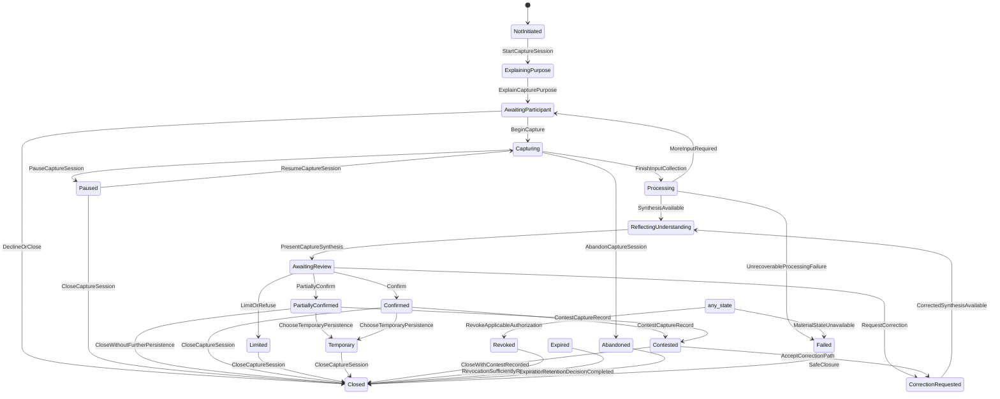
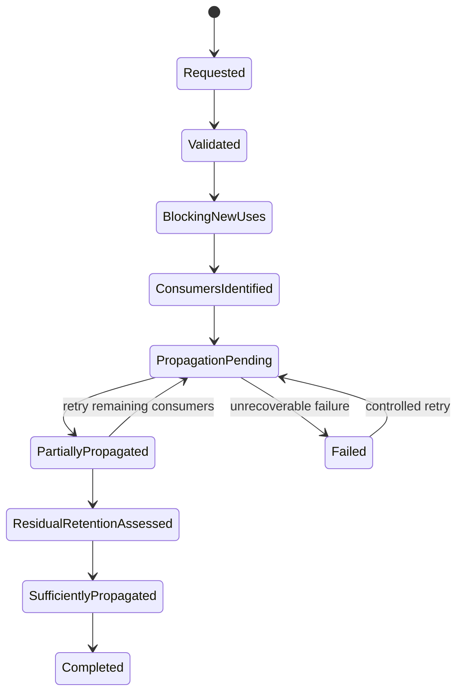
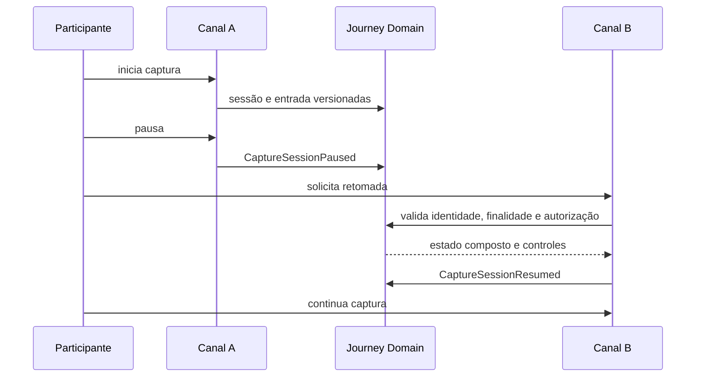
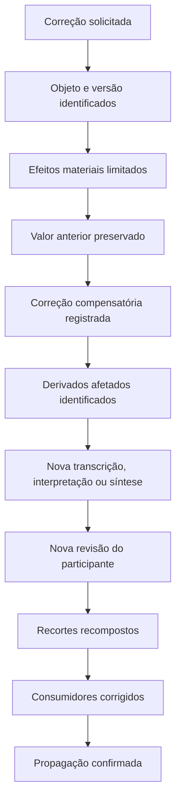
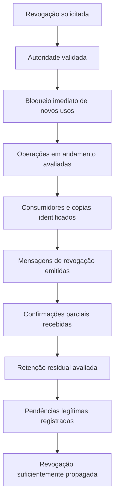

# PAS-001-CC-UIC-LIFECYCLE-001 — Ciclo Técnico da Unidade de Implementação da Captura de Contexto

> **Estado:** `Draft 0.1.0 — Lifecycle technically defined`.
>
> **Progresso de referência da UIC-01:** `60%`.
>
> Este documento traduz o ciclo funcional da Captura de Contexto em máquinas de estado técnicas independentes, regras de coordenação, precondições, compensações, timeouts, expirações, falhas parciais e testes verificáveis. Ele não escolhe linguagem, framework, banco, broker, nuvem ou topologia final de serviços.

# 7201. Pergunta central

> Como coordenar tecnicamente sessão, entradas, derivados, confirmação, autorização, persistência, propagação, contestação, revogação e operações técnicas sem reduzir toda a captura a um único status linear e sem permitir que uma dimensão substitua a autoridade de outra?

# 7202. Autoridade e ordem de prevalência

A interpretação deverá respeitar:

1. Foundation e Princípios Permanentes;
2. `GIA-000`;
3. `GLPA-001`;
4. `PAS-001 1.0.0`;
5. `PAS-001-CAPABILITY-MAP-001 1.0.1`;
6. `PAS-001-CC-LIFECYCLE-001 1.0.0`;
7. `PAS-001-CC-EVENT-INTEGRATION-001 1.0.0`;
8. `PAS-001-CC-CONTRACT-001 1.0.0`;
9. `PAS-001-CC-UIC-DOMAIN-001 0.1.0`;
10. este ciclo técnico;
11. contratos técnicos derivados;
12. código, schemas, infraestrutura e configuração.

Nenhuma otimização técnica poderá inverter essa ordem.

# 7203. Resultado técnico alcançado

Este documento conclui:

- máquinas de estado independentes para as dimensões materiais da captura;
- modelo de coordenação sem status global simplificador;
- matriz normativa de transições da sessão;
- regras de transição para entradas e derivados;
- precondições e guardas por comando;
- pausas, retomadas e continuidade entre canais;
- timeouts, expirações e encerramentos;
- falhas parciais e compensações;
- sincronização entre estados funcionais e técnicos;
- bloqueios por correção, contestação e revogação;
- protocolo técnico de transcrição e correção;
- política técnica de persistência temporária;
- observabilidade e testes de ciclo;
- resolução de `UIC01-GAP-004` e `UIC01-GAP-005`.

# 7204. Princípios permanentes do ciclo técnico

1. Não existe um único estado capaz de representar integralmente a captura.
2. Estado da sessão não confirma conteúdo.
3. Estado técnico não altera autoridade funcional.
4. Operação concluída não significa resultado funcional aceito.
5. Falha em um derivado não invalida automaticamente a entrada original.
6. Pausa não equivale a abandono, recusa ou revogação.
7. Encerramento operacional não impede correção ou contestação legítima.
8. Confirmação não autoriza persistência ou propagação por inferência.
9. Autorização revogada bloqueia novos usos antes da conclusão física da propagação.
10. Persistência temporária não se converte em permanente por timeout, retry ou conveniência.
11. Correção preserva a versão anterior e produz compensação.
12. Contestação material limita efeitos até resolução suficiente.
13. Reprocessamento preserva identidade e causalidade.
14. Retentativa não cria novo fato funcional.
15. Timeouts devem produzir estado explícito, nunca sucesso presumido.
16. Estado `Failed` não poderá ser convertido diretamente em sucesso integral.
17. Projeções podem atrasar, mas não redefinem a fonte de verdade.
18. A ausência de consumidor admissível é resultado legítimo.
19. A ausência de síntese segura é resultado legítimo.
20. A ausência de decisão é resultado legítimo.

# 7205. Modelo de máquinas paralelas

A captura deverá ser representada por um conjunto de máquinas independentes coordenadas pelo `CaptureRecord`.

| Máquina | Unidade governada | Identidade principal |
|---|---|---|
| `SessionLifecycle` | ciclo operacional da sessão | `capture_session_id` |
| `ChannelLifecycle` | disponibilidade e adequação do canal | `channel_instance_id` |
| `InputLifecycle` | entrada original | `capture_input_id` |
| `TranscriptLifecycle` | transcrição versionada | `transcript_id` |
| `InterpretationLifecycle` | interpretação derivada | `interpretation_id` |
| `SynthesisLifecycle` | síntese apresentada | `synthesis_id` |
| `ConfirmationLifecycle` | confirmação granular | `confirmation_id` |
| `AuthorizationLifecycle` | autorização por finalidade | `authorization_id` |
| `PersistenceLifecycle` | retenção e descarte | `persistence_record_id` |
| `PropagationLifecycle` | recortes e consumidores | `propagation_id` |
| `ContestLifecycle` | contestação material | `contest_id` |
| `RevocationLifecycle` | revogação e propagação | `revocation_id` |
| `TechnicalOperationLifecycle` | tentativa técnica | `processing_attempt_id` |

## 7205.1 Snapshot composto

O estado observado de um registro deverá ser um snapshot composto:

```yaml
capture_record_id:
aggregate_version:
session_states: []
channel_states: []
input_states: []
transcript_states: []
interpretation_states: []
synthesis_states: []
confirmation_states: []
authorization_states: []
persistence_states: []
propagation_states: []
contest_states: []
revocation_states: []
technical_operation_states: []
blocking_conditions: []
recoverable_conditions: []
last_functional_event:
last_technical_event:
```

O snapshot é uma projeção reconstruível. Ele não substitui o histórico nem a autoridade de cada entidade.

# 7206. Coordenação do agregado

`CaptureRecord` deverá:

- validar transições materialmente consistentes;
- preservar versões esperadas;
- impedir comandos incompatíveis com bloqueios vigentes;
- registrar eventos funcionais na mesma unidade de consistência da decisão;
- coordenar efeitos assíncronos por processos explícitos;
- manter referências para operações técnicas sem absorver telemetria bruta;
- permitir reconstrução do estado composto;
- impedir que uma máquina altere silenciosamente outra.

A coordenação não transforma `CaptureRecord` em um processo técnico único ou microsserviço obrigatório.

# 7207. Máquina de estado da sessão

Estados normativos:

- `NotInitiated`;
- `ExplainingPurpose`;
- `AwaitingParticipant`;
- `Capturing`;
- `Paused`;
- `Processing`;
- `ReflectingUnderstanding`;
- `AwaitingReview`;
- `PartiallyConfirmed`;
- `Confirmed`;
- `CorrectionRequested`;
- `Limited`;
- `Temporary`;
- `Abandoned`;
- `Expired`;
- `Contested`;
- `Revoked`;
- `Closed`;
- `Failed`.

## 7207.1 Diagrama principal



`any_state` representa qualquer estado material em que a transição seja normativamente admissível. A implementação deverá declarar explicitamente as origens permitidas.

# 7208. Matriz de transições da sessão

| Origem | Comando ou causa | Destino | Precondições principais | Evento funcional |
|---|---|---|---|---|
| `NotInitiated` | `StartCaptureSession` | `ExplainingPurpose` | identidade ou modo temporário suficiente | `CaptureSessionStarted` |
| `ExplainingPurpose` | `ExplainCapturePurpose` | `AwaitingParticipant` | finalidade compreensível e versionada | `CapturePurposeExplained` |
| `AwaitingParticipant` | `BeginCapture` | `Capturing` | canal adequado, autorização aplicável, indicador visível | `CaptureStarted` |
| `AwaitingParticipant` | recusa | `Closed` | nenhuma entrada material capturada | `CaptureSessionClosed` |
| `Capturing` | `PauseCaptureSession` | `Paused` | interrupção de novas entradas confirmada | `CaptureSessionPaused` |
| `Paused` | `ResumeCaptureSession` | `Capturing` | identidade, finalidade e autorização revalidadas | `CaptureSessionResumed` |
| `Paused` | `CloseCaptureSession` | `Closed` | política de retenção definida | `CaptureSessionClosed` |
| `Capturing` | fim da coleta | `Processing` | ao menos uma entrada reconhecida ou justificativa registrada | `CaptureProcessingRequested` |
| `Capturing` | abandono | `Abandoned` | captura interrompida pelo participante ou condição equivalente | `CaptureSessionAbandoned` |
| `Processing` | síntese segura disponível | `ReflectingUnderstanding` | síntese versionada, fontes e incertezas rastreáveis | `CaptureSynthesisProduced` |
| `Processing` | informação adicional necessária | `AwaitingParticipant` | nenhuma conclusão fabricada | `AdditionalCaptureInputRequested` |
| `Processing` | falha irrecuperável | `Failed` | estado confiável indisponível | `CaptureFailureRegistered` |
| `ReflectingUnderstanding` | apresentação concluída | `AwaitingReview` | conteúdo apresentado identificável | `CaptureSynthesisPresented` |
| `AwaitingReview` | confirmação parcial | `PartiallyConfirmed` | escopo granular registrado | `CaptureSynthesisPartiallyConfirmed` |
| `AwaitingReview` | confirmação suficiente | `Confirmed` | síntese vigente e autoridade válida | `CaptureSynthesisConfirmed` |
| `AwaitingReview` | correção | `CorrectionRequested` | trecho ou elemento afetado identificado | `CaptureCorrectionRequested` |
| `AwaitingReview` | limitação ou recusa | `Limited` | limites explicitados | `CaptureUseLimited` |
| `CorrectionRequested` | nova síntese apresentada | `ReflectingUnderstanding` | correção compensatória registrada | `CorrectedCaptureSynthesisProduced` |
| `PartiallyConfirmed` | persistência temporária | `Temporary` | classe temporal e expiração definidas | `TemporaryCapturePersistenceRegistered` |
| `Confirmed` | persistência temporária | `Temporary` | classe temporal e expiração definidas | `TemporaryCapturePersistenceRegistered` |
| `PartiallyConfirmed` | encerramento | `Closed` | recortes restritos aos elementos elegíveis | `CaptureSessionClosed` |
| `Confirmed` | encerramento | `Closed` | decisão de persistência registrada | `CaptureSessionClosed` |
| `Limited` | encerramento | `Closed` | limitações persistidas | `CaptureSessionClosed` |
| `Temporary` | encerramento | `Closed` | descarte ou retenção programada | `CaptureSessionClosed` |
| `Confirmed` | contestação | `Contested` | objeto contestado identificado | `CaptureRecordContested` |
| `PartiallyConfirmed` | contestação | `Contested` | objeto contestado identificado | `CaptureRecordContested` |
| `Contested` | correção aceita | `CorrectionRequested` | efeitos incompatíveis bloqueados | `CaptureCorrectionRequested` |
| `Contested` | encerramento controlado | `Closed` | contestação permanece visível | `CaptureSessionClosed` |
| estado admissível | revogação | `Revoked` | autorização aplicável identificada | `CaptureAuthorizationRevoked` |
| estado material | falha sem estado confiável | `Failed` | causa e impacto registrados | `CaptureFailureRegistered` |
| estado não terminal | expiração | `Expired` | política temporal atingida | `CaptureSessionExpired` |
| `Revoked` | registro suficiente | `Closed` | bloqueio de novos usos ativo | `CaptureSessionClosed` |
| `Expired` | finalização | `Closed` | retenção e descarte avaliados | `CaptureSessionClosed` |
| `Abandoned` | finalização | `Closed` | somente conteúdo autorizado preservado | `CaptureSessionClosed` |
| `Failed` | encerramento seguro | `Closed` | ausência de sucesso presumido | `CaptureSessionClosed` |

# 7209. Transições proibidas da sessão

São proibidas:

- `NotInitiated → Capturing` sem finalidade explicada;
- `NotInitiated → Processing`;
- `ExplainingPurpose → Confirmed`;
- `AwaitingParticipant → Confirmed`;
- `Capturing → Confirmed`;
- `Processing → Confirmed` sem síntese apresentada;
- `ReflectingUnderstanding → propagação` sem revisão aplicável;
- `Paused → Processing` quando a pausa bloqueou processamento opcional;
- `Abandoned → Confirmed`;
- `Expired → Capturing` sem nova validação ou nova sessão;
- `Revoked → Capturing` sob a autorização revogada;
- `Failed → Confirmed`;
- `Contested → efeito material` sem análise;
- `Temporary → persistência permanente` sem nova autorização;
- `Closed → Capturing` sem reabertura formal ou nova sessão relacionada.

# 7210. Máquina de estado do canal

Estados:

- `Available`;
- `AwaitingPermission`;
- `Protected`;
- `Limited`;
- `Degraded`;
- `UnsuitableForSensitivity`;
- `Disconnected`;
- `Unavailable`;
- `Closed`.

Regras:

1. `Capturing` exige canal em `Available`, `Protected` ou `Limited` compatível.
2. Canal `UnsuitableForSensitivity` bloqueia entrada sensível.
3. `Disconnected` suspende novas entradas e preserva o último estado válido.
4. Mudança de canal exige revalidação de identidade, finalidade, autorização e continuidade.
5. Falha de canal não poderá ser promovida a falha funcional integral quando outro canal seguro existir.

# 7211. Máquina de estado da entrada

Estados:

- `Initiated`;
- `Partial`;
- `Received`;
- `Interrupted`;
- `Incomplete`;
- `Corrupted`;
- `Preserved`;
- `DiscardPending`;
- `Discarded`;
- `Limited`;
- `Contested`;
- `Corrected`;
- `Revoked`;
- `Unavailable`.

## 7211.1 Transições principais

| Origem | Causa | Destino | Regra |
|---|---|---|---|
| inexistente | início material | `Initiated` | identidade criada antes do conteúdo |
| `Initiated` | fragmento recebido | `Partial` | sequência e checksum preservados |
| `Partial` | conclusão | `Received` | integridade mínima validada |
| `Initiated` ou `Partial` | interrupção | `Interrupted` | conteúdo parcial identificado |
| `Received` | preservação confirmada | `Preserved` | proveniência e classe de retenção registradas |
| `Received` | integridade insuficiente | `Corrupted` | não processar como entrada íntegra |
| `Received` ou `Preserved` | limitação | `Limited` | escopo de uso bloqueado |
| `Received` ou `Preserved` | contestação | `Contested` | efeitos derivados incompatíveis suspensos |
| `Contested` | correção compensatória | `Corrected` | identidade original preservada |
| estado retido | descarte solicitado | `DiscardPending` | dependências e retenção residual avaliadas |
| `DiscardPending` | descarte executado | `Discarded` | tombstone mínimo quando necessário |
| estado admissível | revogação | `Revoked` | novos processamentos bloqueados |
| estado material | perda de acesso legítima | `Unavailable` | histórico registra indisponibilidade |

Entrada `Corrected` não substitui silenciosamente a fonte original. A correção deverá apontar para a versão ou entrada compensatória aplicável.

# 7212. Máquina de estado da transcrição

Estados:

- `NotApplicable`;
- `Pending`;
- `Processing`;
- `Produced`;
- `Partial`;
- `LowConfidence`;
- `Presented`;
- `ParticipantCorrected`;
- `Contested`;
- `Superseded`;
- `Revoked`;
- `Unavailable`;
- `Failed`.

## 7212.1 Protocolo técnico de transcrição

```text
CaptureInput Preserved
→ TranscriptionRequested
→ ProcessingAttempt Started
→ Transcript Produced, Partial, LowConfidence ou Failed
→ Transcript Presented quando necessário
→ ParticipantCorrected ou Contested
→ Derivados afetados marcados para reprocessamento
→ Nova versão produzida
→ versão anterior Superseded, nunca apagada silenciosamente
```

## 7212.2 Regras obrigatórias

1. Toda transcrição aponta para `capture_input_id` e versão da fonte.
2. Toda tentativa possui `processing_attempt_id` próprio.
3. Retry preserva `transcription_request_id` e causalidade.
4. Resultado `LowConfidence` não poderá ser usado como declaração confirmada.
5. Correção do participante cria nova versão.
6. Correção de transcrição marca interpretações e sínteses derivadas como potencialmente desatualizadas.
7. Falha de transcrição mantém a entrada original disponível quando legítimo.
8. Transcrição indisponível permite alternativa manual, texto, repetição ou encerramento seguro.
9. Revogação bloqueia novas transcrições e reprocessamentos não obrigatórios.
10. Nenhum modelo poderá alterar a fonte original.

# 7213. Máquina de estado da interpretação

Estados:

- `Candidate`;
- `Proposed`;
- `LowConfidence`;
- `UnderReview`;
- `PartiallyAccepted`;
- `AcceptedWithinScope`;
- `Contested`;
- `Corrected`;
- `Limited`;
- `Superseded`;
- `Revoked`;
- `Inconclusive`;
- `Failed`.

Regras:

- interpretação exige fontes versionadas;
- `AcceptedWithinScope` não transforma inferência em fato original;
- baixa confiança bloqueia efeitos materiais;
- contestação mantém alternativas rastreáveis;
- correção de fonte invalida ou reabre interpretações dependentes;
- revogação bloqueia novas derivações sob a finalidade revogada;
- falha de Intelligence não autoriza síntese fabricada.

# 7214. Máquina de estado da síntese

Estados:

- `NotStarted`;
- `Producing`;
- `Provisional`;
- `Produced`;
- `Presented`;
- `UnderReview`;
- `PartiallyConfirmed`;
- `ConfirmedWithinPurpose`;
- `CorrectionPending`;
- `Corrected`;
- `Limited`;
- `Contested`;
- `Superseded`;
- `Expired`;
- `Revoked`;
- `Failed`.

Regras:

1. Síntese exige lista explícita de fontes e versões.
2. `Produced` não equivale a `Presented`.
3. `Presented` não equivale a `ConfirmedWithinPurpose`.
4. Nova versão invalida confirmações que dependam materialmente da versão anterior.
5. Confirmação parcial preserva partes não confirmadas como distintas.
6. Correção de entrada ou transcrição pode mover síntese para `CorrectionPending`.
7. Contestação bloqueia novos recortes dos elementos contestados.
8. Expiração não apaga histórico legitimamente preservado.
9. Revogação bloqueia novos usos, ainda que a versão permaneça em retenção residual.

# 7215. Máquina de estado da confirmação

Estados:

- `NotRequested`;
- `Pending`;
- `Partial`;
- `ConfirmedWithinScope`;
- `Refused`;
- `Contested`;
- `CorrectionRequired`;
- `Expired`;
- `Revoked`;
- `NotApplicable`.

Toda confirmação deverá registrar:

- `confirmation_id`;
- síntese e versão apresentadas;
- escopo confirmado;
- escopo não confirmado;
- finalidade;
- ator e autoridade;
- momento;
- validade;
- limitações;
- autorização separada, quando aplicável.

Confirmação sobre versão desatualizada deverá ser rejeitada ou revalidada explicitamente.

# 7216. Máquina de estado da autorização

Estados:

- `NotRequested`;
- `Explaining`;
- `Pending`;
- `Granted`;
- `GrantedWithLimits`;
- `Temporary`;
- `Suspended`;
- `Expired`;
- `Revoked`;
- `NotApplicableWithBasis`.

Regras:

1. Autorização é específica por finalidade, ação, consumidor, escopo e período.
2. `Granted` não absorve finalidades futuras.
3. `Temporary` exige expiração verificável.
4. `Suspended` bloqueia novos usos até resolução.
5. `Expired` exige nova autorização antes de novo uso.
6. `Revoked` bloqueia novas coletas, derivações, persistências opcionais e recortes abrangidos.
7. Fundamento legítimo sem consentimento deverá ser explicitado e limitado.
8. Silêncio ou uso da interface não cria autorização.

# 7217. Máquina de estado da persistência

Estados:

- `NotRequested`;
- `DecisionPending`;
- `TemporaryScheduled`;
- `TemporaryActive`;
- `Authorized`;
- `PartiallyAuthorized`;
- `Blocked`;
- `Writing`;
- `Completed`;
- `Failure`;
- `Expired`;
- `DiscardPending`;
- `Discarded`;
- `ResidualRetention`.

## 7217.1 Política técnica de persistência temporária

Toda persistência temporária deverá possuir:

```yaml
temporary_persistence_id:
asset_ids: []
purpose:
authority_reference:
created_at:
effective_at:
expires_at:
retention_class:
allowed_operations: []
allowed_consumers: []
prohibited_operations: []
resume_conditions: []
discard_condition:
residual_retention_basis:
revocation_reference:
deletion_status:
```

## 7217.2 Regras obrigatórias

1. `expires_at` ou condição equivalente é obrigatório.
2. Expiração cria comando de descarte, não persistência permanente.
3. Conversão para permanência exige nova decisão e nova autoridade.
4. Consumidores permanentes ficam bloqueados por padrão.
5. Retry de descarte não estende o prazo funcional.
6. Falha de descarte produz alerta crítico e estado `DiscardPending` ou `Failure`.
7. Retenção residual exige fundamento, escopo, duração e proibição de novos usos incompatíveis.
8. Revogação antecipa bloqueios e pode antecipar descarte quando aplicável.
9. Índices, caches e cópias temporárias seguem a mesma expiração ou prazo mais restritivo.
10. Descarte concluído deve ser observável e auditável sem preservar conteúdo excessivo.

# 7218. Máquina de estado da propagação

Estados:

- `NotRequested`;
- `Blocked`;
- `Candidate`;
- `Authorized`;
- `SliceProducing`;
- `PendingDelivery`;
- `PartiallyCompleted`;
- `Completed`;
- `RejectedByConsumer`;
- `Contested`;
- `CorrectionPending`;
- `RevocationPending`;
- `Failed`.

Regras:

- recorte exige finalidade do consumidor e minimização;
- consumidor decide admissibilidade sob autoridade própria;
- rejeição é resultado explícito;
- correção identifica todos os recortes afetados;
- revogação bloqueia novas entregas antes da confirmação de todos os consumidores;
- falha parcial mantém consumidores pendentes identificáveis;
- conclusão exige confirmação suficiente, não mera publicação em fila.

# 7219. Máquina de estado da contestação

Estados:

- `Opened`;
- `EffectsLimited`;
- `UnderAnalysis`;
- `CorrectionAccepted`;
- `AlternativeInterpretationRecorded`;
- `RejectedWithReason`;
- `Resolved`;
- `Closed`.

Uma contestação material deverá:

- identificar objeto e versão;
- limitar efeitos incompatíveis;
- preservar autoria e proveniência;
- permitir interpretações alternativas;
- impedir penalização do participante;
- produzir correção compensatória quando aceita;
- registrar fundamento quando rejeitada;
- manter trilha até resolução.

# 7220. Máquina de estado da revogação

Estados:

- `Requested`;
- `Validated`;
- `BlockingNewUses`;
- `ConsumersIdentified`;
- `PropagationPending`;
- `PartiallyPropagated`;
- `ResidualRetentionAssessed`;
- `SufficientlyPropagated`;
- `Completed`;
- `Failed`.

## 7220.1 Diagrama de revogação



Revogação não será considerada concluída antes de:

- bloqueio efetivo de novos usos;
- identificação suficiente dos consumidores;
- propagação exigível;
- avaliação de retenção residual;
- registro de pendências legítimas.

# 7221. Máquina de estado da operação técnica

Estados:

- `Scheduled`;
- `Started`;
- `Running`;
- `WaitingExternalDependency`;
- `RetryScheduled`;
- `SucceededTechnically`;
- `FailedRecoverable`;
- `FailedUnrecoverable`;
- `Cancelled`;
- `TimedOut`;
- `Compensating`;
- `Compensated`.

`SucceededTechnically` não equivale a evento funcional reconhecido. A promoção exige validação pelo domínio.

# 7222. Regras de sincronização entre máquinas

| Condição | Efeito obrigatório |
|---|---|
| autorização `Revoked` | bloquear novas entradas, derivados, persistências opcionais e recortes abrangidos |
| autorização `Expired` | impedir retomada ou novo uso sem revalidação |
| entrada `Contested` | marcar derivados afetados e bloquear efeitos incompatíveis |
| transcrição `ParticipantCorrected` | reavaliar interpretações e sínteses dependentes |
| interpretação `LowConfidence` | bloquear confirmação material sem reflexão explícita |
| síntese `Superseded` | invalidar confirmações dependentes da versão anterior |
| confirmação `Partial` | restringir recortes ao escopo confirmado |
| persistência `Expired` | iniciar descarte e bloquear extensão automática |
| propagação `CorrectionPending` | impedir conclusão global até tratamento suficiente |
| revogação `BlockingNewUses` | prevalecer sobre estados técnicos ainda em execução |
| operação técnica `TimedOut` | registrar falha ou pendência, nunca sucesso |
| sessão `Closed` | impedir novas entradas, mantendo correções e contestações legítimas |

# 7223. Guardas por comando

## 7223.1 `StartCaptureSession`

Exige:

- `CaptureRecord` existente ou criação legítima;
- identidade ou modo temporário suficiente;
- finalidade proposta;
- ausência de bloqueio incompatível;
- versão esperada do agregado.

## 7223.2 `BeginCapture`

Exige:

- sessão em `AwaitingParticipant`;
- finalidade explicada;
- canal adequado;
- autorização aplicável;
- indicador visível de captura;
- possibilidade de pausa e encerramento.

## 7223.3 `SubmitCaptureInput`

Exige:

- sessão em `Capturing`;
- canal válido;
- finalidade vigente;
- autorização suficiente;
- idempotency key;
- classificação inicial de sensibilidade;
- ausência de revogação incompatível.

## 7223.4 `RequestCaptureProcessing`

Exige:

- entrada reconhecida e elegível;
- finalidade compatível;
- operação não duplicada;
- modelo ou método autorizado;
- política de retenção suficiente;
- ausência de contestação ou revogação bloqueante.

## 7223.5 `PresentCaptureSynthesis`

Exige:

- síntese versionada;
- fontes e versões rastreáveis;
- incertezas visíveis;
- nenhum bloqueio material não apresentado;
- interface acessível e compreensível.

## 7223.6 `ConfirmCaptureSynthesis`

Exige:

- síntese vigente apresentada;
- ator autorizado;
- escopo granular;
- finalidade vigente;
- ausência de versão concorrente material;
- nenhuma contestação bloqueante.

## 7223.7 `AuthorizeCapturePersistence`

Exige:

- conteúdo e escopo identificados;
- finalidade específica;
- classe de retenção;
- período;
- consumidores permitidos;
- autoridade verificável;
- ausência de revogação incompatível.

## 7223.8 `IssueCaptureSlice`

Exige:

- consumidor e finalidade válidos;
- elementos elegíveis;
- minimização;
- autorização suficiente;
- versão do agregado;
- ausência de correção, contestação ou revogação bloqueante.

## 7223.9 `RequestCaptureCorrection`

Exige:

- objeto e versão afetados;
- ator e fundamento;
- escopo da correção;
- identificação inicial de derivados e consumidores.

## 7223.10 `RevokeCaptureAuthorization`

Exige:

- autorização alvo;
- ator competente;
- data efetiva;
- escopo;
- consumidores conhecidos ou processo de descoberta;
- política de retenção residual.

# 7224. Pausa, retomada e continuidade entre canais

## 7224.1 Pausa

A pausa deverá:

- interromper novas entradas;
- interromper gravação;
- registrar momento e ator;
- preservar conteúdo já recebido dentro da autoridade;
- interromper processamento opcional quando solicitado;
- manter operações obrigatórias de segurança identificadas;
- informar expiração possível;
- permitir retomada ou encerramento.

## 7224.2 Retomada

A retomada deverá revalidar:

- identidade ou continuidade legítima;
- finalidade;
- autorização;
- estado e versão;
- canal;
- sensibilidade;
- tempo transcorrido;
- alterações materiais;
- dispositivos compartilhados;
- necessidade de nova explicação.

## 7224.3 Continuidade entre canais



Mudança de canal não cria automaticamente novo `CaptureRecord`. Nova sessão será exigida quando houver mudança material de finalidade, identidade, autoridade, sensibilidade, jurisdição ou escopo.

# 7225. Timeouts e expirações

| Objeto | Timeout ou expiração | Efeito |
|---|---|---|
| explicação de finalidade | janela de interação | retornar a `AwaitingParticipant` ou fechar sem captura |
| sessão pausada | política por finalidade | exigir revalidação ou expirar |
| upload parcial | janela técnica | marcar `Interrupted` ou `Incomplete` |
| processamento | deadline técnico | `TimedOut`, retry controlado ou falha explícita |
| revisão da síntese | validade da versão | expirar síntese ou exigir nova apresentação |
| confirmação pendente | validade da síntese | impedir confirmação tardia sem revalidação |
| autorização temporária | `expires_at` | bloquear novos usos |
| persistência temporária | `expires_at` | iniciar descarte |
| entrega de recorte | deadline contratual | marcar pendência ou falha, não conclusão |
| propagação de correção | SLA funcional | elevar alerta e manter consumidores pendentes |
| propagação de revogação | SLA crítico | elevar incidente e manter bloqueio de novos usos |

Timeout técnico nunca amplia autorização ou retenção.

# 7226. Falhas parciais

Falhas deverão declarar:

- etapa;
- entidade e versão;
- causa;
- impacto funcional;
- ativos preservados;
- ativos indisponíveis;
- possibilidade de retry;
- compensação exigida;
- bloqueios temporários;
- mensagem segura ao participante;
- observabilidade;
- necessidade de intervenção humana.

## 7226.1 Classificação

| Classe | Exemplo | Resultado |
|---|---|---|
| entrada preservada, transcrição falhou | áudio íntegro, serviço indisponível | oferecer alternativa e manter fonte |
| transcrição produzida, interpretação falhou | texto disponível, Intelligence indisponível | não fabricar síntese |
| síntese produzida, apresentação falhou | estado funcional não apresentado | não permitir confirmação |
| confirmação registrada, persistência falhou | decisão existe, escrita incompleta | manter pendência e bloquear propagação |
| recorte entregue a parte dos consumidores | propagação parcial | identificar pendentes e compensar |
| revogação bloqueou novos usos, propagação falhou | segurança inicial ativa | manter revogação pendente e incidente aberto |
| descarte temporário falhou | expiração atingida | bloquear acesso e retry crítico |

# 7227. Retentativas

Retentativas deverão:

- preservar `correlation_id` e `causation_id`;
- usar idempotency key estável;
- gerar nova tentativa técnica, não novo comando funcional;
- respeitar versão vigente;
- interromper quando autoridade expirar ou for revogada;
- limitar quantidade e intervalo;
- registrar backoff;
- evitar duplicidade de eventos;
- permitir intervenção quando excedido o limite.

# 7228. Compensações

| Situação | Compensação |
|---|---|
| transcrição corrigida | marcar derivados, produzir nova versão e reavaliar síntese |
| síntese confirmada sobre fonte corrigida | invalidar escopo afetado e solicitar nova revisão |
| recorte emitido com elemento corrigido | emitir recorte compensatório ao consumidor |
| persistência autorizada parcialmente executada | completar ou reverter dentro da autoridade |
| revogação após entrega | bloquear novos usos e propagar revogação |
| índice contém dado descartado | remover índice e confirmar eliminação |
| consumidor rejeita recorte | registrar ausência de efeito e não redirecionar silenciosamente |
| associação de identidade incorreta | bloquear efeitos, desassociar por compensação e preservar auditoria minimizada |

Compensação não apaga o fato histórico de que a operação anterior ocorreu.

# 7229. Correção técnica



# 7230. Revogação técnica



# 7231. Relação entre estado funcional e estado técnico

| Estado técnico | Estado funcional permitido | Estado funcional proibido |
|---|---|---|
| `Scheduled` | aguardando processamento | sucesso ou confirmação |
| `Running` | `Processing` | `Confirmed` por consequência técnica |
| `SucceededTechnically` | candidato a validação de domínio | fato funcional automático |
| `FailedRecoverable` | pendente, alternativa ou retry | sucesso integral |
| `FailedUnrecoverable` | `Failed` ou encerramento seguro | síntese fabricada |
| `TimedOut` | falha explícita ou pendência | conclusão presumida |
| `Compensating` | correção ou revogação em andamento | propagação concluída |
| `Compensated` | estado funcional corrigido após validação | apagamento do histórico |

# 7232. Eventos mínimos do ciclo técnico

Eventos funcionais principais:

- `CaptureSessionStarted`;
- `CapturePurposeExplained`;
- `CaptureStarted`;
- `CaptureSessionPaused`;
- `CaptureSessionResumed`;
- `CaptureInputReceived`;
- `CaptureProcessingRequested`;
- `CaptureTranscriptProduced`;
- `CaptureTranscriptCorrected`;
- `CaptureInterpretationProduced`;
- `CaptureSynthesisProduced`;
- `CaptureSynthesisPresented`;
- `CaptureSynthesisPartiallyConfirmed`;
- `CaptureSynthesisConfirmed`;
- `CaptureCorrectionRequested`;
- `CaptureCorrectionRegistered`;
- `CapturePersistenceAuthorized`;
- `TemporaryCapturePersistenceRegistered`;
- `CaptureSliceIssued`;
- `CaptureRecordContested`;
- `CaptureAuthorizationRevoked`;
- `CaptureRevocationPropagated`;
- `CaptureSessionExpired`;
- `CaptureSessionAbandoned`;
- `CaptureSessionClosed`;
- `CaptureFailureRegistered`.

Eventos técnicos não substitutivos:

- `ProcessingAttemptStarted`;
- `ProcessingAttemptTimedOut`;
- `ProcessingRetryScheduled`;
- `TechnicalResultAvailable`;
- `ProjectionUpdateFailed`;
- `TemporaryAssetDeletionScheduled`;
- `TemporaryAssetDeletionCompleted`;
- `ConsumerDeliveryAttempted`;
- `ConsumerDeliveryAcknowledged`;
- `ConsumerDeliveryFailed`.

# 7233. Concorrência de transições

A aplicação deverá utilizar controle de versão otimista ou mecanismo equivalente para impedir:

- duas confirmações incompatíveis sobre a mesma síntese;
- retomada simultânea em canais incompatíveis;
- confirmação enquanto correção cria nova versão;
- emissão de recorte durante revogação;
- persistência permanente concorrente com descarte temporário;
- fechamento de sessão enquanto entrada material ainda está sendo reconhecida;
- correções perdidas;
- revogações perdidas;
- eventos fora de ordem promovidos a estado vigente.

Conflito deverá retornar estado atual e exigir reavaliação, nunca sobrescrita silenciosa.

# 7234. Recuperação e reconstrução

A recuperação deverá:

1. carregar snapshot válido, quando existente;
2. reproduzir eventos posteriores em ordem do agregado;
3. reconstruir estados independentes;
4. reabrir operações técnicas pendentes sem duplicar fatos;
5. identificar timeouts ocorridos durante indisponibilidade;
6. executar compensações pendentes;
7. preservar bloqueios de correção, contestação e revogação;
8. reconciliar projeções e índices;
9. impedir reconstrução de conteúdo legitimamente descartado;
10. registrar divergências entre sistema de registro e projeções.

# 7235. Observabilidade do ciclo

Métricas mínimas:

- transições válidas por máquina;
- transições rejeitadas por guarda;
- conflitos de versão;
- operações técnicas por estado;
- timeouts por etapa;
- retries por operação;
- falhas recuperáveis e irrecuperáveis;
- sessões pausadas e retomadas;
- retomadas rejeitadas por expiração;
- confirmações rejeitadas por versão desatualizada;
- derivados reabertos por correção;
- recortes bloqueados por contestação;
- novos usos bloqueados por revogação;
- propagação parcial de correção;
- propagação parcial de revogação;
- descarte temporário pendente;
- falha de eliminação;
- divergências de projeção;
- reconstruções concluídas;
- reconstruções com inconsistência.

Logs não poderão conter conteúdo sensível bruto por padrão.

# 7236. Testes obrigatórios de transição

## 7236.1 Sessão

1. iniciar sessão cria estado `ExplainingPurpose`;
2. captura sem finalidade é rejeitada;
3. captura sem autorização aplicável é rejeitada;
4. pausa interrompe novas entradas;
5. pausa não altera confirmação ou autorização;
6. retomada válida preserva estado e versão;
7. retomada expirada exige nova validação;
8. troca de canal preserva finalidade e autorização;
9. abandono não confirma síntese;
10. fechamento não impede contestação legítima;
11. falha não produz sucesso presumido;
12. sessão revogada não aceita nova entrada.

## 7236.2 Entrada e canal

13. entrada recebe identidade antes do processamento;
14. retry não duplica entrada;
15. fragmentos fora de ordem são detectados;
16. canal inadequado bloqueia conteúdo sensível;
17. canal desconectado preserva último estado válido;
18. entrada corrompida não é processada como íntegra;
19. correção preserva a fonte original;
20. descarte elimina cópias e índices aplicáveis.

## 7236.3 Transcrição e interpretação

21. transcrição aponta para entrada e versão corretas;
22. baixa confiança permanece visível;
23. correção cria nova versão;
24. correção reabre derivados afetados;
25. falha de transcrição preserva entrada legítima;
26. falha de Intelligence não fabrica síntese;
27. interpretação aceita não se torna fato original;
28. interpretação contestada bloqueia efeito material.

## 7236.4 Síntese e confirmação

29. síntese produzida não permite propagação antes de revisão;
30. apresentação registra versão exata;
31. confirmação parcial limita o recorte;
32. confirmação sobre versão desatualizada é rejeitada;
33. silêncio não confirma;
34. síntese substituída invalida confirmação afetada;
35. correção produz nova revisão;
36. síntese inconclusiva permite encerramento neutro.

## 7236.5 Autorização e persistência

37. autorização limitada bloqueia uso fora de escopo;
38. autorização expirada bloqueia retomada;
39. revogação bloqueia novos usos imediatamente;
40. persistência temporária exige expiração;
41. timeout não converte temporário em permanente;
42. falha de descarte gera incidente;
43. retenção residual não permite novo uso;
44. persistência parcial não permite propagação integral.

## 7236.6 Propagação, correção e revogação

45. consumidor rejeitado registra ausência de efeito;
46. entrega parcial mantém propagação pendente;
47. correção identifica todos os recortes afetados;
48. revogação identifica todos os consumidores conhecidos;
49. falha de consumidor mantém bloqueio de novos usos;
50. propagação só conclui com evidência suficiente;
51. replay não duplica correção;
52. replay não duplica revogação.

## 7236.7 Concorrência e recuperação

53. duas confirmações concorrentes não sobrescrevem uma à outra;
54. correção concorrente invalida confirmação desatualizada;
55. revogação vence emissão concorrente de recorte;
56. fechamento espera ou rejeita entrada material pendente;
57. reconstrução preserva estados independentes;
58. reconstrução não recupera conteúdo legitimamente descartado;
59. projeção divergente é reconciliada sem alterar o registro;
60. operação técnica concluída não cria evento funcional sem validação.

# 7237. Cenários técnicos mínimos

O ciclo deverá demonstrar:

- captura temporária sem persistência permanente;
- confirmação parcial;
- continuidade entre voz e texto;
- transcrição indisponível;
- baixa confiança;
- correção antes da propagação;
- correção após propagação;
- contestação de interpretação;
- revogação durante processamento;
- revogação após entrega parcial;
- descarte temporário;
- falha de descarte;
- dispositivo compartilhado;
- identidade não confirmada;
- consumidor rejeita recorte;
- Intelligence indisponível;
- evento fora de ordem;
- conflito de versão;
- recuperação após indisponibilidade;
- encerramento sem primeiro valor seguro.

# 7238. Gaps resolvidos

## 7238.1 `UIC01-GAP-004` — Resolvido

**Questão:** definir protocolo de transcrição e correção.

**Decisão:**

- transcrição possui máquina própria;
- cada tentativa técnica é independente do fato funcional;
- correção cria nova versão e preserva a anterior;
- derivados afetados são identificados e reabertos;
- baixa confiança e indisponibilidade possuem estados explícitos;
- retry preserva identidade e causalidade;
- revogação bloqueia novo processamento.

**Evidência:** seções 7212, 7221, 7226, 7227, 7228, 7229 e 7236.

**Estado:** `Resolved`.

## 7238.2 `UIC01-GAP-005` — Resolvido

**Questão:** definir política de persistência temporária.

**Decisão:**

- toda persistência temporária exige expiração ou condição equivalente;
- conversão para permanência exige nova autoridade;
- consumidores permanentes ficam bloqueados por padrão;
- expiração inicia descarte;
- falha de descarte mantém bloqueio e gera incidente;
- retenção residual exige fundamento e proibição de novos usos incompatíveis;
- caches, índices e cópias seguem a mesma política ou política mais restritiva.

**Evidência:** seções 7217, 7225, 7226, 7228 e 7236.

**Estado:** `Resolved`.

# 7239. Estado da UIC-01 após este incremento

| Dimensão | Estado efetivo |
|---|---|
| Fontes normativas | Mapeadas |
| Modelo de domínio | Proposto |
| Raiz e entidades | Confirmadas |
| Identidades | Confirmadas |
| Máquinas de estado | Definidas |
| Matriz da sessão | Definida |
| Estados de derivados | Definidos |
| Guardas por comando | Definidas |
| Pausa e retomada | Definidas |
| Continuidade entre canais | Definida |
| Timeouts e expirações | Definidos |
| Falhas parciais | Definidas |
| Retentativas | Definidas |
| Compensações | Definidas |
| Sincronização entre máquinas | Definida |
| Protocolo de transcrição e correção | Definido |
| Persistência temporária | Definida |
| Testes de ciclo | Definidos |
| `UIC01-GAP-001` | Resolvido |
| `UIC01-GAP-002` | Resolvido |
| `UIC01-GAP-004` | Resolvido |
| `UIC01-GAP-005` | Resolvido |
| Estado técnico | `Lifecycle technically defined` |
| Progresso de referência | `60%` |

# 7240. Critérios atendidos para 60%

O estado é alcançado porque:

1. as dimensões materiais possuem máquinas independentes;
2. a sessão possui matriz completa de transições materiais;
3. estados de entrada e derivados foram definidos;
4. guardas por comando foram registradas;
5. pausa, retomada e continuidade entre canais foram formalizadas;
6. timeouts e expirações possuem efeitos explícitos;
7. falhas parciais não são confundidas com falha integral;
8. retries e compensações foram delimitados;
9. correção e revogação possuem coordenação técnica;
10. estados técnicos não substituem fatos funcionais;
11. 60 testes de transição foram registrados;
12. dois gaps adicionais foram resolvidos;
13. nenhum conflito funcional bloqueante foi identificado.

# 7241. Próximo incremento

O próximo ciclo deverá elevar a UIC-01 para:

> **`Contracts technically proposed — 80%`.**

Deverá concluir:

- catálogo versionado de comandos;
- catálogo versionado de eventos;
- schemas mínimos;
- contratos síncronos e assíncronos;
- contratos com consumidores;
- protocolo completo de correção e revogação entre serviços ou contextos;
- políticas de compatibilidade;
- erros funcionais e técnicos;
- requisitos de idempotência por operação;
- testes de contrato;
- resolução prioritária de `UIC01-GAP-006`, `UIC01-GAP-007` e `UIC01-GAP-009`.

# 7242. Limites de aprovação

A aprovação deste ciclo:

- não autoriza produção;
- não escolhe tecnologia;
- não define microsserviços;
- não transforma máquina de estado em tabela ou componente obrigatório;
- não torna Intelligence autoridade;
- não permite propagação sem contrato;
- não encerra gaps além dos explicitamente resolvidos;
- não reduz direitos de correção, limitação, contestação ou revogação.
