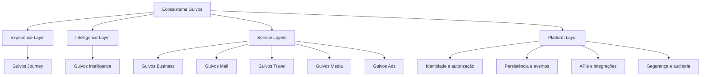
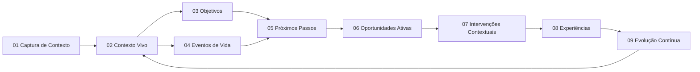

# PAS-001-CANDIDATE-001 — Edição Consolidada e Federada do PAS-001 — Guivos Journey 1.0.0

> **Estado da candidata:** `Candidate ready for validation — PAS-001 1.0.0 publication not yet authorized.`
>
> Esta edição candidata não substitui o arquivo canônico `PAS-001 0.5.0`, não autoriza publicação, tag, release ou lançamento e deverá ser validada por `PAS-001-RELEASE-VALIDATION-001`.

# 1. Autoridade da especificação

O `PAS-001` define a arquitetura funcional consolidada do Guivos Journey.

Ele governa:

- filosofia do produto;
- propósito;
- escopo;
- posição arquitetural;
- princípios permanentes;
- invariantes globais;
- mapa das capacidades;
- responsabilidades transversais;
- fronteiras entre capacidades e camadas;
- fluxos globais;
- autoridade documental;
- critérios globais de reabertura.

O `PAS-001` não substitui os contratos especializados das capacidades.

Os contratos especializados permanecem como autoridade sobre:

- agregados;
- estados;
- transições;
- visualizações;
- eventos;
- integrações;
- KPIs;
- guardrails;
- cenários;
- critérios específicos;
- regras operacionais.

# 2. Definição do Guivos Journey

O Guivos Journey é a **Experience Layer** do Ecossistema Guivos.

Ele é o sistema de experiência unificada por meio do qual participantes podem:

- expressar e revisar seu contexto;
- compreender melhor seu momento atual;
- governar direções conscientemente assumidas;
- reconhecer mudanças relevantes;
- avaliar movimentos possíveis;
- encontrar meios admissíveis;
- receber manifestações no momento adequado;
- reconhecer experiências vividas;
- compreender trajetórias de mudança.

O Journey não é apenas:

- aplicativo;
- feed;
- chatbot;
- formulário;
- rede social;
- marketplace;
- buscador;
- agenda;
- gerenciador de tarefas;
- sistema de recomendações.

Esses elementos podem existir como interfaces ou recursos, mas não definem a arquitetura funcional do Journey.

# 3. Propósito

> **Ajudar participantes a compreender seu contexto, decidir com maior autonomia e encontrar caminhos legítimos para produzir resultados concretos no mundo real.**

O Journey deverá reduzir:

- fragmentação de informações;
- esforço para explicar repetidamente o próprio contexto;
- dificuldade de compreender possibilidades;
- distância entre intenção e ação possível;
- exposição a oportunidades irrelevantes;
- intervenções inadequadas;
- perda de continuidade;
- interpretações opacas;
- dependência de múltiplas plataformas desconectadas.

# 4. Filosofia do produto

O Journey não deverá ser otimizado prioritariamente para:

- tempo de tela;
- frequência compulsiva;
- quantidade de interações;
- volume de dados coletados;
- exposição pessoal;
- consumo contínuo;
- conversão comercial;
- quantidade de oportunidades apresentadas;
- quantidade de notificações;
- dependência da plataforma.

Seu valor deverá ser observado principalmente na capacidade de apoiar compreensão, decisão, ação, experiência e aprendizado fora da plataforma.

# 5. Participante e protagonismo

O participante permanece como protagonista da própria jornada.

A Guivos poderá:

- escutar;
- organizar;
- interpretar;
- sintetizar;
- comparar;
- explicar;
- propor;
- recomendar avaliação;
- apresentar possibilidades;
- lembrar;
- acompanhar;
- reconhecer evidências autorizadas.

A Guivos não poderá:

- confirmar em nome do participante;
- impor significado pessoal;
- assumir objetivo;
- assumir compromisso;
- decidir prioridade humana;
- diagnosticar;
- prescrever;
- medir mérito;
- medir fé;
- medir valor humano;
- determinar automaticamente o que representa evolução.

# 6. Arquitetura em camadas



O diagrama representa responsabilidades funcionais.

Ele não determina:

- topologia técnica definitiva;
- linguagem de programação;
- divisão de microsserviços;
- banco de dados;
- infraestrutura física;
- fornecedor de nuvem.

# 7. Responsabilidades das camadas

## 7.1 Experience Layer

O Journey governa:

- experiência unificada;
- contexto apresentado ao participante;
- objetivos e movimentos possíveis;
- oportunidades e manifestações;
- experiências;
- evolução;
- controles visíveis;
- continuidade experiencial;
- orquestração entre capacidades.

## 7.2 Intelligence Layer

A Guivos Intelligence poderá:

- interpretar;
- classificar;
- estimar confiança;
- detectar divergências;
- produzir candidatos;
- propor sínteses;
- comparar alternativas;
- explicar resultados;
- apoiar decisões das capacidades.

Ela não poderá:

- confirmar contexto em nome da pessoa;
- criar compromisso;
- impor Próximo Passo;
- ativar Oportunidade sem contrato;
- decidir manifestação;
- confirmar Experiência;
- reconhecer Evolução sem evidência e contrato;
- transformar confiança técnica em autoridade humana.

## 7.3 Service Layers

Business, Mall, Travel, Media e Ads poderão:

- fornecer fatos operacionais;
- disponibilizar produtos, serviços, conteúdo e oportunidades;
- receber solicitações autorizadas;
- devolver resultados de suas operações.

Eles não poderão determinar:

- objetivo;
- prioridade humana;
- relevância contextual final;
- progresso;
- experiência;
- evolução;
- valor do participante.

## 7.4 Platform Layer

A Platform Layer sustenta:

- identidade;
- autenticação;
- autorização;
- persistência;
- eventos;
- APIs;
- filas;
- criptografia;
- auditoria;
- versionamento;
- idempotência;
- observabilidade;
- correção;
- revogação.

Ela não redefine:

- significado funcional;
- estado humano;
- relevância;
- experiência;
- evolução;
- autoridade normativa.

# 8. Princípios permanentes

1. O participante controla a própria jornada.
2. Contexto não equivale a identidade definitiva.
3. A compreensão deve ser progressiva e revisável.
4. Inferência não equivale a fato.
5. Confiança não equivale a certeza.
6. Silêncio não equivale a consentimento.
7. Abandono não equivale a fracasso.
8. Confirmação parcial não equivale a confirmação integral.
9. Mais dados não equivalem a melhor compreensão.
10. Receita não supera relevância contextual.
11. Patrocínio não amplia autoridade.
12. Popularidade não determina prioridade.
13. A inteligência propõe; a capacidade decide.
14. A infraestrutura sustenta; não redefine.
15. Cada capacidade resolve um problema central.
16. Uma capacidade não assume decisão pertencente a outra.
17. O Journey não constitui pipeline obrigatório.
18. Ausência de ação pode ser resultado legítimo.
19. Permanecer em silêncio pode ser a melhor intervenção.
20. Estado inconclusivo é legítimo.
21. Correções preservam o histórico.
22. Revogações devem ser propagadas.
23. Informações sensíveis exigem proteção reforçada.
24. Terceiros não podem receber perfil paralelo.
25. Crianças e adolescentes exigem proteção específica.
26. Acessibilidade não pode exigir exposição adicional.
27. O sistema deve falhar com segurança.
28. O participante deve compreender decisões relevantes.
29. Resultados comerciais não redefinem resultados humanos.
30. Nenhum KPI poderá medir valor humano.

# 9. Invariantes globais

## 9.1 Finalidade

Toda coleta, interpretação, persistência, integração ou apresentação deverá possuir finalidade específica.

## 9.2 Autoridade

Nenhum ator poderá ampliar sua autoridade por:

- acesso técnico;
- contrato comercial;
- pagamento;
- patrocínio;
- confiança algorítmica;
- volume de informações.

## 9.3 Proveniência

Informações relevantes deverão preservar:

- origem;
- autoria;
- temporalidade;
- transformações;
- confirmação;
- confiança;
- incerteza.

## 9.4 Minimização

Cada capacidade deverá utilizar somente os elementos necessários à finalidade.

## 9.5 Controle

O participante deverá poder, conforme aplicável:

- consultar;
- compreender;
- corrigir;
- limitar;
- contestar;
- pausar;
- remover;
- desconectar;
- revogar.

## 9.6 Decisão própria

Todo consumidor de um evento ou recorte deverá realizar sua própria avaliação funcional.

## 9.7 Falha segura

Falha parcial não deverá ser apresentada como sucesso integral.

# 10. Modelo operacional global

O Journey opera por responsabilidades contínuas:

1. **Compreender** — construir compreensão autorizada e revisável;
2. **Representar** — manter contexto atual sem produzir identidade definitiva;
3. **Direcionar** — governar objetivos e direções assumidas;
4. **Reconhecer mudanças** — registrar Eventos de Vida relevantes;
5. **Tornar movimentos possíveis** — governar Próximos Passos;
6. **Encontrar meios** — avaliar Oportunidades Ativas;
7. **Manifestar ou silenciar** — governar Intervenções Contextuais;
8. **Reconhecer o vivido** — governar Experiências;
9. **Compreender trajetórias** — governar Evolução Contínua.

# 11. Mapa final das capacidades

| Nº | Capacidade | Responsabilidade principal | Estado |
|---:|---|---|---|
| 01 | Captura de Contexto | Iniciar compreensão autorizada | Functionally complete |
| 02 | Contexto Vivo | Representar o contexto atual | Functionally complete |
| 03 | Objetivos | Governar direções assumidas | Functionally complete |
| 04 | Eventos de Vida | Governar mudanças relevantes | Functionally complete |
| 05 | Próximos Passos | Governar movimentos possíveis | Functionally complete |
| 06 | Oportunidades Ativas | Governar meios admissíveis | Functionally complete |
| 07 | Intervenções Contextuais | Governar manifestação ou silêncio | Functionally complete |
| 08 | Experiências | Governar o que foi vivido | Functionally complete |
| 09 | Evolução Contínua | Governar trajetórias de mudança | Functionally complete |

Nenhuma capacidade representa:

- etapa obrigatória;
- tela;
- microsserviço;
- módulo comercial;
- score humano;
- nível hierárquico da pessoa.

# 12. Perguntas centrais finais

## 12.1 Captura de Contexto

> Como permitir que um participante expresse seu contexto e seja inicialmente compreendido sem transformar captura, transcrição, interpretação, síntese, confirmação ou persistência em conceitos equivalentes?

## 12.2 Contexto Vivo

> Como a Guivos mantém uma representação viva, confiável, explicável e revisável do contexto atual do participante, sem tratá-la como identidade definitiva?

## 12.3 Objetivos

> Como a Guivos governa direções conscientemente assumidas pelo participante, preservando formulação, confirmação, prioridade e possibilidade de mudança?

## 12.4 Eventos de Vida

> Como mudanças relevantes alteram a jornada do participante?

## 12.5 Próximos Passos

> Como grandes objetivos se tornam ações possíveis?

## 12.6 Oportunidades Ativas

> Quais meios disponíveis, legítimos e compatíveis podem apoiar este participante em seu contexto atual?

## 12.7 Intervenções Contextuais

> Existe uma razão legítima e um momento adequado para a Guivos se manifestar agora, ou o melhor comportamento é aguardar ou permanecer em silêncio?

## 12.8 Experiências

> O que foi efetivamente vivido por este participante, em qual contexto, com qual forma de participação e o que pode legitimamente ser reconhecido a partir dessa vivência?

## 12.9 Evolução Contínua

> Que mudanças podem ser legitimamente reconhecidas na trajetória deste participante ao longo do tempo, em relação a quais direções ou referências, com quais evidências, limitações e incertezas?

# 13. Resumo federado das capacidades

## 13.1 Captura de Contexto

Governa o início da compreensão.

Deve preservar finalidade, sessão, entrada original, transcrição, interpretação, síntese, confirmação, autorização, persistência, correção e recortes.

Não cria automaticamente Objetivo, Evento de Vida, Próximo Passo, Oportunidade, Experiência ou Evolução.

**Autoridade especializada:** extensões `PAS-001-CC-*`.

## 13.2 Contexto Vivo

Governa a melhor representação atual e autorizada do contexto.

Não representa verdade absoluta, identidade integral, diagnóstico ou perfil definitivo.

**Autoridade especializada:** extensões `PAS-001-CV-*`.

## 13.3 Objetivos

Governa direções conscientemente assumidas.

Distingue desejo, intenção, candidato, formulação, confirmação, ativação, prioridade e encerramento.

**Autoridade especializada:** extensões `PAS-001-OBJ-*`.

## 13.4 Eventos de Vida

Governa mudanças relevantes capazes de alterar a jornada.

Distingue relato, candidatura, ocorrência, impacto, temporalidade e confirmação.

**Autoridade especializada:** extensões `PAS-001-EV-*`.

## 13.5 Próximos Passos

Governa movimentos possíveis relacionados a contexto, objetivos ou mudanças.

Distingue possibilidade, proposta, decisão, ativação, compromisso, execução e conclusão.

**Autoridade especializada:** extensões `PAS-001-PP-*`.

## 13.6 Oportunidades Ativas

Governa meios externos ou internos que podem apoiar o participante.

Distingue identificação, candidatura, admissibilidade, avaliação, ativação, disponibilidade, elegibilidade e relevância.

Ativação não equivale a apresentação.

**Autoridade especializada:** extensões `PAS-001-OA-*`.

## 13.7 Intervenções Contextuais

Governa se, quando, como e com qual intensidade a Guivos deve se manifestar.

Também governa a decisão de esperar, observar, perguntar ou silenciar.

**Autoridade especializada:** extensões `PAS-001-IC-*`.

## 13.8 Experiências

Governa aquilo que foi efetivamente vivido.

Distingue ocorrência, participação, resultado, percepção, evidência, memória e significado.

Experiência não equivale a evolução.

**Autoridade especializada:** extensões `PAS-001-EXP-*`.

## 13.9 Evolução Contínua

Governa trajetórias de mudança ao longo do tempo.

Distingue observação, evidência, baseline, direção, padrão, interpretação, confiança, incerteza e reconhecimento.

Não produz score humano ou trajetória obrigatoriamente linear.

**Autoridade especializada:** extensões `PAS-001-EC-*`.

# 14. Relações entre capacidades



Esse fluxo representa uma possibilidade coordenada.

Não representa sequência obrigatória, pipeline técnico, funil comercial, jornada universal ou requisito de que todas as capacidades sejam utilizadas.

Capacidades poderão interagir em combinações diferentes, desde que preservem autoridade e contratos.

# 15. Fronteiras fundamentais

## 15.1 Captura e Contexto Vivo

Captura produz recortes candidatos.

Contexto Vivo decide sua admissibilidade.

## 15.2 Contexto Vivo e Objetivos

Contexto pode conter desejos ou intenções.

Objetivos governa sua formulação e confirmação.

## 15.3 Objetivos e Próximos Passos

Objetivo fornece direção.

Próximo Passo governa movimento possível e compromisso.

## 15.4 Próximos Passos e Oportunidades

Próximo Passo pode indicar uma necessidade.

Oportunidades Ativas governa os meios admissíveis.

## 15.5 Oportunidades e Intervenções

Uma oportunidade ativa pode estar disponível.

Intervenções decide se e quando deverá ser apresentada.

## 15.6 Intervenções e Experiências

Uma intervenção pode facilitar uma ação.

Experiências governa o que foi efetivamente vivido.

## 15.7 Experiências e Evolução

Uma experiência pode fornecer evidência.

Evolução Contínua decide se existe mudança reconhecível ao longo do tempo.

# 16. Contexto, fatos e inferências

O Journey deverá distinguir:

- entrada;
- declaração;
- observação;
- fato;
- evidência;
- transcrição;
- interpretação;
- hipótese;
- síntese;
- confirmação;
- contexto;
- decisão;
- evento;
- resultado.

Nenhuma transformação deverá apagar a natureza original da informação.

Toda inferência material deverá possuir origem, método, finalidade, confiança, incerteza, temporalidade e possibilidade de contestação.

# 17. Sensibilidade e proteção

Informações relacionadas a saúde, deficiência, religião, espiritualidade, política, violência, trauma, finanças, emprego, família, sexualidade, localização protegida, crianças, adolescentes e vulnerabilidade deverão receber proteção reforçada.

Essas informações não deverão ser utilizadas para:

- publicidade comportamental;
- aumento de preço;
- concessão de crédito;
- seleção de emprego;
- exclusão;
- manipulação;
- pressão;
- exploração comercial.

# 18. Neutralidade comercial

Relações comerciais deverão permanecer identificadas.

Pagamento, comissão, patrocínio, margem, popularidade ou interesse de fornecedor não poderão:

- criar Objetivo;
- determinar prioridade;
- ampliar confiança;
- elevar relevância funcional;
- ativar oportunidade;
- determinar apresentação;
- alterar experiência;
- reconhecer evolução.

Guivos Ads não deverá acessar narrativas, interpretações ou contextos sensíveis sem contrato específico e fundamento legítimo.

# 19. Eventos e integrações globais

Eventos funcionais deverão representar fatos ocorridos.

Eles deverão preservar, conforme aplicável:

- identidade;
- versão;
- agregado;
- ator;
- autoridade;
- finalidade;
- temporalidades;
- proveniência;
- natureza da informação;
- sensibilidade;
- confiança;
- incerteza;
- idempotência;
- correlação;
- causalidade;
- consumidores autorizados.

Integrações não deverão transferir decisão entre capacidades.

# 20. Correção, contestação e revogação

Correções deverão ser compensatórias e preservar o histórico.

Contestações materiais deverão limitar novos efeitos.

Revogações deverão:

1. bloquear novos usos;
2. identificar consumidores;
3. propagar a decisão;
4. registrar retenções residuais;
5. permanecer pendentes até conclusão suficiente.

# 21. Critérios globais de saúde

O Journey será considerado funcionalmente saudável quando:

- as capacidades operarem dentro de suas fronteiras;
- nenhuma violação crítica estiver aberta;
- controles do participante forem efetivos;
- informações sensíveis permanecerem protegidas;
- decisões automatizadas indevidas forem bloqueadas;
- correções e revogações forem propagadas;
- consumidores realizarem decisão própria;
- falhas forem representadas com segurança;
- ações comerciais permanecerem neutras;
- a experiência produzir valor compreensível.

Não deverá existir score global do participante, score global de evolução, percentual global do Journey ou média que compense guardrail violado.

# 22. Sucesso do Journey

O sucesso do Journey deverá ser avaliado pela capacidade do sistema de:

- apoiar compreensão;
- preservar autonomia;
- reduzir esforço desnecessário;
- oferecer possibilidades legítimas;
- permitir decisões melhores;
- apoiar ações possíveis;
- reconhecer experiências com fidelidade;
- aprender com evidências autorizadas;
- permanecer útil ao longo do tempo;
- gerar valor no mundo real.

O sucesso não deverá ser medido isoladamente por sessões, cliques, notificações, mensagens, oportunidades apresentadas, compras, tempo de uso, quantidade de dados ou profundidade da exposição pessoal.

# 23. Autoridade documental federada

A hierarquia normativa será:

1. decisões institucionais superiores do Ecossistema Guivos;
2. `GLPA-001`, para responsabilidades entre camadas;
3. `PAS-001`, para arquitetura global do Journey;
4. contratos finais das capacidades;
5. extensões especializadas;
6. decisões de reconciliação e auditoria;
7. documentação operacional;
8. exemplos e materiais explicativos.

Em conflitos, deverão ser avaliados escopo, especificidade, versão, temporalidade, supersessão explícita, autoridade e impacto.

Nenhum conflito deverá ser resolvido silenciosamente.

# 24. Documentos especializados vigentes

| Capacidade | Contrato final |
|---|---|
| Captura de Contexto | `PAS-001-CC-CONTRACT-001` |
| Contexto Vivo | `PAS-001-CV-CONTRACT-001` |
| Objetivos | `PAS-001-OBJ-CONTRACT-001` |
| Eventos de Vida | `PAS-001-EV-CONTRACT-001` |
| Próximos Passos | `PAS-001-PP-CONTRACT-001` |
| Oportunidades Ativas | `PAS-001-OA-CONTRACT-001` |
| Intervenções Contextuais | `PAS-001-IC-CONTRACT-001` |
| Experiências | `PAS-001-EXP-CONTRACT-001` |
| Evolução Contínua | `PAS-001-EC-CONTRACT-001` |

As demais extensões das capacidades permanecem vigentes e são referenciadas pelos respectivos contratos finais.

# 25. Preservação histórica

A publicação futura do `PAS-001 1.0.0` não deverá:

- apagar o histórico do `0.5.0`;
- apagar a reconciliação;
- apagar a auditoria;
- apagar extensões;
- ocultar perguntas substituídas;
- ocultar estados históricos;
- reescrever decisões anteriores;
- remover rastreabilidade.

O Git deverá permanecer como registro histórico integral.

# 26. Versionamento e mudanças

## 26.1 Alteração patch

Poderá corrigir erro textual, link, formatação ou ambiguidade sem efeito normativo.

## 26.2 Alteração minor

Poderá adicionar esclarecimento compatível, nova referência, nova visão transversal ou extensão sem quebra de contrato.

## 26.3 Alteração major

Será necessária quando houver alteração da filosofia, alteração do mapa de capacidades, transferência de responsabilidade, mudança de autoridade entre camadas, nova capacidade estrutural, quebra de invariantes ou alteração incompatível das fronteiras.

# 27. Critérios globais de reabertura

O `PAS-001` deverá ser reaberto quando houver:

- nova capacidade do Journey;
- mudança de Experience Layer;
- mudança estrutural na relação com Intelligence;
- mudança estrutural na Platform Layer;
- novo produto especializado de alto impacto;
- novo uso de dados sensíveis;
- conflito entre contratos finais;
- violação recorrente de guardrail;
- transferência indevida de autoridade;
- regressão na autonomia do participante;
- nova obrigação regulatória estrutural;
- evidência de que a arquitetura vigente não protege adequadamente o participante.

Preferências editoriais ou interesses comerciais isolados não justificam reabertura normativa.

# 28. Comportamentos globais proibidos

O Journey não deverá:

1. decidir pelo participante;
2. criar perfil humano definitivo;
3. utilizar contexto como identidade absoluta;
4. tratar inferência como fato;
5. ocultar incerteza material;
6. presumir consentimento;
7. transformar silêncio em confirmação;
8. transformar abandono em fracasso;
9. ampliar coleta sem finalidade;
10. converter persistência temporária silenciosamente;
11. utilizar vulnerabilidade comercialmente;
12. criar score de valor humano;
13. criar score de fé;
14. criar score global de evolução;
15. obrigar trajetória linear;
16. obrigar uso de todas as capacidades;
17. criar Objetivo automaticamente;
18. confirmar Evento de Vida automaticamente;
19. assumir Próximo Passo;
20. apresentar oportunidade apenas por interesse comercial;
21. manifestar-se sem legitimidade contextual;
22. confirmar Experiência automaticamente;
23. reconhecer Evolução automaticamente;
24. transferir decisão à Intelligence;
25. transferir significado à Platform;
26. apagar histórico em correções;
27. declarar revogação antes da propagação;
28. compartilhar conteúdo integral quando recorte for suficiente;
29. reduzir capacidade a tela ou microsserviço;
30. compensar guardrail violado com média positiva.

# 29. Critérios de aceite da edição candidata

A candidata será considerada pronta para validação quando:

1. utilizar `PAS-001-CANDIDATE-001`;
2. utilizar versão `1.0.0-rc.1`;
3. manter o `PAS-001 0.5.0` intacto;
4. incorporar a filosofia vigente;
5. incorporar a arquitetura em camadas;
6. incorporar os 30 princípios permanentes;
7. incorporar os invariantes globais;
8. apresentar o mapa final das nove capacidades;
9. utilizar as perguntas centrais aprovadas;
10. aplicar os dois refinamentos editoriais da auditoria;
11. definir responsabilidades de cada capacidade;
12. definir limites de cada capacidade;
13. preservar a não linearidade;
14. definir fronteiras entre capacidades;
15. definir limites da Intelligence;
16. definir limites da Platform;
17. definir limites dos produtos especializados;
18. preservar neutralidade comercial;
19. preservar proteção sensível;
20. preservar correção e revogação;
21. referenciar os nove contratos finais;
22. referenciar as 54 extensões;
23. preservar a matriz de supersessão;
24. preservar o registro de autoridade;
25. preservar o histórico do `0.5.0`;
26. definir critérios de reabertura;
27. não reproduzir integralmente os contratos especializados;
28. não utilizar percentual global do Journey;
29. possuir links válidos;
30. possuir navegação candidata;
31. possuir metadados válidos;
32. não introduzir contradição com `GLPA-001`;
33. não introduzir contradição com `GIA-000`;
34. não introduzir regressão nos 15 gates;
35. não publicar automaticamente `PAS-001 1.0.0`.

# 30. Processo de validação da candidata

Após a criação da candidata, deverá ser produzido:

`PAS-001-RELEASE-VALIDATION-001 — Validação Editorial e Normativa da Edição Candidata do Guivos Journey`

A validação deverá comparar:

- candidata versus auditoria;
- candidata versus `PAS-001 0.5.0`;
- candidata versus matriz de supersessão;
- candidata versus registro de autoridade;
- candidata versus contratos finais;
- candidata versus `GLPA-001`;
- candidata versus `GIA-000`;
- candidata versus navegação;
- candidata versus artefatos canônicos.

# 31. Estados da publicação

```text
Ready for consolidation
→ Candidate in preparation
→ Candidate ready for validation
→ Validation passed
→ Ready for publication
→ Publication approved
→ PAS-001 1.0.0 active
```

Nenhum estado poderá ser omitido sem decisão formal registrada.

# 32. Condição para Ready for publication

`Ready for publication` somente poderá ser declarado quando:

- a candidata estiver completa;
- os critérios de aceite estiverem aprovados;
- não houver regressão dos 15 gates;
- links estiverem válidos;
- versões estiverem coerentes;
- autoridade documental estiver preservada;
- as perguntas centrais estiverem corretas;
- o mapa das capacidades estiver correto;
- as fronteiras estiverem preservadas;
- as 54 extensões permanecerem vigentes;
- não houver achado crítico ou alto aberto;
- a validação formal estiver registrada.

# 33. Ação de publicação futura

Somente após aprovação expressa para publicação deverá ocorrer:

1. substituição controlada do conteúdo de `pas-001-guivos-journey.md`;
2. alteração de `status: draft` para `status: active`;
3. alteração de `version: 0.5.0` para `version: 1.0.0`;
4. preservação do histórico no Git;
5. atualização dos artefatos canônicos;
6. classificação da candidata como histórica;
7. validação final de links;
8. decisão formal de publicação;
9. eventual criação de tag ou release, mediante aprovação específica.

# 34. Versões desta etapa

A criação da candidata deverá registrar:

- Arquitetura de Produtos: `1.27.0`;
- Roadmap: `11.8.0`;
- Knowledge Board: `11.8.0`;
- Matriz de Consolidação Canônica: `1.27.0`;
- Changelog: `0.55.0`;
- `PAS-001` canônico: permanece `0.5.0`;
- `PAS-001-CANDIDATE-001`: `1.0.0-rc.1`;
- `PAS-001-AUDIT-001`: permanece `1.0.0`.

O parecer vigente nesta etapa é:

> **Candidate ready for validation — PAS-001 1.0.0 publication not yet authorized.**

# 35. Próximo ponto exato

Após a criação e integração da candidata, o próximo bloco será:

> **Validação Editorial e Normativa da Edição Candidata do PAS-001 — Guivos Journey 1.0.0**, incluindo comparação com os 15 gates, contratos finais, autoridade documental, matriz de supersessão, links, versões, navegação, regressões e decisão formal sobre `Ready for publication`.

Documento projetado:

`PAS-001-RELEASE-VALIDATION-001`

Sequência:

```text
PAS-001-AUDIT-001
→ PAS-001-CANDIDATE-001 1.0.0-rc.1
→ PAS-001-RELEASE-VALIDATION-001
→ decisão Ready for publication
→ aprovação expressa
→ PAS-001 1.0.0 active
→ mapa final publicado
```
