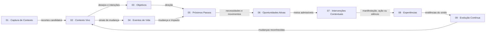

# PAS-001-CAPABILITY-MAP-001 — Mapa Final de Capacidades do Guivos Journey

> **Estado:** `Active 1.0.0`.
>
> Visão normativa, executiva e navegável das nove capacidades funcionalmente concluídas do Guivos Journey. O `PAS-001 1.0.0` permanece como autoridade global; os nove contratos finais e as 54 extensões normativas permanecem como autoridades especializadas.

# 5021. Autoridade e finalidade

O mapa sintetiza responsabilidades, relações, entradas, saídas, fronteiras, contratos e critérios de reabertura. Ele não altera o `PAS-001`, não cria capacidade, não transfere autoridade, não redefine estados ou eventos e não substitui contratos finais.

> **Pergunta central:** Como apresentar de forma executiva, precisa, navegável e não linear a arquitetura das nove capacidades do Guivos Journey, preservando suas fronteiras, contratos especializados e autonomia decisória?

# 5022. Princípios

1. Uma capacidade resolve um problema funcional central.
2. Capacidade não equivale a tela, microsserviço ou etapa obrigatória.
3. Relação não equivale a transferência de decisão.
4. Saída de uma capacidade pode ser apenas entrada candidata para outra.
5. Toda capacidade receptora realiza sua própria avaliação.
6. Ausência de movimento e silêncio podem ser resultados legítimos.
7. Experiência não equivale a Evolução.
8. Ativação de oportunidade não equivale a apresentação.
9. Intelligence apoia; não governa a decisão humana.
10. Platform sustenta; não redefine significado.
11. Interesses comerciais não determinam relevância.
12. Contratos finais permanecem como autoridades especializadas.

# 5023. Visão executiva

| Nº | Capacidade | Verbo | Responsabilidade | Estado | Contrato final |
|---:|---|---|---|---|---|
| 01 | Captura de Contexto | Compreender | Iniciar compreensão autorizada | Functionally complete | `PAS-001-CC-CONTRACT-001` |
| 02 | Contexto Vivo | Representar | Manter representação contextual atual | Functionally complete | `PAS-001-CV-CONTRACT-001` |
| 03 | Objetivos | Direcionar | Governar direções assumidas | Functionally complete | `PAS-001-OBJ-CONTRACT-001` |
| 04 | Eventos de Vida | Reconhecer mudança | Governar mudanças relevantes | Functionally complete | `PAS-001-EV-CONTRACT-001` |
| 05 | Próximos Passos | Movimentar | Governar movimentos possíveis | Functionally complete | `PAS-001-PP-CONTRACT-001` |
| 06 | Oportunidades Ativas | Encontrar meios | Governar meios admissíveis | Functionally complete | `PAS-001-OA-CONTRACT-001` |
| 07 | Intervenções Contextuais | Manifestar ou silenciar | Governar manifestação, espera ou silêncio | Functionally complete | `PAS-001-IC-CONTRACT-001` |
| 08 | Experiências | Reconhecer o vivido | Governar aquilo que foi efetivamente vivido | Functionally complete | `PAS-001-EXP-CONTRACT-001` |
| 09 | Evolução Contínua | Compreender trajetória | Governar mudanças ao longo do tempo | Functionally complete | `PAS-001-EC-CONTRACT-001` |

# 5024. Mapa visual



O diagrama representa relações possíveis, não fluxo obrigatório, funil comercial, pipeline técnico ou jornada universal.

# 5025. Perguntas centrais

| Capacidade | Pergunta central |
|---|---|
| Captura de Contexto | Como permitir que um participante expresse seu contexto e seja inicialmente compreendido sem transformar captura, transcrição, interpretação, síntese, confirmação ou persistência em conceitos equivalentes? |
| Contexto Vivo | Como a Guivos mantém uma representação viva, confiável, explicável e revisável do contexto atual do participante, sem tratá-la como identidade definitiva? |
| Objetivos | Como a Guivos governa direções conscientemente assumidas pelo participante, preservando formulação, confirmação, prioridade e possibilidade de mudança? |
| Eventos de Vida | Como mudanças relevantes alteram a jornada do participante? |
| Próximos Passos | Como grandes objetivos se tornam ações possíveis? |
| Oportunidades Ativas | Quais meios disponíveis, legítimos e compatíveis podem apoiar este participante em seu contexto atual? |
| Intervenções Contextuais | Existe uma razão legítima e um momento adequado para a Guivos se manifestar agora, ou o melhor comportamento é aguardar ou permanecer em silêncio? |
| Experiências | O que foi efetivamente vivido por este participante, em qual contexto, com qual forma de participação e o que pode legitimamente ser reconhecido a partir dessa vivência? |
| Evolução Contínua | Que mudanças podem ser legitimamente reconhecidas na trajetória deste participante ao longo do tempo, em relação a quais direções ou referências, com quais evidências, limitações e incertezas? |

# 5026. Entradas, saídas e limites

| Capacidade | Recebe tipicamente | Produz em nível de mapa | Não decide ou não representa |
|---|---|---|---|
| Captura de Contexto | Expressões e entradas autorizadas | Recortes, interpretações e sínteses candidatas | Objetivos, eventos, compromissos ou evolução |
| Contexto Vivo | Recortes admissíveis, fatos e atualizações | Representação contextual atual e revisável | Identidade definitiva, diagnóstico ou objetivo |
| Objetivos | Contexto, desejos, intenções e formulações | Direções formuladas, confirmadas e priorizadas | Próximos Passos, execução ou evolução |
| Eventos de Vida | Relatos, sinais e evidências de mudança | Evento reconhecido e impacto contextual | Objetivo ou ação obrigatória |
| Próximos Passos | Contexto, Objetivos e Eventos de Vida | Movimentos possíveis, decididos ou assumidos | Meio específico ou apresentação comercial |
| Oportunidades Ativas | Necessidades, movimentos e meios disponíveis | Oportunidades avaliadas, admitidas ou ativas | Momento da manifestação, aceitação ou evolução |
| Intervenções Contextuais | Contexto, oportunidades, momento e preferências | Manifestação, espera, observação ou silêncio | Experiência, concordância ou significado do vivido |
| Experiências | Ocorrência, participação, evidências e percepções | Registro do que foi efetivamente vivido | Evolução automática ou transformação presumida |
| Evolução Contínua | Experiências, observações, baselines e evidências | Interpretações e reconhecimentos de trajetória | Valor humano, mérito, ranking ou causalidade presumida |

# 5027. Fronteiras decisórias

| Origem | Elemento disponibilizado | Decisão preservada na capacidade receptora |
|---|---|---|
| Captura de Contexto | Recorte candidato | Contexto Vivo decide admissibilidade |
| Contexto Vivo | Desejo ou intenção | Objetivos decide formulação e confirmação |
| Contexto Vivo | Sinal de mudança | Eventos de Vida decide ocorrência e impacto |
| Objetivos | Direção assumida | Próximos Passos decide movimento e compromisso |
| Eventos de Vida | Mudança reconhecida | Próximos Passos decide necessidade de movimento |
| Próximos Passos | Necessidade ou movimento | Oportunidades Ativas decide admissibilidade do meio |
| Oportunidades Ativas | Oportunidade ativa | Intervenções decide manifestação, momento ou silêncio |
| Intervenções | Manifestação ou facilitação | Experiências decide o que foi efetivamente vivido |
| Experiências | Evidência do vivido | Evolução Contínua decide se existe mudança reconhecível |
| Evolução Contínua | Mudança reconhecida | Contexto Vivo decide incorporação à representação atual |

# 5028. Relações não lineares

Evento de Vida pode provocar revisão de Objetivo; Experiência pode alterar Contexto Vivo sem reconhecimento de Evolução; Contexto Vivo pode limitar Intervenções; contestação pode retornar a capacidades anteriores; revogação pode interromper múltiplos consumidores; falha pode encerrar um fluxo; ausência de oportunidade pode ser resultado válido; silêncio pode ser resultado final.

# 5029. Relações com as camadas

## Guivos Intelligence

Apoia por interpretação, classificação, comparação, confiança, detecção de divergência, candidatos e explicação. Não assume confirmação, objetivo, compromisso, admissibilidade final, manifestação, experiência ou evolução. Não constitui décima capacidade.

## Service Layers

Business, Mall, Travel, Media e Ads fornecem fatos, serviços, produtos, conteúdo e oportunidades. Não determinam direção, prioridade, relevância final, experiência, evolução ou valor humano.

## Platform Layer

Sustenta identidade, autorização, persistência, eventos, APIs, integrações, criptografia, auditoria, idempotência, observabilidade, correção e revogação. Não redefine significado funcional.

# 5030. Navegação e camadas de leitura

Cada capacidade deve permitir acesso à seção do `PAS-001`, ao contrato final, às extensões, à pergunta central, às fronteiras, aos critérios de reabertura e ao estado de conclusão.

- **Executiva:** problema, responsabilidade, estado e relação principal.
- **Produto e design:** perguntas, controles, limites e superfícies possíveis.
- **Arquitetura e engenharia:** contratos, fronteiras, entradas, saídas e dependências.
- **Intelligence e dados:** autoridade, candidatos, confiança, incerteza e proibições.
- **Governança:** documentos, reabertura, proteção e rastreabilidade.

# 5031. Estados e reabertura

Estados possíveis: `Defined`, `In specification`, `Functionally complete`, `Reopened`, `Superseded` e `Historical`. Nesta versão, todas as nove capacidades estão `Functionally complete`.

O mapa não reabre capacidade. Registra gatilho, capacidade afetada, contrato competente, impacto e necessidade de avaliação. A reabertura formal ocorre no contrato ou documento autorizado.

Permanecem aplicáveis os critérios globais do `PAS-001`: nova capacidade, mudança de camada, conflito entre contratos, novo uso sensível, regressão da autonomia, transferência indevida de autoridade, obrigação regulatória estrutural ou proteção insuficiente.

# 5032. Atualização e proibições

- **Patch:** correção de link, texto ou visual.
- **Minor:** nova visão ou relação compatível.
- **Major:** mudança de capacidade, pergunta, responsabilidade, fronteira ou autoridade; exige reabertura do `PAS-001`.

O mapa não deve criar fluxo obrigatório, funil, score, nova capacidade visual, transferência de decisões, duplicação de contratos, Intelligence decisora, Platform normativa, relevância comercial, Evolução automática, intervenção automática, silêncio como falha ou apagamento histórico.

# 5033. Critérios de aceite

O mapa deve conter exatamente nove capacidades na ordem canônica; preservar perguntas, responsabilidades, contratos e 54 extensões; apresentar visão executiva, diagrama, entradas, saídas e fronteiras; preservar não linearidade; apresentar as relações entre camadas; não alterar `PAS-001 1.0.0`, contratos ou extensões; não criar percentual global; possuir links e Mermaid válidos; sincronizar artefatos e definir o próximo ponto.

# 5034. Versionamento e estado resultante

- `PAS-001`: permanece `1.0.0`;
- `PAS-001-CAPABILITY-MAP-001`: `1.0.0`;
- Arquitetura de Produtos: `1.30.0`;
- Roadmap: `11.11.0`;
- Knowledge Board: `11.11.0`;
- Matriz de Consolidação Canônica: `1.30.0`;
- Changelog: `0.58.0`.

| Ativo | Estado |
|---|---|
| PAS-001 | Active 1.0.0 |
| Mapa Final de Capacidades | Active 1.0.0 |
| Capacidades 01–09 | Functionally complete |
| Contratos finais | Active 1.0.0 |
| Extensões normativas | 54 vigentes |
| Lacuna de mapa executivo | Encerrada |
| Arquitetura funcional | Publicada e navegável |

# 5035. Próximo ponto exato

> **`PAS-001-ENGINEERING-HANDOFF-001 — Handoff Arquitetural do Guivos Journey para Product Engineering`**

O Handoff deve transformar a arquitetura funcional em plano de engenharia por capacidade, identificando agregados, superfícies, componentes, schemas, eventos, integrações, segurança, dependências, protótipos, testes, observabilidade, prontidão técnica e ordem recomendada de implementação.

```text
PAS-001 1.0.0
→ PAS-001-CAPABILITY-MAP-001
→ mapa executivo e navegável
→ PAS-001-ENGINEERING-HANDOFF-001
→ planejamento técnico por capacidade
→ arquitetura física e backlog de implementação
```

O Handoff não reabre automaticamente o `PAS-001`; conflitos funcionais retornam ao contrato competente.
