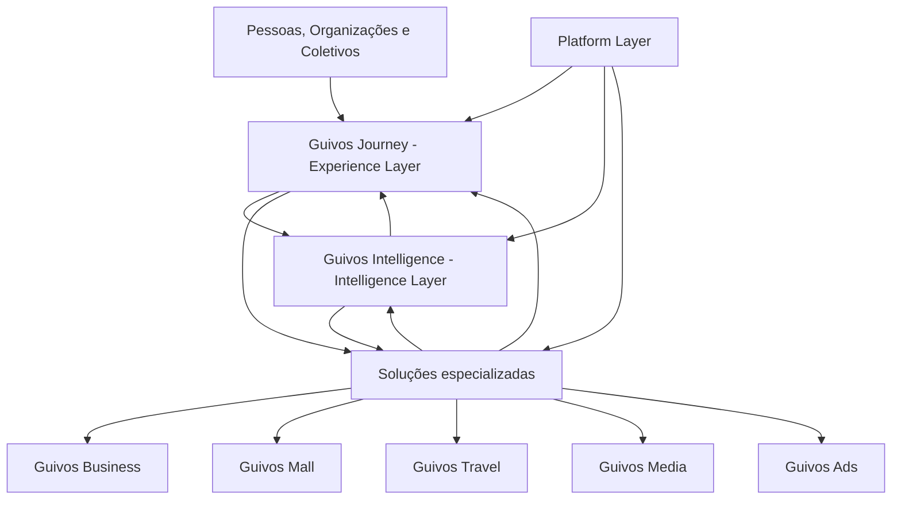
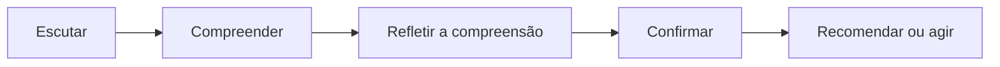
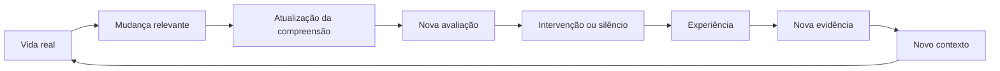
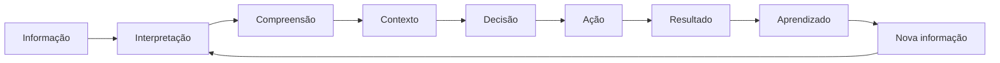
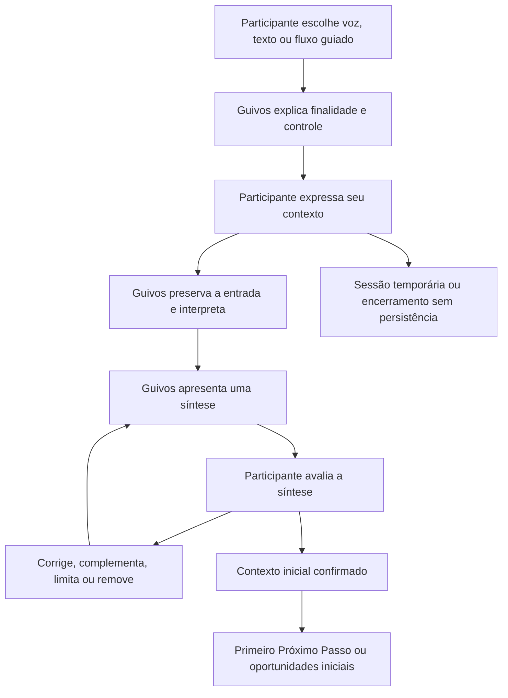
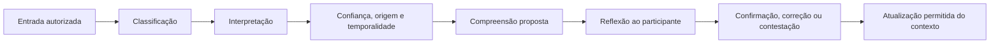
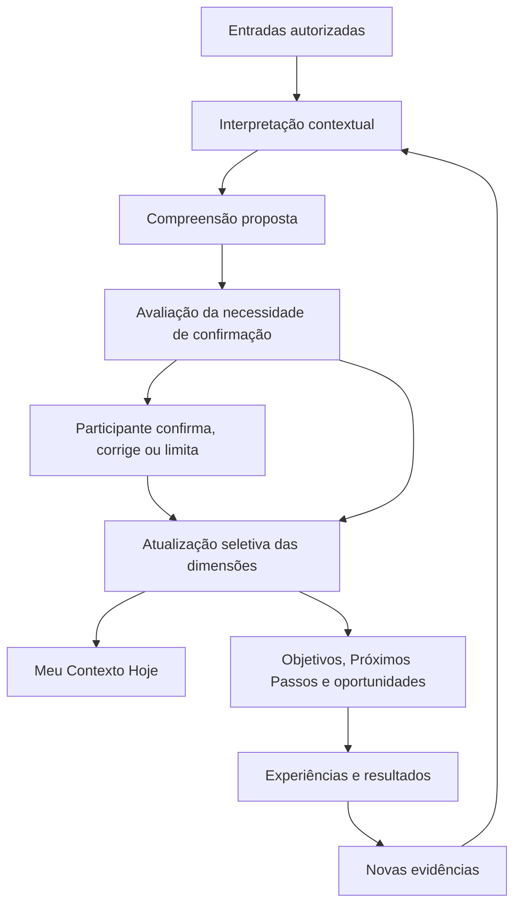
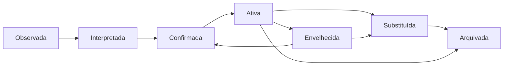
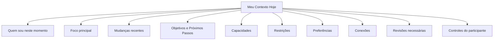

# PAS-001 — Guivos Journey Product Architecture Specification

## 0. Product Philosophy

### 0.1 Filosofia do Produto

O Guivos Journey não foi concebido para maximizar tempo de uso, consumo de conteúdo ou interação superficial.

Sua finalidade é ajudar participantes a alcançar resultados concretos no mundo real, conectando-os às oportunidades mais relevantes para seus objetivos, contexto e momento de vida.

O sucesso do Journey será medido pela quantidade e qualidade do valor gerado fora da plataforma.

### 0.2 Objetivo Fundamental

Toda capacidade do Journey deverá responder positivamente:

> Esta capacidade aumenta a condição do participante de compreender seu contexto, decidir melhor ou avançar em sua jornada?

Se a resposta for negativa, ela não deve fazer parte do núcleo do produto.

### 0.3 Papel da Inteligência

A Inteligência do Ecossistema Guivos existe para reduzir esforço, ampliar possibilidades, contextualizar informações, reconhecer mudanças, recomendar oportunidades, explicar caminhos e aprender com evidências autorizadas.

Ela não existe para manipular comportamento, substituir decisões humanas, maximizar permanência, induzir consumo desnecessário ou tratar inferências como fatos definitivos.

### 0.4 Papel do Participante

O participante permanece no controle da própria jornada.

A plataforma pode escutar, organizar, sugerir, explicar, recomendar, lembrar e acompanhar. A decisão final permanece humana.

## 1. Visão do Produto

### 1.1 Definição

O Guivos Journey é a Experience Layer do Ecossistema Guivos.

Mais do que um aplicativo, feed ou tela, é o sistema de experiência unificada por meio do qual participantes compreendem seu contexto, organizam sua jornada, descobrem oportunidades e acompanham sua evolução.

### 1.2 Propósito

Reduzir a distância entre o contexto atual de um participante e os caminhos disponíveis para avançar, utilizando inteligência contextual, conexões relevantes e oportunidades acionáveis.

### 1.3 Proposta de Valor

> Ajudar cada participante a descobrir, no momento certo, as melhores oportunidades para avançar em direção aos seus objetivos, reunindo em uma única experiência aquilo que normalmente estaria disperso em muitas plataformas.

A proposta combina descoberta, contexto, continuidade, acionabilidade e confiança.

### 1.4 O que o Journey não é

O Journey não é uma rede social tradicional, marketplace convencional, buscador genérico, agregador de eventos, plataforma exclusiva de cursos, aplicativo de produtividade, sistema de tarefas ou assistente que decide pelo participante.

### 1.5 Princípios de Produto

1. O participante é protagonista da própria jornada.
2. Toda interação deve gerar valor perceptível.
3. A inteligência deve reduzir esforço, não aumentar complexidade.
4. Recomendações devem ser contextualizadas e explicáveis.
5. O sucesso é medido por impacto no mundo real, não por tempo de tela.
6. A experiência deve evoluir continuamente com o participante.
7. O Journey deve incentivar ação no mundo real.
8. O participante controla sua jornada.
9. A compreensão deve ser progressiva, natural e revisável.
10. Voz e demais canais multimodais devem reduzir dependência de formulários extensos.
11. O Journey deve saber quando agir e quando permanecer em silêncio.
12. Receita, popularidade ou patrocínio não devem superar relevância contextual.

## 2. Arquitetura em Camadas Aplicada ao Journey



O diagrama representa limites funcionais. Não prescreve topologia técnica definitiva.

### 2.1 Responsabilidades do Journey

- experiência unificada;
- superfície principal de experiência;
- descoberta contextual;
- organização da jornada;
- apresentação de recomendações e oportunidades;
- objetivos, Próximos Passos e Momentos Atuais;
- visão autorizada do contexto do participante;
- acompanhamento da evolução;
- comunicação e intervenções visíveis;
- gamificação e incentivos apresentados ao participante;
- integração experiencial;
- orquestração de capacidades das demais camadas.

### 2.2 Responsabilidades externas ao Journey

O Journey não processa pagamentos do Mall, contratos B2B do Business, inteligência algorítmica da Intelligence Layer, campanhas do Ads, produção editorial do Media, reservas do Travel ou infraestrutura comum da Platform Layer.

### 2.3 Limite específico do Contexto Vivo

- Journey apresenta, organiza e permite governar a visão do contexto;
- Intelligence interpreta entradas, propõe compreensão e recomenda atualizações;
- Platform sustenta identidade, persistência, segurança, auditoria e integrações;
- o participante confirma, corrige, limita ou remove informações conforme as regras aplicáveis.

## 3. Filosofia Operacional do Journey

O Journey opera por cinco responsabilidades permanentes:

1. **Compreender** — construir e atualizar contexto;
2. **Acompanhar** — reconhecer continuidade e mudanças;
3. **Ativar** — tornar oportunidades relevantes visíveis;
4. **Orquestrar** — organizar próximos passos, intervenções e experiências;
5. **Aprender** — incorporar resultados e evidências autorizadas.



## 4. Relação Contínua e Vida Real

O Journey não deve ser especificado apenas como aplicativo utilizado em sessões isoladas.



O aplicativo é um ponto de contato dessa relação, não o centro da jornada.

## 5. Estado, Eventos de Vida e Oportunidades Ativas

### 5.1 Estado

Estado representa a realidade atual compreendida do participante.

### 5.2 Evento de Vida

Evento de Vida representa uma mudança relevante capaz de alterar esse estado.

Eventos podem ser declarados, observados ou recebidos por integração autorizada. Eventos inferidos devem ser confirmados quando houver impacto relevante.

### 5.3 Oportunidade Ativa

Oportunidade Ativa é uma oportunidade que, considerando o contexto atual de um participante, possui potencial imediato de apoiar progresso e merece ser apresentada.

O Journey deve priorizar relevância, momento, acionabilidade, confiança e potencial de evolução, não quantidade.

### 5.4 Intervenção Contextual

Intervenção Contextual é a decisão de agir em determinado momento. Notificação é apenas um canal.

A orquestração deve decidir quando agir, perguntar, esperar, observar ou permanecer em silêncio.

### 5.5 Distância para Evolução

`Distância para Evolução` é um conceito interno de produto que representa a diferença entre o contexto atual do participante e os caminhos disponíveis para avançar.

> O objetivo do Journey não é maximizar oportunidades apresentadas, mas reduzir continuamente essa distância, ativando apenas oportunidades com maior probabilidade de gerar progresso naquele momento.

## 6. Padrão de Especificação por Capacidades

Cada capacidade deverá possuir:

1. pergunta central;
2. objetivo;
3. valor entregue;
4. responsabilidades e limites;
5. entradas;
6. ciclo cognitivo;
7. fluxo do participante;
8. fluxo do sistema;
9. estados;
10. regras de negócio;
11. exceções;
12. privacidade e consentimento;
13. integrações;
14. eventos produzidos;
15. KPIs;
16. cenários ideal, alternativo e limite;
17. contrato da capacidade.

### 6.1 Princípio da Singularidade Funcional

> Cada capacidade funcional existe para resolver um único problema central.

### 6.2 Ciclo Cognitivo do Domínio



Esse ciclo é funcional. Não representa pipeline técnico obrigatório, modelo de IA específico ou sequência rígida para todos os casos.

## 7. Mapa de Capacidades do Journey

| Capacidade | Pergunta central | Estado |
|---|---|---|
| 01 — Captura de Contexto | Como a Guivos começa a compreender um participante? | Substantially complete |
| 02 — Contexto Vivo | Como a Guivos mantém uma representação viva e confiável do participante? | In progress |
| 03 — Objetivos | Como a Guivos compreende para onde o participante deseja evoluir? | Planned |
| 04 — Eventos de Vida | Como mudanças relevantes alteram a jornada? | Planned / concept consolidated |
| 05 — Próximos Passos | Como grandes objetivos se tornam ações possíveis? | Planned |
| 06 — Oportunidades Ativas | Como decidir quais oportunidades devem aparecer? | Planned / concept consolidated |
| 07 — Intervenções Contextuais | Quando agir e quando permanecer em silêncio? | Planned / concept consolidated |
| 08 — Experiências | Como oportunidades se transformam em evolução real? | Planned |
| 09 — Evolução Contínua | Como a jornada permanece útil durante anos? | Planned |

# Capacidade 01 — Captura de Contexto

## 8. Pergunta central

> Como a Guivos começa a compreender um participante?

## 9. Objetivo e valor entregue

Permitir que o participante expresse sua realidade de forma natural para que a Guivos construa uma compreensão inicial, revisável e útil, sem depender de cadastro longo.

## 10. Formas de início

### 10.1 Voz

Canal prioritário para expressão livre e detalhada.

### 10.2 Texto

Alternativa equivalente para preferência, acessibilidade ou ambiente inadequado para áudio.

### 10.3 Fluxo guiado

Alternativa opcional para quem não sabe por onde começar. Não deve ser o fluxo obrigatório.

## 11. Primeira mensagem

A mensagem inicial deve explicar finalidade, ausência de julgamento, liberdade para não responder e possibilidade de revisão.

> Para apresentar oportunidades realmente úteis, preciso compreender um pouco do seu momento atual. Você pode falar ou escrever livremente. Não é necessário contar nada que não queira, e você poderá revisar tudo o que eu compreender.

## 12. Fluxo funcional da Captura de Contexto



## 13. Comportamento durante a escuta

A Guivos deve:

- permitir expressão livre;
- não interromper desnecessariamente;
- preservar o conteúdo original;
- permitir pausar, continuar, apagar ou recomeçar;
- sinalizar captura de áudio;
- permitir ouvir, editar transcrição e excluir áudio quando aplicável;
- não transformar inferência em fato;
- não recomendar antes da confirmação.

## 14. Interpretação inicial e reflexão

A Guivos deverá organizar a compreensão em:

- Momento Atual;
- objetivos mencionados;
- limitações e condições;
- preferências;
- possível prioridade;
- pontos incertos;
- fatos declarados;
- inferências provisórias.

Ela deverá devolver uma síntese compreensível e perguntar se a leitura está correta.

Respostas mínimas:

- está correto;
- parcialmente correto;
- quero corrigir;
- quero acrescentar;
- prefiro não registrar parte disso.

## 15. Controle do participante

Antes da confirmação, o participante poderá:

- editar;
- remover;
- alterar prioridade;
- marcar interpretação como incorreta;
- confirmar inferência;
- limitar uso;
- manter informação temporária;
- impedir recomendações sobre determinado tema.

## 16. Perguntas complementares e priorização

Perguntas adicionais somente são permitidas para evitar erro, diferenciar objetivos, identificar restrições, tornar recomendação útil, proteger o participante ou atender obrigação legal.

Quando houver vários objetivos, o participante poderá escolher um ou mais, pedir ajuda para comparar ou manter sem prioridade definida.

Sugestões de prioridade devem ser explicadas.

## 17. Profundidade progressiva

- nível inicial: contexto mínimo;
- nível intermediário: preferências, disponibilidade, limitações e histórico;
- nível aprofundado: documentos, integrações, evidências, competências e relações autorizadas.

Níveis superiores não são obrigatórios para utilizar o Journey.

## 18. Temas sensíveis

Informações sobre saúde, religião, renda, política, família, deficiência, localização precisa e outros dados sensíveis exigem finalidade clara, consentimento proporcional, possibilidade de recusa e proteção superior.

A Guivos não deve utilizar vulnerabilidades para publicidade, manipulação, diagnóstico ou conclusão profissional indevida.

## 19. Resultado da captura

A capacidade produz:

1. síntese confirmada do Momento Atual;
2. objetivos ou intenções;
3. prioridade inicial, quando definida;
4. limitações e preferências relevantes;
5. autorização de uso para etapas seguintes.

Após a confirmação, a Guivos deverá entregar valor imediato por meio de síntese, possível Próximo Passo, até três oportunidades iniciais ou uma ação simples.

## 20. Exceções

- participante não sabe o que deseja: explorar sem pressionar;
- informação insuficiente: pergunta complementar curta;
- muitos problemas simultâneos: organizar e ajudar a priorizar;
- mudança de ideia: atualizar antes da confirmação;
- recusa em salvar: oferecer sessão temporária com limites claros;
- risco grave ou urgência: aplicar protocolo específico e orientar ajuda adequada.

## 21. Critérios de sucesso

A capacidade é bem-sucedida quando o participante:

- conclui sem fricção excessiva;
- reconhece a síntese como suficientemente correta;
- entende finalidade e uso;
- mantém controle;
- recebe valor inicial coerente;
- não precisa repetir imediatamente o que já explicou.

## 22. Contrato da Capacidade 01

A Capacidade 01 garante que:

- o participante inicia sem cadastro complexo;
- voz, texto e fluxo guiado são opções válidas;
- a Guivos escuta, interpreta, reflete e confirma;
- o participante corrige e governa sua informação;
- o primeiro valor é entregue após confirmação;
- o contexto inicial fica pronto para alimentar a Capacidade 02.

> A primeira conversa termina quando o participante confirma que foi compreendido e recebe um primeiro caminho útil, não quando completa um cadastro.

# Interpretação do Contexto

## 23. Objetivo

Transformar entradas autorizadas em compreensão coerente, explicável e útil, sem decidir pelo participante ou alterar silenciosamente sua representação permanente.

## 24. Tipos interpretados

- fatos;
- intenções;
- objetivos;
- limitações;
- preferências;
- emoções percebidas, sem diagnóstico;
- incertezas;
- hipóteses e inferências.

## 25. Fluxo funcional da interpretação



## 26. Confiança, proveniência e temporalidade

Toda interpretação relevante deve responder:

- de onde veio;
- quando surgiu;
- quem informou;
- se foi inferida;
- se foi confirmada;
- se continua válida.

Níveis funcionais iniciais de confiança:

- muito alta: declaração explícita e atual;
- alta: confirmação recorrente ou evidência convergente;
- média: inferência consistente;
- baixa: hipótese inicial.

Hipóteses de baixa confiança não devem alterar informação permanente sem confirmação.

## 27. Conflitos e explicabilidade

Informações conflitantes não devem ser resolvidas silenciosamente.

A Guivos deverá preservar histórico, reconhecer mudança, pedir confirmação quando necessário e reconstruir continuamente sua compreensão.

Uma nova evidência pode confirmar, fortalecer, enfraquecer, complementar, substituir ou invalidar uma interpretação.

O participante poderá perguntar por que a Guivos entende determinado aspecto de sua jornada. A resposta deverá citar fontes, interações ou evidências relevantes, nunca apenas afirmar que “a IA decidiu”.

# Capacidade 02 — Contexto Vivo

## 28. Pergunta central

> Como a Guivos mantém uma representação viva, confiável, explicável e continuamente evolutiva do participante?

## 29. Definição funcional

O Contexto Vivo não representa a realidade absoluta do participante.

Ele representa a melhor compreensão que a Guivos possui sobre essa realidade em determinado momento, construída a partir de informações, evidências, interpretações e confirmações autorizadas.

Toda representação relevante deve ser:

- contextual;
- temporal;
- explicável;
- revisável;
- controlável pelo participante.

### 29.1 Princípio da Representação Humilde

> A Guivos nunca presume conhecer completamente o participante. Ela mantém continuamente a melhor representação possível de sua realidade, sempre aberta à revisão, ao aprendizado e à confirmação.

## 30. Fluxo funcional do Contexto Vivo



O fluxo não autoriza atualização silenciosa de informações sensíveis, permanentes ou de impacto relevante.

## 31. Dimensões de compreensão

O Contexto Vivo é um modelo multidimensional de compreensão, não um supercadastro.

### 31.1 Identidade

Papéis e formas pelas quais o participante se reconhece no momento: profissional, estudante, empreendedor, responsável familiar, voluntário, atleta, mentor ou integrante de coletivos.

### 31.2 Momento

Condições que caracterizam a realidade atual: início de carreira, transição, crescimento, reorganização, mudança, recuperação ou expansão.

### 31.3 Direção

Objetivos, sonhos, prioridades, intenções e possibilidades desejadas.

### 31.4 Capacidades

Conhecimentos, competências, experiências, certificações, recursos e redes disponíveis.

### 31.5 Restrições

Tempo, dinheiro, saúde, disponibilidade, mobilidade, responsabilidades e demais limites atuais.

### 31.6 Preferências

Formas preferidas de viver experiências: online, presencial, individual, coletiva, gratuita, paga, curta ou longa.

### 31.7 Relacionamentos

Pessoas, Organizações e Coletivos relevantes para a jornada.

### 31.8 Evolução

Mudanças, resultados, evidências e diferenças entre estados ao longo do tempo.

## 32. Evolução independente das dimensões

> Cada dimensão do Contexto Vivo evolui de forma independente. Uma alteração poderá impactar outras dimensões, mas não deverá exigir reconstrução completa nem presumir mudanças onde não existam evidências suficientes.

Exemplos:

- uma promoção pode alterar Momento, Capacidades e Direção, sem modificar Preferências;
- o nascimento de um filho pode alterar Momento, Restrições, Disponibilidade e Direção, sem alterar competências profissionais.

## 33. Ciclo de vida da informação



Cada item deverá preservar origem, temporalidade, confiança, finalidade, permissões e relação com dimensões afetadas.

Nem toda informação percorre todos os estados. Itens podem ser descartados antes da confirmação ou permanecer temporários sem integrar a representação persistente.

## 34. Visão do participante — Meu Contexto Hoje

O participante deverá acessar uma visão simples contendo:

- quem sou neste momento;
- foco principal;
- mudanças recentes;
- objetivos ativos;
- próximos passos;
- capacidades relevantes;
- restrições atuais;
- preferências;
- conexões importantes;
- temas acompanhados;
- informações que podem precisar de atualização;
- última revisão.

Ele deverá conseguir entender:

- o que a Guivos entende;
- por que entende;
- quando atualizou;
- quais fontes foram utilizadas;
- como corrigir, ocultar, limitar ou remover.

### 34.1 Diagrama conceitual



Esse diagrama representa organização conceitual, não layout definitivo de interface.

## 35. Responsabilidades da Capacidade 02

### R-CV-01 — Manter a melhor compreensão disponível

Manter a melhor representação autorizada e disponível do participante em determinado momento, sem tratá-la como verdade absoluta.

### R-CV-02 — Organizar a compreensão por dimensões

Distribuir informações e compreensões nas oito dimensões vigentes: Identidade, Momento, Direção, Capacidades, Restrições, Preferências, Relacionamentos e Evolução.

### R-CV-03 — Atualizar seletivamente

Atualizar apenas as dimensões e os elementos efetivamente afetados por nova informação ou evidência.

### R-CV-04 — Preservar proveniência e explicabilidade

Manter origem, temporalidade, confiança, confirmação, finalidade, permissões e evidências relevantes de cada elemento.

### R-CV-05 — Governar validade temporal

Distinguir informações atuais, temporárias, envelhecidas, substituídas, arquivadas ou que exigem revisão.

### R-CV-06 — Representar incertezas e conflitos

Registrar hipóteses, dúvidas, divergências e informações conflitantes sem resolvê-las silenciosamente.

### R-CV-07 — Garantir controle do participante

Permitir que o participante confirme, corrija, complemente, conteste, limite, oculte ou remova informações conforme as regras aplicáveis.

### R-CV-08 — Identificar necessidades de revisão

Reconhecer quando determinada informação deixou de ser suficientemente atual ou confiável para orientar a jornada.

### R-CV-09 — Fornecer contexto autorizado

Entregar recortes mínimos, autorizados e explicáveis para capacidades consumidoras, de acordo com a finalidade solicitada.

### R-CV-10 — Preservar continuidade histórica

Manter rastreabilidade das mudanças sem transformar estados anteriores em contexto vigente.

### R-CV-11 — Produzir eventos contextuais

Emitir eventos funcionais que permitam às demais capacidades reagir a mudanças relevantes, respeitando finalidade e permissão.

## 36. Limites da Capacidade 02

### L-CV-01 — Não representa verdade absoluta

O Contexto Vivo mantém uma compreensão revisável, não uma definição definitiva do participante.

### L-CV-02 — Não é um supercadastro

A capacidade não existe para acumular toda informação disponível, mas para manter apenas aquilo que possui finalidade legítima e valor funcional.

### L-CV-03 — Não é um perfil público

O Contexto Vivo não deve ser confundido com página pública, currículo, biografia ou identidade social exibida a terceiros.

### L-CV-04 — Não decide pelo participante

A capacidade organiza contexto, mas não escolhe objetivos, caminhos, oportunidades ou ações em nome da pessoa.

### L-CV-05 — Não realiza diagnóstico

Informações de saúde, emoções, comportamento ou vulnerabilidade não autorizam diagnóstico clínico, psicológico, financeiro, jurídico ou profissional.

### L-CV-06 — Não infere livremente atributos sensíveis

A capacidade não deverá produzir ou persistir inferências sensíveis sem finalidade clara, base autorizada e controles proporcionais.

### L-CV-07 — Não atualiza silenciosamente informações críticas

Informações sensíveis, permanentes ou de alto impacto exigem confirmação proporcional ao risco.

### L-CV-08 — Não trata informação envelhecida como atual

A ausência de atualização não autoriza presumir permanência indefinida.

### L-CV-09 — Não executa inteligência algorítmica

Interpretação, inferência e cálculo de confiança pertencem à Intelligence Layer. O Contexto Vivo representa, governa e disponibiliza a compreensão resultante.

### L-CV-10 — Não substitui responsabilidades da Platform Layer

Persistência, identidade, segurança, auditoria, controle de acesso e infraestrutura de integração pertencem à Platform Layer.

### L-CV-11 — Não executa recomendações ou transações

O Contexto Vivo fornece contexto. Recomendações, experiências, reservas, compras, contratos ou outras ações pertencem às capacidades e produtos correspondentes.

### L-CV-12 — Não apaga silenciosamente a evolução

Correções e exclusões deverão respeitar direitos aplicáveis, mas mudanças funcionais não deverão destruir a rastreabilidade necessária sem regra explícita.

## 37. Fronteiras de responsabilidade

| Responsabilidade | Dono funcional principal |
|---|---|
| Representar e permitir governar o contexto | Journey / Contexto Vivo |
| Interpretar entradas, propor inferências e confiança | Guivos Intelligence |
| Confirmar, corrigir, limitar ou contestar | Participante por meio do Journey |
| Persistir, proteger, auditar e controlar acesso | Platform Layer |
| Produzir recomendações e Próximos Passos | Capacidade consumidora com apoio da Intelligence |
| Executar serviços, experiências e transações | Produto ou Service Layer correspondente |

## 38. Entradas da Capacidade 02

O Contexto Vivo recebe informações de diferentes origens, mas não deve tratá-las como igualmente confiáveis, atuais ou autorizadas.

### 38.1 Declarações diretas do participante

Informações fornecidas conscientemente pelo participante, como:

- momento atual;
- objetivos;
- prioridades;
- capacidades;
- restrições;
- preferências;
- relacionamentos relevantes;
- mudanças recentes;
- correções de informações anteriores.

Declarações explícitas e atuais constituem a principal fonte de compreensão, mas ainda poderão ser revisadas posteriormente.

### 38.2 Confirmações e contestações

Respostas do participante sobre uma compreensão apresentada pela Guivos:

- confirmação;
- correção;
- complementação;
- contestação;
- limitação de uso;
- solicitação de remoção;
- indicação de que a informação não é mais válida.

Uma contestação deverá prevalecer sobre inferências anteriores até que existam novas evidências autorizadas.

### 38.3 Interpretações propostas

Compreensões produzidas pela Intelligence Layer com base em informações autorizadas.

Exemplos:

- possível mudança de prioridade;
- possível nova restrição;
- indício de interesse;
- hipótese sobre um objetivo;
- relação entre um evento e determinada dimensão.

Toda interpretação deverá chegar ao Contexto Vivo acompanhada de:

- origem;
- evidências utilizadas;
- temporalidade;
- nível de confiança;
- dimensões possivelmente afetadas;
- necessidade ou não de confirmação.

Uma interpretação não confirmada não deverá ser apresentada como fato.

### 38.4 Eventos de Vida

Mudanças relevantes que possam alterar uma ou mais dimensões, como:

- mudança de emprego;
- início ou conclusão de estudos;
- nascimento de um filho;
- mudança de cidade;
- início de um projeto;
- alteração financeira significativa;
- início de atividade física;
- ingresso em grupo ou comunidade;
- mudança de objetivo;
- conclusão de uma experiência importante.

Um Evento de Vida poderá ser:

- declarado pelo participante;
- identificado em uma interação;
- recebido de fonte autorizada;
- proposto pela Intelligence Layer;
- confirmado posteriormente.

### 38.5 Experiências realizadas

Informações provenientes da participação efetiva em oportunidades, projetos, eventos, cursos, serviços, viagens, grupos ou outras experiências.

Exemplos:

- inscrição;
- participação;
- conclusão;
- abandono;
- avaliação;
- resultado obtido;
- habilidade desenvolvida;
- relacionamento criado;
- mudança percebida;
- ausência de resultado.

A simples inscrição não deverá ser tratada como experiência concluída ou evolução comprovada.

### 38.6 Evidências de evolução

Resultados observáveis ou declarados que indiquem alguma mudança na jornada.

Podem incluir:

- conclusão de uma ação;
- aquisição de conhecimento;
- desenvolvimento de competência;
- criação de hábito;
- mudança de comportamento;
- alcance de objetivo;
- ampliação de rede;
- melhoria percebida;
- superação ou redução de uma restrição;
- surgimento de nova necessidade.

Toda evidência deverá indicar se é:

- autodeclarada;
- observada pela plataforma;
- fornecida por organização autorizada;
- inferida;
- confirmada.

### 38.7 Sinais de interação

Comportamentos observados durante o uso da Guivos, como:

- temas pesquisados;
- oportunidades visualizadas;
- itens salvos;
- ações iniciadas;
- conteúdos ignorados;
- correções frequentes;
- solicitações de explicação;
- mudança de foco;
- interrupção de uma jornada.

Esses sinais não deverão ser automaticamente convertidos em preferências, objetivos ou fatos permanentes.

Exemplo:

> Visualizar várias oportunidades de corrida não significa necessariamente que o participante deseja se tornar corredor.

Sinais de interação deverão funcionar inicialmente como evidências auxiliares ou hipóteses.

### 38.8 Dados externos autorizados

Informações provenientes de integrações consentidas, como:

- calendários;
- plataformas esportivas;
- instituições de ensino;
- organizações;
- empresas;
- sistemas profissionais;
- serviços financeiros, quando futuramente permitido;
- dispositivos ou aplicações pessoais.

A existência de uma integração não autoriza o uso irrestrito de todos os dados disponíveis.

Cada integração deverá indicar:

- finalidade;
- escopo;
- duração da autorização;
- dados permitidos;
- possibilidade de revogação;
- impacto sobre o Contexto Vivo.

### 38.9 Sinais temporais

Informações produzidas pela passagem do tempo, como:

- dado sem revisão recente;
- objetivo sem atividade;
- restrição possivelmente encerrada;
- preferência antiga;
- relacionamento sem interação;
- informação com validade conhecida expirada;
- contexto que precisa ser novamente confirmado.

A passagem do tempo não deverá alterar fatos por si mesma. Ela deverá alterar o estado de validade ou a necessidade de revisão.

### 38.10 Controles e autorizações

Decisões do participante relacionadas ao uso de sua informação:

- consentimento;
- revogação;
- limitação de finalidade;
- ocultação;
- autorização para compartilhar;
- autorização temporária;
- escolha de não persistir;
- solicitação de exclusão.

Mudanças de autorização são entradas prioritárias e deverão produzir efeito imediato sobre utilizações futuras.

## 39. Requisitos mínimos de uma entrada

Uma entrada somente poderá alterar o Contexto Vivo quando possuir informações suficientes para avaliação funcional.

| Atributo | Finalidade |
|---|---|
| Origem | Identificar de onde veio |
| Data e hora | Determinar temporalidade |
| Autor ou sistema | Identificar quem informou ou produziu |
| Tipo | Distinguir fato, declaração, evento, hipótese ou evidência |
| Confiança | Indicar força da compreensão |
| Confirmação | Registrar validação pelo participante |
| Dimensões afetadas | Limitar o impacto da atualização |
| Finalidade | Justificar por que a informação é necessária |
| Permissão | Determinar usos autorizados |
| Sensibilidade | Aplicar controles proporcionais |
| Validade estimada | Apoiar envelhecimento e revisão |

Entradas incompletas poderão permanecer temporariamente em avaliação, mas não deverão modificar silenciosamente informações relevantes.

## 40. Regras de admissão das entradas

### 40.1 Relevância

A entrada deverá contribuir para compreender o momento, apoiar a jornada ou cumprir finalidade autorizada.

Informações sem utilidade demonstrável não deverão integrar o Contexto Vivo.

### 40.2 Proporcionalidade

A profundidade da informação coletada deverá ser proporcional ao valor que será entregue.

### 40.3 Confirmação proporcional ao impacto

Quanto maior o impacto, a sensibilidade ou a permanência da informação, maior deverá ser a necessidade de confirmação.

### 40.4 Preservação de conflitos

Uma nova entrada conflitante não deverá apagar automaticamente a anterior.

O sistema deverá avaliar se houve:

- erro;
- mudança real;
- diferença de contexto;
- diferença temporal;
- interpretação equivocada;
- coexistência legítima.

### 40.5 Separação entre observação e conclusão

O Contexto Vivo deverá preservar a diferença entre:

```text
Participante visualizou uma oportunidade de corrida
```

e:

```text
Participante prefere atividades de corrida
```

A primeira é observação. A segunda é uma interpretação que poderá exigir mais evidências ou confirmação.

### 40.6 Respeito à finalidade

Uma informação coletada para determinada finalidade não deverá ser automaticamente utilizada em outra finalidade incompatível.

## 41. Saídas da Capacidade 02

### 41.1 Representação contextual vigente

A principal saída é a melhor representação disponível e autorizada do participante naquele momento.

Ela deverá conter:

- dimensões relevantes;
- elementos ativos;
- níveis de confiança;
- temporalidade;
- pontos de incerteza;
- informações que precisam de revisão;
- controles aplicáveis.

### 41.2 Estado de cada dimensão

Para cada dimensão, o Contexto Vivo deverá disponibilizar uma síntese própria.

| Dimensão | Exemplo de saída |
|---|---|
| Identidade | Papéis atuais considerados relevantes |
| Momento | Situação predominante da vida atual |
| Direção | Objetivos e prioridades ativos |
| Capacidades | Recursos, conhecimentos e competências disponíveis |
| Restrições | Limitações relevantes no momento |
| Preferências | Formas preferidas de participação |
| Relacionamentos | Pessoas e organizações relevantes |
| Evolução | Mudanças e evidências acumuladas |

### 41.3 Visão Meu Contexto Hoje

Saída compreensível ao participante contendo:

- o que a Guivos entende;
- o que mudou;
- quais informações estão incertas;
- o que precisa ser revisado;
- de onde vieram as informações;
- como corrigir ou limitar seu uso.

Essa saída deverá utilizar linguagem humana, e não somente atributos técnicos.

### 41.4 Solicitações de confirmação

Quando necessário, a capacidade poderá produzir perguntas como:

- “Isso ainda representa sua situação atual?”
- “Esse objetivo continua sendo prioridade?”
- “Sua disponibilidade mudou?”
- “Você deseja que essa informação seja utilizada para encontrar oportunidades?”
- “Entendemos que sua prioridade pode ter mudado. Isso está correto?”

As solicitações deverão ser curtas, contextuais e não repetitivas.

### 41.5 Alertas de envelhecimento

Sinalizações de que determinada informação pode não representar mais o momento atual.

Exemplos:

- objetivo sem revisão há longo período;
- restrição temporária possivelmente encerrada;
- preferência antiga;
- relacionamento que pode não ser mais relevante;
- informação importada cuja autorização expirou.

### 41.6 Explicações contextuais

A capacidade deverá responder perguntas como:

- por que a Guivos entende isso;
- quando a informação foi obtida;
- quais evidências foram utilizadas;
- se a compreensão é confirmada ou inferida;
- como ela influencia determinada experiência.

### 41.7 Contexto autorizado para capacidades consumidoras

O Contexto Vivo poderá fornecer recortes específicos para:

- Objetivos;
- Próximos Passos;
- Oportunidades Ativas;
- Intervenções Contextuais;
- Experiências;
- Evolução Contínua;
- Guivos Intelligence;
- produtos e serviços autorizados.

Cada saída deverá conter apenas o necessário para a finalidade solicitada.

Exemplo:

Uma capacidade que procura grupos de corrida poderá precisar de:

- objetivo relacionado à saúde;
- localização aproximada;
- disponibilidade;
- preferência por atividade coletiva;
- limitações relevantes.

Ela não precisa receber toda a história pessoal do participante.

### 41.8 Histórico de evolução

Registro temporal das mudanças relevantes:

- estado anterior;
- nova informação;
- mudança realizada;
- motivo;
- evidência;
- confirmação;
- data;
- dimensões afetadas.

O histórico deverá permitir explicar a evolução sem transformar informações antigas em contexto atual.

## 42. Eventos produzidos

As saídas operacionais poderão gerar eventos como:

- `ContextoAtualizado`;
- `DimensaoAtualizada`;
- `InformacaoConfirmada`;
- `InformacaoCorrigida`;
- `InformacaoContestada`;
- `InformacaoEnvelhecida`;
- `RevisaoNecessaria`;
- `ConflitoIdentificado`;
- `EventoDeVidaReconhecido`;
- `ObjetivoPossivelmenteImpactado`;
- `RestricaoAlterada`;
- `PreferenciaAlterada`;
- `EvidenciaDeEvolucaoRegistrada`;
- `PermissaoAlterada`;
- `ContextoLimitado`;
- `ContextoRemovido`.

Esses nomes representam eventos funcionais. Não determinam ainda nomenclatura técnica, tecnologia de mensageria ou estrutura definitiva de implementação.

## 43. Contrato funcional das saídas

Toda saída destinada a outra capacidade deverá informar:

1. finalidade de uso;
2. recorte contextual fornecido;
3. data de referência;
4. nível de confiança;
5. informações inferidas;
6. permissões aplicáveis;
7. restrições de reutilização;
8. necessidade de nova confirmação;
9. validade estimada;
10. origem das informações relevantes.

> O Contexto Vivo não entrega todos os dados do participante. Ele entrega a menor representação contextual suficiente, autorizada e explicável para cada finalidade.

## 44. Estado atual da Capacidade 02

Já consolidados:

- definição funcional;
- princípio da Representação Humilde;
- modelo multidimensional;
- oito dimensões iniciais;
- evolução independente;
- ciclo de vida inicial;
- fluxo funcional;
- visão conceitual `Meu Contexto Hoje`;
- responsabilidades e limites;
- fronteiras entre Journey, Intelligence, Platform e capacidades consumidoras;
- categorias de entrada;
- requisitos mínimos e regras de admissão;
- saídas funcionais;
- eventos funcionais iniciais;
- contrato funcional das saídas.

Ainda pendentes:

- estados funcionais de cada dimensão;
- regras detalhadas de atualização e envelhecimento;
- resolução detalhada de conflitos;
- comportamentos da interface `Meu Contexto Hoje`;
- contratos detalhados dos eventos;
- integrações;
- KPIs;
- casos ideal, alternativo e limite;
- contrato da capacidade.

## 45. Ponto de retomada

Retomar na Capacidade 02 — Contexto Vivo, definindo os estados funcionais de cada dimensão e, em seguida, as regras de atualização e envelhecimento.