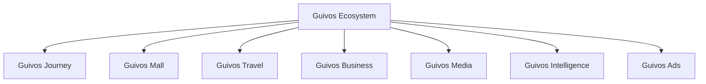

# Arquitetura de Produtos da Guivos — Estado Reconciliado 1.31.0

## Autoridade

Este overlay preserva integralmente a [Arquitetura de Produtos 1.30.0](index.md) e prevalece somente sobre estado, versão, prontidão e próxima frente.

## Estrutura oficial

## Arquitetura em camadas

- **Guivos Journey:** Experience Layer;
- **Guivos Intelligence:** Intelligence Layer;
- **Guivos Business, Mall, Travel, Media e Ads:** Service Layers;
- **Platform Layer:** identidade, autorização, persistência, eventos, APIs, integrações, segurança e observabilidade.

Nenhuma camada técnica redefine significado funcional ou autoridade normativa.

## Guivos Journey — estado vigente

| Elemento | Estado |
|---|---|
| PAS-001 | Active 1.0.0 |
| Estado canônico | Published |
| Mapa Final | Active 1.0.1 |
| Capacidades concluídas | Nove de nove |
| Contratos finais | Nove ativos em 1.0.0 |
| Extensões normativas | 54 vigentes |
| Lacuna bloqueante funcional | Nenhuma |
| Marco vigente | M5.10 |
| Frente operacional | Product Engineering |

## Capacidades

| Nº | Capacidade | Responsabilidade | Contrato final |
|---:|---|---|---|
| 01 | Captura de Contexto | Iniciar compreensão autorizada | [`PAS-001-CC-CONTRACT-001`](pas-001-captura-de-contexto-kpis-cenarios-contrato-final.md) |
| 02 | Contexto Vivo | Manter representação contextual atual | [`PAS-001-CV-CONTRACT-001`](pas-001-contexto-vivo-cenarios-contrato-final.md) |
| 03 | Objetivos | Governar direções assumidas | [`PAS-001-OBJ-CONTRACT-001`](pas-001-objetivos-kpis-cenarios-contrato-final.md) |
| 04 | Eventos de Vida | Governar mudanças relevantes | [`PAS-001-EV-CONTRACT-001`](pas-001-eventos-de-vida-kpis-cenarios-contrato-final.md) |
| 05 | Próximos Passos | Governar movimentos possíveis | [`PAS-001-PP-CONTRACT-001`](pas-001-proximos-passos-kpis-cenarios-contrato-final.md) |
| 06 | Oportunidades Ativas | Governar meios admissíveis | [`PAS-001-OA-CONTRACT-001`](pas-001-oportunidades-ativas-kpis-cenarios-contrato-final.md) |
| 07 | Intervenções Contextuais | Governar manifestação, espera ou silêncio | [`PAS-001-IC-CONTRACT-001`](pas-001-intervencoes-contextuais-kpis-cenarios-contrato-final.md) |
| 08 | Experiências | Governar aquilo que foi vivido | [`PAS-001-EXP-CONTRACT-001`](pas-001-experiencias-kpis-cenarios-contrato-final.md) |
| 09 | Evolução Contínua | Governar trajetórias de mudança | [`PAS-001-EC-CONTRACT-001`](pas-001-evolucao-continua-kpis-cenarios-contrato-final.md) |

## Próxima frente

> **`PAS-001-ENGINEERING-HANDOFF-001 — Handoff Arquitetural do Guivos Journey para Product Engineering`**

O Handoff deverá traduzir a arquitetura funcional em:

- agregados e autoridades de domínio;
- superfícies e componentes;
- comandos, eventos e schemas;
- persistência, busca e grafo;
- integrações;
- identidade, autorização, privacidade e segurança;
- observabilidade;
- estratégias de teste;
- dependências e ordem recomendada;
- protótipos, prontidão e backlog técnico.

## Regras da tradução técnica

- capacidade não equivale a tela;
- capacidade não equivale a microsserviço;
- ordem canônica não equivale a pipeline obrigatório;
- tecnologia não redefine conceito funcional;
- Intelligence apoia, mas não assume decisão;
- Platform sustenta, mas não assume autoridade normativa;
- conflito técnico com regra funcional retorna ao contrato competente;
- o Handoff não reabre automaticamente o `PAS-001`.
