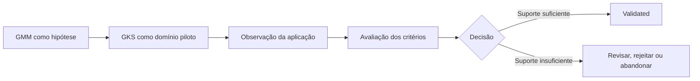

# Checkpoint M2.0 — Architectural Evolution Hypothesis

## Finalidade

Registrar o início da etapa experimental da Fase M2 e preservar, de forma rastreável, as hipóteses estruturantes relacionadas à evolução institucional do conhecimento na Guivos.

Este checkpoint não cria uma nova Canon, não altera a macroestrutura da GEA e não declara o Guivos Meta-Model ou o Guivos Knowledge System como componentes permanentes da organização.

## Contexto

O Baseline M1 consolidou os fundamentos arquiteturais e metodológicos existentes. Durante o início da Fase M2 surgiu uma hipótese adicional: a Guivos pode se beneficiar de um padrão explícito para conceber, estruturar, governar e evoluir domínios institucionais.

Essa hipótese recebeu o nome provisório de **Guivos Meta-Model — GMM**.

Também foi proposta a construção experimental do **Guivos Knowledge System — GKS**, concebido como sistema institucional para governar o ciclo de vida do conhecimento.

## Hipótese arquitetural

> Um metamodelo institucional explícito pode reduzir ambiguidades, melhorar consistência, tornar ativos reutilizáveis e facilitar a evolução de novos domínios da Guivos.

## Estado dos ativos

| Ativo | Classificação | Estado |
|---|---|---|
| Guivos Meta-Model — GMM | Architectural Meta-Hypothesis | Hypothesis |
| Guivos Knowledge System — GKS | Domínio piloto proposto | Hypothesis |
| Knowledge Validation Framework — GKVF | Componente candidato do GKS | Idea |
| Knowledge Validation Standards — KVS | Padrões candidatos | Idea |

Nenhum desses ativos integra a Canon neste checkpoint.

## Estratégia de validação

O GMM será testado por meio da construção experimental do GKS.



## Critérios de sucesso

O experimento deverá avaliar se o GMM:

1. reduz ambiguidades de escopo e responsabilidade;
2. evita duplicação de conceitos e artefatos;
3. melhora consistência entre fundamentos, arquitetura, governança, padrões e operação;
4. facilita rastreabilidade entre ativos;
5. reduz esforço de concepção do domínio piloto;
6. melhora compreensão por pessoas que não participaram da criação;
7. pode ser reutilizado sem impor complexidade desnecessária;
8. preserva as fronteiras entre Foundation, GEA, Research, Governance e GKR.

## Critérios de falha ou revisão

O GMM deverá ser revisado, reduzido ou rejeitado se:

- criar uma camada sem responsabilidade exclusiva;
- duplicar funções já pertencentes à GEA, Governance ou Knowledge Architecture;
- aumentar complexidade líquida sem benefício comprovado;
- exigir documentação desproporcional;
- dificultar, em vez de facilitar, a criação do GKS;
- produzir nomenclaturas artificiais sem utilidade prática.

## Ciclo institucional de evolução

O checkpoint adota experimentalmente o seguinte ciclo:

```text
Idea -> Hypothesis -> Experimental -> Validated -> Canonical -> Deprecated
```

### Definições

| Estado | Significado |
|---|---|
| Idea | Intuição inicial ainda não estruturada |
| Hypothesis | Proposição documentada e passível de avaliação |
| Experimental | Hipótese aplicada em um piloto controlado |
| Validated | Demonstrou utilidade prática dentro dos critérios definidos |
| Canonical | Tornou-se referência institucional aprovada |
| Deprecated | Foi substituída, rejeitada ou deixou de ser recomendada |

A progressão não é automática. Um ativo pode permanecer em qualquer estado, retornar para revisão ou ser abandonado.

## Princípio operacional

> Propor, experimentar, observar, avaliar e somente então consolidar.

## Relação com o Baseline M1

O Baseline M1 permanece congelado e não é alterado por este checkpoint.

O Checkpoint M2.0 registra hipóteses e um experimento posterior ao baseline. Ele não reclassifica ativos do M1 nem promove novos conceitos à Canon.

## Escopo do experimento inicial

A primeira aplicação deverá se limitar a:

1. definir o problema institucional que o GKS pretende resolver;
2. delimitar seu escopo e suas fronteiras;
3. explicitar relações com Research, GEA, Governance e GKR;
4. testar uma estrutura mínima derivada do GMM;
5. avaliar a aplicação usando os critérios deste checkpoint.

## Fora do escopo imediato

- criar uma nova arquitetura oficial da GEA;
- alterar a Foundation;
- promover GMM, GKS, GKVF ou KVS à Canon;
- construir um grafo de conhecimento;
- implementar software;
- substituir o RP-001 ou o Evidence Registry;
- criar novos padrões antes da validação do domínio piloto.

## Próxima decisão

A próxima decisão arquitetural deverá responder:

> O problema de governança do ciclo de vida do conhecimento justifica a criação experimental do GKS, e qual é a estrutura mínima necessária para testá-lo sem duplicar ativos existentes?

## Resultado esperado

Ao término do experimento, o GMM deverá receber uma das seguintes decisões:

- promover para `validated`;
- manter como `experimental` e revisar;
- reduzir o escopo;
- integrar partes a estruturas existentes;
- rejeitar ou descontinuar.
