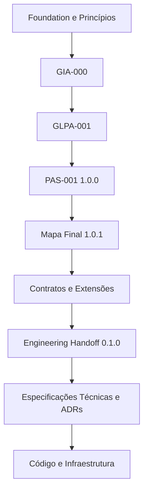

# Adendo Canônico — Journey Engineering Handoff

## 1. Autoridade

Este adendo atualiza o estado efetivo da Matriz de Consolidação Canônica para `1.32.0` sem substituir o inventário histórico e conceitual da matriz-base.

Prevalece apenas sobre:

- versão efetiva;
- estado da frente;
- marco vigente;
- artefato em elaboração;
- ponto de retomada.

## 2. Decisões consolidadas

| Conceito | Decisão | Situação canônica |
|---|---|---|
| Engineering Handoff | Manter | Autoridade derivada de tradução técnica |
| Unidade de Implementação de Capacidade — UIC | Introduzir | Estrutura padronizada para traduzir cada capacidade |
| Capacidade e microsserviço | Restringir | Não são conceitos equivalentes |
| Evento funcional e evento técnico | Restringir | Permanecem distintos |
| Ownership técnico | Refinar | Não equivale a autoridade funcional |
| Sistema de registro | Refinar | Preserva fatos reconhecidos dentro de autoridade e finalidade |
| Contextos técnicos candidatos | Introduzir | Não representam topologia final |
| Ondas de implementação | Introduzir | Ordem técnica recomendada, não jornada humana obrigatória |
| Foundation técnica da Onda 0 | Introduzir | Identidade, autorização, eventos, auditoria e padrões |
| Escolha tecnológica | Restringir | Depende de comparação e ADR |
| Produção | Restringir | Não autorizada pelo Handoff 0.1.0 |

## 3. Estado da arquitetura funcional

| Ativo | Estado |
|---|---|
| PAS-001 | Active 1.0.0 |
| Mapa Final | Active 1.0.1 |
| Contratos finais | 9 ativos em 1.0.0 |
| Extensões normativas | 54 vigentes |
| Capacidades | 9 de 9 Functionally complete |

Nenhum desses ativos é alterado pelo Handoff.

## 4. Estado da tradução técnica

| Ativo | Estado |
|---|---|
| Engineering Handoff | Draft 0.1.0 |
| UICs definidas como estrutura | 1 modelo geral |
| UICs detalhadas | 0 de 9 |
| Ondas técnicas | 0–6 estabelecidas |
| Lacunas iniciais | 9 registradas |
| Próxima UIC | UIC-01 — Captura de Contexto |

## 5. Relação de autoridade

Uma autoridade inferior não poderá corrigir ou redefinir silenciosamente uma autoridade superior.

## 6. Ponto exato de retomada

> Elaborar e submeter à aprovação a `UIC-01 — Captura de Contexto`, preservando `PAS-001-CC-CONTRACT-001` e as extensões `PAS-001-CC-*` como autoridades especializadas.