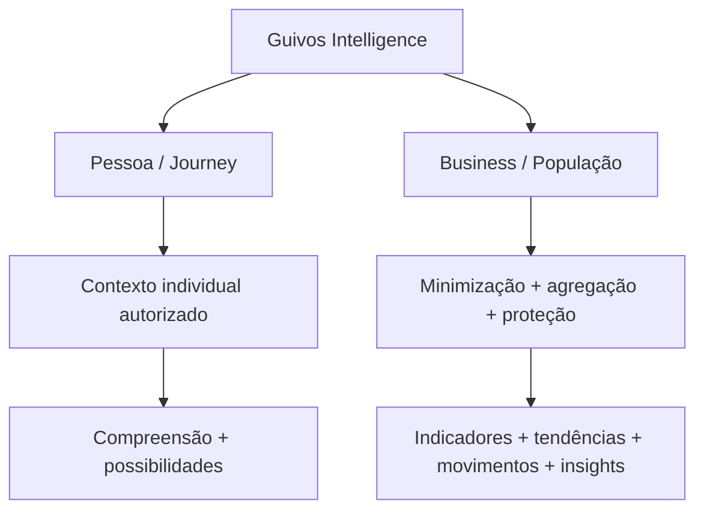

# Registro do Estado Atual

## 1. Autoridade

Este registro declara o estado global vigente do Guivos Knowledge Repository após a consolidação documental P1–P9, a reconciliação controlada da origem voluntária de Planos, a formalização dos Domínios de Evolução do Guivos Journey, a D5-C1 — contrato arquitetural das superfícies de direção, movimento e evolução da Pessoa —, a D5-C2 — materialização low-fidelity dessas três responsabilidades —, a D5-C3 — validação funcional/reformulação local dos três SVGs —, a D5-C4A — materialização e contrato integrado dos handoffs — e a D5-C4B — validação integrada individual de `TRN-008..013`.

A D5-C4B **não cria novo marco funcional, não inicia UXA-102, não retoma Engenharia de Produto e não altera inventário visual ou granular**. Ela promove individualmente `TRN-008..013` para `integralmente validada` no limite documental, após examinar origem, destino, autoridade, contexto mínimo, efeitos, retorno, interrupção, concorrência, idempotência e sensibilidade aplicável.

A frente pública evoluiu posteriormente com a convergência documental das oito Homes de Pessoa, Organizações e Coletivos, Guivos Mall, Guivos Travel, Guivos Media, Guivos Ads, Guivos Business e Guivos Intelligence; com a reconciliação do abastecimento editorial do Guivos Media; e com `GKR-UX-HOMES-DESIGN-HANDOFF-001` v1.3.0, que governa proceduralmente o handoff das oito Homes sem autorizar Engenharia ou publicação.

`GKR-HOME-DECISION-NO-WIREFRAME-001` permanece preservado como registro histórico da decisão pós-P5 de 2026-08-12, mas sua proibição procedimental de wireframe foi posteriormente **superada para a fase externa de Design** por `GKR-UX-HOMES-DESIGN-HANDOFF-001`. O handoff posterior prevalece nesse limite específico; as decisões semânticas, narrativas, funcionais e de produto das autoridades próprias de cada Home permanecem intactas. A existência dessa autorização procedimental não significa que tela, wireframe, UI, protótipo ou Design tenham sido produzidos nesta continuidade.

`GKR-UX-HOMES-DESIGN-DELIVERY-001` v4.0.0 governa a composição e a separação do pacote externo vigente de Design. A branch `delivery/design-handoff-v4` materializa o snapshot operacional vigente de distribuição com oito Homes; `delivery/design-handoff-v3`, `delivery/design-handoff-v2` e `delivery/design-handoff-v1` permanecem preservadas como emissões históricas. Nenhuma delas constitui fonte canônica paralela à `main`.

A autoridade de produto do Guivos Business está ressincronizada em `GPA-004` v1.6.0. A versão explicita o **formato vigente em duas ofertas principais — Programas de Incentivo e Guivos Journey custeado pela EMPRESA —**, preserva `Organização ≠ Guivos Business`, estabelece **Empresa** como ponto de partida do contrato Business, diferencia oferta, plano, escala, orçamento e serviço, formaliza as fronteiras de Pontos e Intelligence e mantém **Guivos Ads como produto totalmente distinto e comercialmente independente do Guivos Business**. A ressincronização corrige a leitura anterior de “jornadas corporativas”: a empresa pode custear o Guivos Journey existente, mas não criar, possuir ou controlar a Journey da pessoa.

A Home Pública do Guivos Business está **documentalmente convergida e apta ao handoff externo controlado**. A arquitetura narrativa, os contratos de autoridade, a conversão global v2, o Documento Mestre, o Source Lock semântico e o Source Lock Operacional + Prompt estão integrados. Business integra o handoff canônico v1.3.0 e a emissão externa v4, sem que qualquer output visual tenha sido produzido ou promovido automaticamente no GKR.

A autoridade de produto do Guivos Intelligence está consolidada em **`GPA-006 2.0.0`**. A edição encerra os Checkpoints 1–12 e governa identidade, duas frentes superiores — Pessoa/Journey e Business/População —, capacidades funcionais, Contexto Vivo, inputs, outputs, proveniência, proteção populacional, contratos interproduto, handoffs minimizados, arquiteturas tecnológicas subordinadas, modos de entrega, Intelligence Serving, direção comercial, governança, maturidade, gaps e guardrails. `GIA-000 1.5.0` reconcilia a relação entre autoridade de produto e Intelligence Architecture sem promover engines candidatos ou implementação física.

A cadeia pública da Home Intelligence também está agora convergida: `GKR-INTELLIGENCE-PRODUCT-SOURCELOCK-001 v1.0.0`, `GKR-UX-HOME-INTELLIGENCE-NARRATIVE-001 v0.2.1`, `GKR-UX-HOME-INTELLIGENCE-MASTER-001 v0.1.1`, `GKR-UX-HOME-INTELLIGENCE-SOURCELOCK-001 v1.0.0`, `GKR-UX-HOME-INTELLIGENCE-HANDOFF-001 v1.0.0` e `GKR-UX-HOME-INTELLIGENCE-GENINPUT-001 v1.0.0` estão integrados. Intelligence foi incorporada ao handoff v1.3.0 e ao snapshot externo v4. Essa convergência **não cria wireframe/UI/Design, não seleciona modelo de IA e não comprova Neo4j, GraphRAG, Power BI ou APIs operacionais**.

`GKR-CHRISTIAN-FOUNDATION-001 v1.0.0` está integrado como autoridade fundacional normativa da Guivos. O documento registra a essência cristã, o princípio **Evolução com propósito**, a base bíblica convergente e os guardrails entre fé, pessoa, produto, negócio e ação social. Sua finalidade é **interna de governança**, embora permaneça canonicamente armazenado no GKR público com `classification: public` e `authority_profile: public_foundational`. A acessibilidade pública do repositório não transforma essa doutrina em comunicação externa automática; qualquer reutilização externa exige decisão contextual própria.

Em caso de divergência, prevalece esta autoridade transversal e, dentro de cada domínio, a autoridade temática específica mais recente.

## 2. Estado global

| Elemento | Estado vigente |
|---|---|
| Era | GE-2 — Knowledge |
| Fundamento cristão e doutrina de propósito | **GKR-CHRISTIAN-FOUNDATION-001 v1.0.0 integrado; `Evolução com propósito`; uso interno de governança; armazenamento canônico no GKR; reutilização externa não automática** |
| Marco funcional | **M7.88 — saída consciente para fronteira externa validada** |
| Última frente funcional numerada | **UXA-101** |
| Reconciliação de Planos | **UXA-100-A4 — origem voluntária de Planos** |
| Journey — frente não numerada funcional mais recente | **D5-C4B — `TRN-008..013` integralmente validadas no limite documental** |
| Experience Architecture pública mais recente | **oito Homes convergidas e incluídas no handoff controlado; emissão externa v4 materializada** |
| Guivos Business — autoridade de produto | **GPA-004 v1.6.0 ressincronizado; duas ofertas principais: Programas de Incentivo + Guivos Journey custeado pela Empresa; Business distinto de Organização e independente de Ads** |
| Home Pública — Guivos Business | **arquitetura narrativa, autoridade, conversão v2, Documento Mestre e Source Locks convergidos; incluída no snapshot v4; output visual ainda não produzido no GKR** |
| Guivos Intelligence — autoridade de produto | **GPA-006 v2.0.0 convergido; Checkpoints 1–12 consolidados; GIA-000 v1.5.0 sincronizado; Product Source Lock v1.0.0 integrado** |
| Home Pública — Guivos Intelligence | **Narrative, Documento Mestre, Source Lock, Handoff e GENINPUT convergidos; incluída no snapshot v4; wireframe, UI, protótipo e Design não iniciados** |
| Próxima UXA | **UXA-102/V5 não iniciada** |
| Engenharia de Produto | pausada antes de W0-01 |
| Domínios de Evolução do Journey | **9 domínios canônicos + estado transversal “Ainda estou descobrindo”** |
| Registros granulares | **57 superfícies/estados/fronteiras e 66 transições** |
| Galeria visual | **121 SVGs — 121 validados / 0 pendentes** |
| Matriz por SVG | **121 associações / 34 perfis** |
| Jornadas principais | Pessoa, Coletivo e Organização permanecem `draft` |
| Home Pública — Pessoa | **Documento Mestre convergido; reconciliação pós-Media e Source Lock vigentes; incluída no handoff v4** |
| Home Pública — Organizações e Coletivos | **Documento Mestre convergido; P1–P5 preservados como histórico; Source Lock vigente; incluída no handoff v4** |
| Home Pública — Guivos Mall | **Documento Mestre convergido; reconciliação pós-Media e Source Lock vigentes; incluída no handoff v4** |
| Home Pública — Guivos Travel | **Documento Mestre convergido; reconciliação pós-Media e Source Lock vigentes; incluída no handoff v4** |
| Home Pública — Guivos Media | **Documento Mestre convergido; GPA-005 e Source Lock vigentes; incluída no handoff v4** |
| Home Pública — Guivos Ads | **Documento Mestre convergido; GPA-007 v1.3.0 e Source Lock vigentes; incluída no handoff v4** |
| Handoff das oito Homes | **GKR-UX-HOMES-DESIGN-HANDOFF-001 v1.3.0 ativo** |
| Entrega para Design | **GKR-UX-HOMES-DESIGN-DELIVERY-001 v4.0.0; 31 fontes canônicas + 8 guias operacionais no snapshot externo** |
| Snapshot externo v4 | **`delivery/design-handoff-v4` @ `dfed980d8cfb39bbe4694e58d7c86ca0692266dc`; tree `270e404cf0b5bf0d5d543bbbb0c5bd6a1f4602df`; 39 arquivos** |
| Snapshot externo v3 | **preservado em `delivery/design-handoff-v3` @ `7b2b20c035551e3b1206af987aaddda710757166`** |
| Snapshot externo v2 | **preservado em `delivery/design-handoff-v2` @ `486f1c5e784be6cf3db9b2fbcbc47da39f9e9016`** |
| Snapshot externo v1 | **preservado em `delivery/design-handoff-v1` @ `8e2a356ca84ba980e588258757800cde2a946f40`** |
| P1/P1.1 | integrado — semântica e nomenclaturas reconciliadas |
| P2 | integrado como arquitetura de referência — Neo4j `reference_selected` |
| P3 | governança integrada — fatos registrários/digitais dependem de evidência |
| P4 | método/gates integrados — resultado real de mercado não estabelecido |
| P5 | arquitetura institucional integrada — Fundação Guivos continua conceito, não entidade comprovada |
| P6 | arquitetura de privacidade/verdade operacional integrada — controles reais dependem de evidência |
| P7 | governança territorial integrada — Portugal permanece `T1_candidate` |
| P8 | sete Produtos Especializados rebaselineados; Intelligence posteriormente aprofundado em GPA-006 v2.0.0 |
| P9 | consolidação global e Public Canon em edição corrente |

## 3. Cobertura funcional e visual reconciliada

A D5-C4B altera somente a maturidade integrada de seis transições e preserva o inventário físico e granular:

- **121 SVGs** existentes e referenciados;
- **121 associações** individuais;
- **34 perfis** de rastreabilidade;
- **121 validações funcionais vigentes** de SVG;
- **0 pendentes** de validação específica de SVG;
- **45 de 57 IDs** granulares com referência visual;
- **10 responsabilidades** sem SVG dedicado;
- **2 fronteiras** sem tela por definição;
- **57 superfícies/estados/fronteiras**;
- **66 transições documentais**.

Entre as responsabilidades pessoais adicionadas/reconciliadas recentemente:

- `PER-008 — Hoje` mantém duas variantes; o estado recorrente foi reformulado e revalidado localmente pela D5-C4A;
- `PER-009 — Conta e configurações da Pessoa` permanece sem SVG;
- `PER-010 — Meus Objetivos` possui SVG D5-C2 reformulado e validado localmente pela D5-C3;
- `PER-011 — Meus Próximos Passos` possui SVG D5-C2 reformulado e validado localmente pela D5-C3;
- `PER-012 — Minha Evolução` possui SVG D5-C2 reformulado e validado localmente pela D5-C3.

A continuidade especializada passa a estar integralmente validada no limite documental:

```text
PER-008 — Hoje recorrente
├── TRN-008 → PER-010 → TRN-009 → PER-008
├── TRN-010 → PER-011 → TRN-011 → PER-008
└── TRN-012 → PER-012 → TRN-013 → PER-008
```

`TRN-008..013` estão **integralmente validadas** pela D5-C4B. Para `TRN-008`, `TRN-010` e `TRN-012`, a validação aplica-se ao estado recorrente de Hoje quando o affordance correspondente estiver presente e aplicável; a primeira variante de Hoje da UXA-097 não é obrigada a materializar esses acessos.

A promoção documental não comprova implementação técnica, roteamento real, persistência, cache, fila, telemetria ou produto em produção.

`TRN-406/407` permanecem contratadas. `TRN-417/418` e `TRN-427/428` continuam integralmente validadas no limite documental de navegação administrativa. As transições comerciais internas de Planos preservam suas maturidades anteriores.

A UXA-101 continua encerrando V4 em `BND-001`. Resultado executado por terceiro após essa fronteira não é presumido pela Guivos.

## 4. Participantes, planos, produtos e Domínios de Evolução

Participantes estruturais:

- Pessoa;
- Coletivo;
- Organização.

Taxonomia de planos:

- Pessoa: Free · Plus · Pro;
- Coletivo: Livre · Mobiliza · Impacta · Rede;
- Organização: Conecta · Eleva · Transforma;
- Guivos Business: Start · Growth · Scale · Enterprise.

Sete Produtos Especializados:

1. Guivos Journey;
2. Guivos Mall;
3. Guivos Travel;
4. Guivos Business;
5. Guivos Media;
6. Guivos Intelligence;
7. Guivos Ads.

### 4.1 Domínios de Evolução do Guivos Journey

`PAS-001-DOMAIN-MODEL-001` governa o baseline inicial de nove Domínios de Evolução:

1. Saúde e Bem-estar;
2. Trabalho, Carreira e Estudos;
3. Vida Financeira;
4. Empreendedorismo e Projetos;
5. Relacionamentos e Vida Social;
6. Espiritualidade, Propósito e Valores;
7. Viagens, Lazer, Cultura e Novas Experiências;
8. Causas, Voluntariado e Contribuição;
9. Organização e Equilíbrio da Vida.

`Ainda estou descobrindo` é estado transversal legítimo de exploração e **não** constitui décimo domínio. `Outra área` é mecanismo de extensibilidade e preservação da expressão original do participante.

Os domínios possuem interpretação específica para Pessoa, Coletivo e Organização. Uma trajetória pode envolver vários domínios simultaneamente.

Separações canônicas:

```text
Organização ≠ Guivos Business
Empresa no contrato Business ≠ novo tipo estrutural de participante
Guivos Business ≠ Guivos Ads
participante ≠ produto
plano ≠ mérito ou nível de evolução
custeio empresarial da Journey ≠ propriedade ou controle da Journey
Intelligence apoiando Business ≠ Intelligence como módulo Business
Guivos Intelligence ≠ Guivos Journey
pontos/benefícios ≠ relevância pessoal, mérito ou evolução
Parceria Estratégica ≠ Organização
Guivos Mall = nome canônico
Guivos Marketplace = alias histórico/migração
Domínio de Evolução ≠ identidade
Domínio de Evolução ≠ dimensão estrutural do Contexto Vivo
Domínio de Evolução ≠ aspecto descritivo da mudança
Domínio de Evolução ≠ Objetivo
Domínio de Evolução ≠ Próximo Passo
Domínio de Evolução ≠ score
Domínio de Evolução ≠ diagnóstico
Domínio de Evolução ≠ prova de evolução
```

A D5-C1 aplica essa separação prospectivamente à Experience Architecture de `Meus Objetivos`, `Meus Próximos Passos` e `Minha Evolução`. A D5-C2 a torna visualmente inspecionável, a D5-C3 valida/reformula o estado-base, a D5-C4A governa a navegação e a D5-C4B valida integralmente os seis handoffs sem transformar domínio ou contexto em decisão, prioridade, progresso ou evolução.

A UXA-100-A4 corrige no SVG de `ORG-001` o rótulo visual obsoleto `Guivos Business`, sem criar novo ativo. `BND-002` permanece fronteira genérica de contratação/dimensionamento assistido e não pertence semanticamente a um plano específico.

## 5. Go-to-Market e internacionalização

O GTM governa como baseline candidata:

```text
Belo Horizonte
→ São Paulo
→ amplificação nacional seletiva
→ Portugal / Lisboa
→ Portugal / Porto somente após gate
→ novo país europeu somente mediante novo gate
```

Portugal permanece `T1_candidate`.

Não estão comprovados por esta documentação:

- entidade/filial portuguesa;
- equipe local;
- contratos locais;
- IVA/OSS em operação;
- PSP europeu em produção;
- suporte internacional em produção;
- piloto Lisboa executado;
- Porto autorizado;
- segundo país europeu autorizado.

A governança territorial exige distinguir acesso internacional, pesquisa, readiness, piloto autorizado, piloto executado e mercado ativo.

## 6. Grafo, Journey e Intelligence

Neo4j é a tecnologia primária de referência para a camada de grafo.

```text
reference_selected
≠ POC
≠ provisioned
≠ integrated
≠ production
```

Não há autoridade suficiente para afirmar POC, cluster/Aura provisionado, dados pessoais reais no grafo, GDS em produção, GraphRAG implementado ou Power BI conectado.

`Grafo Global ≠ Guivos Intelligence ≠ Neo4j`.

Os Domínios de Evolução constituem vocabulário semântico canônico do Journey e podem orientar futura ontologia, classificação explicável e relações no Grafo Global. Isso **não** declara ontologia física, nós, relações, embeddings, pipelines ou dados implementados.

`GPA-006 2.0.0` consolida Guivos Intelligence como Produto Especializado transversal e Intelligence Layer com dois grandes eixos de valor:



Na frente Pessoa, a Intelligence pode compreender contexto autorizado e apoiar o Journey a revelar possibilidades relevantes sem assumir a decisão da Pessoa.

Na frente Business, Intelligence trabalha com **dados, interações e eventos legitimamente gerados ou conhecidos dentro do Ecossistema Guivos** e entrega leitura populacional agregada e protegida. A Empresa pode combinar essas saídas com seus KPIs internos em seu próprio ambiente analítico. O Intelligence Business não depende de importar bases internas completas da empresa nem utiliza comparação interna antes/depois como atalho para provar causalidade.

A arquitetura preserva:

```text
COMPREENDER ≠ DECIDIR
CONHECER ≠ UTILIZAR ≠ COMPARTILHAR
PERSONALIZAR ≠ EXPOR
DECLARADO ≠ OBSERVADO ≠ INFERIDO ≠ PREDITO
CORRELAÇÃO ≠ CAUSALIDADE
ENTITLEMENT ≠ AUTORIDADE
MAIOR PLANO ≠ MENOR PRIVACIDADE
INFERÊNCIA DA IA ≠ FATO
TECNOLOGIA ≠ PRODUTO
PERCEBER ANTES ≠ PREVER O FUTURO
```

`GIA-000 1.5.0` mantém CIE, LPM, GPMA e família de Intelligence Engines como candidatos técnicos/arquiteturais. Não existe autoridade suficiente para declarar arquitetura física, engines implementados, modelo de IA selecionado, MLOps, serving técnico, APIs ou ontologia física.

A materialização/validação documental de `PER-010..012`, o contrato D5-C4A, a validação integrada D5-C4B, a convergência do GPA-006 e a convergência documental da Home Intelligence não declaram rotas, banco, APIs, eventos, grafo físico ou Intelligence operacional implementados.

## 7. Marca, naming e ativos digitais

```text
nome canônico
≠ marca registrada
≠ domínio controlado
≠ DNS operacional
≠ serviço em produção
```

O GKR governa naming e estados de evidência, mas não presume titularidade, proteção territorial, domínio adquirido ou controle técnico específico sem prova própria. Segredos, credenciais, recovery codes, chaves, tokens e inventário operacional sensível permanecem fora do corpus público.

## 8. Validação de mercado

VAL-001–010 constituem o sistema metodológico B2C inicial.

Parâmetros governados incluem questionário VAL-002 2.1.0 com 19 perguntas, pré-teste previsto de 10–15 participantes, mínimo de 200 respostas válidas para decisão inicial e meta preferencial de 500.

As áreas utilizadas no instrumento de pesquisa contribuíram para o baseline semântico dos Domínios de Evolução. Essa promoção arquitetural **não transforma a existência da pergunta ou das opções em resultado de pesquisa, preferência de mercado ou evidência de eficácia**.

```text
método definido
≠ instrumento aplicado
≠ base válida
≠ KPI calculado
≠ decisão de mercado
≠ product-market fit
```

Neste checkpoint não existe evidência integrada suficiente para declarar PMF, disposição a pagar, retenção, recorrência ou resultado real da pesquisa.

## 9. Incentivos

`GEM-005-A1` estabelece **Propósito Antes do Incentivo**.

Pontos, créditos, saldo, streak ou ranking não podem substituir evolução, autonomia ou valor legítimo como objetivo da experiência. `GPA-004` reconhece arquiteturalmente o Programa de Pontos do Guivos Business como capacidade de benefício empresarial, com equivalência econômica previamente validada preservada, mas isso **não comprova carteira, token, cashback ou operação financeira em produção**.

No Business, a empresa pode financiar/carregar um orçamento de pontos. A concessão à pessoa já constitui consumo/alocação do orçamento empresarial; o uso posterior pelo participante é evento distinto. O saldo empresarial distingue **carregado, concedido e disponível**; neste contexto, `concedido` representa a alocação/consumo do orçamento empresarial, enquanto `utilizado` fica reservado ao uso posterior realizado pela pessoa. A leitura de **onde os pontos foram efetivamente utilizados** considera somente usos realizados pelas pessoas, fecha 100% entre Mall, Travel e Journey e exclui pontos não utilizados ou expirados dessa distribuição percentual.

Pontos Business não pagam plano do Journey. Journey permanece voluntário e com seus planos normais; pontos podem ser usados somente em possibilidades pagas elegíveis e não alteram pertinência, recomendação, prioridade, `Next Step`, confiança, impacto, conclusão editorial ou exposição publicitária.

A terminologia **VALOR DE IMPACTO LIBERADO** descreve valor disponibilizado a uma ação e não constitui impacto realizado, impacto comprovado ou prova de evolução.

O modelo de Domínios de Evolução reforça que contribuição, espiritualidade, saúde, finanças, relacionamentos ou organização não podem ser convertidos em ranking moral, score humano ou competição por “nível de evolução”.

`PER-012 — Minha Evolução` permanece explicitamente incompatível com placar global, roda da vida obrigatória ou percentual geral da Pessoa. A D5-C3 reforça período, baseline, natureza da interpretação, confiança e incerteza em vez de score.

### 9.1 Fundamento cristão e doutrina de propósito

`GKR-CHRISTIAN-FOUNDATION-001 v1.0.0` governa o fundamento cristão e a doutrina de propósito da Guivos sob o princípio **Evolução com propósito**.

A autoridade preserva como formulação central que a Guivos **não transforma pessoas**. Seu papel é ampliar condições, percepção, acesso, conexão e possibilidades para que cada pessoa possa fazer escolhas e viver experiências capazes de contribuir para sua própria transformação; como organização de essência cristã, a Guivos espera que essa evolução aconteça com propósito e possa aproximar as pessoas de Deus.

A base bíblica é convergente e complementar, organizada pelas dimensões **Crescer, Direcionar, Despertar, Desenvolver, Discernir e Reconhecer**, sem reduzir a doutrina a um único versículo isolado.

A finalidade do documento é interna:

```text
primary_use = internal_governance
classification = public
authority_profile = public_foundational
repository_storage = GKR
external_reuse_automatic = false
```

A distinção é obrigatória:

```text
USO INTERNO ≠ CLASSIFICAÇÃO internal
ACESSIBILIDADE PÚBLICA ≠ DESTINAÇÃO PÚBLICA
PRESENÇA NO GKR ≠ AUTORIZAÇÃO DE USO EXTERNO
FÉ ≠ MECANISMO DE CONVERSÃO COMERCIAL
AMPLIAR POSSIBILIDADES ≠ DECIDIR PELA PESSOA
```

A integração desta autoridade não altera produto, Home, UX, Design, implementação, jornada funcional, marco M7.88 ou fila UXA. Também não autoriza automaticamente exposição religiosa em superfícies públicas.

## 10. Arquitetura institucional e Fundação Guivos

`Fundação Guivos` permanece:

```text
conceito institucional social validado
+ nome de trabalho
≠ forma jurídica escolhida
≠ entidade constituída
≠ CNPJ/registro comprovado
≠ operação social própria comprovada
```

F0–F9 governam a eventual progressão do conceito até uma operação institucional evidenciada. A forma jurídica permanece `unresolved`.

## 11. Privacidade, consentimentos e verdade operacional

P6 estabelece:

```text
aceite contratual ≠ consentimento LGPD ≠ preferência voluntária
arquitetura de privacidade ≠ conformidade operacional comprovada
política em draft ≠ política publicada
controle projetado ≠ controle implementado ≠ controle evidenciado
```

Não são presumidos como operacionais: Termos publicados, Aviso/Política de Privacidade vigente, consentimentos, centro de preferências, inventário de cookies/SDKs, Encarregado formalmente indicado, fluxo de direitos, incident response LGPD ou dados pessoais em produção no grafo.

Domínios que envolvam saúde, condição emocional, espiritualidade/religião, finanças, emprego, família, sexualidade, vulnerabilidade ou outras informações sensíveis exigem finalidade, minimização, autoridade e proteção reforçada.

A D5-C3 valida documentalmente que os estados-base preservam minimização, contestação e controles de privacidade. A D5-C4A acrescenta que a navegação não transporta automaticamente domínio sensível, interpretação, evidência, conteúdo clínico/financeiro/religioso ou autorização ampliada. A D5-C4B valida integralmente esse limite documental para `TRN-012/013`, sem comprovar controles técnicos ou operacionais. Títulos neutros, ocultação de área/domínio sensível, dispositivo compartilhado e autenticação reforçada continuam dependentes de materializações específicas quando aplicáveis. `domain_link` sensível não constitui autorização adicional de tratamento.

No Guivos Business, vínculo empresarial, custeio de Journey, concessão de benefício ou participação em programa não ampliam automaticamente a finalidade nem autorizam exposição do contexto pessoal protegido à empresa contratante.

`GPA-006 2.0.0` reforça Privacy by Architecture na Intelligence Layer: profundidade de compreensão não equivale a profundidade de exposição; dados individualmente utilizados para servir a própria Pessoa não se tornam automaticamente outputs Business, Ads, treinamento de modelo ou datasets exportáveis. Thresholds operacionais, técnicas de proteção e controles de enforcement continuam dependentes de autoridades próprias e evidência.

## 12. Public Canon

`GOG-001 — Guia Oficial da Guivos` é a única superfície institucional classificada como `public-canon` neste domínio documental.

O Public Canon traduz autoridades do GKR para linguagem pública e deve distinguir claramente:

- visão e disponibilidade real;
- arquitetura e implementação;
- preço/plano candidato e oferta vigente;
- expansão planejada e mercado ativo;
- conceito institucional e entidade constituída;
- privacidade por design e controles efetivamente publicados/operacionais.

A página pública de Arquitetura do Guivos Journey explicita os nove Domínios de Evolução e exemplos de como a Guivos pode apoiar jornadas nesses domínios, preservando os guardrails do `PAS-001-DOMAIN-MODEL-001`.

D5-C4B é uma autoridade interna de Experience Architecture e não, por si só, autoriza declaração pública de disponibilidade de produto. Validação documental integrada ≠ tela implementada.

`GPA-006 2.0.0` é autoridade de Produto Especializado e não, por si só, autoriza oferta operacional, pricing, IA em produção, dashboard, API, GraphRAG ou benchmark real. A existência posterior da Home Pública e do handoff v4 também não comprova implementação ou publicação.

`GKR-CHRISTIAN-FOUNDATION-001` é autoridade fundacional de **uso interno de governança**. Sua presença no GKR público não o promove automaticamente a Public Canon, copy institucional, campanha, produto ou comunicação externa. Qualquer reutilização externa de seu conteúdo exige decisão contextual própria.

Nenhum texto público pode promover estado superior ao evidenciado nas autoridades internas.

### 12.1 Homes públicas, Media, Ads e handoff para Design

Oito Homes públicas estão convergidas documentalmente para o handoff controlado:

1. Pessoa;
2. Organizações e Coletivos;
3. Guivos Mall;
4. Guivos Travel;
5. Guivos Media;
6. Guivos Ads;
7. Guivos Business;
8. Guivos Intelligence.

Cada Home mantém autoridade própria de narrativa e finalidade. O Guivos Media possui autoridade editorial e pode abastecer outras superfícies com conteúdo sem adquirir autoridade sobre a finalidade, narrativa ou operação dessas superfícies.

A relação transversal do Media distingue:

```text
DISTRIBUIÇÃO
→ onde o conteúdo Media é publicado

ABASTECIMENTO EDITORIAL
→ material Media utilizado dentro da narrativa de outra superfície

CONTINUIDADE CONTEXTUAL
→ descoberta editorial conduzindo, quando pertinente, a outra capacidade do ecossistema
```

Guivos Ads possui autoridade comercial publicitária e postura funcional transversal. Os produtos anfitriões preservam autoridade sobre sua finalidade e experiência; Ads governa a relação publicitária, o inventário permitido, a identificação e a mensuração dentro dos contratos vigentes. Opportunity Boost permanece mecanismo do Ads, não definição integral do produto. A qualificação comercial inteligente pode utilizar respostas declaradas e contexto comercial autorizado sem transformar contexto pessoal protegido dos participantes em matéria-prima publicitária.

`GKR-UX-HOMES-DESIGN-HANDOFF-001` v1.3.0 governa a fase externa de Design das oito Homes. Essa autorização procedimental **não** equivale a execução de Design, implementação, publicação, Marketing/GTM ou promoção automática do output a estado canônico. Nesta continuidade, nenhuma tela, wireframe, UI ou protótipo foi criado.

Os Source Locks específicos limitam cada exploração futura ao contexto da respectiva Home. Ferramentas externas não possuem autoridade para redefinir arquitetura, produto ou significado.

`GKR-UX-HOMES-DESIGN-DELIVERY-001` v4.0.0 governa o pacote externo vigente. A emissão v4 utiliza 31 fontes canônicas congeladas, separadas por Home, mais oito guias operacionais `LEIA-PRIMEIRO`, totalizando 39 arquivos de entrega.

A branch `delivery/design-handoff-v4`, commit `dfed980d8cfb39bbe4694e58d7c86ca0692266dc`, tree `270e404cf0b5bf0d5d543bbbb0c5bd6a1f4602df`, materializa esse snapshot para distribuição. Ela é **artefato externo reproduzível**, não nova fonte de verdade e não deve ser mesclada na `main` como duplicação das fontes canônicas.

A emissão v3 permanece preservada em `delivery/design-handoff-v3`, commit `7b2b20c035551e3b1206af987aaddda710757166`; a emissão v2 permanece preservada em `delivery/design-handoff-v2`, commit `486f1c5e784be6cf3db9b2fbcbc47da39f9e9016`; a emissão v1 permanece preservada em `delivery/design-handoff-v1`, commit `8e2a356ca84ba980e588258757800cde2a946f40`.

### 12.2 Reconciliação canônica do Guivos Business

`GPA-004` v1.6.0 consolida a autoridade superior do Guivos Business e explicita o formato funcional já validado.

A separação central é:

```text
ORGANIZAÇÃO
= participante estrutural do ecossistema

EMPRESA
= ponto de partida do contrato comercial específico do Business

GUIVOS BUSINESS
= produto especializado B2B

GUIVOS ADS
= produto especializado de publicidade e exposição comercial paga
```

O formato vigente possui duas ofertas principais:

```text
GUIVOS BUSINESS
├── PROGRAMAS DE INCENTIVO
└── GUIVOS JOURNEY CUSTEADO PELA EMPRESA
```

Pontos Guivos, Guivos Intelligence, integrações/eventos, transações/liquidação e governança apoiam essas ofertas sem se tornarem automaticamente novas famílias comerciais.

Business e Ads podem ser contratados pela mesma empresa, porém permanecem relações comerciais independentes. Ads não é módulo, capacidade, componente, benefício de plano ou subsistema do Business; Business não opera inventário ou campanha publicitária em nome do Ads.

A empresa pode estruturar Programas de Incentivo para públicos elegíveis e pode custear o acesso ao **Guivos Journey existente**. Não existe nesta arquitetura Journey para Empresas, Journey Business, Journey Corporativo, Journey Patrocinado ou Journey criada/controlada pela empresa. O custeio não transfere controle da Journey nem acesso ao contexto pessoal protegido. Journey permanece voluntário; pontos Business não pagam plano e não compram pertinência. O uso efetivo dos pontos pode ocorrer em possibilidades pagas elegíveis de Mall, Travel e Journey.

A arquitetura Business diferencia **oferta, plano, escala, orçamento pré-pago e serviço**. Os planos Start, Growth, Scale e Enterprise governam profundidade de capacidade, Intelligence, integração, governança, escala e serviço; não determinam mérito ou qual das duas ofertas a empresa pode contratar.

Guivos Intelligence apoia o Business utilizando dados/eventos gerados na própria Guivos. A empresa pode combinar externamente essas saídas com seus indicadores internos; a Guivos não precisa importar bases corporativas para produzir o Intelligence Business e não deve usar comparações internas antes/depois para inferir causalidade automaticamente.

A Home Pública do Guivos Business está documentalmente convergida. `GKR-UX-HOME-BUSINESS-NARRATIVE-001`, `GKR-UX-HOME-BUSINESS-AUTHORITY-001`, `GKR-UX-HOME-BUSINESS-CONVERSION-002`, `GKR-UX-HOME-BUSINESS-MASTER-001`, `GKR-UX-HOME-BUSINESS-SOURCELOCK-001` e `GKR-UX-HOME-BUSINESS-GENINPUT-001` governam sua narrativa, fronteiras, conversão, Documento Mestre e inputs de Design. Pontos permanecem capacidade funcional do produto, porém foram deliberadamente retirados da narrativa pública da Home. A contratação pública vigente é online; `Self-service`, `Com apoio do suporte` e `Gerenciado` são modelos de implementação/operação. Business integra o handoff de Design v1.3.0 e o snapshot externo v4; nenhum output visual é promovido automaticamente a autoridade canônica.

### 12.3 Reconciliação canônica do Guivos Intelligence

`GPA-006 2.0.0` permanece a autoridade superior do Produto Especializado Guivos Intelligence.

Sua unidade de valor é **compreensão útil e contextualizada**.

A arquitetura reconhece um núcleo transversal e duas frentes superiores:

```text
PESSOA / JOURNEY
→ contexto individual autorizado
→ compreensão e possibilidades relevantes
→ decisão permanece com a Pessoa

BUSINESS / POPULAÇÃO
→ minimização + agregação + proteção
→ indicadores, tendências, movimentos e insights
→ decisão empresarial permanece com a Empresa
```

O produto reconhece responsabilidades de contexto, conhecimento, relações, compreensão, relevância, possibilidades, agregação, insights/tendências, explicabilidade, aprendizado governado e Intelligence Serving.

Graph, Knowledge, Analytics e AI são arquiteturas/capacidades subordinadas. Neo4j, modelos de IA, embeddings e Power BI são tecnologias ou consumidores possíveis. Guivos.ai permanece possível superfície conversacional. Nenhum desses elementos redefine a identidade do produto.

O modelo comercial de alto nível preserva Intelligence predominantemente embutido para a Pessoa e capacidades progressivas do Intelligence dentro dos entitlements Business, sem transformar Intelligence em módulo do Business. Oferta B2B autônoma do Intelligence permanece candidato futuro.

A Home Pública do Intelligence está documentalmente convergida. A cadeia vigente combina Product Source Lock, Narrative Contract, Documento Mestre, Home Source Lock, Design Handoff e GENINPUT. Intelligence integra o handoff comum v1.3.0 e o snapshot externo v4. A Home preserva 11 movimentos funcionais, explicabilidade, autonomia, proteção populacional e os contratos `INTELLIGENCE ≠ JOURNEY`, `INTELLIGENCE ≠ BUSINESS`, `SINAL ≠ CERTEZA`, `TENDÊNCIA ≠ DESTINO` e `PERCEBER ANTES ≠ PREVER O FUTURO`. Nenhuma tela, wireframe, UI, protótipo ou Design foi produzido por essa convergência.

## 13. Programa P0–P9

O programa amplo de ressincronização documental está **consolidado** quanto aos pacotes temáticos previstos:

- P0 — intake/evidência: preservado;
- P1/P1.1 — semântica/nomenclatura: integrado;
- P2 — tecnologia/grafo: integrado como referência;
- P3 — marca/naming/ativos: integrado;
- P4 — validação de mercado: integrado como método/gates;
- P5 — institucional/jurídico: integrado como arquitetura/gates;
- P6 — operação/privacidade/legal: integrado como arquitetura/gates;
- P7 — internacionalização: integrado como programa territorial/gates;
- P8 — Produtos Especializados: integrado, com aprofundamento posterior do Intelligence em `GPA-006 2.0.0`;
- P9 — estado global/Public Canon: consolidado por `GKR-P9-GLOBAL-CONSOLIDATION-001`.

**Encerramento documental não significa encerramento das lacunas operacionais.** Itens dependentes de evidência permanecem abertos em seus domínios próprios.

## 14. Fila funcional

| Família | Estado |
|---|---|
| V1 — compreensão inicial → Tela Hoje | encerrada pela UXA-097 |
| V2 — publicação → descoberta/mapa/lista/detalhe | encerrada pela UXA-098 |
| V3 — estados residuais Opportunity Boost | encerrada pela UXA-099 |
| Planos — identidade/promoção canônica | encerrada pela UXA-100-A3 |
| Planos — origem voluntária e retorno | identidade encerrada pela UXA-100-A4; PER-009 ainda sem materialização |
| Journey — Domínios de Evolução | baseline canônico + D4 propagado + D5-A/B materializados em superfícies existentes |
| D5-C1 — direção, movimento e evolução | PER-010..012 + TRN-008..013 contratados |
| D5-C2 — low-fidelity das três superfícies | PER-010..012 materializados |
| D5-C3 — validação funcional local | PER-010..012 reformulados e validados |
| D5-C4A — contrato/materialização dos handoffs | Hoje recorrente reformulado/revalidado; contexto mínimo e proteção dos seis handoffs governados |
| D5-C4B — validação integrada dos handoffs | **TRN-008..013 integralmente validadas; lacuna específica D5-C encerrada no limite documental** |
| V4 — efeito externo de oportunidades | encerrada pela UXA-101 até BND-001 |
| V5 — erros, retornos e interrupções | **pendente; não iniciada** |

D5-C1/C2/C3/C4A/C4B não são V5 e não alteram a numeração UXA.

A evolução das Homes públicas e o handoff de Design são frentes de Experience Architecture separadas da fila UXA funcional acima e não alteram M7.88 nem iniciam UXA-102. As oito Homes atualmente convergidas estão organizadas no Design Delivery v4, mas a existência desse pacote não inicia materialização visual nesta continuidade.

A ressincronização do Guivos Business continua sendo atualização de autoridade de produto separada da fila UXA. A Home Business também percorreu frente própria de Experience Architecture até Documento Mestre, Source Lock, autorização procedimental de handoff e inclusão na emissão v4, sem alterar M7.88 ou iniciar UXA-102.

A convergência do Guivos Intelligence em `GPA-006 2.0.0` e a posterior convergência de sua Home Pública também são frentes separadas da fila UXA. Elas não criam superfície, transição, SVG, UXA ou marco funcional por esta sincronização.

A integração e sincronização global do Fundamento Cristão também constituem frente de governança fundacional separada da fila UXA. Elas não criam superfície, transição, SVG, UXA, produto, Design ou marco funcional.

## 15. Preservações finais

- M7.88 permanece o marco funcional;
- UXA-101 permanece a última frente funcional numerada;
- UXA-100-A4 permanece reconciliação de Planos e não inicia UXA-102;
- D5-C4B permanece a frente funcional não numerada mais recente do Journey;
- UXA-102/V5 não foi iniciada;
- Engenharia de Produto permanece pausada antes de W0-01;
- Pessoa, Coletivo e Organização permanecem jornadas `draft`;
- nove Domínios de Evolução estão governados como vocabulário do Journey;
- “Ainda estou descobrindo” não é décimo domínio;
- classificação de domínio por IA não está declarada como operacional;
- ontologia de grafo física não está declarada como implementada;
- `PER-010..012` permanecem validados localmente como superfícies;
- `TRN-008..013` estão integralmente validadas documentalmente e isso não equivale a implementação;
- a primeira variante de Hoje não é obrigada a expor os handoffs especializados;
- materialização, validação, promoção, implementação e operação são estados distintos;
- P1–P5 da Home de Organizações e Coletivos permanecem histórico válido;
- `GKR-HOME-DECISION-NO-WIREFRAME-001` permanece histórico, mas está `superseded` quanto à proibição procedimental de wireframe na fase externa de Design;
- `GKR-UX-HOMES-DESIGN-HANDOFF-001` v1.3.0 governa a autorização procedimental vigente de handoff das oito Homes;
- handoff autorizado ≠ Design produzido ≠ output canônico ≠ implementação ≠ publicação;
- cada Home mantém finalidade, narrativa e autoridade próprias;
- Media pode abastecer editorialmente outra superfície sem adquirir autoridade sobre ela;
- Ads pode comercializar oportunidades publicitárias legítimas sem adquirir autoridade funcional sobre a superfície anfitriã;
- `delivery/design-handoff-v4` é o snapshot externo vigente e não é fonte canônica paralela;
- `delivery/design-handoff-v3`, `delivery/design-handoff-v2` e `delivery/design-handoff-v1` permanecem preservados como snapshots históricos;
- Home Guivos Ads está convergida documentalmente, mas operação publicitária, pricing, inventário, formulário inteligente e Intelligence operacional não são presumidos;
- Guivos Business permanece distinto da participação de Organização;
- a arquitetura comercial Business parte da Empresa sem criar novo tipo global de participante;
- Guivos Business possui duas ofertas principais: Programas de Incentivo e Guivos Journey custeado pela Empresa;
- Guivos Ads permanece produto totalmente distinto e independente do Guivos Business;
- capacidade Business ≠ investimento publicitário;
- custeio empresarial da Journey ≠ propriedade, controle ou acesso ao contexto pessoal protegido da Journey;
- Journey permanece voluntário; pontos Business não pagam plano nem compram pertinência;
- Programa de Pontos ≠ identidade do Business ≠ medida de evolução;
- Pontos permanecem fora da narrativa pública da Home Business;
- a equivalência econômica de pontos já validada permanece preservada e não é reaberta por esta reconciliação;
- distribuição de uso de pontos considera somente usos efetivos e fecha 100% entre Mall, Travel e Journey, excluindo não utilizados/expirados da distribuição percentual;
- `VALOR DE IMPACTO LIBERADO` ≠ impacto realizado ≠ impacto comprovado;
- Intelligence apoiando Business ≠ Intelligence como módulo Business ≠ acesso irrestrito a dados pessoais;
- Intelligence Business usa dados/eventos gerados na Guivos; combinação com KPIs internos ocorre no ambiente analítico da empresa;
- Home Business: narrativa + autoridade + conversão v2 + Documento Mestre + Source Lock + Prompt operacional convergidos; inclusão no v4 ≠ output visual aprovado;
- contratação Business pública vigente = online; `Self-service / Com apoio do suporte / Gerenciado` = modelos de implementação/operação;
- `GPA-006 2.0.0` está convergido como autoridade de Produto Especializado, não como prova de implementação;
- duas frentes do Intelligence = Pessoa/Journey + Business/População;
- profundidade de compreensão ≠ profundidade de exposição;
- entitlement ≠ autoridade;
- relação comercial ≠ relevância pessoal;
- Guivos Intelligence ≠ Journey ≠ Business;
- Guivos Intelligence ≠ IA ≠ Guivos.ai ≠ Grafo Global ≠ Neo4j ≠ Power BI;
- Intelligence Serving está consolidado conceitualmente, não implementado tecnicamente;
- CIE, LPM, GPMA e família de Intelligence Engines permanecem candidatos técnicos/arquiteturais;
- Neo4j permanece `reference_selected`, não POC/provisioned/production;
- GraphRAG permanece padrão candidato, não implementação comprovada;
- oferta B2B autônoma do Intelligence não está estabelecida;
- Home Pública do Intelligence está documentalmente convergida e incluída no snapshot v4;
- Product Source Lock, Narrative, Documento Mestre, Home Source Lock, Handoff e GENINPUT do Intelligence permanecem autoridades distintas e preservadas;
- `PERCEBER ANTES ≠ PREVER O FUTURO` permanece guardrail explícito;
- tela, wireframe, UI, protótipo e Design da Home Intelligence não foram iniciados nesta continuidade;
- `GKR-CHRISTIAN-FOUNDATION-001 v1.0.0` permanece autoridade fundacional normativa da Guivos;
- o Fundamento Cristão possui finalidade interna de governança e armazenamento canônico no GKR;
- `classification: public` ≠ finalidade pública; `authority_profile: public_foundational` ≠ Public Canon;
- presença da doutrina no GKR ≠ autorização automática de uso em Home, campanha, produto ou comunicação externa;
- `Evolução com propósito` permanece princípio interno fundacional;
- essência cristã ≠ proselitismo oculto; fé ≠ mecanismo comercial;
- ampliar possibilidades ≠ decidir pela pessoa;
- a integração do Fundamento Cristão não inicia UI, Design, implementação ou nova frente funcional;
- projeção não é realizado;
- preço não é disposição a pagar;
- capital não é receita;
- valuation interno não é laudo/oferta/promessa;
- recompensa não compra evolução;
- internacionalização planejada não é mercado ativo;
- nenhuma etapa autoriza automaticamente a seguinte.

## 16. Próximo ato governado

A sincronização global do `GKR-CHRISTIAN-FOUNDATION-001` fecha a lacuna entre a autoridade fundacional integrada e o Registro do Estado Atual. O fundamento cristão passa a estar representado transversalmente como autoridade normativa de **uso interno de governança**, preservando seu armazenamento canônico no GKR e a regra de que reutilização externa não é automática.

Esta sincronização **não inicia Home, UI, wireframe, protótipo, Design, implementação, Engenharia de Produto, campanha ou comunicação religiosa externa**.

A sincronização global pós-v4 fecha o ato documental necessário para que o estado transversal volte a representar o estado real do repositório. O Design Delivery v4 está materializado e registrado, porém isso **não inicia qualquer tela, wireframe, UI, protótipo ou exploração visual**.

Para o Guivos Business, a cadeia documental permanece concluída e preservada no snapshot v4. Nenhuma materialização visual é iniciada por este registro.

Para o Guivos Intelligence, a cadeia de Produto + Product Source Lock + Narrative + Documento Mestre + Home Source Lock + Handoff + GENINPUT está concluída e incorporada ao snapshot v4. O próximo movimento não é inferido automaticamente; qualquer frente visual ou técnica futura exige autorização própria e deve preservar todas essas autoridades.

D6, D7, materialização de `PER-009`, maturidade das transições internas de Planos, integrações patrocinadas, cobrança real, processo posterior a `BND-002`, UXA-102/V5 e Product Engineering permanecem frentes separadas e exigem autorização própria. Nenhuma é iniciada automaticamente.

Para Guivos Ads, os próximos atos possíveis continuam dependentes de autorização própria. A existência do Documento Mestre, do Source Lock e da inclusão no v4 **não** autoriza campanhas reais, pricing público, inventário vendável, checkout, painel do anunciante, segmentação pessoal ou implementação de Intelligence.
