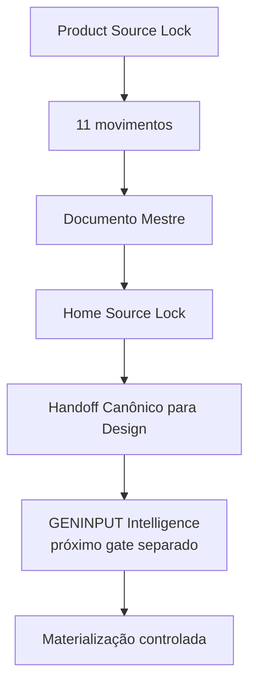

# Checkpoint de Continuidade — Home Pública Guivos Intelligence v1 — Handoff Canônico

## 1. Finalidade

Este checkpoint preserva o ponto exato da construção da **Home Pública Guivos Intelligence v1** após a integração conceitual da arquitetura pública, do Documento Mestre e do Home Source Lock, e após a criação do **Handoff Canônico para Design** neste pacote.

Estado de autoridade:

```text
GPA-006 v2.0.0
→ AUTORIDADE SUPERIOR DO PRODUTO

GKR-INTELLIGENCE-PRODUCT-SOURCELOCK-001 v1.0.0
→ PRODUCT SOURCE LOCK

GKR-UX-HOME-INTELLIGENCE-NARRATIVE-001 v0.2.1
→ ARQUITETURA NARRATIVA EM 11 MOVIMENTOS
→ COPY DE REFERÊNCIA CORRIGIDA

GKR-UX-HOME-INTELLIGENCE-MASTER-001 v0.1.1
→ DOCUMENTO MESTRE

GKR-UX-HOME-INTELLIGENCE-SOURCELOCK-001 v1.0.0
→ HOME SOURCE LOCK
→ NORMATIVO

GKR-UX-HOME-INTELLIGENCE-HANDOFF-001 v1.0.0
→ HANDOFF CANÔNICO PARA DESIGN
→ NORMATIVO
```

## 2. Baseline do Handoff

O Handoff foi preparado sobre o estado reconciliado:

```text
main
43a8b0b07c6b7fe6690f422dc26844d0e22c5ea8

PR #288
GKR: congelar Source Lock da Home Intelligence v1
→ merged

HOME SOURCE LOCK
GKR-UX-HOME-INTELLIGENCE-SOURCELOCK-001 v1.0.0
→ active
→ normative: true
```

A `main` utilizada como base já contém o Home Source Lock vigente. Este pacote não promove estado global, maturidade tecnológica, implementação ou publicação.

## 3. Estado conceitual consolidado

```text
MOVIMENTOS 01–11
→ CONVERGIDOS

MOVIMENTO 12
→ NÃO PREVISTO

DOCUMENTO MESTRE
→ CONVERGIDO E INTEGRADO

COPY DE REFERÊNCIA
→ CORRIGIDA E INTEGRADA

HOME SOURCE LOCK
→ INTEGRADO

HANDOFF CANÔNICO PARA DESIGN
→ CRIADO NESTE PACOTE

GENINPUT INTELLIGENCE
→ NÃO INICIADO NESTE PACOTE

WIREFRAME / UI / PROTÓTIPO
→ NÃO INICIADOS

IMPLEMENTAÇÃO
→ NÃO AUTORIZADA
```

## 4. Centro semântico preservado

Unidade de valor:

> **compreensão útil e contextualizada.**

Ideia-mãe:

> **Compreender melhor amplia o que você consegue perceber.**

Pergunta-mãe:

> **O que se torna possível quando você compreende melhor o que está acontecendo?**

Apoio inicial:

> **Entenda melhor o que está acontecendo. Amplie o que você consegue perceber.**

Autonomia:

> **Veja mais antes de decidir.**

Fechamento:

> **Perceba antes o que começa a mudar. Enxergue além do que já está evidente.**

> **Novas possibilidades podem se tornar mais visíveis.**

## 5. CTAs preservados

CTA principal:

> **Veja o que suas informações podem mostrar**

CTA secundário:

> **Conheça o Guivos Intelligence**

Os CTAs não autorizam promessa de futuro conhecido, decisão certa, diagnóstico, certeza ou resultado empresarial comprovado.

## 6. Arquitetura preservada no Handoff

```text
01 — ABRIR A POSSIBILIDADE
02 — CRIAR A NECESSIDADE
03 — DEFINIR O VALOR
04 — MOSTRAR OS RESULTADOS
05 — DEMONSTRAR OS RESULTADOS
06 — EXPLICAR A FORMAÇÃO
07 — MOSTRAR UTILIDADE
08 — CONSTRUIR CONFIANÇA
09 — PRESERVAR AUTONOMIA
10 — APROFUNDAR RELAÇÕES
11 — AMPLIAR O HORIZONTE
```

Separações obrigatórias:

```text
M03
→ DEFINE POR QUE INTELLIGENCE EXISTE

M10
→ APROFUNDA POR QUE AS RELAÇÕES IMPORTAM

M04
→ MOSTRA O QUE O INTELLIGENCE PERMITE PERCEBER

M05
→ DEMONSTRA COMO ESSA PERCEPÇÃO GANHA FORMA
```

Os onze movimentos continuam sendo funções semânticas. O Handoff permite agrupamento visual, mas não remoção de função.

## 7. Contrato de materialização

Regra introduzida pelo Handoff:

> **DESIGN RECEBE AUTORIDADE DE MATERIALIZAÇÃO ≠ AUTORIDADE DE REDEFINIÇÃO**

Design pode decidir composição, grid, quantidade física de seções, tipografia, mídia, iconografia, cards, tratamento de KPIs e gráficos, responsividade, motion, progressive disclosure e agrupamento visual dos movimentos.

Design não recebe autoridade para alterar produto, unidade de valor, promessa, fronteiras, privacidade, autonomia, causalidade, maturidade, claims, evidências, pricing, arquitetura técnica ou estado global do GKR.

## 8. Duas frentes preservadas

### Pessoa / Journey

> **Entenda melhor por que determinadas informações, recomendações ou possibilidades podem aparecer em determinado contexto.**

```text
INTELLIGENCE
→ produz compreensão

JOURNEY
→ governa a experiência

PESSOA
→ escolhe
```

### Business / população

> **Compreenda padrões, mudanças e movimentos em populações de forma agregada e protegida.**

```text
INTELLIGENCE
→ produz leitura populacional

BUSINESS
→ governa a relação empresarial

EMPRESA
→ decide
```

A Empresa não recebe Intelligence individual por funcionário nem acesso à intimidade individual da Journey.

## 9. Tecnologia e visual

Graph, IA, Neo4j, GraphRAG, Power BI, Guivos.ai, dashboards e APIs permanecem subordinados ao valor do produto.

O Handoff não cria seção tecnológica obrigatória.

Visualizações analíticas podem demonstrar conexões, repetições, mudanças, relações, sinais ganhando força, contexto, origem de leitura, incerteza e limites.

```text
VISUAL ANALÍTICO ≠ DASHBOARD COMO PRODUTO
EXEMPLO CONCEITUAL ≠ DADO OPERACIONAL REAL
VISUAL EXPLICATIVO ≠ PROVA DE RESULTADO
TECNOLOGIA ≠ PRODUTO
```

## 10. Guardrails preservados

```text
INFORMAÇÃO ≠ COMPREENSÃO
COMPREENDER ≠ DECIDIR
INTELLIGENCE ≠ JOURNEY
INTELLIGENCE ≠ BUSINESS
CONHECER ≠ UTILIZAR ≠ COMPARTILHAR
DECLARADO ≠ OBSERVADO ≠ INFERIDO ≠ PREDITO
PERSONALIZAR ≠ EXPOR
CORRELAÇÃO ≠ CAUSALIDADE
RELAÇÃO ≠ CAUSA
PADRÃO ≠ CAUSA
MOVIMENTO ≠ DIAGNÓSTICO
SINAL ≠ CERTEZA
TENDÊNCIA ≠ DESTINO
INFERÊNCIA ≠ FATO
MAIS DADOS ≠ MELHOR INTELLIGENCE
RESULTADO ESPERADO ≠ RESULTADO COMPROVADO
PERCEBER ANTES ≠ PREVER O FUTURO
POSSIBILIDADE ≠ RESULTADO GARANTIDO
RECOMENDAÇÃO ≠ ORDEM
```

## 11. Preservações globais

Esta frente não altera:

- `M7.88`;
- `UXA-101` como última UXA numerada;
- `UXA-102/V5`, que permanece não iniciada;
- Product Engineering, que permanece pausada antes de W0-01;
- maturidade tecnológica do Guivos Intelligence;
- status de Neo4j como referência, não operação comprovada;
- ausência de GraphRAG/GDS/Power BI/Guivos.ai operacionais comprovados;
- ausência de pricing final e oferta B2B autônoma vigente;
- `GKR-STATE-001 2.39.0` e `ROADMAP-12.81.0` como último snapshot global até sincronização transversal autorizada.

Não há promoção silenciosa de estado global por este pacote.

## 12. Próximo ponto exato

Após a integração deste Handoff Canônico, retomar exatamente em:

> **Home Pública Guivos Intelligence v1 — GENINPUT Intelligence — PR B.**

Escopo do próximo gate:

```text
HOME SOURCE LOCK
→ HANDOFF CANÔNICO PARA DESIGN
→ GENINPUT INTELLIGENCE
→ MATERIALIZAÇÃO CONTROLADA
```

O GENINPUT deve traduzir o Handoff para o formato operacional da etapa ou ferramenta de Design escolhida sem redefinir a Home.

```text
GENINPUT TRADUZ O HANDOFF
≠
REDEFINE A HOME
```

O GENINPUT está explicitamente **fora deste pacote**. Sua criação exige PR separada e autorização correspondente.

Também permanecem não iniciados por este pacote:

- execução em Figma Make ou outra ferramenta generativa;
- wireframe;
- UI;
- protótipo;
- implementação;
- publicação.



Nenhuma etapa autoriza automaticamente a seguinte.
