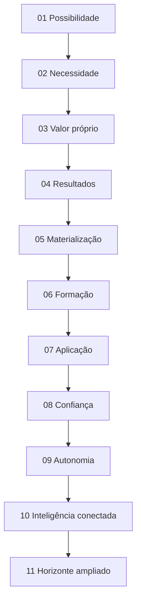
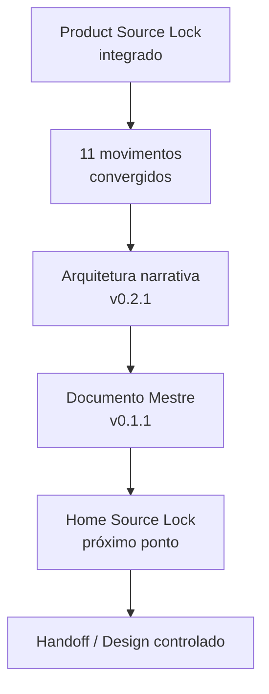

# Checkpoint de Continuidade — Home Pública Guivos Intelligence v1 — 11 Movimentos, Documento Mestre e Correção Editorial

## 1. Finalidade

Este checkpoint preserva o ponto exato da construção da **Home Pública Guivos Intelligence v1** após:

- integração de `GPA-006 2.0.0`;
- integração do `GKR-INTELLIGENCE-PRODUCT-SOURCELOCK-001 1.0.0`;
- integração do princípio `GKR-UX-HOMES-OUTCOME-001 1.0.0`;
- convergência dos Movimentos 01–11;
- encerramento da arquitetura narrativa em onze movimentos;
- criação do Documento Mestre;
- identificação e correção da divergência editorial entre a copy aprovada em conversa e a copy registrada na primeira edição do Documento Mestre.

A autoridade superior de produto continua sendo `GPA-006 2.0.0`.

A porta de entrada normativa para a Home continua sendo `GKR-INTELLIGENCE-PRODUCT-SOURCELOCK-001 1.0.0`.

Após esta correção, a arquitetura da Home deve ser lida em `GKR-UX-HOME-INTELLIGENCE-NARRATIVE-001 0.2.1`.

O Documento Mestre da Home deve ser lido em `GKR-UX-HOME-INTELLIGENCE-MASTER-001 0.1.1`.

## 2. Baseline antes desta correção

A correção editorial parte exatamente de:

```text
main
c1356369f0345a0c9411d51ceb8e16159738756e

PR ANTERIOR
#286 — GKR: consolidar Documento Mestre da Home Intelligence v1
→ merged

ARQUITETURA DA HOME
GKR-UX-HOME-INTELLIGENCE-NARRATIVE-001 0.2.0

DOCUMENTO MESTRE
GKR-UX-HOME-INTELLIGENCE-MASTER-001 0.1.0

CHECKPOINT DE CONTINUIDADE
GKR-INTELLIGENCE-HOME-CONTINUITY-001 1.1.0
```

A PR #286 consolidou corretamente os onze movimentos e o Documento Mestre, mas preservou em alguns pontos formulações editoriais anteriores que já haviam sido substituídas por versões mais claras em conversa.

A correção atual é **editorial e de consistência**, não uma reabertura conceitual.

## 3. Estado conceitual atual

```text
HOME PÚBLICA GUIVOS INTELLIGENCE v1
→ ARQUITETURA CONCEITUAL COMPLETA

MOVIMENTOS 01–11
→ CONVERGIDOS

QUANTIDADE FINAL DE MOVIMENTOS
→ 11

MOVIMENTO 12
→ NÃO PREVISTO NESTA ARQUITETURA

ARQUITETURA NARRATIVA
→ GKR-UX-HOME-INTELLIGENCE-NARRATIVE-001 0.2.1
→ COPY DE REFERÊNCIA CORRIGIDA

DOCUMENTO MESTRE
→ GKR-UX-HOME-INTELLIGENCE-MASTER-001 0.1.1
→ COPY DE REFERÊNCIA CORRIGIDA

HOME SOURCE LOCK
→ NÃO CRIADO

DESIGN / UI / PROTÓTIPO
→ NÃO INICIADOS NESTE FLUXO
```

## 4. Natureza da correção editorial

A correção preserva integralmente:

- os onze movimentos;
- a ordem narrativa;
- `GPA-006` como autoridade superior;
- o Product Source Lock;
- `GKR-UX-HOMES-OUTCOME-001`;
- `INTELLIGENCE ≠ JOURNEY`;
- `INTELLIGENCE ≠ BUSINESS`;
- `COMPREENDER ≠ DECIDIR`;
- explicabilidade;
- autonomia;
- privacidade e assimetria de exposição;
- papel subordinado da tecnologia;
- guardrails de não previsão, não causalidade e não diagnóstico.

A correção altera somente **como esses significados são traduzidos para linguagem pública**.

Regra editorial consolidada:

> **Primeiro mostre o que a pessoa consegue enxergar. Depois explique como o Intelligence torna isso possível.**

## 5. Formulações de referência corrigidas

### Movimento 01 — Possibilidade

Pergunta-mãe preservada:

> **O que se torna possível quando você compreende melhor o que está acontecendo?**

Expressão de apoio corrigida:

> **Entenda melhor o que está acontecendo. Amplie o que você consegue perceber.**

A palavra “possibilidades” deixa de ser antecipada na abertura e ganha maior força no fechamento aspiracional.

### Movimento 02 — Necessidade

> **Ter mais informação não significa entender melhor.**

Supporting corrigido:

> **O que faz diferença é conseguir juntar informações que estão espalhadas e entender o que elas mostram quando vistas em conjunto.**

### Movimento 03 — Valor próprio

> **Entenda o que informações isoladas não conseguem mostrar.**

Supporting corrigido:

> **Guivos Intelligence conecta informações que, separadas, mostram apenas parte da história — ajudando você a perceber relações, padrões e mudanças que antes poderiam passar despercebidos.**

Expressão funcional corrigida:

> **Veja como as informações se conectam. Perceba o que se repete. Entenda o que está mudando.**

### Movimento 04 — Resultados

Função fixada:

```text
MOVIMENTO 04
→ MOSTRA OS RESULTADOS
```

Formulações:

> **Veja o que está conectado.**

> **Perceba o que se repete.**

> **Entenda o que está mudando.**

> **Veja o que começa a ganhar força.**

### Movimento 05 — Materialização

Função fixada:

```text
MOVIMENTO 05
→ DEMONSTRA OS RESULTADOS
```

Headline preservada:

> **Veja o que você não enxergaria olhando cada informação separadamente.**

Correção para sinais emergentes:

> **Perceba quando algo que parecia isolado começa a se repetir e ganhar força.**

KPIs, comparações, contexto, relações e leituras pertencem prioritariamente à demonstração deste movimento.

### Movimento 06 — Formação

Headline corrigida:

> **Informações fazem mais sentido quando você consegue enxergar o contexto ao redor delas.**

Supporting corrigido:

> **Guivos Intelligence observa informações em conjunto, considera o contexto em que elas existem e busca relações que ajudem você a interpretá-las melhor.**

### Movimento 08 — Confiança

Headline corrigida:

> **Não veja apenas a conclusão. Entenda de onde ela veio.**

Sequência pública:

```text
O que foi observado?
O que mudou?
Quais informações foram consideradas?
Como elas podem estar relacionadas?
O que é fato?
O que é interpretação?
Até onde essa leitura pode ir?
```

### Movimento 09 — Autonomia

Headline preservada:

> **Veja mais antes de decidir.**

Supporting corrigido:

> **Guivos Intelligence pode mostrar relações, comparar informações e explicar leituras. A decisão continua com você — ou com quem tem autoridade para tomá-la.**

### Movimento 10 — Inteligência conectada

Função diferenciada do Movimento 03:

```text
MOVIMENTO 03
→ DEFINE O VALOR PRÓPRIO DO INTELLIGENCE

MOVIMENTO 10
→ APROFUNDA POR QUE AS RELAÇÕES IMPORTAM
```

Headline corrigida:

> **Uma informação pode mostrar mais quando você entende com o que ela se relaciona.**

Supporting corrigido:

> **Guivos Intelligence não olha apenas informações isoladas. Ele considera como acontecimentos, contextos e informações podem estar relacionados para construir uma leitura mais completa.**

Guardrail:

```text
RELAÇÃO
≠
CAUSA
```

### Movimento 11 — Horizonte ampliado

Headline preservada:

> **Perceba antes o que começa a mudar. Enxergue além do que já está evidente.**

Supporting corrigido:

> **Ao perceber relações, repetições e mudanças com mais contexto, você pode reconhecer sinais mais cedo e ampliar o que consegue considerar.**

Fechamento:

> **Novas possibilidades podem se tornar mais visíveis.**

Guardrail central:

```text
PERCEBER ANTES
≠
PREVER O FUTURO
```

## 6. Duas frentes — redação corrigida

### Pessoa / Journey

> **Entenda melhor por que determinadas informações, recomendações ou possibilidades podem aparecer em determinado contexto.**

```text
INTELLIGENCE
→ produz compreensão

JOURNEY
→ governa a experiência

PESSOA
→ escolhe
```

### Business / população

> **Compreenda padrões, mudanças e movimentos em populações de forma agregada e protegida.**

```text
INTELLIGENCE
→ produz leitura populacional

BUSINESS
→ governa a relação empresarial

EMPRESA
→ decide
```

Essas formulações reconhecem as duas frentes sem converter a Home Intelligence em Home Journey ou Business.

## 7. Mapa final da arquitetura



A arquitetura não exige onze seções visuais equivalentes. Os movimentos são funções semânticas que podem ser agrupadas no Design posterior sem perder significado ou ordem narrativa.

## 8. Guardrails preservados

```text
CONHECER ≠ UTILIZAR ≠ COMPARTILHAR
DECLARADO ≠ OBSERVADO ≠ INFERIDO ≠ PREDITO
PERSONALIZAR ≠ EXPOR
COMPREENDER ≠ DECIDIR
PADRÃO ≠ CAUSA
RELAÇÃO ≠ CAUSA
MOVIMENTO ≠ DIAGNÓSTICO
INFERÊNCIA ≠ FATO
CORRELAÇÃO ≠ CAUSALIDADE
PAGAMENTO ≠ RELEVÂNCIA
ENTITLEMENT ≠ AUTORIDADE
PLANO SUPERIOR ≠ MENOS PRIVACIDADE
RESULTADO ESPERADO ≠ RESULTADO COMPROVADO
SINAL ≠ CERTEZA
TENDÊNCIA ≠ DESTINO
```

A Empresa recebe compreensão populacional autorizada e protegida; não recebe a intimidade individual da Journey.

## 9. Diretriz visual preservada

A Home Intelligence pode utilizar representações de:

- KPIs;
- indicadores;
- mini gráficos;
- comparações;
- tendências;
- padrões;
- movimentos;
- cards analíticos;
- organogramas;
- fluxos;
- sequências;
- redes conceituais;
- escadas de interpretação.

Esses elementos devem demonstrar **o tipo de leitura**, **a sequência de compreensão**, **a relação entre sinais** ou **o resultado esperado**.

A separação funcional deve ser preservada:

```text
M04
→ apresenta o que passa a ser percebido

M05
→ demonstra essas leituras de forma tangível
```

Não usar elementos analíticos apenas como decoração nem confundi-los com wireframe, dashboard operacional ou prova de implementação.

## 10. Documento Mestre corrigido

`GKR-UX-HOME-INTELLIGENCE-MASTER-001 0.1.1` passa a ser a leitura mestre desta Home antes do Home Source Lock.

Ele consolida:

- autoridade de origem;
- intenção própria da Home;
- regra editorial pública;
- proposta de valor;
- pergunta-mãe;
- copy de referência corrigida;
- os onze movimentos;
- as duas frentes superiores;
- explicabilidade e autonomia;
- horizonte ampliado;
- papel subordinado da tecnologia;
- diretrizes visuais;
- guardrails;
- itens ainda não congelados;
- critério de passagem para a próxima etapa.

O Documento Mestre não substitui `GPA-006` nem o Product Source Lock.

## 11. O que permanece aberto

Ainda não estão congelados:

- Home Source Lock;
- CTA principal;
- CTA secundário;
- microcopy final;
- formulação final da pergunta-mãe, caso o Source Lock exija refinamento semântico sem alterar intenção;
- ordem visual final;
- quantidade final de exemplos de KPI;
- dados reais versus exemplos conceituais;
- profundidade da apresentação pública de Graph/AI;
- composição visual final das duas frentes;
- wireframe;
- UI;
- protótipo;
- Design Handoff.

Esses itens não reabrem automaticamente os onze movimentos convergidos.

## 12. Preservações globais

Esta frente não altera:

- `M7.88`;
- `UXA-101` como última UXA numerada;
- `UXA-102/V5`, que permanece não iniciada;
- Product Engineering, que permanece pausada antes de W0-01;
- inventários de superfícies, transições ou SVGs;
- o handoff externo v3 das sete Homes anteriores;
- maturidade tecnológica do Guivos Intelligence;
- status de Neo4j como referência, não operação comprovada;
- ausência de GraphRAG/GDS/Power BI/Guivos.ai operacionais comprovados;
- ausência de pricing final e oferta B2B autônoma vigente.

## 13. Estado global e roadmap

`GKR-STATE-001 2.39.0` e `ROADMAP-12.81.0` permanecem como último snapshot global até uma próxima sincronização transversal autorizada.

Não há promoção silenciosa de versão global por esta correção editorial.

## 14. Próximo ponto exato

Após a integração desta correção, retomar exatamente em:

> **Home Pública Guivos Intelligence v1 — elaboração do Home Source Lock.**

Estado esperado:

```text
ARQUITETURA NARRATIVA
→ COMPLETA EM 11 MOVIMENTOS
→ v0.2.1

DOCUMENTO MESTRE
→ v0.1.1

CORREÇÃO EDITORIAL
→ CONCLUÍDA

HOME SOURCE LOCK
→ PRÓXIMO PONTO
→ NÃO CRIADO

HANDOFF / DESIGN
→ BLOQUEADO ATÉ ETAPA AUTORIZADA
```

## 15. Sequência preservada



Nenhuma etapa autoriza automaticamente a seguinte.
