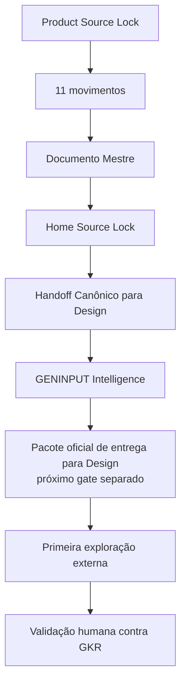

# Checkpoint de Continuidade — Home Pública Guivos Intelligence v1 — GENINPUT emitido

## 1. Finalidade

Este checkpoint preserva o ponto exato da construção da **Home Pública Guivos Intelligence v1** após:

- arquitetura narrativa convergida;
- Documento Mestre integrado;
- Home Source Lock integrado;
- navegação da Home integrada ao Guivos Knowledge Repository;
- Handoff Canônico para Design integrado;
- emissão do **GENINPUT Intelligence** neste pacote.

Estado de autoridade:

```text
GPA-006 v2.0.0
→ AUTORIDADE SUPERIOR DO PRODUTO

GKR-INTELLIGENCE-PRODUCT-SOURCELOCK-001 v1.0.0
→ PRODUCT SOURCE LOCK

GKR-UX-HOME-INTELLIGENCE-NARRATIVE-001 v0.2.1
→ ARQUITETURA NARRATIVA EM 11 MOVIMENTOS

GKR-UX-HOME-INTELLIGENCE-MASTER-001 v0.1.1
→ DOCUMENTO MESTRE

GKR-UX-HOME-INTELLIGENCE-SOURCELOCK-001 v1.0.0
→ HOME SOURCE LOCK
→ NORMATIVO

GKR-UX-HOME-INTELLIGENCE-HANDOFF-001 v1.0.0
→ HANDOFF CANÔNICO PARA DESIGN
→ NORMATIVO

GKR-UX-HOME-INTELLIGENCE-GENINPUT-001 v1.0.0
→ SOURCE LOCK OPERACIONAL DA PRIMEIRA EXPLORAÇÃO
→ NORMATIVO
```

## 2. Baseline do GENINPUT

O GENINPUT foi preparado sobre o estado reconciliado:

```text
main
43ed02030dc03600ce756ce63ea55bd3e742f910

PR #289
GKR: ativar Handoff de Design da Home Intelligence v1
→ merged

HANDOFF
GKR-UX-HOME-INTELLIGENCE-HANDOFF-001 v1.0.0
→ active
→ normative: true
```

O checkpoint acima é a fonte temporal do GENINPUT. A criação do GENINPUT não altera produto, maturidade tecnológica, implementação, pricing ou estado global do GKR.

## 3. Estado consolidado

```text
MOVIMENTOS 01–11
→ CONVERGIDOS

MOVIMENTO 12
→ NÃO PREVISTO

DOCUMENTO MESTRE
→ CONVERGIDO E INTEGRADO

COPY DE REFERÊNCIA
→ CORRIGIDA E INTEGRADA

HOME SOURCE LOCK
→ INTEGRADO

NAVEGAÇÃO NO GKR
→ INTEGRADA

HANDOFF CANÔNICO PARA DESIGN
→ INTEGRADO

GENINPUT INTELLIGENCE
→ EMITIDO NESTE PACOTE

WIREFRAME / UI / PROTÓTIPO
→ NÃO INICIADOS

PRIMEIRA EXPLORAÇÃO EXTERNA
→ NÃO INICIADA

IMPLEMENTAÇÃO
→ NÃO AUTORIZADA
```

## 4. Contratos centrais preservados

Unidade de valor:

> **compreensão útil e contextualizada.**

Ideia-mãe:

> **Compreender melhor amplia o que você consegue perceber.**

Pergunta-mãe:

> **O que se torna possível quando você compreende melhor o que está acontecendo?**

Apoio inicial:

> **Entenda melhor o que está acontecendo. Amplie o que você consegue perceber.**

Autonomia:

> **Veja mais antes de decidir.**

Fechamento:

> **Perceba antes o que começa a mudar. Enxergue além do que já está evidente.**

> **Novas possibilidades podem se tornar mais visíveis.**

Contratos:

```text
INFORMAÇÃO ≠ COMPREENSÃO
COMPREENDER ≠ DECIDIR
DESIGN RECEBE AUTORIDADE DE MATERIALIZAÇÃO ≠ AUTORIDADE DE REDEFINIÇÃO
GENINPUT TRADUZ O HANDOFF ≠ REDEFINE A HOME
```

## 5. CTAs congelados

CTA principal:

> **Veja o que suas informações podem mostrar**

CTA secundário:

> **Conheça o Guivos Intelligence**

Os CTAs não autorizam promessa de futuro conhecido, decisão certa, diagnóstico, certeza ou resultado empresarial comprovado.

## 6. Arquitetura preservada

```text
01 — ABRIR A POSSIBILIDADE
02 — CRIAR A NECESSIDADE
03 — DEFINIR O VALOR
04 — MOSTRAR OS RESULTADOS
05 — DEMONSTRAR OS RESULTADOS
06 — EXPLICAR A FORMAÇÃO
07 — MOSTRAR UTILIDADE
08 — CONSTRUIR CONFIANÇA
09 — PRESERVAR AUTONOMIA
10 — APROFUNDAR RELAÇÕES
11 — AMPLIAR O HORIZONTE
```

Separações obrigatórias:

```text
M03
→ DEFINE POR QUE INTELLIGENCE EXISTE

M10
→ APROFUNDA POR QUE AS RELAÇÕES IMPORTAM

M04
→ MOSTRA O QUE O INTELLIGENCE PERMITE PERCEBER

M05
→ DEMONSTRA COMO ESSA PERCEPÇÃO GANHA FORMA
```

Os onze movimentos continuam sendo funções semânticas, não obrigação de onze seções físicas.

## 7. Papel do GENINPUT

O `GKR-UX-HOME-INTELLIGENCE-GENINPUT-001 v1.0.0`:

- fixa o checkpoint exato da `main` utilizado como fonte;
- define o pacote mínimo de documentos entregues à ferramenta;
- traduz as invariantes do Handoff em instruções operacionais;
- congela copy e CTAs necessários à primeira exploração;
- registra liberdades reais de Design;
- proíbe inferências sobre claims, tecnologia, dados, maturidade e autoridade;
- define placeholders permitidos;
- inclui prompt controlado;
- exige autoauditoria e validação humana.

O GENINPUT não cria:

- UI;
- wireframe;
- protótipo;
- claim;
- tecnologia;
- integração;
- evidência;
- decisão de produto.

## 8. Direção de experiência registrada

Expressão operacional:

> **clareza emergindo da complexidade.**

Transformações de referência:

```text
DISPERSÃO → RELAÇÃO
RUÍDO → PADRÃO
ESTADO → MUDANÇA
SINAL → MOVIMENTO PERCEPTÍVEL
NÚMERO → CONTEXTO
CONCLUSÃO → EXPLICAÇÃO
INFORMAÇÃO → COMPREENSÃO
```

A primeira percepção deve ser de ampliação de compreensão, e não de IA, dashboard, grafo ou plataforma analítica genérica.

## 9. Duas frentes preservadas

### Pessoa / Journey

> **Entenda melhor por que determinadas informações, recomendações ou possibilidades podem aparecer em determinado contexto.**

```text
INTELLIGENCE → produz compreensão
JOURNEY → governa a experiência
PESSOA → escolhe
```

### Business / população

> **Compreenda padrões, mudanças e movimentos em populações de forma agregada e protegida.**

```text
INTELLIGENCE → produz leitura populacional
BUSINESS → governa a relação empresarial
EMPRESA → decide
```

A Empresa não recebe Intelligence individual por funcionário nem acesso à intimidade individual da Journey.

## 10. Tecnologia e exemplos

IA, Graph, Neo4j, GraphRAG, Power BI, Guivos.ai, dashboards e APIs permanecem subordinados ao valor do produto.

O GENINPUT não cria seção tecnológica obrigatória.

Exemplos analíticos permanecem conceituais até prova em contrário.

```text
VISUAL ANALÍTICO ≠ DASHBOARD COMO PRODUTO
EXEMPLO CONCEITUAL ≠ DADO OPERACIONAL REAL
VISUALIZAÇÃO ≠ CLAIM COMPROVADO
TECNOLOGIA ≠ PRODUTO
```

## 11. Guardrails preservados

```text
INFORMAÇÃO ≠ COMPREENSÃO
COMPREENDER ≠ DECIDIR
INTELLIGENCE ≠ JOURNEY
INTELLIGENCE ≠ BUSINESS
CONHECER ≠ UTILIZAR ≠ COMPARTILHAR
DECLARADO ≠ OBSERVADO ≠ INFERIDO ≠ PREDITO
PERSONALIZAR ≠ EXPOR
CORRELAÇÃO ≠ CAUSALIDADE
RELAÇÃO ≠ CAUSA
PADRÃO ≠ CAUSA
MOVIMENTO ≠ DIAGNÓSTICO
SINAL ≠ CERTEZA
TENDÊNCIA ≠ DESTINO
INFERÊNCIA ≠ FATO
MAIS DADOS ≠ MELHOR INTELLIGENCE
RESULTADO ESPERADO ≠ RESULTADO COMPROVADO
PERCEBER ANTES ≠ PREVER O FUTURO
POSSIBILIDADE ≠ RESULTADO GARANTIDO
RECOMENDAÇÃO ≠ ORDEM
```

## 12. Preservações globais

Esta frente não altera:

- `M7.88`;
- `UXA-101` como última UXA numerada;
- `UXA-102/V5`, que permanece não iniciada;
- Product Engineering, que permanece pausada antes de W0-01;
- maturidade tecnológica do Guivos Intelligence;
- status de Neo4j como referência, não operação comprovada;
- ausência de GraphRAG/GDS/Power BI/Guivos.ai operacionais comprovados;
- ausência de pricing final e oferta B2B autônoma vigente;
- `GKR-STATE-001 2.39.0` e `ROADMAP-12.81.0` como último snapshot global até sincronização transversal autorizada.

Não há promoção silenciosa de estado global por este pacote.

## 13. Próximo ponto exato

Após a integração do GENINPUT, retomar exatamente em:

> **Home Pública Guivos Intelligence v1 — pacote oficial de entrega para Design — gate separado.**

Antes da primeira exploração externa, deve ser reconciliado o **Design Delivery Manifest** vigente e emitido um pacote que inclua formalmente o Intelligence e seu GENINPUT no checkpoint correto.

Sequência:

```text
HOME SOURCE LOCK
→ HANDOFF CANÔNICO PARA DESIGN
→ GENINPUT INTELLIGENCE
→ PACOTE OFICIAL DE ENTREGA PARA DESIGN
→ PRIMEIRA EXPLORAÇÃO EXTERNA
→ VALIDAÇÃO HUMANA CONTRA O GKR
```

Permanecem fora deste pacote:

- atualização ou nova emissão do Design Delivery Manifest;
- bundle oficial de Design;
- execução em Figma Make ou outra ferramenta generativa;
- wireframe;
- UI;
- protótipo;
- implementação;
- publicação.

Cada etapa exige gate e autorização próprios.



Nenhuma etapa autoriza automaticamente a seguinte.
