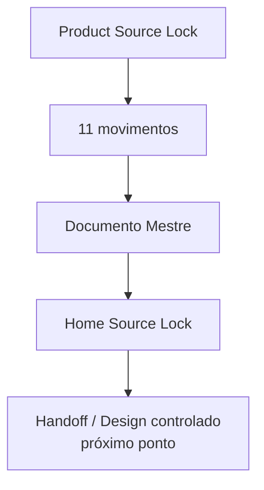

# Checkpoint de Continuidade — Home Pública Guivos Intelligence v1 — Home Source Lock

## 1. Finalidade

Este checkpoint preserva o ponto exato da construção da **Home Pública Guivos Intelligence v1** após a integração conceitual de toda a arquitetura pública e a criação do Home Source Lock.

Estado de autoridade:

```text
GPA-006 v2.0.0
→ AUTORIDADE SUPERIOR DO PRODUTO

GKR-INTELLIGENCE-PRODUCT-SOURCELOCK-001 v1.0.0
→ PRODUCT SOURCE LOCK

GKR-UX-HOME-INTELLIGENCE-NARRATIVE-001 v0.2.1
→ ARQUITETURA NARRATIVA EM 11 MOVIMENTOS
→ COPY DE REFERÊNCIA CORRIGIDA

GKR-UX-HOME-INTELLIGENCE-MASTER-001 v0.1.1
→ DOCUMENTO MESTRE

GKR-UX-HOME-INTELLIGENCE-SOURCELOCK-001 v1.0.0
→ HOME SOURCE LOCK
→ NORMATIVO
```

## 2. Baseline do Home Source Lock

O Source Lock foi preparado sobre o estado reconciliado:

```text
main
31f985625c312e3d0bdc3836dbf34fa39c762d80

gh-pages
40ee70b8b0038b4a20c2b12691f438d5f7d4fa06
→ Deployed 31f985625 with MkDocs 1.6.1

PR #287
GKR: corrigir copy da Home Intelligence v1
→ merged
```

A publicação documental e a `main` estavam sincronizadas antes da criação deste Source Lock.

## 3. Estado conceitual consolidado

```text
MOVIMENTOS 01–11
→ CONVERGIDOS

MOVIMENTO 12
→ NÃO PREVISTO

DOCUMENTO MESTRE
→ CONVERGIDO E INTEGRADO

COPY DE REFERÊNCIA
→ CORRIGIDA E INTEGRADA

HOME SOURCE LOCK
→ CRIADO

HANDOFF / DESIGN
→ NÃO INICIADO NESTE FLUXO
```

## 4. Centro semântico congelado

Unidade de valor:

> **compreensão útil e contextualizada.**

Ideia-mãe:

> **Compreender melhor amplia o que você consegue perceber.**

Pergunta-mãe:

> **O que se torna possível quando você compreende melhor o que está acontecendo?**

Apoio inicial:

> **Entenda melhor o que está acontecendo. Amplie o que você consegue perceber.**

Autonomia:

> **Veja mais antes de decidir.**

Fechamento:

> **Perceba antes o que começa a mudar. Enxergue além do que já está evidente.**

> **Novas possibilidades podem se tornar mais visíveis.**

## 5. CTAs congelados

CTA principal:

> **Veja o que suas informações podem mostrar**

CTA secundário:

> **Conheça o Guivos Intelligence**

Os CTAs não autorizam promessa de futuro conhecido, decisão certa, diagnóstico ou resultado empresarial comprovado.

## 6. Arquitetura congelada

```text
01 — POSSIBILIDADE
02 — NECESSIDADE
03 — VALOR PRÓPRIO
04 — RESULTADOS
05 — MATERIALIZAÇÃO
06 — FORMAÇÃO DA COMPREENSÃO
07 — APLICAÇÃO
08 — CONFIANÇA
09 — AUTONOMIA
10 — INTELIGÊNCIA CONECTADA
11 — HORIZONTE AMPLIADO
```

Separações obrigatórias:

```text
M03
→ DEFINE POR QUE INTELLIGENCE EXISTE

M10
→ APROFUNDA POR QUE AS RELAÇÕES IMPORTAM

M04
→ MOSTRA OS RESULTADOS

M05
→ DEMONSTRA OS RESULTADOS
```

Os onze movimentos não obrigam onze seções visuais equivalentes.

## 7. Duas frentes preservadas

### Pessoa / Journey

> **Entenda melhor por que determinadas informações, recomendações ou possibilidades podem aparecer em determinado contexto.**

```text
INTELLIGENCE
→ produz compreensão

JOURNEY
→ governa a experiência

PESSOA
→ escolhe
```

### Business / população

> **Compreenda padrões, mudanças e movimentos em populações de forma agregada e protegida.**

```text
INTELLIGENCE
→ produz leitura populacional

BUSINESS
→ governa a relação empresarial

EMPRESA
→ decide
```

A Empresa não recebe Intelligence individual por funcionário nem acesso à intimidade individual da Journey.

## 8. Tecnologia e visual

Graph, IA, Neo4j, GraphRAG, Power BI, Guivos.ai, dashboards e APIs permanecem subordinados ao valor do produto.

Não existe seção tecnológica obrigatória congelada.

Visualizações analíticas podem demonstrar conexões, repetições, mudanças, relações, sinais ganhando força, contexto, origem de leitura, incerteza e limites.

```text
VISUAL ANALÍTICO ≠ DASHBOARD COMO PRODUTO
EXEMPLO CONCEITUAL ≠ DADO OPERACIONAL REAL
TECNOLOGIA ≠ PRODUTO
```

## 9. Guardrails preservados

```text
INFORMAÇÃO ≠ COMPREENSÃO
COMPREENDER ≠ DECIDIR
INTELLIGENCE ≠ JOURNEY
INTELLIGENCE ≠ BUSINESS
CONHECER ≠ UTILIZAR ≠ COMPARTILHAR
DECLARADO ≠ OBSERVADO ≠ INFERIDO ≠ PREDITO
PERSONALIZAR ≠ EXPOR
CORRELAÇÃO ≠ CAUSALIDADE
RELAÇÃO ≠ CAUSA
PADRÃO ≠ CAUSA
MOVIMENTO ≠ DIAGNÓSTICO
SINAL ≠ CERTEZA
TENDÊNCIA ≠ DESTINO
INFERÊNCIA ≠ FATO
MAIS DADOS ≠ MELHOR INTELLIGENCE
RESULTADO ESPERADO ≠ RESULTADO COMPROVADO
PERCEBER ANTES ≠ PREVER O FUTURO
```

## 10. Preservações globais

Esta frente não altera:

- `M7.88`;
- `UXA-101` como última UXA numerada;
- `UXA-102/V5`, que permanece não iniciada;
- Product Engineering, que permanece pausada antes de W0-01;
- maturidade tecnológica do Guivos Intelligence;
- status de Neo4j como referência, não operação comprovada;
- ausência de GraphRAG/GDS/Power BI/Guivos.ai operacionais comprovados;
- ausência de pricing final e oferta B2B autônoma vigente;
- `GKR-STATE-001 2.39.0` e `ROADMAP-12.81.0` como último snapshot global até sincronização transversal autorizada.

Não há promoção silenciosa de estado global por este pacote.

## 11. Próximo ponto exato

Após a integração deste Home Source Lock, retomar exatamente em:

> **Home Pública Guivos Intelligence v1 — Handoff controlado para Design.**

Esse próximo ponto ainda exige autorização separada e não deve ser inferido como iniciado pela criação do Source Lock.



Nenhuma etapa autoriza automaticamente a seguinte.
