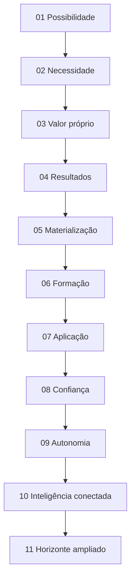
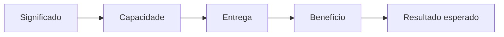
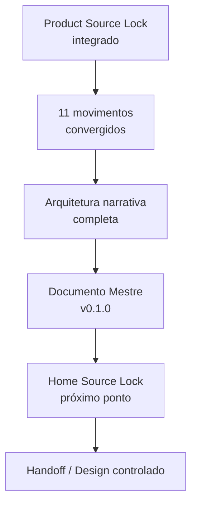

# Checkpoint de Continuidade — Home Pública Guivos Intelligence v1 — 11 Movimentos e Documento Mestre

## 1. Finalidade

Este checkpoint preserva o ponto exato da construção da **Home Pública Guivos Intelligence v1** após:

- integração de `GPA-006 2.0.0`;
- integração do `GKR-INTELLIGENCE-PRODUCT-SOURCELOCK-001 1.0.0`;
- integração do princípio `GKR-UX-HOMES-OUTCOME-001 1.0.0`;
- convergência dos Movimentos 01–11;
- encerramento da arquitetura narrativa em onze movimentos;
- criação do `GKR-UX-HOME-INTELLIGENCE-MASTER-001 0.1.0`.

A autoridade superior de produto continua sendo `GPA-006 2.0.0`.

A porta de entrada normativa para a Home continua sendo `GKR-INTELLIGENCE-PRODUCT-SOURCELOCK-001 1.0.0`.

A arquitetura da Home passa a estar registrada em `GKR-UX-HOME-INTELLIGENCE-NARRATIVE-001 0.2.0`.

O Documento Mestre da Home passa a estar registrado em `GKR-UX-HOME-INTELLIGENCE-MASTER-001 0.1.0`.

## 2. Baseline antes deste pacote

O pacote parte exatamente de:

```text
main
0815b2035ce0f8c2b4482c8fe0a71a7e9d7b8771

PR ANTERIOR
#285 — GKR: consolidar movimentos 1–10 da Home Intelligence v1
→ merged

GPA-006
2.0.0

PRODUCT SOURCE LOCK
GKR-INTELLIGENCE-PRODUCT-SOURCELOCK-001 1.0.0

ARQUITETURA DA HOME
GKR-UX-HOME-INTELLIGENCE-NARRATIVE-001 0.1.0
→ Movimentos 01–10 convergidos
→ Movimento 11 como próximo ponto

CHECKPOINT DE CONTINUIDADE
GKR-INTELLIGENCE-HOME-CONTINUITY-001 1.0.0
```

A publicação documental do baseline `0815b2035...` já havia sido confirmada em `gh-pages` antes deste novo pacote.

## 3. Estado conceitual atual

```text
HOME PÚBLICA GUIVOS INTELLIGENCE v1
→ ARQUITETURA CONCEITUAL COMPLETA

MOVIMENTO 01 — POSSIBILIDADE
→ CONVERGIDO

MOVIMENTO 02 — NECESSIDADE
→ CONVERGIDO

MOVIMENTO 03 — VALOR PRÓPRIO DO INTELLIGENCE
→ CONVERGIDO

MOVIMENTO 04 — RESULTADOS DA INTELIGÊNCIA
→ CONVERGIDO

MOVIMENTO 05 — MATERIALIZAÇÃO DOS RESULTADOS
→ CONVERGIDO

MOVIMENTO 06 — FORMAÇÃO DA COMPREENSÃO
→ CONVERGIDO

MOVIMENTO 07 — ONDE A COMPREENSÃO GERA VALOR
→ CONVERGIDO

MOVIMENTO 08 — CONFIANÇA / EXPLICABILIDADE / LIMITES
→ CONVERGIDO

MOVIMENTO 09 — AUTONOMIA / DECISÃO
→ CONVERGIDO

MOVIMENTO 10 — INTELIGÊNCIA CONECTADA
→ CONVERGIDO

MOVIMENTO 11 — HORIZONTE AMPLIADO
→ CONVERGIDO

QUANTIDADE FINAL DE MOVIMENTOS
→ 11

MOVIMENTO 12
→ NÃO PREVISTO NESTA ARQUITETURA

DOCUMENTO MESTRE
→ GKR-UX-HOME-INTELLIGENCE-MASTER-001 0.1.0
→ CRIADO

HOME SOURCE LOCK
→ NÃO CRIADO

DESIGN / UI / PROTÓTIPO
→ NÃO INICIADOS NESTE FLUXO
```

## 4. Movimento 11 — convergência registrada

Função:

> **Levar a narrativa da compreensão para aquilo que uma compreensão mais ampla pode tornar perceptível, sem converter Intelligence em previsão do futuro.**

Ideia central:

> **Compreender melhor não muda apenas o que você sabe. Pode mudar o que você consegue perceber.**

Headline de referência:

> **Perceba antes o que começa a mudar. Enxergue além do que já está evidente.**

Supporting copy de referência:

> **Guivos Intelligence conecta sinais, contexto, conhecimento e relações para tornar padrões, movimentos e novas possibilidades mais visíveis — ajudando você a compreender mais antes de decidir.**

Progressão:

```text
COMPREENDER MAIS
→ PERCEBER MAIS
→ ENXERGAR MAIS CEDO
→ AMPLIAR O QUE PODE SER CONSIDERADO
```

Resposta de fechamento à pergunta-mãe:

> **Você passa a perceber mais, mais cedo — e a enxergar possibilidades que informações isoladas ainda não conseguiam mostrar.**

Guardrails específicos:

```text
PERCEBER ANTES ≠ PREVER O FUTURO
ENXERGAR MAIS LONGE ≠ SABER O QUE VAI ACONTECER
SINAL ≠ CERTEZA
TENDÊNCIA ≠ DESTINO
PADRÃO EM FORMAÇÃO ≠ RESULTADO FUTURO GARANTIDO
POSSIBILIDADE ≠ RECOMENDAÇÃO OBRIGATÓRIA
```

## 5. Mapa final da arquitetura



A arquitetura não exige onze seções visuais equivalentes. Os movimentos são funções semânticas que podem ser agrupadas no Design posterior sem perder significado ou ordem narrativa.

## 6. Formulações de referência preservadas

```text
01
O que se torna possível quando você compreende melhor o que está acontecendo?

02
Ter mais informação não significa entender melhor.

03
Entenda o que suas informações, isoladamente, não conseguem mostrar.

04
Veja conexões. Identifique padrões. Entenda mudanças. Perceba movimentos.

05
Veja o que você não enxergaria olhando cada informação separadamente.

06
Transformar informação em compreensão exige mais do que reunir dados.

07
Onde essa compreensão gera valor.

08
Não receba apenas uma conclusão. Entenda como ela foi construída.

09
Veja mais antes de decidir.

10
Entenda não apenas cada informação, mas como elas podem estar relacionadas.

11
Perceba antes o que começa a mudar. Enxergue além do que já está evidente.
```

## 7. Correções e fronteiras preservadas

### 7.1 Intelligence ≠ Journey

A Home Intelligence permanece centrada em:

- informação;
- contexto;
- conhecimento;
- evidência;
- relações;
- padrões;
- mudanças;
- movimentos;
- insights;
- explicações;
- compreensão.

O território de evolução, direção, caminho pessoal e experiência da Pessoa permanece governado pela Journey.

### 7.2 Intelligence ≠ Business

A frente Business/População pode aparecer como aplicação da compreensão, mas a Home Intelligence não se torna página de programas, benefícios, RH, planos ou contratação Business.

### 7.3 Tecnologia ≠ produto

```text
INTELLIGENCE ≠ IA
INTELLIGENCE ≠ LLM
INTELLIGENCE ≠ DASHBOARD
INTELLIGENCE ≠ POWER BI
INTELLIGENCE ≠ NEO4J
INTELLIGENCE ≠ GRAPHRAG
INTELLIGENCE ≠ GRAFO GLOBAL
```

> **A tecnologia amplia a capacidade do Intelligence. Não amplia sua autoridade.**

### 7.4 Compreensão ≠ previsão

O Movimento 11 amplia o horizonte sem autorizar linguagem determinística de futuro.

## 8. Regra transversal de resultado

Continua vigente `GKR-UX-HOMES-OUTCOME-001 1.0.0`:

> **A Home não deve apenas explicar produto, significado e funcionalidades. Deve mostrar o que as capacidades entregam e quais resultados ou possibilidades são legitimamente esperados por quem usa.**



```text
RESULTADO ESPERADO
≠
RESULTADO COMPROVADO
```

## 9. Diretriz visual preservada

A Home Intelligence pode utilizar representações de:

- KPIs;
- indicadores;
- mini gráficos;
- comparações;
- tendências;
- padrões;
- movimentos;
- cards analíticos;
- organogramas;
- fluxos;
- sequências;
- redes conceituais;
- escadas de interpretação.

Esses elementos devem demonstrar **o tipo de leitura**, **a sequência de compreensão**, **a relação entre sinais** ou **o resultado esperado**.

Não devem ser usados apenas como decoração nem confundidos com wireframe, dashboard operacional ou prova de implementação.

## 10. Guardrails mestres preservados

```text
CONHECER ≠ UTILIZAR ≠ COMPARTILHAR
DECLARADO ≠ OBSERVADO ≠ INFERIDO ≠ PREDITO
PERSONALIZAR ≠ EXPOR
COMPREENDER ≠ DECIDIR
PADRÃO ≠ CAUSA
RELAÇÃO ≠ CAUSA
MOVIMENTO ≠ DIAGNÓSTICO
INFERÊNCIA ≠ FATO
CORRELAÇÃO ≠ CAUSALIDADE
PAGAMENTO ≠ RELEVÂNCIA
ENTITLEMENT ≠ AUTORIDADE
PLANO SUPERIOR ≠ MENOS PRIVACIDADE
```

A Empresa recebe compreensão populacional autorizada e protegida; não recebe a intimidade individual da Journey.

## 11. Documento Mestre criado

`GKR-UX-HOME-INTELLIGENCE-MASTER-001 0.1.0` passa a concentrar a leitura mestre desta Home antes do Home Source Lock.

O Documento Mestre consolida:

- autoridade de origem;
- intenção própria da Home;
- proposta de valor;
- pergunta-mãe e copy de referência;
- os onze movimentos;
- as duas frentes superiores;
- explicabilidade e autonomia;
- horizonte ampliado;
- papel subordinado da tecnologia;
- diretrizes visuais;
- guardrails;
- itens ainda não congelados;
- critério de passagem para a próxima etapa.

O Documento Mestre não substitui `GPA-006` nem o Product Source Lock.

## 12. O que permanece aberto

Ainda não estão congelados:

- Home Source Lock;
- CTA principal;
- CTA secundário;
- microcopy final;
- formulação final da pergunta-mãe, caso o Source Lock exija refinamento semântico;
- ordem visual final;
- quantidade final de exemplos de KPI;
- dados reais versus exemplos conceituais;
- profundidade da apresentação pública de Graph/AI;
- composição visual final das duas frentes;
- wireframe;
- UI;
- protótipo;
- Design Handoff.

Esses itens não reabrem automaticamente os onze movimentos convergidos.

## 13. Preservações globais

Esta frente não altera:

- `M7.88`;
- `UXA-101` como última UXA numerada;
- `UXA-102/V5`, que permanece não iniciada;
- Product Engineering, que permanece pausada antes de W0-01;
- inventários de superfícies, transições ou SVGs;
- o handoff externo v3 das sete Homes anteriores;
- maturidade tecnológica do Guivos Intelligence;
- status de Neo4j como referência, não operação comprovada;
- ausência de GraphRAG/GDS/Power BI/Guivos.ai operacionais comprovados;
- ausência de pricing final e oferta B2B autônoma vigente.

## 14. Estado global e roadmap

`GKR-STATE-001 2.39.0` e `ROADMAP-12.81.0` permanecem como último snapshot global até uma próxima sincronização transversal autorizada.

Não há promoção silenciosa de versão global por este pacote documental.

## 15. Próximo ponto exato

Retomar exatamente em:

> **Home Pública Guivos Intelligence v1 — elaboração do Home Source Lock.**

Estado:

```text
ARQUITETURA NARRATIVA
→ COMPLETA EM 11 MOVIMENTOS

DOCUMENTO MESTRE
→ CRIADO

HOME SOURCE LOCK
→ PRÓXIMO PONTO
→ NÃO CRIADO

HANDOFF / DESIGN
→ BLOQUEADO ATÉ ETAPA AUTORIZADA
```

## 16. Sequência preservada



Nenhuma etapa autoriza automaticamente a seguinte.
