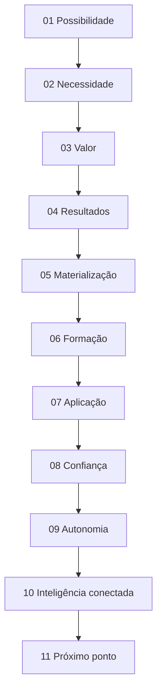
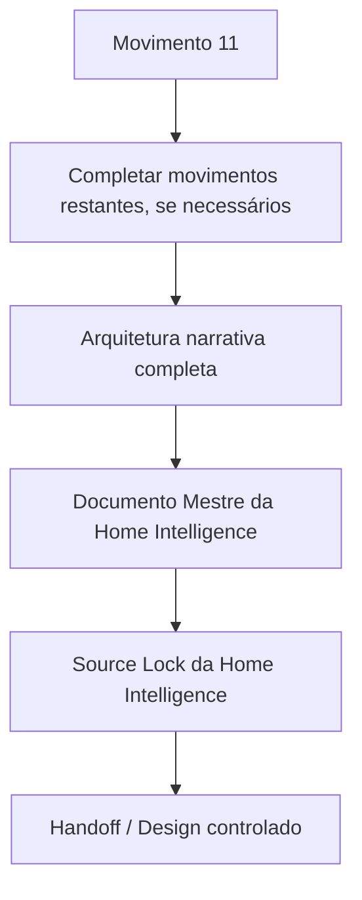

# Checkpoint de Continuidade — Home Pública Guivos Intelligence v1 — Movimentos 1–10

## 1. Finalidade

Este checkpoint preserva o ponto exato da construção conceitual da **Home Pública do Guivos Intelligence v1** após a integração do Source Lock do Produto e a convergência dos Movimentos 01–10 em conversa.

A autoridade superior de produto continua sendo `GPA-006 2.0.0`.

A porta de entrada normativa para a Home continua sendo `GKR-INTELLIGENCE-PRODUCT-SOURCELOCK-001 1.0.0`.

A arquitetura parcial da Home está registrada em `GKR-UX-HOME-INTELLIGENCE-NARRATIVE-001 0.1.0`.

## 2. Baseline canônico anterior

Antes desta frente documental, o estado canônico era:

```text
main
471a8ae50afef28627478df23da7b10a75c33653

GPA-006
2.0.0

SOURCE LOCK DO PRODUTO
GKR-INTELLIGENCE-PRODUCT-SOURCELOCK-001 1.0.0

HOME INTELLIGENCE
não iniciada no estado global anterior
```

A publicação documental correspondente foi confirmada em `gh-pages` por:

```text
Deployed 471a8ae50 with MkDocs version: 1.6.1
```

## 3. Estado conceitual desta frente

```text
HOME PÚBLICA GUIVOS INTELLIGENCE v1
→ INICIADA CONCEITUALMENTE

MOVIMENTO 01 — POSSIBILIDADE
→ CONVERGIDO

MOVIMENTO 02 — NECESSIDADE
→ CONVERGIDO

MOVIMENTO 03 — VALOR PRÓPRIO DO INTELLIGENCE
→ CONVERGIDO

MOVIMENTO 04 — RESULTADOS DA INTELIGÊNCIA
→ CONVERGIDO

MOVIMENTO 05 — MATERIALIZAÇÃO DOS RESULTADOS
→ CONVERGIDO

MOVIMENTO 06 — FORMAÇÃO DA COMPREENSÃO
→ CONVERGIDO

MOVIMENTO 07 — ONDE A COMPREENSÃO GERA VALOR
→ CONVERGIDO

MOVIMENTO 08 — CONFIANÇA / EXPLICABILIDADE / LIMITES
→ CONVERGIDO

MOVIMENTO 09 — AUTONOMIA / DECISÃO
→ CONVERGIDO

MOVIMENTO 10 — INTELIGÊNCIA CONECTADA
→ CONVERGIDO

MOVIMENTO 11
→ PRÓXIMO PONTO
→ AINDA NÃO DESENVOLVIDO / NÃO CONVERGIDO
```

## 4. Correções conceituais incorporadas

### 4.1 Linguagem abstrata simplificada

Foi rejeitada como excessivamente abstrata a formulação interna:

> “há algo além da informação: compreensão capaz de revelar possibilidades”.

A direção pública passa a privilegiar linguagem mais simples:

> **Ter informação não é o mesmo que entender o que ela significa — e entender melhor ajuda a enxergar novas possibilidades.**

### 4.2 Falar diretamente com o visitante

Foi rejeitada a dependência de formulações genéricas como:

> “veja o que está mudando e entenda por que isso pode merecer sua atenção”.

A Home deve preferir consequências diretas e compreensíveis para quem visita.

### 4.3 Intelligence ≠ Journey

Foi corrigido o desvio que aproximava a Home de expressões como:

> “entenda melhor o seu momento e descubra possibilidades que fazem sentido para você”.

Essa intenção é predominantemente Journey.

A Home Intelligence deve permanecer centrada em:

- informação;
- contexto;
- conhecimento;
- evidência;
- relações;
- padrões;
- mudanças;
- movimentos;
- insights;
- explicações;
- compreensão.

### 4.4 Intelligence ≠ Business

A frente Business/População pode aparecer como aplicação da compreensão, mas a Home Intelligence não deve se tornar página de programas, benefícios, RH, planos ou contratação Business.

## 5. Regra transversal criada durante a construção

A construção da Home produziu uma regra válida para todas as Homes Públicas:

> **A Home não deve apenas explicar produto, significado e funcionalidades. Deve mostrar o que as capacidades entregam e quais resultados ou possibilidades são legitimamente esperados por quem usa.**

Essa regra está formalizada em `GKR-UX-HOMES-OUTCOME-001 1.0.0`.

Arquitetura:


Guardrail:

```text
RESULTADO ESPERADO
≠
RESULTADO COMPROVADO
```

## 6. Diretriz visual consolidada

A Home Intelligence pode utilizar representações de:

- KPIs;
- indicadores;
- mini gráficos;
- comparações;
- tendências;
- padrões;
- movimentos;
- cards analíticos;
- organogramas;
- fluxos;
- sequências;
- redes conceituais;
- escadas de interpretação.

Esses elementos devem demonstrar **o tipo de leitura**, **a sequência de compreensão** ou **o resultado entregue**.

Não devem ser usados apenas como decoração nem confundidos com wireframe, dashboard operacional ou prova de implementação.

## 7. Síntese dos dez movimentos



Formulações de referência preservadas:

```text
01
O que se torna possível quando você compreende melhor o que está acontecendo?

02
Ter mais informação não significa entender melhor.

03
Entenda o que suas informações, isoladamente, não conseguem mostrar.

04
Veja conexões. Identifique padrões. Entenda mudanças. Perceba movimentos.

05
Veja o que você não enxergaria olhando cada informação separadamente.

06
Transformar informação em compreensão exige mais do que reunir dados.

07
Onde essa compreensão gera valor.

08
Não receba apenas uma conclusão. Entenda como ela foi construída.

09
Veja mais antes de decidir.

10
Entenda não apenas cada informação, mas como elas podem estar relacionadas.
```

## 8. O que permanece aberto

Ainda não estão congelados:

- Movimento 11;
- quantidade final de movimentos da Home;
- síntese/fechamento final;
- CTA principal e secundário;
- pergunta-mãe definitiva, caso a arquitetura completa exija refinamento;
- copy final;
- composição final das duas frentes;
- profundidade da apresentação tecnológica;
- eventual seção específica de Graph/AI;
- ordem visual final;
- quantidade de exemplos de KPI;
- dados reais versus exemplos conceituais;
- Documento Mestre;
- Source Lock da Home;
- Handoff de Design desta Home.

## 9. Preservações globais

Esta frente não altera:

- `M7.88`;
- `UXA-101` como última UXA numerada;
- `UXA-102/V5`, que permanece não iniciada;
- Product Engineering, que permanece pausada antes de W0-01;
- inventários de superfícies, transições ou SVGs;
- o handoff externo v3 das sete Homes anteriores;
- maturidade tecnológica do Guivos Intelligence;
- status de Neo4j como referência, não operação comprovada;
- ausência de GraphRAG/GDS/Power BI/Guivos.ai operacionais comprovados;
- ausência de pricing final e oferta B2B autônoma vigente.

## 10. Estado global e roadmap

`GKR-STATE-001 2.39.0` e `ROADMAP-12.81.0` permanecem como último snapshot global até uma próxima sincronização transversal.

Este checkpoint é a autoridade de continuidade **mais recente e específica para a frente Home Intelligence** e corrige, somente dentro dessa frente, a leitura anterior de “Home não iniciada”.

Não há promoção silenciosa de versão global por uma convergência narrativa ainda parcial.

## 11. Próximo ponto exato

Retomar exatamente em:

> **Home Guivos Intelligence v1 — Movimento 11.**

Brief já identificado, mas não convergido:

> **Traduzir a compreensão em uma visão mais aspiracional de resultado — perceber antes, enxergar mais longe e descobrir possibilidades que antes não estavam visíveis — sem transformar isso em promessa de prever o futuro.**

## 12. Sequência depois do Movimento 11



Nenhuma etapa autoriza automaticamente a seguinte.
