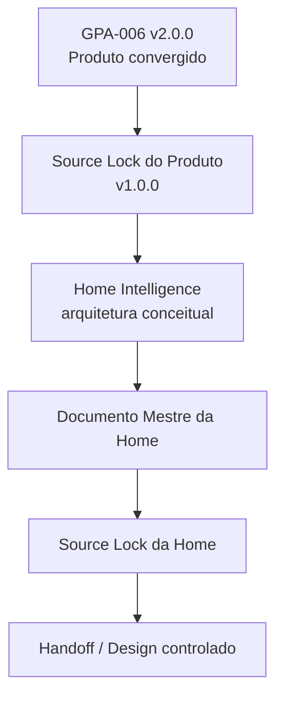
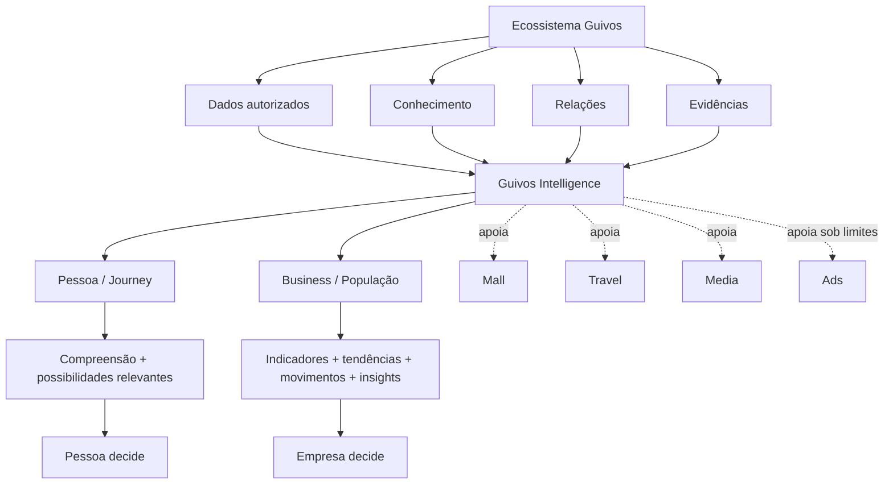
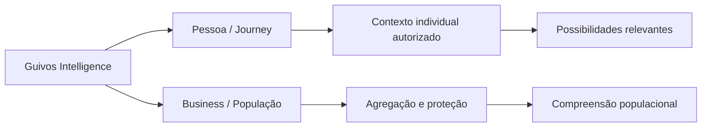
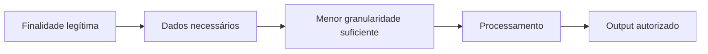

# Checkpoint de Continuidade — Guivos Intelligence — pós-Source Lock do Produto

## 1. Finalidade

Este checkpoint preserva o ponto exato da estruturação do **Produto Especializado Guivos Intelligence** após a convergência dos Checkpoints 1–12, a promoção de `GPA-006` para `2.0.0` e a materialização do `GKR-INTELLIGENCE-PRODUCT-SOURCELOCK-001`.

A autoridade superior continua sendo `GPA-006 — Guivos Intelligence 2.0.0`. O Source Lock governa quais fontes, claims, precedências e limites podem alimentar a futura estruturação da Home Pública. Este arquivo é somente um registro recuperável de continuidade e não substitui essas autoridades.

## 2. Estado consolidado

```text
CHECKPOINT 1 — identidade, papel e fronteiras
→ CONVERGIDO

CHECKPOINT 2 — duas frentes superiores
→ CONVERGIDO

CHECKPOINT 3 — arquitetura funcional
→ CONVERGIDO

CHECKPOINT 4 — inputs, conhecimento, proveniência e autoridade
→ CONVERGIDO

CHECKPOINT 5 — outputs
→ CONVERGIDO

CHECKPOINT 6 — personalização, agregação, privacidade e explicabilidade
→ CONVERGIDO

CHECKPOINT 7 — contratos interproduto
→ CONVERGIDO

CHECKPOINT 8 — Graph, Knowledge, Analytics, AI e tecnologias subordinadas
→ CONVERGIDO EM ALTO NÍVEL

CHECKPOINT 9 — modos de entrega e Intelligence Serving
→ CONVERGIDO CONCEITUALMENTE

CHECKPOINT 10 — direção comercial, planos, entitlements e contratação
→ CONVERGIDO EM ALTO NÍVEL

CHECKPOINT 11 — governança, maturidade, gaps, riscos e guardrails
→ CONVERGIDO

CHECKPOINT 12 — Documento Mestre / GPA-006 V2
→ CONVERGIDO E INTEGRADO

SOURCE LOCK DO PRODUTO
→ GKR-INTELLIGENCE-PRODUCT-SOURCELOCK-001 v1.0.0
→ MATERIALIZADO

HOME PÚBLICA GUIVOS INTELLIGENCE
→ NÃO INICIADA
```

## 3. Sequência governada vigente



Nenhuma etapa autoriza automaticamente a seguinte.

## 4. Arquitetura recuperável em uma visão



## 5. Identidade congelada

Guivos Intelligence é o **Produto Especializado transversal da Guivos e a Intelligence Layer do ecossistema**.

Unidade superior de valor:

> **compreensão útil e contextualizada.**

Princípio superior:

```text
COMPREENDER ≠ DECIDIR
```

Intelligence produz compreensão; a autoridade de decisão permanece com quem legitimamente a possui.

## 6. Duas frentes superiores



### Pessoa / Journey

Pergunta funcional:

> **O que pode ser relevante para esta Pessoa, neste momento, considerando sua própria Journey?**

### Business / População

Pergunta funcional:

> **O que está emergindo nesta população e o que a Empresa pode compreender a partir disso?**

Contrato:

```text
AUTORIDADE PARA PERSONALIZAR
≠ AUTORIDADE PARA EXPOR
```

## 7. Núcleo funcional

Responsabilidades consolidadas:

1. contexto;
2. conhecimento;
3. relações;
4. compreensão;
5. relevância;
6. descoberta de possibilidades;
7. agregação;
8. insights e tendências;
9. explicabilidade;
10. aprendizado governado;
11. Intelligence Serving como responsabilidade de entrega.

```text
RESPONSABILIDADE FUNCIONAL
≠ MICROSSERVIÇO
≠ ENGINE TÉCNICO OBRIGATÓRIO
```

## 8. Inputs e outputs

Inputs distinguem:

```text
DECLARADO
OBSERVADO
OPERACIONAL
CALCULADO
INFERIDO
PREDITO
AGREGADO
CONHECIMENTO EXTERNO / GOVERNADO
```

Outputs distinguem:

```text
DESCRIÇÃO
→ indicador / distribuição / comparação / estado observado

INTERPRETAÇÃO
→ padrão / sinal / Movimento Emergente / insight

PROJEÇÃO
→ tendência / estimativa / previsão

ORIENTAÇÃO
→ possibilidade / oportunidade / recomendação / caminho a explorar

REFERÊNCIA
→ benchmark

TRANSPARÊNCIA
→ explicação / proveniência / incerteza / limitação
```

Contrato:

```text
DECLARADO ≠ OBSERVADO ≠ INFERIDO ≠ PREDITO
```

## 9. Proveniência e finalidade

```text
CONHECER ≠ UTILIZAR ≠ COMPARTILHAR
```

Fluxo governado:



## 10. Proteção populacional

```text
INDIVIDUAL
→ serve prioritariamente à própria Pessoa

GRUPO / SEGMENTO PROTEGIDO
→ análise autorizada quando houver proteção suficiente

POPULAÇÃO AGREGADA
→ pode servir ao Business
```

```text
SEM NOME ≠ ANÔNIMO
AGREGADO ≠ AUTOMATICAMENTE SEGURO
```

A Empresa não recebe um “Intelligence por funcionário”.

## 11. Contratos interproduto

| Produto | Intelligence apoia | Autoridade final |
|---|---|---|
| Journey | contexto, relevância, possibilidades | Journey + Pessoa |
| Business | inteligência populacional | Business + Empresa |
| Mall | descoberta e pertinência | Mall + Pessoa |
| Travel | contextualização | Travel + Pessoa |
| Media | descoberta e relações editoriais | Media |
| Ads | mensuração e contexto permitido | Ads + superfície anfitriã |

Princípio:

> **Intelligence conecta autoridades. Não as absorve.**

## 12. Handoff minimizado


```text
OUTPUT AUTORIZADO
≠ DATASET DE ORIGEM
```

## 13. Produto versus tecnologia

```text
GUIVOS INTELLIGENCE
= PRODUTO

GIA
= INTELLIGENCE ARCHITECTURE

GRAFO GLOBAL
= CAPACIDADE / MODELO RELACIONAL

KNOWLEDGE
= CAPACIDADE DE CONHECIMENTO

ANALYTICS
= CAPACIDADE DE MEDIÇÃO E ANÁLISE

AI / ML
= MECANISMOS

RAG / GRAPHRAG
= MECANISMOS DE RECUPERAÇÃO

NEO4J
= TECNOLOGIA DE REFERÊNCIA DE GRAFO

POWER BI
= CONSUMIDOR / SUPERFÍCIE ANALÍTICA POSSÍVEL

GUIVOS.AI
= POSSÍVEL SUPERFÍCIE CONVERSACIONAL
```

> **A tecnologia amplia capacidade. Não amplia autoridade.**

## 14. Modos de entrega

```text
EMBUTIDO
DIRETO / ANALÍTICO
CONVERSACIONAL
PROATIVO
DOCUMENTAL
PROGRAMÁTICO
```

Intelligence pode ser origem de compreensão sem ser destino da experiência.

`Intelligence Serving` governa conceitualmente quem pode receber determinado output, em qual granularidade, momento, canal e forma.

## 15. Direção comercial

### Pessoa

Intelligence é predominantemente incorporado à Journey e aos planos pessoais `Free / Plus / Pro`.

```text
PRODUTO PRÓPRIO
≠ ASSINATURA PRÓPRIA OBRIGATÓRIA
```

### Business

Intelligence não é módulo do Business, mas capacidades do Intelligence podem compor os entitlements dos planos:

```text
START → operar
GROWTH → acompanhar e compreender
SCALE → interpretar e integrar
ENTERPRISE → governar em alta complexidade e escala
```

```text
ENTITLEMENT ≠ AUTORIDADE
MAIOR PLANO ≠ MENOR PRIVACIDADE
```

Uma oferta B2B autônoma do Intelligence permanece candidato futuro, não oferta vigente.

## 16. Constituição

1. servir à compreensão, não ao controle;
2. preservar autonomia humana;
3. distinguir fato, interpretação e previsão;
4. usar dados somente com finalidade e autoridade;
5. compreender profundamente sem expor profundamente;
6. não vender intimidade;
7. não criar score universal de valor ou evolução humana;
8. não confundir correlação com causalidade;
9. explicar proporcionalmente à complexidade e ao impacto;
10. permitir correção, contestação e mudança;
11. tecnologia não cria autoridade;
12. quando não houver evidência suficiente, não inventar certeza.

## 17. Maturidade e gaps

Convergido como autoridade de produto:

- identidade;
- duas frentes;
- capacidades;
- inputs;
- outputs;
- personalização/agregação;
- contratos interproduto;
- papel de Graph/Knowledge/Analytics/AI;
- modos de entrega;
- Serving;
- direção comercial;
- governança;
- guardrails;
- Source Lock do Produto para entrada controlada da futura Home.

Continuam abertos ou não evidenciados:

- modelo físico de dados;
- ontologia lógica completa;
- ontologia física;
- thresholds de proteção populacional;
- contrato operacional de inferência e explicabilidade;
- governança operacional de benchmarks;
- stack de IA;
- MLOps;
- APIs físicas;
- serving técnico;
- Neo4j provisionado/produção;
- GraphRAG/GDS operacional;
- Power BI integrado;
- pricing final;
- compliance e controles de privacidade operacionais.

## 18. Source Lock do Produto

`GKR-INTELLIGENCE-PRODUCT-SOURCELOCK-001 v1.0.0` passa a ser a **porta de entrada normativa para a futura estruturação da Home Pública do Guivos Intelligence**.

Ele congela:

- pacote primário de fontes;
- fontes secundárias consultáveis somente por dúvida específica;
- ordem de autoridade;
- centro semântico;
- duas frentes superiores;
- traduções públicas permitidas e distorções proibidas;
- maturidade tecnológica;
- claims proibidos;
- direção comercial vigente;
- gaps que a Home não pode preencher por inferência;
- gate para novos claims e novas fontes.

Ele não congela:

- pergunta-mãe da Home;
- hero;
- headline;
- CTA;
- arquitetura narrativa;
- quantidade de movimentos;
- visual;
- UI;
- Design.

## 19. Home Pública

A Home Pública do Guivos Intelligence permanece **não iniciada** neste checkpoint.

O Source Lock do Produto não cria:

- Documento Mestre da Home;
- Source Lock da Home;
- narrativa pública final;
- CTA;
- wireframe;
- UI;
- protótipo;
- Design.

## 20. Próximo ponto exato

Após integração governada do `GKR-INTELLIGENCE-PRODUCT-SOURCELOCK-001`, retomar exatamente em:

> **arquitetura conceitual da Home Pública do Guivos Intelligence.**

A Home deverá começar pelo Source Lock do Produto e por `GPA-006 v2.0.0`, sem misturar automaticamente Source Locks, Documentos Mestres ou Design das outras Homes.
