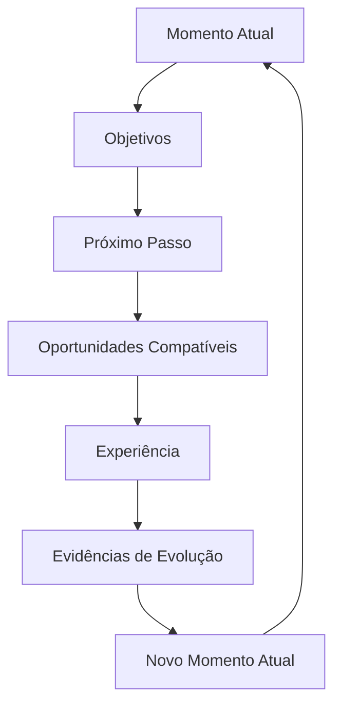
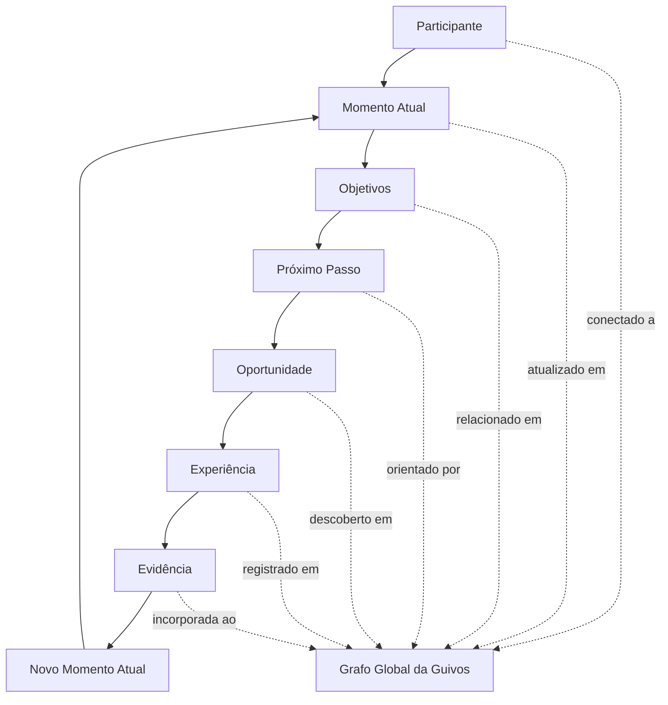
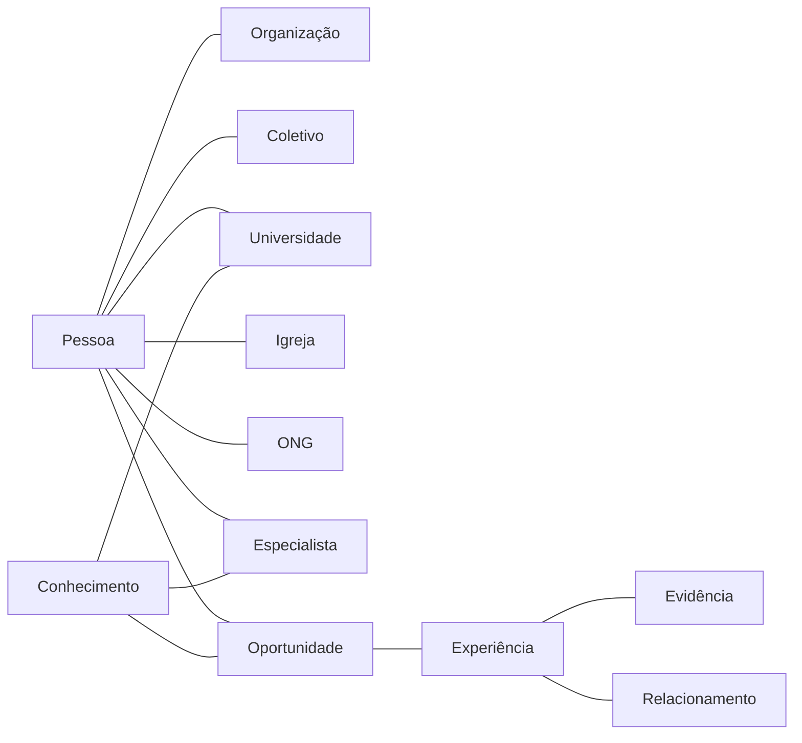
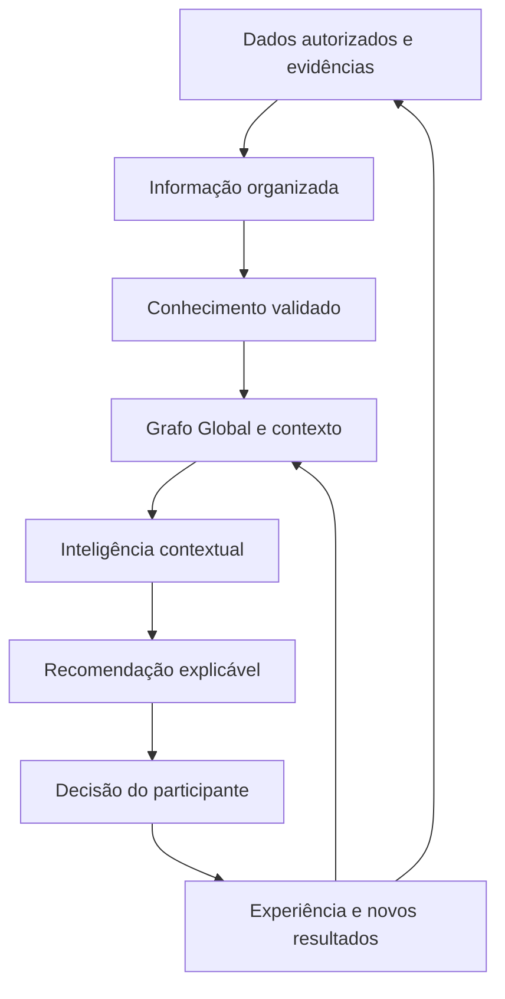

# Guia Oficial da Guivos

## Controle do documento

| Campo | Informação |
|---|---|
| Nome | Guia Oficial da Guivos |
| Finalidade | Explicar, em linguagem pública e prática, o que é a Guivos, por que ela existe, como funcionará, quais são seus limites e como pessoas e organizações poderão participar |
| Público | Pessoas, empresas, organizações, comunidades, movimentos, parceiros, imprensa, investidores, fornecedores, colaboradores e interessados em geral |
| Responsável institucional | Guivos |
| Versão | 3.2.0 |
| Última atualização | 04/07/2026 |
| Status | Public Canon |
| Fonte principal | Guivos Knowledge Repository |
| Natureza | Documento vivo, atualizado conforme a evolução oficial do repositório |

> Este guia traduz para linguagem pública as decisões consolidadas no Guivos Knowledge Repository. Não apresenta hipóteses, discussões preliminares ou planos não validados como fatos concluídos.

## Regra editorial principal

Nenhum conceito abstrato deve ser apresentado antes de o leitor compreender, por meio de uma situação concreta, qual problema esse conceito resolve.

---

# 1. Imagine esta situação

João sente que precisa melhorar alguma área da vida.

Talvez queira encontrar um novo emprego, aumentar a renda, voltar a estudar, cuidar da saúde, fortalecer a espiritualidade, melhorar relacionamentos, fazer novas amizades, praticar esporte, viajar, abrir uma empresa, participar de uma causa social ou encontrar mais propósito.

João sabe que deseja avançar, mas não sabe por onde começar.

Quando procura ajuda, encontra milhares de cursos, vídeos, especialistas, eventos, vagas, viagens, grupos, comunidades, igrejas, movimentos, empresas e projetos sociais. As oportunidades existem, mas estão espalhadas. Algumas são boas, outras não combinam com sua realidade e muitas aparecem sem orientação.

O problema de João não é apenas falta de informação.

É informação demais, pouca organização e dificuldade para identificar qual oportunidade realmente faz sentido agora.

A Guivos foi criada para enfrentar esse problema.

---

# 2. O problema da fragmentação das oportunidades

O mundo já possui milhões de oportunidades capazes de transformar vidas, organizações e comunidades.

O problema é que elas estão fragmentadas.

- pessoas procuram oportunidades sem saber onde encontrá-las;
- empresas oferecem programas sem alcançar o público certo;
- universidades possuem bolsas que muitas pessoas desconhecem;
- igrejas e comunidades oferecem apoio sem alcançar quem está buscando;
- ONGs precisam de voluntários enquanto pessoas desejam ajudar;
- grupos esportivos procuram participantes;
- movimentos e coletivos atuam isoladamente;
- especialistas possuem conhecimento que nem sempre chega a quem precisa;
- eventos, conteúdos, serviços e experiências aparecem em canais separados.

A Guivos nasce para reduzir essa fragmentação, organizar possibilidades e conectar pessoas, grupos e organizações de forma mais relevante.

---

# 3. Definição simples da Guivos

A Guivos é um ecossistema criado para ajudar pessoas e organizações a compreender o que desejam melhorar e encontrar oportunidades, experiências, grupos, conteúdos, produtos, serviços e parceiros que possam ajudá-las a avançar.

Ao mesmo tempo, ajuda empresas, universidades, igrejas, movimentos, comunidades, ONGs, especialistas, órgãos públicos e outros participantes a disponibilizar oportunidades para quem realmente pode se beneficiar delas.

A Guivos não define o que uma pessoa deve querer para sua vida. Cada participante escolhe seus próprios objetivos.

> **A Guivos conecta pessoas que desejam evoluir às oportunidades, experiências, grupos e organizações que podem ajudá-las a dar o próximo passo.**

---

# 4. Essência, propósito, missão e visão

## Essência

A Guivos é um ecossistema criado para acelerar jornadas de evolução por meio das oportunidades mais relevantes para cada momento de vida.

Ela não existe para substituir pessoas, organizações, coletivos ou instituições. Existe para fortalecer conexões entre participantes e ampliar sua capacidade de gerar evolução.

## Formulação central

> **A Guivos reduz a distância entre o Momento Atual de um participante e seu Próximo Passo de evolução.**

## Propósito

> **Acelerar jornadas de evolução por meio das oportunidades mais relevantes para cada momento de vida.**

## Missão

Ajudar cada participante a evoluir continuamente por meio de oportunidades relevantes, experiências, conexões e conhecimento.

## Visão

Tornar-se um ecossistema global de descoberta, conexão e desenvolvimento de oportunidades capazes de transformar positivamente a vida de pessoas, organizações e comunidades.

---

# 5. O que a Guivos não é

A Guivos utiliza elementos presentes em diferentes tipos de plataformas, mas não pode ser definida apenas por um deles.

A Guivos não é apenas:

- uma rede social;
- um marketplace;
- um aplicativo de viagens;
- uma plataforma de cursos;
- um portal de empregos;
- uma agência de turismo;
- um programa de benefícios;
- um aplicativo de saúde;
- uma plataforma religiosa;
- uma comunidade online;
- uma empresa de mídia;
- uma plataforma de inteligência artificial;
- um sistema de pontos;
- um catálogo genérico de anúncios.

Cada uma dessas atividades pode aparecer dentro do ecossistema quando contribuir para uma jornada real. Nenhuma delas, isoladamente, representa a Guivos.

---

# 6. Que evolução é essa?

Na Guivos, evolução não significa que todas as pessoas devam buscar o mesmo objetivo ou seguir um único modelo de vida.

Cada participante define o que significa evoluir para si.

Evoluir pode significar:

- conseguir o primeiro emprego;
- mudar de profissão;
- aumentar a renda;
- organizar a vida financeira;
- concluir uma formação;
- conseguir uma bolsa de estudos;
- cuidar da saúde física;
- fortalecer a saúde emocional;
- desenvolver a espiritualidade;
- melhorar relacionamentos;
- ampliar o círculo de amizades;
- participar de uma comunidade;
- começar a correr ou pedalar;
- viajar e conhecer outras culturas;
- desenvolver um negócio;
- servir em uma ação social;
- apoiar uma causa ambiental ou animal;
- descobrir novas possibilidades para a própria vida.

A evolução também pode acontecer com organizações e grupos.

---

# 7. O que significa Momento Atual?

O Momento Atual é a fotografia da realidade de uma pessoa ou organização em determinado período.

Ele pode envolver objetivos, necessidades, profissão, renda, formação, saúde, espiritualidade, relacionamentos, cidade, disponibilidade, interesses, conhecimentos, experiências anteriores, limitações, preferências, causas e grupos dos quais participa.

A pessoa não precisará expor tudo sobre sua vida. A experiência deverá respeitar suas escolhas, seus limites e sua privacidade.

## Exemplo

Ana mora em Belo Horizonte, deseja cuidar da saúde, prefere atividades em grupo, tem disponibilidade aos sábados e está começando.

A Guivos poderá apresentar grupos de caminhada, pedais para iniciantes, trilhas leves, eventos de saúde, conteúdos introdutórios e organizações parceiras.

---

# 8. O que é a jornada?

A jornada é o caminho entre aquilo que a pessoa vive hoje e aquilo que deseja construir.

Ela pode começar com uma intenção ampla:

> “Quero melhorar minha saúde.”

Depois, essa intenção pode se transformar em passos concretos:

1. compreender a situação atual;
2. escolher um objetivo possível;
3. identificar um próximo passo;
4. encontrar oportunidades relacionadas;
5. decidir se deseja participar;
6. viver uma experiência;
7. observar o que mudou;
8. definir um novo passo.

É essa jornada contínua que o **Guivos Journey** pretende apoiar.

---

# 9. Ciclo Contínuo de Evolução da Guivos

O Ciclo Contínuo de Evolução da Guivos representa a forma como pessoas e organizações avançam dentro do ecossistema.

Ele não possui um ponto final definitivo. Cada experiência pode produzir aprendizados, resultados e mudanças que formam um **Novo Momento Atual**. Esse novo estado passa a ser o ponto de partida do ciclo seguinte.

> **O ciclo nunca termina. Cada transformação gera um novo Momento Atual, que pode trazer novas necessidades, novos interesses, novos objetivos e novas oportunidades.**

---

# 10. Quem oferece as oportunidades?

A Guivos não criará sozinha todas as oportunidades.

Elas poderão ser oferecidas por empresas, universidades, escolas, igrejas, movimentos, comunidades, ONGs, órgãos públicos, especialistas, grupos esportivos, produtores de experiências e parceiros locais.

Uma universidade poderá oferecer bolsas. Uma empresa poderá divulgar vagas, benefícios e mentorias. Uma igreja poderá divulgar grupos de oração e ações comunitárias. Uma ONG poderá buscar voluntários. Um grupo de pedal poderá receber novos integrantes.

---

# 11. A Guivos fortalece o que já existe

A Guivos não pretende substituir, renomear ou absorver a identidade de grupos, movimentos, igrejas, comunidades, ONGs ou organizações.

A Guivos pretende oferecer um ambiente comum onde essas iniciativas possam:

- apresentar quem são;
- divulgar encontros e oportunidades;
- receber novos participantes;
- encontrar parceiros;
- conectar-se a empresas e instituições;
- colaborar com outros grupos;
- fortalecer suas atividades;
- preservar relacionamentos e aprendizados.

---

# 12. Papel das pessoas, organizações e da Guivos

## Papel da pessoa

A pessoa pode informar o que deseja melhorar, descobrir oportunidades, participar de experiências, aprender, criar ou integrar grupos, compartilhar conhecimento, liderar iniciativas, apoiar outras pessoas e revisar objetivos ao longo do tempo.

Ela não é apenas consumidora. É participante ativa do ecossistema.

## Papel das organizações

Empresas, universidades, igrejas, movimentos, ONGs e demais instituições podem oferecer oportunidades, criar experiências, formar comunidades, distribuir benefícios, compartilhar conhecimento, desenvolver pessoas, apoiar causas e formar parcerias.

## Papel da Guivos

A Guivos existe para compreender contextos, organizar oportunidades, conectar pessoas e organizações, fortalecer comunidades, apoiar jornadas, facilitar experiências, produzir inteligência, preservar a autonomia e reduzir a fragmentação do ecossistema.

---

# 13. Como a pessoa informa o que está buscando

A Guivos deverá permitir que cada pessoa indique, de forma progressiva e voluntária, áreas em que deseja avançar, como carreira, renda, educação, saúde, bem-estar, espiritualidade, relacionamentos, família, empreendedorismo, esportes, viagens, cultura, voluntariado, impacto social, participação comunitária, hobbies e lazer.

---

# 14. Como a Guivos funcionará na prática

Uma experiência completa poderá ocorrer assim:

1. a pessoa conhece a Guivos;
2. informa o que deseja melhorar, descobrir ou viver;
3. escolhe quais informações deseja compartilhar;
4. a Guivos organiza o contexto disponível;
5. possíveis próximos passos são apresentados;
6. oportunidades, grupos e organizações são encontrados;
7. a pessoa compara as opções;
8. decide se deseja participar;
9. vive uma experiência;
10. reconhece o que mudou;
11. recebe novas possibilidades compatíveis com seu novo momento.

A pessoa poderá ajustar objetivos, interromper uma jornada, mudar de interesse ou rejeitar recomendações.

---

# 15. Como a Guivos decide o que entra no ecossistema?

Uma iniciativa deverá ser analisada por perguntas como:

- contribui para a evolução de pessoas ou organizações?
- ajuda alguém a se aproximar de um objetivo legítimo?
- fortalece relações, comunidades ou experiências?
- respeita a autonomia e a dignidade das pessoas?
- possui valor real além da venda imediata?
- pode ser explicada dentro do propósito da Guivos?
- respeita a legislação e os princípios do ecossistema?
- apresenta informações claras e responsáveis?

## Atividades incompatíveis

Não fazem parte da proposta jogos de azar, apostas, cassinos, pirâmides financeiras, golpes, produtos ilícitos, publicidade enganosa, exploração de vulnerabilidades, conteúdo de ódio ou violência, spam, ofertas abusivas e atividades contrárias à lei ou à dignidade humana.

## Atividades legítimas sem aderência automática

Restaurantes, bares, lojas e outros segmentos não estão proibidos apenas por sua categoria. A participação depende do contexto.

Um restaurante pode fazer sentido em uma viagem, roteiro cultural, benefício corporativo, encontro comunitário ou ação social. Uma promoção isolada, como uma promoção de pizza, sem relação com qualquer jornada, não possui aderência automática.

> **A simples existência de uma atividade econômica não justifica sua presença na Guivos. A participação depende da contribuição real para pessoas, organizações, comunidades ou jornadas.**

---

# 16. Princípios permanentes da Guivos

- evolução antes da tecnologia;
- autonomia antes da automação;
- contexto antes da recomendação;
- relevância antes de volume;
- ecossistema antes de plataforma;
- comunidades antes de audiência;
- evidências antes de afirmações;
- cooperação antes do isolamento;
- realização progressiva.

---

# 17. Produtos da Guivos

## Guivos Journey

Apoia pessoas e organizações na compreensão do Momento Atual, organização de objetivos, identificação de próximos passos e acompanhamento de experiências.

## Guivos Mall

É o shopping da Guivos, responsável por organizar e comercializar produtos, serviços, assinaturas, gift cards e outros ativos de diferentes fornecedores relacionados às jornadas.

Guivos Mall não deve funcionar como catálogo genérico sem curadoria.

## Guivos Travel

Reúne viagens, destinos e experiências turísticas ligadas a cultura, natureza, aprendizagem, grupos e comunidades.

## Guivos Business

Entrega soluções para empresas e organizações, incluindo desenvolvimento de pessoas, benefícios, jornadas corporativas, recompensas, fidelização, engajamento, retenção, recorrência, captação de clientes, parcerias, impacto social e inteligência empresarial.

## Guivos Media

Produz e distribui vídeos, podcasts, entrevistas, documentários, histórias reais, livros, artigos, newsletters e materiais editoriais.

## Guivos Intelligence

É o produto que entrega a **Inteligência do Ecossistema Guivos**, transformando dados, contexto, evidências, conhecimento e conexões em recomendações, indicadores, tendências e análises úteis.

## Guivos Ads

Opera publicidade, patrocínios e mídia patrocinada com regras de transparência, identificação e relevância.

---

# 18. Como os produtos se conectam

Uma pessoa assiste a um conteúdo no **Guivos Media** sobre voluntariado.

No **Guivos Journey**, informa interesse em participar de uma causa.

A **Inteligência do Ecossistema Guivos**, entregue pelo Guivos Intelligence, ajuda a organizar oportunidades compatíveis.

Uma ONG participa por meio do **Guivos Business**.

Se houver produto ou serviço necessário, ele poderá aparecer no **Guivos Mall**.

Uma empresa poderá apoiar a ação por meio do **Guivos Ads**.

Se houver deslocamento, o **Guivos Travel** poderá apoiar essa parte da experiência.

---

# 19. A Inteligência do Ecossistema Guivos

A Inteligência do Ecossistema Guivos não deverá funcionar apenas como um sistema de conversa, pesquisa ou recomendação automática.

Seu papel é compreender um ecossistema vivo de pessoas, organizações, coletivos, jornadas, oportunidades, experiências, conhecimentos, relacionamentos e evidências.

Ela é um meio a serviço do propósito da Guivos. Não é a finalidade do ecossistema.

## 19.1 O que essa inteligência procura compreender

Ela procura responder continuamente perguntas como:

- quem é esta pessoa ou organização em seu contexto atual?
- o que deseja melhorar, descobrir, construir ou viver?
- qual próximo passo parece mais relevante agora?
- quais oportunidades, grupos ou organizações podem ajudar?
- quais experiências já foram vividas?
- o que mudou?
- quais novas possibilidades surgiram?

## 19.2 Como ela aprende

A Inteligência do Ecossistema poderá aprender com quatro fontes complementares.

### Conhecimento científico, técnico e institucional

Poderá utilizar conhecimento produzido por universidades, instituições de pesquisa, organismos públicos e multilaterais, centros de referência, estudos científicos, artigos revisados por pares, livros, normas técnicas, especialistas qualificados e bases institucionais confiáveis.

A existência de uma publicação não garante sua incorporação automática. Fontes deverão ser avaliadas quanto a qualidade, atualidade, contexto, limites, conflitos e aplicabilidade.

### Conhecimento produzido pelo ecossistema

Poderá aprender com experiências, resultados e padrões produzidos na própria Guivos, respeitando privacidade, consentimento, finalidade legítima, qualidade dos dados e análise de possíveis vieses.

### Contexto e movimentação do participante

Com autorização e transparência, poderá aprender com objetivos, mudanças de interesse, oportunidades visualizadas, experiências realizadas, conteúdos consumidos, grupos, habilidades, preferências, disponibilidade, localização, contexto e evidências de progresso.

A movimentação fornece sinais, não verdades absolutas. A pessoa poderá corrigir, rejeitar ou atualizar interpretações.

### Aprendizado coletivo e contextual

A Guivos poderá identificar padrões agregados entre jornadas semelhantes sem reduzir pessoas a perfis rígidos.

Esse aprendizado poderá ajudar a descobrir lacunas de oferta, necessidades locais, oportunidades pouco conhecidas, resultados recorrentes e conexões relevantes entre organizações.

## 19.3 O Grafo Global da Guivos

Um dos principais diferenciais da Inteligência do Ecossistema é a organização do conhecimento em um **Grafo Global da Guivos**.

Em vez de enxergar apenas documentos, pesquisas ou conversas isoladas, o grafo conecta elementos do ecossistema e preserva as relações entre eles.

O grafo também conecta simultaneamente pessoas, organizações, coletivos, universidades, igrejas, ONGs, especialistas, conhecimentos, eventos, cursos, viagens, oportunidades e relacionamentos.

O conhecimento não fica armazenado apenas como conteúdo. Ele passa a representar quem se relaciona com quem, em qual contexto, por meio de qual oportunidade, experiência ou evidência.

## 19.4 Como o grafo evolui

Cada nova experiência pode alterar o grafo.

Uma pessoa pode entrar em um grupo, conhecer alguém, iniciar um curso, mudar de emprego, viajar, participar de uma ação social ou tornar-se mentora de outras pessoas.

Essas mudanças criam novas conexões, atualizam o Momento Atual e abrem novas possibilidades.

Por isso, a Inteligência do Ecossistema aprende não apenas quando recebe novos documentos, mas também quando o próprio ecossistema se movimenta, desde que esse aprendizado seja autorizado, legítimo e governado.

## 19.5 Como gera recomendações

A Inteligência do Ecossistema não deverá recomendar algo apenas porque é popular, rentável ou patrocinado.

Ela poderá considerar:

- Momento Atual;
- objetivos declarados;
- preferências;
- disponibilidade;
- localização;
- experiências anteriores;
- relacionamentos;
- conhecimento disponível;
- evidências acumuladas;
- limitações informadas.

Duas pessoas com objetivos semelhantes podem receber recomendações diferentes porque seus contextos são diferentes.

## 19.6 O que ela nunca deverá fazer

A Inteligência do Ecossistema Guivos não deverá:

- decidir o que uma pessoa deve querer;
- impor objetivos ou caminhos;
- manipular escolhas;
- ocultar oportunidades para favorecer patrocinadores;
- priorizar receita em prejuízo da evolução do participante;
- substituir profissionais especializados;
- tratar hipóteses como certezas;
- utilizar qualquer fonte como verdade automática;
- utilizar dados sem finalidade legítima e transparência;
- otimizar apenas tempo de tela, venda ou permanência na plataforma.

A decisão final permanece com a pessoa ou organização.

## 19.7 Por que essa arquitetura é diferente

Uma inteligência convencional pode responder perguntas com base em textos, documentos, conversas e padrões estatísticos.

A Inteligência do Ecossistema Guivos pretende compreender relações em movimento dentro de um ambiente vivo.

O principal patrimônio dessa inteligência não é apenas o software. É o conhecimento acumulado nas conexões entre jornadas, experiências, organizações, coletivos, oportunidades, resultados e evidências.

Quanto maior a participação responsável no ecossistema, maior pode se tornar a capacidade de compreender contextos e revelar conexões relevantes.

> **Replicar funcionalidades é possível. Replicar um ecossistema vivo de conhecimento, relacionamentos, jornadas e evidências construído ao longo do tempo exige reconstruir uma rede inteira de conexões e aprendizado acumulado.**

Por isso, o Grafo Global da Guivos pode criar uma vantagem cumulativa difícil de reproduzir. O valor não está apenas no código, mas no grafo vivo, na qualidade das evidências, na governança e na confiança formada entre participantes.

Os princípios completos estão descritos no `GAI-002 — Manifesto da Inteligência do Ecossistema Guivos`.

---

# 20. Dados, privacidade e confiança

A Guivos poderá utilizar informações fornecidas voluntariamente, preferências, interações e registros de experiências para operar serviços, encontrar oportunidades, melhorar recomendações, proteger o ecossistema e cumprir obrigações legais.

O Grafo Global da Guivos não autoriza uso irrestrito de dados.

A pessoa deverá manter controle sobre suas informações conforme as regras e a legislação aplicável.

A arquitetura deverá preservar consentimento, finalidade, níveis de acesso, segregação de informações, anonimização ou agregação quando necessárias e rastreabilidade das fontes.

---

# 21. Como a Guivos poderá se sustentar

A Guivos poderá gerar receita por meio de planos para pessoas, soluções para empresas, serviços B2B, Guivos Mall, viagens, experiências, publicidade responsável, patrocínios, conteúdos de marca, relatórios, análises, parcerias e produtos digitais.

O detalhamento completo desses mecanismos será desenvolvido no domínio **Guivos Economic Model**, responsável por consolidar princípios econômicos, fontes de receita, planos, incentivos, sustentabilidade financeira, limites de monetização e relações entre propósito, impacto e geração de valor.

## Planos gratuitos e pagos

A Guivos poderá oferecer planos gratuitos e pagos.

O plano gratuito deverá permitir acesso real à descoberta de oportunidades, participação em comunidades, experiências e meios essenciais de evolução disponíveis no ecossistema.

Os planos pagos poderão oferecer maior velocidade, profundidade, personalização, acompanhamento, inteligência, conveniência, benefícios e recursos avançados.

> **A diferença entre os planos deverá estar na aceleração e ampliação da jornada, nunca no bloqueio da evolução ou transformação de quem utiliza um plano gratuito.**

Os planos pagos existem para acelerar, personalizar e ampliar possibilidades. Não devem transformar o propósito da Guivos em uma barreira econômica.

A monetização deverá sustentar o ecossistema, financiar sua evolução e ampliar sua capacidade de gerar valor, sem substituir o propósito.

---

# 22. Estágio atual da Guivos

## Consolidado no repositório

- identidade, propósito, missão e visão;
- princípios permanentes;
- arquitetura institucional;
- estrutura superior dos produtos;
- Guivos Mall como nome oficial do produto comercial;
- Ciclo Contínuo de Evolução da Guivos;
- limites públicos de aderência ao ecossistema;
- modelo conceitual da Inteligência do Ecossistema Guivos;
- Grafo Global da Guivos como modelo conceitual de conexões;
- GAI-002 — Manifesto da Inteligência do Ecossistema Guivos;
- governança documental e arquitetural;
- Guia Oficial da Guivos.

## Em validação, desenvolvimento ou planejamento

- Modelo Fundamental e Core Capabilities;
- Guivos Economic Model;
- modelos econômicos e operacionais detalhados;
- preços, planos e critérios específicos de diferenciação;
- ontologia formal do Grafo Global;
- modelo lógico e físico do grafo;
- capacidades técnicas de dados e inteligência;
- produtos e integrações;
- participação operacional de grupos e organizações;
- programas de recompensas e fidelização;
- expansão geográfica;
- regras operacionais detalhadas.

---

# 23. Perguntas frequentes

## A Guivos é uma rede social?

Não. Relacionamentos podem fazer parte da experiência, mas o escopo é mais amplo.

## A Guivos é um marketplace?

Não. A Guivos possui o **Guivos Mall**, seu produto comercial, mas o ecossistema não é definido por transações.

## O que é Guivos Mall?

É o shopping da Guivos, reunindo produtos, serviços e outros ativos de diferentes fornecedores com curadoria e relação com as jornadas do ecossistema.

## O que é a Inteligência do Ecossistema Guivos?

É a capacidade de interpretar dados, conhecimento, contexto, conexões, jornadas, experiências e evidências para apoiar decisões e revelar oportunidades relevantes.

## Ela é apenas um chatbot?

Não. Interfaces de conversa podem existir, mas a inteligência é mais ampla e trabalha sobre o Grafo Global da Guivos.

## O que é o Grafo Global da Guivos?

É o modelo conceitual que conecta participantes, organizações, coletivos, objetivos, oportunidades, experiências, conhecimentos, relacionamentos e evidências ao longo do tempo.

## O grafo torna a Guivos impossível de copiar?

Nenhuma empresa é impossível de copiar. Entretanto, funcionalidades isoladas são mais fáceis de reproduzir do que um ecossistema vivo de relações, conhecimento, experiências e confiança acumulados ao longo do tempo.

## Os planos gratuitos impedirão algumas pessoas de evoluir?

Não. A diferença entre planos gratuitos e pagos deverá estar na velocidade, profundidade e amplitude dos recursos. O pagamento pode acelerar uma jornada, mas não deve ser condição para que uma pessoa possa descobrir oportunidades e evoluir.

## Onde estará descrito o modelo econômico completo?

No domínio **Guivos Economic Model**, atualmente planejado no Guivos Knowledge Repository.

## A Guivos aceita qualquer empresa ou anúncio?

Não. A participação depende de legalidade, qualidade, transparência e aderência ao propósito.

## Jogos de azar e apostas poderão participar?

Não fazem parte da proposta da Guivos.

## A Inteligência do Ecossistema decidirá o que devo fazer?

Não. Ela poderá organizar conhecimento e recomendar possibilidades. A decisão permanece com a pessoa.

---

# 24. Informações que ainda exigem validação

Não devem ser apresentadas como disponíveis ou definitivas sem nova validação:

- datas de lançamento;
- preços e planos;
- critérios detalhados de diferenciação entre planos gratuitos e pagos;
- cidades e países de início;
- funcionalidades técnicas específicas;
- integrações externas;
- parceiros já contratados;
- participação efetiva das organizações citadas como exemplos;
- regras finais de recompensas, fidelização, captação e retenção;
- métricas de usuários, receita ou impacto;
- detalhes de infraestrutura e segurança;
- modelos técnicos de inteligência artificial;
- tecnologia específica do grafo;
- ontologia e modelo lógico definitivos;
- estrutura completa do Guivos Economic Model;
- disponibilidade pública de cada produto;
- critérios finais de cadastro, curadoria, moderação, suporte e atendimento;
- políticas legais e de privacidade ainda não publicadas.

> Os nomes e tipos de organizações citados neste guia demonstram como o ecossistema poderá funcionar. A citação não representa parceria formal, salvo anúncio oficial específico.

---

# 25. Conclusão

A Guivos existe para ajudar pessoas e organizações a transformar desejos amplos em próximos passos mais claros.

Ela pretende reduzir a fragmentação das oportunidades e conectar quem busca evoluir a experiências, grupos, movimentos, empresas, universidades, igrejas, comunidades, ONGs, especialistas e parceiros.

A jornada não possui um encerramento definitivo. Cada experiência pode gerar um Novo Momento Atual e abrir novas possibilidades.

A Inteligência do Ecossistema Guivos apoiará esse processo com dados, conhecimento, estudos, evidências, contexto e conexões organizadas no Grafo Global da Guivos, mas a autonomia continuará pertencendo às pessoas e organizações.

O modelo econômico deverá sustentar e acelerar esse propósito, sem impedir que participantes de planos gratuitos possam descobrir oportunidades e evoluir.

---

# Histórico resumido de alterações

| Versão | Data | Alteração principal |
|---|---|---|
| 1.0.0 | 03/07/2026 | Criação da primeira versão pública oficial |
| 2.0.0 | 03/07/2026 | Reestruturação da narrativa, definição prática de evolução, Momento Atual, jornada, grupos e parceiros |
| 2.1.0 | 03/07/2026 | Inclusão do que a Guivos não é, limites de atuação, critérios de aderência e ampliação do Guivos Business |
| 2.2.0 | 03/07/2026 | Inclusão do Ciclo Contínuo de Evolução da Guivos |
| 3.0.0 | 03/07/2026 | Consolidação pública da Foundation, fragmentação das oportunidades, papéis dos participantes, princípios permanentes e modelo de aprendizagem da IA |
| 3.1.0 | 04/07/2026 | Guivos Mall, exemplo da promoção de pizza, Guivos Economic Model e princípio de aceleração sem bloqueio nos planos pagos |
| 3.2.0 | 04/07/2026 | Inteligência do Ecossistema Guivos, Grafo Global, diagramas, aprendizagem ampliada e patrimônio cumulativo difícil de reproduzir |

# Regra de atualização contínua

Este documento deverá ser revisto quando houver alteração relevante em identidade, propósito, missão, visão, evolução, jornada, Momento Atual, produtos, nomenclaturas, critérios de participação, inteligência, Grafo Global, dados, privacidade, modelo econômico, planos, monetização, impacto, expansão, baselines ou decisões arquiteturais.

Toda atualização deverá preservar linguagem acessível, partir de exemplos concretos, substituir informações superadas e distinguir claramente o que está consolidado, em validação, em desenvolvimento ou planejado.