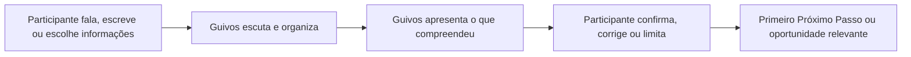
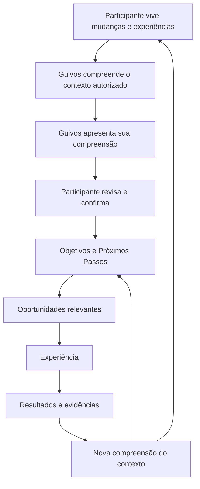
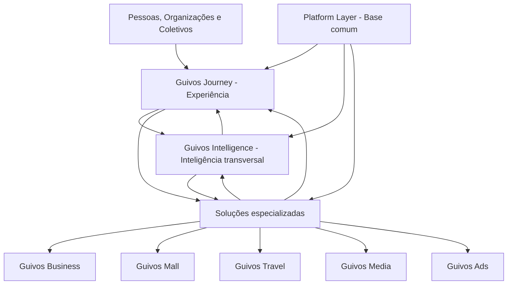
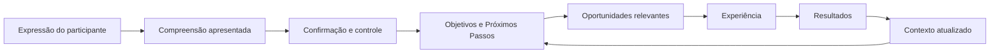

# Guia Oficial da Guivos

## Controle do documento

| Campo | Informação |
|---|---|
| Nome | Guia Oficial da Guivos |
| Finalidade | Explicar, em linguagem pública e prática, o que é a Guivos, por que ela existe, como funcionará, quais são seus limites e como pessoas, organizações e coletivos poderão participar |
| Público | Pessoas, empresas, organizações, grupos, comunidades, movimentos, parceiros, imprensa, investidores, fornecedores, colaboradores e interessados em geral |
| Responsável institucional | Guivos |
| Versão | 4.2.1 |
| Última atualização | 11/07/2026 |
| Status | Public Canon |
| Fonte principal | Guivos Knowledge Repository |
| Natureza | Documento vivo, atualizado conforme a evolução oficial do repositório |

> **Public Canon** significa que este é o documento público institucional vigente da Guivos. Não significa que todos os produtos, funcionalidades, preços, integrações ou operações descritos como futuros já estejam comercialmente disponíveis.

> Este guia traduz para linguagem pública as decisões consolidadas no Guivos Knowledge Repository. Funcionalidades, tecnologias, preços, integrações, parceiros e políticas ainda em validação não são apresentados como concluídos.

## Regra editorial principal

Nenhum conceito abstrato deve ser apresentado antes de o leitor compreender, por meio de uma situação concreta, qual problema esse conceito resolve.

---

# 1. Imagine esta situação

João deseja melhorar alguma área da vida. Talvez queira mudar de emprego, aumentar a renda, estudar, cuidar da saúde, fortalecer a espiritualidade, melhorar relacionamentos, viajar, empreender ou participar de uma causa.

As oportunidades existem, mas estão espalhadas em cursos, vídeos, vagas, eventos, empresas, igrejas, universidades, ONGs, grupos, serviços, viagens e comunidades.

O problema não é apenas falta de informação. É informação demais, pouca organização e dificuldade para identificar o que realmente faz sentido agora.

A Guivos foi criada para reduzir essa distância.

---

# 2. Definição simples da Guivos

A Guivos é um ecossistema inteligente criado para compreender contextos, organizar oportunidades e apoiar jornadas de evolução de pessoas, organizações e coletivos.

Ela reúne, em uma experiência integrada, oportunidades, experiências, grupos, conteúdos, produtos, serviços, viagens, parceiros e conhecimento que normalmente estariam distribuídos em muitas plataformas.

> **A Guivos conecta cada participante às oportunidades mais relevantes para seu contexto e para o próximo passo de sua jornada.**

A Guivos não define o que uma pessoa deve querer. Cada participante escolhe seus próprios objetivos.

---

# 3. Essência, propósito, missão e visão

## Essência

A Guivos é um ecossistema criado para acelerar jornadas de evolução por meio das oportunidades mais relevantes para cada momento de vida.

## Formulação central

> **A Guivos reduz a distância entre o Momento Atual de um participante e seu Próximo Passo de evolução.**

## Propósito oficial

> **Acelerar jornadas de evolução por meio das oportunidades mais relevantes para cada momento de vida.**

## Missão oficial

> **Ajudar cada participante a evoluir continuamente por meio das oportunidades mais relevantes para seu momento de vida.**

Experiências, conexões e conhecimento são meios pelos quais essas oportunidades podem produzir valor, mas não substituem a formulação oficial da missão.

## Visão oficial

> **Tornar a Guivos um ecossistema global de referência para descoberta, conexão e desenvolvimento de oportunidades capazes de transformar positivamente a vida de pessoas, organizações e coletivos.**

---

# 4. O que a Guivos não é

A Guivos não é apenas:

- rede social;
- marketplace;
- aplicativo de viagens;
- plataforma de cursos;
- portal de empregos;
- agência de turismo;
- programa de benefícios;
- aplicativo de saúde;
- plataforma religiosa;
- comunidade online;
- empresa de mídia;
- plataforma de inteligência artificial;
- sistema de pontos;
- catálogo de anúncios.

Esses elementos podem existir dentro do ecossistema quando contribuírem para uma jornada real. Nenhum deles, isoladamente, representa a Guivos.

---

# 5. Quem participa do ecossistema

A Guivos reconhece três categorias principais.

## Pessoas

Indivíduos que desejam aprender, trabalhar, empreender, cuidar da saúde, fortalecer relacionamentos, desenvolver a espiritualidade, viajar, participar de grupos, apoiar causas ou avançar em outras áreas da vida.

## Organizações

Empresas, universidades, escolas, igrejas, ONGs, órgãos públicos, instituições, negócios e associações que oferecem oportunidades, serviços, conhecimento, experiências ou apoio.

## Coletivos

Grupos, comunidades, movimentos, clubes, equipes e redes formadas em torno de interesses, causas, identidades ou objetivos compartilhados.

Uma mesma pessoa pode exercer diferentes papéis ao longo do tempo: participante, voluntária, mentora, cliente, organizadora, especialista, parceira ou líder.

---

# 6. O que significa evoluir

Na Guivos, evolução não possui uma única definição.

Pode significar conseguir o primeiro emprego, mudar de profissão, aumentar renda, organizar a vida financeira, concluir uma formação, cuidar da saúde, fortalecer a fé, melhorar relacionamentos, ampliar amizades, viajar, empreender, servir em uma ação social ou apoiar uma causa.

A Guivos não impõe um modelo de sucesso. Ela apoia objetivos legítimos escolhidos pelo próprio participante.

---

# 7. O que é o Momento Atual

O Momento Atual representa a realidade presente do participante e o contexto relevante para compreendê-la.

Pode envolver profissão, cidade, disponibilidade, interesses, objetivos, limitações, relacionamentos, conhecimentos, preferências, experiências e responsabilidades.

O Momento Atual não é um cadastro fixo nem uma definição permanente da pessoa. Ele pode mudar conforme novas experiências, decisões, relações e resultados surgem.

O participante não precisa expor tudo sobre sua vida. A experiência deve respeitar suas escolhas, seus limites e sua privacidade.

---

# 8. Como o participante poderá explicar seu contexto

A Guivos deverá permitir que o contexto seja construído progressivamente, por meios naturais e voluntários.

O participante poderá começar explicando, com suas próprias palavras, o que está vivendo, o que deseja mudar e onde pretende chegar.

A voz deverá ser um canal prioritário por permitir uma descrição mais natural e detalhada, mas não será o único meio.

A experiência poderá utilizar, conforme disponibilidade, autorização e finalidade legítima:

- voz;
- conversa por texto;
- informações escolhidas pelo participante;
- documentos enviados voluntariamente;
- imagens autorizadas;
- localização;
- calendário;
- aplicativos de saúde, esporte ou produtividade;
- integrações profissionais;
- experiências e interações realizadas na própria Guivos.

A Guivos poderá interpretar essas informações, apresentar o que compreendeu e permitir confirmação, correção, complementação ou limitação antes de utilizar essa compreensão para decisões relevantes.

> **O participante não deverá ser obrigado a preencher um longo questionário para começar. A compreensão poderá crescer ao longo da jornada.**

## Fluxo público da primeira compreensão

## Exemplo prático

Uma pessoa poderá dizer por voz:

> “Sou engenheiro, estou pensando em mudar de carreira, tenho pouco tempo livre e gostaria de trabalhar remotamente no futuro.”

A Guivos poderá organizar essa fala em contexto profissional, intenção de transição, restrição de tempo e preferência por trabalho remoto. A pessoa deverá poder revisar essa interpretação antes que ela seja utilizada.

---

# 9. Como a Guivos mantém sua compreensão atualizada

A Guivos não deverá tratar o participante como um perfil estático.

Sua compreensão poderá evoluir ao longo do tempo conforme o participante:

- informa mudanças;
- conclui experiências;
- altera objetivos;
- corrige interpretações;
- autoriza novas integrações;
- desenvolve novas competências;
- muda de cidade, trabalho, rotina ou prioridade.

A plataforma não deverá afirmar que conhece completamente a pessoa. Ela deverá apresentar sua melhor compreensão disponível, explicar de onde ela veio e permitir revisão.

O participante deverá poder responder:

- o que a Guivos entende sobre mim;
- por que entende isso;
- quando essa compreensão foi atualizada;
- como posso corrigir, ocultar, limitar ou remover uma informação.

## Exemplo prático

Maria informa que foi promovida. Essa mudança pode alterar suas prioridades profissionais, disponibilidade, responsabilidades e oportunidades relevantes, sem obrigar a plataforma a presumir mudanças em todas as demais áreas de sua vida.

---

# 10. O que é a jornada

A jornada é o caminho entre aquilo que o participante vive hoje e aquilo que deseja construir.

Uma intenção ampla pode ser transformada em passos concretos:

1. compreender a situação atual;
2. escolher um objetivo;
3. identificar um Próximo Passo;
4. encontrar oportunidades relacionadas;
5. decidir se deseja participar;
6. viver uma experiência;
7. observar o que mudou;
8. atualizar a compreensão do contexto;
9. definir um novo passo.

É essa jornada contínua que o **Guivos Journey** pretende apoiar.

---

# 11. Ciclo Contínuo de Evolução

> **O ciclo não possui encerramento definitivo. Cada transformação pode gerar um novo contexto, novas necessidades, interesses, objetivos e oportunidades.**

---

# 12. O que é uma oportunidade

Na Guivos, oportunidade é qualquer iniciativa, recurso ou possibilidade capaz de apoiar um Próximo Passo por meio de uma experiência.

Pode assumir a forma de vaga de trabalho, curso, bolsa, evento, grupo, mentoria, ação social, serviço, produto, viagem, conteúdo, benefício, desafio, parceria ou experiência cultural, espiritual, esportiva ou comunitária.

A pergunta central é:

> **Essa oportunidade ajuda o participante a avançar de forma relevante em seu contexto atual?**

---

# 13. Quem oferece as oportunidades

As oportunidades poderão ser oferecidas por empresas, universidades, escolas, igrejas, movimentos, comunidades, ONGs, órgãos públicos, especialistas, grupos esportivos, produtores de experiências e parceiros locais.

A Guivos não pretende substituir essas iniciativas. Pretende fortalecê-las, organizá-las e conectá-las aos participantes adequados.

---

# 14. Estrutura da Guivos

A estrutura pública distingue três naturezas visíveis e uma base comum de plataforma.

## Experiência

- **Guivos Journey** — experiência principal e acompanhamento da jornada.

## Inteligência

- **Guivos Intelligence** — inteligência transversal que interpreta contexto, conhecimento, conexões, experiências e evidências.

## Soluções especializadas

- **Guivos Business** — soluções para organizações;
- **Guivos Mall** — produtos, serviços e ativos comerciais;
- **Guivos Travel** — viagens e experiências;
- **Guivos Media** — conteúdo e comunicação;
- **Guivos Ads** — publicidade e patrocínios responsáveis.

## Base comum

A Platform Layer sustenta autenticação, segurança, dados, integrações, pagamentos, busca, notificações e outras capacidades compartilhadas. Ela não é um produto público independente.

---

# 15. Como a Guivos funcionará na prática

Uma experiência poderá ocorrer assim:

1. o participante conhece a Guivos;
2. explica o que deseja melhorar, construir ou viver;
3. escolhe quais informações deseja compartilhar;
4. a Guivos escuta e organiza uma compreensão inicial;
5. a Guivos apresenta o que compreendeu;
6. o participante confirma, corrige, complementa ou limita essa compreensão;
7. objetivos e possíveis Próximos Passos são apresentados;
8. oportunidades, grupos e organizações são encontrados;
9. o participante decide se deseja participar;
10. vive uma experiência;
11. reconhece o que mudou;
12. a compreensão da Guivos é atualizada;
13. novas possibilidades compatíveis podem surgir.

A Guivos deverá saber quando apresentar algo e quando permanecer em silêncio. O objetivo não é enviar o maior número possível de recomendações, mas apresentar possibilidades relevantes no momento adequado.

---

# 16. Como a Guivos decide o que entra no ecossistema

Uma iniciativa deverá ser analisada por perguntas como:

- contribui para a evolução de pessoas, organizações ou coletivos?
- ajuda alguém a se aproximar de um objetivo legítimo?
- fortalece relações, comunidades ou experiências?
- respeita autonomia e dignidade?
- possui valor real além da venda imediata?
- respeita legislação e transparência?

Não fazem parte da proposta jogos de azar, apostas, golpes, pirâmides financeiras, produtos ilícitos, publicidade enganosa, exploração de vulnerabilidades, conteúdo de ódio, spam e ofertas abusivas.

Restaurantes, lojas e outros segmentos legítimos podem participar quando houver relação real com uma jornada. Uma promoção isolada, como uma promoção de pizza sem contexto, não possui aderência automática.

---

# 17. Princípios permanentes

- evolução antes da tecnologia;
- autonomia antes da automação;
- contexto antes da recomendação;
- relevância antes de volume;
- ecossistema antes de plataforma;
- comunidades antes de audiência;
- evidências antes de afirmações;
- cooperação antes do isolamento;
- realização progressiva.

---

# 18. Inteligência do Ecossistema Guivos

A Inteligência do Ecossistema Guivos é a capacidade de interpretar dados, conhecimento, contexto, conexões, jornadas, experiências e evidências para apoiar decisões e revelar oportunidades relevantes.

Ela não deverá recomendar algo apenas porque é popular, rentável ou patrocinado.

Poderá considerar Momento Atual, objetivos, preferências, disponibilidade, localização, experiências anteriores, relacionamentos, conhecimento disponível, evidências acumuladas e limitações informadas.

Duas pessoas com objetivos semelhantes podem receber recomendações diferentes porque seus contextos são diferentes.

A decisão final permanece com o participante.

---

# 19. Grafo Global da Guivos

O Grafo Global da Guivos organiza conexões entre participantes, organizações, coletivos, objetivos, oportunidades, experiências, conhecimentos, relacionamentos e evidências ao longo do tempo.

Ele não autoriza uso irrestrito de dados.

Seu valor está na capacidade de compreender relações em movimento e conectar contextos que normalmente permaneceriam separados.

---

# 20. Dados, privacidade e confiança

A Guivos poderá utilizar informações fornecidas voluntariamente, preferências, interações e registros de experiências para operar serviços, encontrar oportunidades, melhorar recomendações, proteger o ecossistema e cumprir obrigações legais.

A arquitetura deverá preservar:

- consentimento;
- finalidade;
- níveis de acesso;
- segregação de informações;
- anonimização ou agregação quando necessárias;
- rastreabilidade das fontes;
- revisão e correção pelo participante.

O participante deverá manter controle sobre suas informações conforme as regras e a legislação aplicável.

---

# 21. Como a Guivos poderá se sustentar

A Guivos poderá gerar receita por meio de planos para pessoas, soluções para empresas, serviços B2B, Guivos Mall, viagens, experiências, publicidade responsável, patrocínios, conteúdos de marca, relatórios, análises, parcerias e produtos digitais.

A Guivos poderá oferecer planos gratuitos e pagos.

O plano gratuito deverá permitir acesso real à descoberta de oportunidades e meios essenciais de evolução.

Planos pagos poderão oferecer maior profundidade, personalização, acompanhamento, inteligência, conveniência e benefícios.

> **A diferença entre os planos deverá estar na aceleração e ampliação da jornada, nunca no bloqueio da evolução de quem utiliza um plano gratuito.**

O detalhamento completo será desenvolvido no domínio **Guivos Economic Model**.

---

# 22. Estágio atual da Guivos

## Consolidado

- identidade, propósito, missão e visão;
- princípios permanentes;
- estrutura dos participantes;
- arquitetura institucional;
- estrutura pública dos produtos;
- Guivos Mall como produto comercial oficial;
- Guivos Journey como experiência principal;
- Inteligência do Ecossistema Guivos;
- Grafo Global como modelo conceitual;
- captura progressiva e multimodal de contexto;
- compreensão contínua, revisável e controlável;
- princípios públicos do modelo econômico;
- governança documental e arquitetural.

## Em desenvolvimento ou planejamento

- arquitetura funcional completa dos produtos;
- preços e planos específicos;
- Guivos Economic Model completo;
- integrações externas;
- programas de recompensas;
- regras operacionais detalhadas;
- ontologia e implementação técnica do grafo;
- capacidades técnicas de inteligência;
- expansão geográfica.

---

# 23. Perguntas frequentes

## A Guivos é uma rede social?

Não. Relacionamentos podem fazer parte da experiência, mas o escopo é mais amplo.

## A Guivos é um marketplace?

Não. A Guivos possui o Guivos Mall, mas o ecossistema não é definido por transações.

## A Guivos mantém um perfil fixo sobre mim?

Não deveria. A proposta é construir uma compreensão progressiva e revisável, que muda conforme sua jornada e permanece sob seu controle.

## A voz será obrigatória?

Não. Ela poderá ser priorizada por sua naturalidade, mas texto e outras formas deverão permanecer disponíveis.

## A Guivos decidirá o que devo fazer?

Não. Ela poderá organizar conhecimento e recomendar possibilidades. A decisão permanece com o participante.

## Os planos gratuitos impedirão algumas pessoas de evoluir?

Não. O pagamento poderá acelerar e ampliar a experiência, mas não deverá ser condição para descobrir oportunidades e avançar.

## A Guivos aceita qualquer empresa ou anúncio?

Não. A participação depende de legalidade, qualidade, transparência e aderência ao propósito.

---

# 24. Informações que ainda exigem validação

Não devem ser apresentadas como definitivas sem nova validação:

- datas de lançamento;
- preços e planos;
- cidades e países de início;
- funcionalidades técnicas específicas;
- integrações externas;
- parceiros contratados;
- regras finais de recompensas e fidelização;
- métricas de usuários, receita ou impacto;
- detalhes de infraestrutura e segurança;
- tecnologia específica do grafo;
- políticas legais e de privacidade ainda não publicadas;
- disponibilidade pública de cada produto.

> Os nomes e tipos de organizações citados neste guia demonstram como o ecossistema poderá funcionar. A citação não representa parceria formal, salvo anúncio oficial específico.

---

# 25. Conclusão

A Guivos existe para ajudar pessoas, organizações e coletivos a transformar desejos amplos em próximos passos mais claros.

Ela pretende reduzir a fragmentação das oportunidades e compreender continuamente o contexto de cada participante para apresentar possibilidades mais relevantes ao longo do tempo.

A autonomia permanece com o participante. A inteligência, os produtos e o modelo econômico devem servir ao propósito, e não substituí-lo.

---

# Histórico resumido de alterações

| Versão | Data | Alteração principal |
|---|---|---|
| 1.0.0 | 03/07/2026 | Criação da primeira versão pública oficial |
| 2.0.0 | 03/07/2026 | Reestruturação da narrativa pública |
| 3.0.0 | 04/07/2026 | Inteligência do Ecossistema, Grafo Global e Economic Model |
| 3.3.0 | 04/07/2026 | Ampliação de exemplos práticos |
| 4.0.0 | 04/07/2026 | Arquitetura em camadas e captura multimodal de contexto |
| 4.1.0 | 04/07/2026 | Compreensão contínua, revisável e atualizada ao longo da jornada |
| 4.2.0 | 11/07/2026 | Alinhamento literal com Foundation, esclarecimento de Public Canon e revisão dos diagramas públicos |
| 4.2.1 | 11/07/2026 | Correção de compatibilidade Mermaid no diagrama público da estrutura da Guivos |
