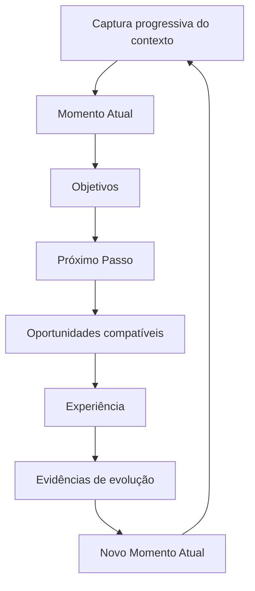
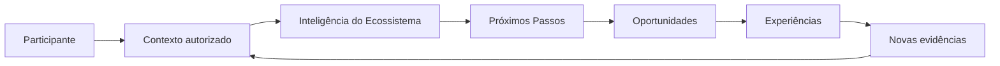
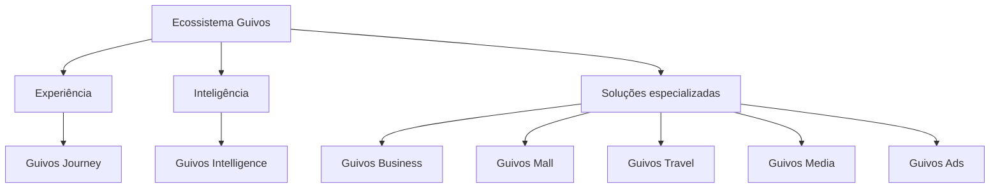
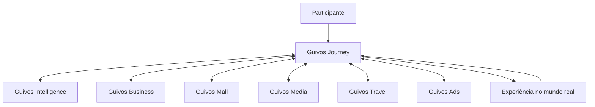
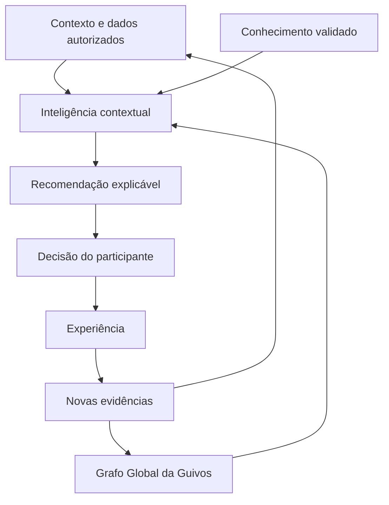
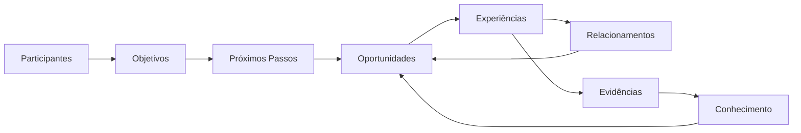

# Guia Oficial da Guivos

## Controle do documento

| Campo | Informação |
|---|---|
| Nome | Guia Oficial da Guivos |
| Finalidade | Explicar, em linguagem pública e prática, o que é a Guivos, por que ela existe, como funcionará, quais são seus limites e como pessoas, organizações e coletivos poderão participar |
| Público | Pessoas, empresas, organizações, grupos, comunidades, movimentos, parceiros, imprensa, investidores, fornecedores, colaboradores e interessados em geral |
| Responsável institucional | Guivos |
| Versão | 4.0.0 |
| Última atualização | 04/07/2026 |
| Status | Public Canon |
| Fonte principal | Guivos Knowledge Repository |
| Natureza | Documento vivo, atualizado conforme a evolução oficial do repositório |

> Este guia traduz para linguagem pública as decisões consolidadas no Guivos Knowledge Repository. Hipóteses, funcionalidades ainda não lançadas, preços, integrações e tecnologias em validação não são apresentados como fatos concluídos.

## Regra editorial principal

Nenhum conceito abstrato deve ser apresentado antes de o leitor compreender, por meio de uma situação concreta, qual problema esse conceito resolve.

---

# 1. Imagine esta situação

João sente que precisa melhorar alguma área da vida.

Talvez queira encontrar um novo emprego, aumentar a renda, voltar a estudar, cuidar da saúde, fortalecer a espiritualidade, melhorar relacionamentos, fazer novas amizades, praticar esporte, viajar, abrir uma empresa, participar de uma causa social ou encontrar mais propósito.

João sabe que deseja avançar, mas não sabe por onde começar.

Quando procura ajuda, encontra milhares de cursos, vídeos, especialistas, eventos, vagas, viagens, grupos, comunidades, igrejas, movimentos, empresas e projetos sociais. As oportunidades existem, mas estão espalhadas. Algumas são boas, outras não combinam com sua realidade e muitas aparecem sem orientação.

O problema de João não é apenas falta de informação.

É informação demais, pouca organização e dificuldade para identificar qual oportunidade realmente faz sentido agora.

A Guivos foi criada para enfrentar esse problema.

---

# 2. O problema da fragmentação das oportunidades

O mundo já possui milhões de oportunidades capazes de transformar vidas, organizações e comunidades.

O problema é que elas estão fragmentadas.

- pessoas procuram oportunidades sem saber onde encontrá-las;
- empresas oferecem programas sem alcançar o público certo;
- universidades possuem bolsas que muitas pessoas desconhecem;
- igrejas e comunidades oferecem apoio sem alcançar quem está buscando;
- ONGs precisam de voluntários enquanto pessoas desejam ajudar;
- grupos esportivos procuram participantes;
- movimentos e coletivos atuam isoladamente;
- especialistas possuem conhecimento que nem sempre chega a quem precisa;
- eventos, conteúdos, serviços e experiências aparecem em canais separados.

A Guivos nasce para reduzir essa fragmentação, organizar possibilidades e conectar pessoas, grupos e organizações de forma mais relevante.

## Exemplo prático

Uma universidade possui bolsas para cursos técnicos. Uma empresa precisa contratar pessoas qualificadas. Um jovem deseja entrar no mercado de trabalho, mas não conhece a bolsa nem a empresa.

As três partes existem, mas permanecem desconectadas. A Guivos pretende reduzir essa distância e organizar a conexão entre a necessidade, a oportunidade e o próximo passo possível.

---

# 3. Definição simples da Guivos

A Guivos é um ecossistema inteligente criado para compreender contextos, organizar oportunidades e apoiar jornadas de evolução de pessoas, organizações e coletivos.

Ela reúne, em uma experiência integrada, oportunidades, experiências, grupos, conteúdos, produtos, serviços, viagens, parceiros e conhecimento que normalmente estariam distribuídos em muitas plataformas diferentes.

Ao mesmo tempo, ajuda empresas, universidades, igrejas, movimentos, comunidades, ONGs, especialistas, órgãos públicos e outros participantes a disponibilizar oportunidades para quem realmente pode se beneficiar delas.

A Guivos não define o que uma pessoa deve querer para sua vida. Cada participante escolhe seus próprios objetivos.

> **A Guivos conecta cada participante às oportunidades mais relevantes para seu contexto e para o próximo passo de sua jornada.**

## Exemplo prático

Uma pessoa deseja melhorar a saúde, mas não sabe se deve começar por academia, caminhada, orientação profissional, mudança de alimentação ou participação em um grupo.

A Guivos não escolhe o objetivo por ela. Organiza o contexto disponível e apresenta possibilidades compatíveis para que a própria pessoa decida como deseja começar.

---

# 4. Essência, propósito, missão e visão

## Essência

A Guivos é um ecossistema criado para acelerar jornadas de evolução por meio das oportunidades mais relevantes para cada momento de vida.

Ela não existe para substituir pessoas, organizações, coletivos ou instituições. Existe para fortalecer conexões entre participantes e ampliar sua capacidade de gerar evolução.

## Formulação central

> **A Guivos reduz a distância entre o Momento Atual de um participante e seu Próximo Passo de evolução.**

## Propósito

> **Acelerar jornadas de evolução por meio das oportunidades mais relevantes para cada momento de vida.**

## Missão

Ajudar cada participante a evoluir continuamente por meio de oportunidades relevantes, experiências, conexões e conhecimento.

## Visão

Tornar-se um ecossistema global de descoberta, conexão e desenvolvimento de oportunidades capazes de transformar positivamente a vida de pessoas, organizações e comunidades.

## Exemplo prático

Mariana deseja mudar de carreira, mas não precisa receber imediatamente centenas de vagas. Seu primeiro passo pode ser compreender as áreas compatíveis com sua experiência, conversar com alguém do setor ou iniciar uma formação introdutória.

Reduzir a distância entre o Momento Atual e o Próximo Passo significa tornar essa primeira ação mais clara e possível.

---

# 5. O que a Guivos não é

A Guivos utiliza elementos presentes em diferentes tipos de plataformas, mas não pode ser definida apenas por um deles.

A Guivos não é apenas:

- uma rede social;
- um marketplace;
- um aplicativo de viagens;
- uma plataforma de cursos;
- um portal de empregos;
- uma agência de turismo;
- um programa de benefícios;
- um aplicativo de saúde;
- uma plataforma religiosa;
- uma comunidade online;
- uma empresa de mídia;
- uma plataforma de inteligência artificial;
- um sistema de pontos;
- um catálogo genérico de anúncios.

Cada uma dessas atividades pode aparecer dentro do ecossistema quando contribuir para uma jornada real. Nenhuma delas, isoladamente, representa a Guivos.

## Exemplo prático

Uma rede social pode mostrar uma publicação sobre um curso. Um marketplace pode vender esse curso. Uma plataforma de conteúdo pode explicar o tema.

A Guivos pretende ir além: compreender se aquele curso faz sentido para o Momento Atual da pessoa, como se relaciona com seu objetivo, qual próximo passo poderá gerar e quais outras experiências podem complementar sua jornada.

---

# 6. Quem participa do ecossistema

A Guivos reconhece três categorias principais de participantes.

## Pessoas

Indivíduos que desejam aprender, trabalhar, empreender, cuidar da saúde, fortalecer relacionamentos, desenvolver a espiritualidade, viajar, participar de grupos, apoiar causas ou avançar em outras áreas da vida.

## Organizações

Empresas, universidades, escolas, igrejas, ONGs, órgãos públicos, instituições, negócios, associações e demais estruturas organizadas que oferecem oportunidades, serviços, conhecimento, experiências ou apoio.

## Coletivos

Grupos, comunidades, movimentos, clubes, equipes, redes e outras formas de associação entre pessoas e organizações em torno de um propósito compartilhado.

Uma mesma pessoa poderá exercer diferentes papéis ao longo do tempo: participante de uma experiência, voluntária, mentora, cliente, organizadora, especialista, parceira ou líder de um coletivo.

---

# 7. Que evolução é essa?

Na Guivos, evolução não significa que todas as pessoas devam buscar o mesmo objetivo ou seguir um único modelo de vida.

Cada participante define o que significa evoluir para si.

Evoluir pode significar:

- conseguir o primeiro emprego;
- mudar de profissão;
- aumentar a renda;
- organizar a vida financeira;
- concluir uma formação;
- conseguir uma bolsa de estudos;
- cuidar da saúde física;
- fortalecer a saúde emocional;
- desenvolver a espiritualidade;
- melhorar relacionamentos;
- ampliar o círculo de amizades;
- participar de uma comunidade;
- começar a correr ou pedalar;
- viajar e conhecer outras culturas;
- desenvolver um negócio;
- servir em uma ação social;
- apoiar uma causa ambiental ou animal;
- descobrir novas possibilidades para a própria vida.

A evolução também pode acontecer com organizações e coletivos.

## Exemplo prático

Para uma pessoa, evoluir pode significar obter uma promoção. Para outra, pode significar reduzir a carga de trabalho para cuidar da família. Para uma terceira, pode significar recuperar a saúde, fortalecer a fé ou começar um projeto social.

A Guivos não estabelece uma única definição de sucesso. Ela apoia objetivos legítimos escolhidos pelo próprio participante.

---

# 8. O que significa Momento Atual?

O Momento Atual representa a realidade presente do participante e os elementos necessários para compreender seu contexto.

Ele pode envolver objetivos, necessidades, profissão, renda, formação, saúde, espiritualidade, relacionamentos, cidade, disponibilidade, interesses, conhecimentos, experiências anteriores, limitações, preferências, causas e grupos dos quais participa.

O participante não precisará expor tudo sobre sua vida. A experiência deverá respeitar suas escolhas, seus limites e sua privacidade.

O Momento Atual também não deve ser tratado como um cadastro fixo. Ele pode mudar conforme novas experiências, decisões, relações e resultados surgem.

## Exemplo prático

Ana mora em Belo Horizonte, deseja cuidar da saúde, prefere atividades em grupo, tem disponibilidade aos sábados e está começando.

A Guivos poderá apresentar grupos de caminhada, pedais para iniciantes, trilhas leves, eventos de saúde, conteúdos introdutórios e organizações parceiras.

João, embora também queira cuidar da saúde, trabalha aos sábados, prefere atividades individuais e possui uma limitação física. Seu contexto é diferente e, por isso, as possibilidades apresentadas também devem ser diferentes.

---

# 9. Como o participante poderá explicar seu contexto

A Guivos deverá permitir que o contexto seja construído progressivamente, por meios naturais e voluntários.

O participante poderá começar explicando, com suas próprias palavras, o que está vivendo, o que deseja mudar e onde pretende chegar.

A voz deverá ser um canal prioritário por permitir uma descrição mais natural e detalhada, mas não será o único meio.

A experiência poderá utilizar, conforme disponibilidade, autorização e finalidade legítima:

- voz;
- conversa por texto;
- informações escolhidas pelo participante;
- documentos enviados voluntariamente;
- imagens autorizadas;
- localização;
- calendário;
- aplicativos de saúde, esporte ou produtividade;
- integrações profissionais;
- experiências e interações realizadas na própria Guivos.

A Guivos poderá interpretar essas informações e apresentar sua compreensão para confirmação, correção ou complementação.

> **O participante não deverá ser obrigado a preencher um longo questionário para começar. A compreensão poderá crescer ao longo da jornada.**

## Exemplo prático

Uma pessoa poderá dizer por voz:

> “Sou engenheiro, estou pensando em mudar de carreira, tenho pouco tempo livre e gostaria de trabalhar remotamente no futuro.”

A Guivos poderá organizar essa fala em contexto profissional, objetivo de transição, restrição de tempo e preferência por trabalho remoto. A pessoa deverá poder revisar essa interpretação antes que ela seja utilizada como base permanente.

---

# 10. O que é a jornada?

A jornada é o caminho entre aquilo que o participante vive hoje e aquilo que deseja construir.

Ela pode começar com uma intenção ampla:

> “Quero melhorar minha saúde.”

Depois, essa intenção pode se transformar em passos concretos:

1. compreender a situação atual;
2. escolher um objetivo possível;
3. identificar um próximo passo;
4. encontrar oportunidades relacionadas;
5. decidir se deseja participar;
6. viver uma experiência;
7. observar o que mudou;
8. atualizar o contexto;
9. definir um novo passo.

É essa jornada contínua que o **Guivos Journey** pretende apoiar.

## Exemplo prático

Uma pessoa deseja abrir uma empresa. Sua jornada pode incluir compreender o problema que deseja resolver, participar de um curso de empreendedorismo, conversar com um mentor, conhecer possíveis sócios, encontrar um contador, testar a primeira oferta e conquistar os primeiros clientes.

A Guivos não trata cada oportunidade como um item isolado. Procura organizá-las como partes possíveis de uma sequência coerente.

---

# 11. Ciclo Contínuo de Evolução da Guivos

O Ciclo Contínuo de Evolução representa a forma como participantes avançam dentro do ecossistema.

Ele não possui um ponto final definitivo. Cada experiência pode produzir aprendizados, resultados e mudanças que formam um **Novo Momento Atual**. Esse novo estado passa a ser o ponto de partida do ciclo seguinte.

> **O ciclo nunca termina. Cada transformação gera um novo contexto, que pode trazer novas necessidades, interesses, objetivos e oportunidades.**

## Exemplo prático

Pedro começa a correr para melhorar a saúde. Depois de alguns meses, completa sua primeira prova, faz novas amizades e passa a ajudar iniciantes.

Seu objetivo inicial era cuidar da saúde. O novo Momento Atual inclui experiência esportiva, novos relacionamentos e uma possível vontade de orientar outras pessoas. O ciclo recomeça a partir dessa nova realidade.

---

# 12. O que é uma oportunidade na Guivos

Na Guivos, oportunidade é qualquer iniciativa, recurso ou possibilidade capaz de apoiar um Próximo Passo por meio de uma experiência.

Uma oportunidade pode assumir diferentes formas:

- vaga de trabalho;
- curso;
- bolsa de estudos;
- evento;
- grupo;
- mentoria;
- ação social;
- serviço;
- produto;
- viagem;
- conteúdo;
- benefício;
- desafio;
- parceria;
- experiência cultural, espiritual, esportiva ou comunitária.

O formato pode mudar, mas a pergunta permanece a mesma:

> **Essa oportunidade ajuda o participante a avançar de forma relevante em seu contexto atual?**

---

# 13. Quem oferece as oportunidades?

A Guivos não criará sozinha todas as oportunidades.

Elas poderão ser oferecidas por empresas, universidades, escolas, igrejas, movimentos, comunidades, ONGs, órgãos públicos, especialistas, grupos esportivos, produtores de experiências e parceiros locais.

Uma universidade poderá oferecer bolsas. Uma empresa poderá divulgar vagas, benefícios e mentorias. Uma igreja poderá divulgar grupos de oração e ações comunitárias. Uma ONG poderá buscar voluntários. Um grupo de pedal poderá receber novos integrantes.

## Exemplo prático

Uma universidade oferece uma bolsa de estudos. Uma empresa oferece estágio. Um grupo de estudos ajuda na preparação. Um profissional voluntário atua como mentor.

A jornada da pessoa pode ser fortalecida pela combinação dessas oportunidades, mesmo que cada uma seja oferecida por uma organização diferente.

---

# 14. A Guivos fortalece o que já existe

A Guivos não pretende substituir, renomear ou absorver a identidade de grupos, movimentos, igrejas, comunidades, ONGs ou organizações.

A Guivos pretende oferecer um ambiente comum onde essas iniciativas possam:

- apresentar quem são;
- divulgar encontros e oportunidades;
- receber novos participantes;
- encontrar parceiros;
- conectar-se a empresas e instituições;
- colaborar com outros grupos;
- fortalecer suas atividades;
- preservar relacionamentos e aprendizados.

## Exemplo prático

Um grupo de ciclismo que já existe em uma cidade mantém seu nome, sua liderança, seus valores e sua forma de organização.

Na Guivos, esse grupo poderá divulgar pedais, informar o nível de dificuldade, receber novos participantes, encontrar apoiadores, organizar ações sociais e conectar-se a outros grupos. A Guivos fortalece sua presença sem substituir sua identidade.

---

# 15. Papel das pessoas, organizações e da Guivos

## Papel da pessoa

A pessoa pode informar o que deseja melhorar, descobrir oportunidades, participar de experiências, aprender, criar ou integrar grupos, compartilhar conhecimento, liderar iniciativas, apoiar outras pessoas e revisar objetivos ao longo do tempo.

Ela não é apenas consumidora. É participante ativa do ecossistema.

## Papel das organizações

Empresas, universidades, igrejas, movimentos, ONGs e demais instituições podem oferecer oportunidades, criar experiências, formar coletivos, distribuir benefícios, compartilhar conhecimento, desenvolver pessoas, apoiar causas e formar parcerias.

## Papel dos coletivos

Grupos, comunidades, movimentos e redes podem reunir participantes em torno de objetivos, identidades, causas, interesses e experiências compartilhadas.

## Papel da Guivos

A Guivos existe para compreender contextos, organizar oportunidades, conectar participantes, fortalecer coletivos, apoiar jornadas, facilitar experiências, produzir inteligência, preservar a autonomia e reduzir a fragmentação do ecossistema.

---

# 16. Como a Guivos funcionará na prática

Uma experiência completa poderá ocorrer assim:

1. o participante conhece a Guivos;
2. explica o que deseja melhorar, descobrir, construir ou viver;
3. escolhe quais informações deseja compartilhar;
4. a Guivos organiza o contexto disponível;
5. o participante revisa ou corrige essa compreensão;
6. possíveis próximos passos são apresentados;
7. oportunidades, grupos e organizações são encontrados;
8. o participante compara as opções;
9. decide se deseja participar;
10. vive uma experiência;
11. reconhece o que mudou;
12. atualiza seu contexto;
13. recebe novas possibilidades compatíveis com seu novo momento.

O participante poderá ajustar objetivos, interromper uma jornada, mudar de interesse, rejeitar recomendações e corrigir interpretações.

---

# 17. Como a Guivos decide o que entra no ecossistema?

Uma iniciativa deverá ser analisada por perguntas como:

- contribui para a evolução de pessoas, organizações ou coletivos?
- ajuda alguém a se aproximar de um objetivo legítimo?
- fortalece relações, comunidades ou experiências?
- respeita a autonomia e a dignidade das pessoas?
- possui valor real além da venda imediata?
- pode ser explicada dentro do propósito da Guivos?
- respeita a legislação e os princípios do ecossistema?
- apresenta informações claras e responsáveis?

## Atividades incompatíveis

Não fazem parte da proposta jogos de azar, apostas, cassinos, pirâmides financeiras, golpes, produtos ilícitos, publicidade enganosa, exploração de vulnerabilidades, conteúdo de ódio ou violência, spam, ofertas abusivas e atividades contrárias à lei ou à dignidade humana.

## Atividades legítimas sem aderência automática

Restaurantes, bares, lojas e outros segmentos não estão proibidos apenas por sua categoria. A participação depende do contexto.

Um restaurante pode fazer sentido em uma viagem, roteiro cultural, benefício corporativo, encontro comunitário ou ação social. Uma promoção isolada, como uma promoção de pizza, sem relação com qualquer jornada, não possui aderência automática.

> **A simples existência de uma atividade econômica não justifica sua presença na Guivos. A participação depende da contribuição real para pessoas, organizações, coletivos ou jornadas.**

---

# 18. Princípios permanentes da Guivos

- evolução antes da tecnologia;
- autonomia antes da automação;
- contexto antes da recomendação;
- relevância antes de volume;
- ecossistema antes de plataforma;
- comunidades antes de audiência;
- evidências antes de afirmações;
- cooperação antes do isolamento;
- realização progressiva.

## Exemplo prático

Se uma oferta patrocinada gera mais receita, mas não possui relação com a jornada da pessoa, ela não deve receber prioridade sobre uma oportunidade mais relevante.

Esse exemplo reúne vários princípios: evolução antes da venda, contexto antes da recomendação e relevância antes de volume.

---

# 19. Como a estrutura da Guivos se organiza

A Guivos possui componentes de naturezas diferentes. Eles não devem ser compreendidos apenas como uma lista de produtos equivalentes.

Para o participante, a experiência deve parecer integrada. Internamente, cada componente possui responsabilidade própria.

## Experiência

O **Guivos Journey** é a principal camada de experiência. É por meio dele que o participante poderá compreender sua jornada, organizar objetivos, descobrir próximos passos, receber recomendações e acessar capacidades do ecossistema.

## Inteligência

O **Guivos Intelligence** entrega a Inteligência do Ecossistema Guivos para toda a plataforma. Ele interpreta contexto, conhecimento, conexões, experiências e evidências para apoiar recomendações e decisões.

## Soluções especializadas

Guivos Business, Mall, Travel, Media e Ads entregam capacidades específicas, integradas à experiência do Journey e apoiadas pela Intelligence.

---

# 20. Componentes oficiais da Guivos

## Guivos Journey — experiência

É a principal experiência do participante dentro do ecossistema.

Apoia a compreensão do Momento Atual, a organização de objetivos, a identificação de próximos passos, a descoberta de oportunidades e o acompanhamento das experiências vividas.

**Exemplo:** uma pessoa deseja mudar de carreira e utiliza o Journey para explicar seu contexto, organizar objetivos, identificar uma formação inicial e acompanhar os avanços realizados.

## Guivos Intelligence — inteligência transversal

Entrega a Inteligência do Ecossistema Guivos para Journey e para as demais soluções.

Transforma contexto, dados autorizados, evidências, conhecimento e conexões em recomendações, indicadores, tendências e análises úteis.

**Exemplo:** duas pessoas desejam começar a correr, mas recebem possibilidades diferentes porque possuem cidades, horários, experiências e limitações distintas.

## Guivos Business — organizações

Entrega soluções para empresas e demais organizações, incluindo desenvolvimento de pessoas, benefícios, jornadas corporativas, recompensas, fidelização, engajamento, retenção, recorrência, captação de clientes, parcerias, impacto social e inteligência empresarial.

**Exemplo:** uma empresa pode criar uma jornada de saúde para colaboradores, oferecer recompensas pela participação, conectar academias e grupos esportivos e acompanhar indicadores de engajamento.

## Guivos Mall — produtos e serviços

É o shopping da Guivos, responsável por organizar e comercializar produtos, serviços, assinaturas, gift cards e outros ativos de diferentes fornecedores relacionados às jornadas.

Guivos Mall não deve funcionar como catálogo genérico sem curadoria.

**Exemplo:** uma mochila pode aparecer porque a pessoa iniciou uma faculdade, foi aceita em um intercâmbio, começou a fazer trilhas ou está organizando uma viagem. O produto ganha relevância pelo contexto da jornada, não apenas pela promoção.

## Guivos Travel — viagens e experiências

Reúne viagens, destinos e experiências turísticas ligadas a cultura, natureza, aprendizagem, grupos e comunidades.

**Exemplo:** uma viagem pode combinar destino, hospedagem, roteiro cultural, encontro com uma comunidade local e uma experiência de voluntariado.

## Guivos Media — conhecimento e histórias

Produz e distribui vídeos, podcasts, entrevistas, documentários, histórias reais, livros, artigos, newsletters e materiais editoriais.

**Exemplo:** uma história real de transformação pode inspirar uma pessoa, apresentar uma oportunidade e levá-la a iniciar uma jornada no Guivos Journey.

## Guivos Ads — publicidade responsável

Opera publicidade, patrocínios e mídia patrocinada com regras de transparência, identificação e relevância.

**Exemplo:** uma empresa de equipamentos esportivos pode patrocinar um desafio de corrida, desde que a publicidade seja identificada e faça sentido para aquela experiência.

---

# 21. Como os componentes se conectam

Uma pessoa assiste a um conteúdo no **Guivos Media** sobre voluntariado.

No **Guivos Journey**, explica seu interesse em participar de uma causa.

O **Guivos Intelligence** ajuda a interpretar o contexto e organizar oportunidades compatíveis.

Uma ONG participa por meio do **Guivos Business**.

Se houver produto ou serviço necessário, ele poderá aparecer no **Guivos Mall**.

Uma empresa poderá apoiar a ação por meio do **Guivos Ads**.

Se houver deslocamento, o **Guivos Travel** poderá apoiar essa parte da experiência.

O participante não precisa conhecer essas divisões internas para utilizar a Guivos. A experiência deve parecer contínua e integrada.

---

# 22. A Inteligência do Ecossistema Guivos

A Inteligência do Ecossistema Guivos não deverá funcionar apenas como um sistema de conversa, pesquisa ou recomendação automática.

Seu papel é compreender um ecossistema vivo de pessoas, organizações, coletivos, jornadas, oportunidades, experiências, conhecimentos, relacionamentos e evidências.

Ela é um meio a serviço do propósito da Guivos. Não é a finalidade do ecossistema.

## 22.1 O que essa inteligência procura compreender

Ela procura responder continuamente perguntas como:

- quem é este participante em seu contexto atual?
- o que deseja melhorar, descobrir, construir ou viver?
- qual próximo passo parece mais relevante agora?
- quais oportunidades, grupos ou organizações podem ajudar?
- quais experiências já foram vividas?
- o que mudou?
- quais novas possibilidades surgiram?

## 22.2 Como ela aprende

A Inteligência do Ecossistema poderá aprender com fontes complementares.

### Conhecimento científico, técnico e institucional

Poderá utilizar conhecimento produzido por universidades, instituições de pesquisa, organismos públicos e multilaterais, centros de referência, estudos científicos, artigos revisados por pares, livros, normas técnicas, especialistas qualificados e bases institucionais confiáveis.

A existência de uma publicação não garante sua incorporação automática. Fontes deverão ser avaliadas quanto a qualidade, atualidade, contexto, limites, conflitos e aplicabilidade.

### Conhecimento produzido pelo ecossistema

Poderá aprender com experiências, resultados e padrões produzidos na própria Guivos, respeitando privacidade, consentimento, finalidade legítima, qualidade dos dados e análise de possíveis vieses.

### Contexto e movimentação do participante

Com autorização e transparência, poderá aprender com objetivos, mudanças de interesse, oportunidades visualizadas, experiências realizadas, conteúdos consumidos, grupos, habilidades, preferências, disponibilidade, localização, contexto e evidências de progresso.

A movimentação fornece sinais, não verdades absolutas. O participante poderá corrigir, rejeitar ou atualizar interpretações.

## 22.3 Como gera recomendações

A Inteligência do Ecossistema não deverá recomendar algo apenas porque é popular, rentável ou patrocinado.

Ela poderá considerar:

- Momento Atual;
- objetivos declarados;
- preferências;
- disponibilidade;
- localização;
- experiências anteriores;
- relacionamentos;
- conhecimento disponível;
- evidências acumuladas;
- limitações informadas.

Duas pessoas com objetivos semelhantes podem receber recomendações diferentes porque seus contextos são diferentes.

## 22.4 O que ela nunca deverá fazer

A Inteligência do Ecossistema Guivos não deverá:

- decidir o que uma pessoa deve querer;
- impor objetivos ou caminhos;
- manipular escolhas;
- ocultar oportunidades para favorecer patrocinadores;
- priorizar receita em prejuízo da evolução do participante;
- substituir profissionais especializados;
- tratar hipóteses como certezas;
- utilizar qualquer fonte como verdade automática;
- utilizar dados sem finalidade legítima e transparência;
- otimizar apenas tempo de tela, venda ou permanência na plataforma.

A decisão final permanece com a pessoa, organização ou coletivo.

---

# 23. O Grafo Global da Guivos

O Grafo Global da Guivos é o modelo conceitual que organiza conexões entre participantes, objetivos, Momentos Atuais, Próximos Passos, oportunidades, experiências, conhecimentos, relacionamentos e evidências.

Ele funciona como uma memória relacional do ecossistema: ajuda a compreender não apenas elementos isolados, mas como eles se conectam e mudam ao longo do tempo.

O Grafo Global não significa uso irrestrito de dados. Sua evolução deverá respeitar finalidade, consentimento, privacidade, governança e controle de acesso.

---

# 24. Dados, privacidade, transparência e controle

A Guivos poderá utilizar informações fornecidas voluntariamente, preferências, interações e registros de experiências para operar serviços, encontrar oportunidades, melhorar recomendações, proteger o ecossistema e cumprir obrigações legais.

O participante deverá manter controle sobre as informações utilizadas para personalizar sua jornada, conforme as regras e a legislação aplicável.

A experiência deverá permitir, quando aplicável:

- visualizar o que a Guivos compreendeu;
- identificar a origem das informações;
- corrigir interpretações incorretas;
- complementar o contexto;
- limitar determinados usos;
- remover ou ocultar informações quando permitido;
- revisar autorizações e integrações;
- compreender por que uma recomendação foi apresentada.

A arquitetura deverá preservar consentimento, finalidade, níveis de acesso, segregação de informações, anonimização ou agregação quando necessárias e rastreabilidade das fontes.

## Exemplo prático

Uma pessoa pode informar que deseja receber oportunidades de estudo em sua cidade sem autorizar o compartilhamento público de sua renda, saúde ou histórico profissional.

A Guivos deverá utilizar apenas as informações necessárias e autorizadas para aquela finalidade, respeitando os limites definidos pelo participante e pela legislação.

---

# 25. Como a Guivos poderá se sustentar

A Guivos poderá gerar receita por meio de planos para pessoas, soluções para empresas, serviços B2B, Guivos Mall, viagens, experiências, publicidade responsável, patrocínios, conteúdos de marca, relatórios, análises, parcerias e produtos digitais.

O detalhamento completo desses mecanismos será desenvolvido no domínio **Guivos Economic Model**, responsável por consolidar princípios econômicos, fontes de receita, planos, incentivos, sustentabilidade financeira, limites de monetização e relações entre propósito, impacto e geração de valor.

## Planos gratuitos e pagos

A Guivos poderá oferecer planos gratuitos e pagos.

O plano gratuito deverá permitir acesso real à descoberta de oportunidades, participação em coletivos, experiências e meios essenciais de evolução disponíveis no ecossistema.

Os planos pagos poderão oferecer maior velocidade, profundidade, personalização, acompanhamento, inteligência, conveniência, benefícios e recursos avançados.

> **A diferença entre os planos deverá estar na aceleração e ampliação da jornada, nunca no bloqueio da evolução de quem utiliza um plano gratuito.**

A monetização deverá sustentar o ecossistema, financiar sua evolução e ampliar sua capacidade de gerar valor, sem substituir o propósito.

---

# 26. Estágio atual da Guivos

## Consolidado no repositório

- identidade, propósito, missão e visão;
- princípios permanentes;
- arquitetura institucional;
- participantes: Pessoa, Organização e Coletivo;
- Ciclo Contínuo de Evolução;
- estrutura funcional em camadas;
- Guivos Journey como experiência principal;
- Guivos Intelligence como inteligência transversal;
- Guivos Business, Mall, Travel, Media e Ads como soluções especializadas;
- Guivos Mall como nome oficial do produto comercial;
- limites públicos de aderência ao ecossistema;
- modelo conceitual da Inteligência do Ecossistema Guivos;
- Grafo Global da Guivos como modelo conceitual de conexões;
- princípios públicos iniciais do Guivos Economic Model;
- governança documental e arquitetural;
- Guia Oficial da Guivos.

## Em desenvolvimento, validação ou planejamento

- arquitetura funcional detalhada do Journey;
- captura multimodal de contexto e integrações específicas;
- funcionamento técnico da inteligência contextual;
- Modelo Fundamental e Core Capabilities;
- Guivos Economic Model;
- modelos econômicos e operacionais detalhados;
- preços, planos e critérios específicos de diferenciação;
- ontologia formal do Grafo Global;
- modelo lógico e físico do grafo;
- capacidades técnicas de dados e inteligência;
- produtos e integrações;
- participação operacional de grupos e organizações;
- programas de recompensas e fidelização;
- expansão geográfica;
- regras operacionais detalhadas.

---

# 27. Perguntas frequentes

## A Guivos é uma rede social?

Não. Relacionamentos podem fazer parte da experiência, mas o escopo é mais amplo.

## A Guivos é um marketplace?

Não. A Guivos possui o **Guivos Mall**, sua solução comercial, mas o ecossistema não é definido por transações.

## O que é o Guivos Journey?

É a principal experiência da Guivos. Organiza a jornada do participante e integra oportunidades, recomendações, conteúdos, produtos, serviços e experiências provenientes dos demais componentes.

## O que é o Guivos Intelligence?

É o componente que entrega a Inteligência do Ecossistema Guivos para Journey e para as demais soluções.

## A Inteligência do Ecossistema é apenas um chatbot?

Não. Interfaces de conversa e voz podem existir, mas a inteligência é mais ampla e trabalha sobre contexto, conhecimento, conexões, experiências, evidências e o Grafo Global da Guivos.

## Serei obrigado a preencher um cadastro longo?

A intenção é que não. A compreensão poderá ser construída progressivamente por voz, texto e outros meios autorizados, com possibilidade de revisão e correção.

## A voz será obrigatória?

Não. A voz deverá ser um canal prioritário pela naturalidade, mas outros meios deverão estar disponíveis.

## O que é o Grafo Global da Guivos?

É o modelo conceitual que conecta participantes, organizações, coletivos, objetivos, oportunidades, experiências, conhecimentos, relacionamentos e evidências ao longo do tempo.

## A Guivos decidirá o que devo fazer?

Não. Ela poderá organizar conhecimento, apresentar possibilidades e explicar recomendações. A decisão permanece com o participante.

## Os planos gratuitos impedirão algumas pessoas de evoluir?

Não. A diferença entre planos gratuitos e pagos deverá estar na velocidade, profundidade e amplitude dos recursos. O pagamento pode acelerar uma jornada, mas não deve ser condição para descobrir oportunidades e evoluir.

## A Guivos aceita qualquer empresa ou anúncio?

Não. A participação depende de legalidade, qualidade, transparência e aderência ao propósito.

## Jogos de azar e apostas poderão participar?

Não fazem parte da proposta da Guivos.

---

# 28. Informações que ainda exigem validação

Não devem ser apresentadas como disponíveis ou definitivas sem nova validação:

- datas de lançamento;
- preços e planos;
- critérios detalhados de diferenciação entre planos gratuitos e pagos;
- cidades e países de início;
- funcionalidades técnicas específicas;
- integrações externas;
- parceiros já contratados;
- participação efetiva das organizações citadas como exemplos;
- regras finais de recompensas, fidelização, captação e retenção;
- métricas de usuários, receita ou impacto;
- detalhes de infraestrutura e segurança;
- modelos técnicos de inteligência artificial;
- tecnologia específica do grafo;
- ontologia e modelo lógico definitivos;
- estrutura completa do Guivos Economic Model;
- disponibilidade pública de cada componente;
- critérios finais de cadastro, curadoria, moderação, suporte e atendimento;
- políticas legais e de privacidade ainda não publicadas.

> Os nomes e tipos de organizações citados neste guia demonstram como o ecossistema poderá funcionar. A citação não representa parceria formal, salvo anúncio oficial específico.

---

# 29. Conclusão

A Guivos existe para ajudar pessoas, organizações e coletivos a transformar desejos amplos em próximos passos mais claros.

Ela pretende reduzir a fragmentação das oportunidades e conectar quem busca evoluir a experiências, grupos, movimentos, empresas, universidades, igrejas, comunidades, ONGs, especialistas e parceiros.

O Guivos Journey será a experiência principal. O Guivos Intelligence apoiará todo o ecossistema com inteligência contextual. Business, Mall, Travel, Media e Ads entregarão soluções especializadas de forma integrada.

A jornada não possui um encerramento definitivo. Cada experiência pode gerar um Novo Momento Atual e abrir novas possibilidades.

A Inteligência do Ecossistema Guivos apoiará esse processo com contexto autorizado, conhecimento, estudos, evidências e conexões organizadas no Grafo Global da Guivos, mas a autonomia continuará pertencendo aos participantes.

O modelo econômico deverá sustentar e acelerar esse propósito, sem impedir que participantes de planos gratuitos possam descobrir oportunidades e evoluir.

---

# Histórico resumido de alterações

| Versão | Data | Alteração principal |
|---|---|---|
| 1.0.0 | 03/07/2026 | Criação da primeira versão pública oficial |
| 2.0.0 | 03/07/2026 | Reestruturação da narrativa, definição prática de evolução, Momento Atual, jornada, produtos, papéis e limites |
| 2.1.0 | 03/07/2026 | Inclusão de limites públicos, critérios de aderência e expansão do Guivos Business |
| 2.2.0 | 03/07/2026 | Inclusão do Ciclo Contínuo de Evolução da Guivos |
| 3.0.0 | 04/07/2026 | Consolidação pública da essência, propósito, missão, visão e modelo de aprendizagem da inteligência |
| 3.1.0 | 04/07/2026 | Inclusão do Guivos Mall, Guivos Economic Model e princípios dos planos gratuitos e pagos |
| 3.2.0 | 04/07/2026 | Consolidação da Inteligência do Ecossistema Guivos e do Grafo Global |
| 3.3.0 | 04/07/2026 | Inclusão de exemplos práticos em todo o documento |
| 4.0.0 | 04/07/2026 | Alinhamento à arquitetura em camadas, Journey como experiência, Intelligence transversal, contexto multimodal e novos diagramas públicos |