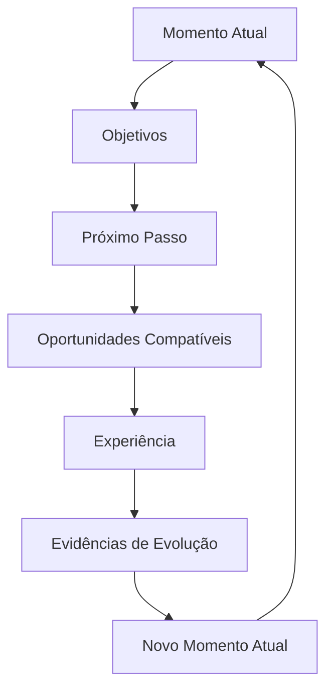
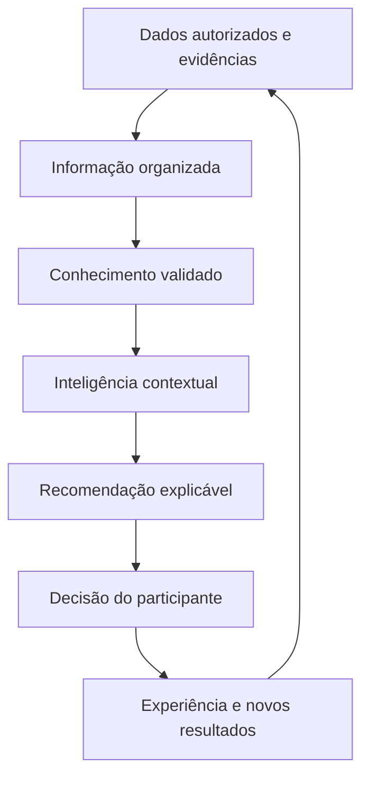

# Guia Oficial da Guivos

## Controle do documento

| Campo | Informação |
|---|---|
| Nome | Guia Oficial da Guivos |
| Finalidade | Explicar, em linguagem pública e prática, o que é a Guivos, por que ela existe, como funcionará, quais são seus limites e como pessoas e organizações poderão participar |
| Público | Pessoas, empresas, organizações, comunidades, movimentos, parceiros, imprensa, investidores, fornecedores, colaboradores e interessados em geral |
| Responsável institucional | Guivos |
| Versão | 3.0.0 |
| Última atualização | 03/07/2026 |
| Status | Public Canon |
| Fonte principal | Guivos Knowledge Repository |
| Natureza | Documento vivo, atualizado conforme a evolução oficial do repositório |

> Este guia traduz para linguagem pública as decisões consolidadas no Guivos Knowledge Repository. Não apresenta hipóteses, discussões preliminares ou planos não validados como fatos concluídos.

## Regra editorial principal

Nenhum conceito abstrato deve ser apresentado antes de o leitor compreender, por meio de uma situação concreta, qual problema esse conceito resolve.

---

# 1. Imagine esta situação

João sente que precisa melhorar alguma área da vida.

Talvez queira encontrar um novo emprego, aumentar a renda, voltar a estudar, cuidar da saúde, fortalecer a espiritualidade, melhorar relacionamentos, fazer novas amizades, praticar esporte, viajar, abrir uma empresa, participar de uma causa social ou encontrar mais propósito.

João sabe que deseja avançar, mas não sabe por onde começar.

Quando procura ajuda, encontra milhares de cursos, vídeos, especialistas, eventos, vagas, viagens, grupos, comunidades, igrejas, movimentos, empresas e projetos sociais. As oportunidades existem, mas estão espalhadas. Algumas são boas, outras não combinam com sua realidade e muitas aparecem sem orientação.

O problema de João não é apenas falta de informação.

É informação demais, pouca organização e dificuldade para identificar qual oportunidade realmente faz sentido agora.

A Guivos foi criada para enfrentar esse problema.

---

# 2. O problema da fragmentação das oportunidades

O mundo já possui milhões de oportunidades capazes de transformar vidas, organizações e comunidades.

O problema é que elas estão fragmentadas.

- pessoas procuram oportunidades sem saber onde encontrá-las;
- empresas oferecem programas sem alcançar o público certo;
- universidades possuem bolsas que muitas pessoas desconhecem;
- igrejas e comunidades oferecem apoio sem alcançar quem está buscando;
- ONGs precisam de voluntários enquanto pessoas desejam ajudar;
- grupos esportivos procuram participantes;
- movimentos e coletivos atuam isoladamente;
- especialistas possuem conhecimento que nem sempre chega a quem precisa;
- eventos, conteúdos, serviços e experiências aparecem em canais separados.

A Guivos nasce para reduzir essa fragmentação, organizar possibilidades e conectar pessoas, grupos e organizações de forma mais relevante.

---

# 3. Definição simples da Guivos

A Guivos é um ecossistema criado para ajudar pessoas e organizações a compreender o que desejam melhorar e encontrar oportunidades, experiências, grupos, conteúdos, produtos, serviços e parceiros que possam ajudá-las a avançar.

Ao mesmo tempo, ajuda empresas, universidades, igrejas, movimentos, comunidades, ONGs, especialistas, órgãos públicos e outros participantes a disponibilizar oportunidades para quem realmente pode se beneficiar delas.

A Guivos não define o que uma pessoa deve querer para sua vida. Cada participante escolhe seus próprios objetivos.

> **A Guivos conecta pessoas que desejam evoluir às oportunidades, experiências, grupos e organizações que podem ajudá-las a dar o próximo passo.**

---

# 4. Essência, propósito, missão e visão

## Essência

A Guivos é um ecossistema criado para acelerar jornadas de evolução por meio das oportunidades mais relevantes para cada momento de vida.

Ela não existe para substituir pessoas, organizações, coletivos ou instituições. Existe para fortalecer conexões entre participantes e ampliar sua capacidade de gerar evolução.

## Formulação central

> **A Guivos reduz a distância entre o Momento Atual de um participante e seu Próximo Passo de evolução.**

## Propósito

> **Acelerar jornadas de evolução por meio das oportunidades mais relevantes para cada momento de vida.**

## Missão

Ajudar cada participante a evoluir continuamente por meio de oportunidades relevantes, experiências, conexões e conhecimento.

## Visão

Tornar-se um ecossistema global de descoberta, conexão e desenvolvimento de oportunidades capazes de transformar positivamente a vida de pessoas, organizações e comunidades.

---

# 5. O que a Guivos não é

A Guivos utiliza elementos presentes em diferentes tipos de plataformas, mas não pode ser definida apenas por um deles.

A Guivos não é apenas:

- uma rede social;
- um marketplace;
- um aplicativo de viagens;
- uma plataforma de cursos;
- um portal de empregos;
- uma agência de turismo;
- um programa de benefícios;
- um aplicativo de saúde;
- uma plataforma religiosa;
- uma comunidade online;
- uma empresa de mídia;
- uma plataforma de inteligência artificial;
- um sistema de pontos;
- um catálogo genérico de anúncios.

Cada uma dessas atividades pode aparecer dentro do ecossistema quando contribuir para uma jornada real. Nenhuma delas, isoladamente, representa a Guivos.

---

# 6. Que evolução é essa?

Na Guivos, evolução não significa que todas as pessoas devam buscar o mesmo objetivo ou seguir um único modelo de vida.

Cada participante define o que significa evoluir para si.

Evoluir pode significar:

- conseguir o primeiro emprego;
- mudar de profissão;
- aumentar a renda;
- organizar a vida financeira;
- concluir uma formação;
- conseguir uma bolsa de estudos;
- cuidar da saúde física;
- fortalecer a saúde emocional;
- desenvolver a espiritualidade;
- melhorar relacionamentos;
- ampliar o círculo de amizades;
- participar de uma comunidade;
- começar a correr ou pedalar;
- viajar e conhecer outras culturas;
- desenvolver um negócio;
- servir em uma ação social;
- apoiar uma causa ambiental ou animal;
- descobrir novas possibilidades para a própria vida.

A evolução também pode acontecer com organizações e grupos.

Uma empresa pode desenvolver colaboradores e melhorar o relacionamento com clientes. Uma igreja pode ampliar sua capacidade de acolhimento. Uma universidade pode aproximar bolsas de quem precisa. Uma ONG pode encontrar voluntários. Um grupo de ciclistas pode reunir mais participantes e criar novas ações.

---

# 7. O que significa Momento Atual?

O Momento Atual é a fotografia da realidade de uma pessoa ou organização em determinado período.

Ele pode envolver:

- objetivos e necessidades;
- profissão, renda e formação;
- saúde e bem-estar;
- espiritualidade;
- relacionamentos;
- cidade ou região;
- disponibilidade de tempo;
- interesses e conhecimentos;
- experiências anteriores;
- limitações e preferências;
- causas apoiadas;
- grupos dos quais participa.

A pessoa não precisará expor tudo sobre sua vida. A experiência deverá respeitar suas escolhas, seus limites e sua privacidade.

## Exemplo

Ana mora em Belo Horizonte, deseja cuidar da saúde, prefere atividades em grupo, tem disponibilidade aos sábados e está começando.

A Guivos poderá apresentar grupos de caminhada, pedais para iniciantes, trilhas leves, eventos de saúde, conteúdos introdutórios e organizações parceiras.

---

# 8. O que é a jornada?

A jornada é o caminho entre aquilo que a pessoa vive hoje e aquilo que deseja construir.

Ela pode começar com uma intenção ampla:

> “Quero melhorar minha saúde.”

Depois, essa intenção pode se transformar em passos concretos:

1. compreender a situação atual;
2. escolher um objetivo possível;
3. identificar um próximo passo;
4. encontrar oportunidades relacionadas;
5. decidir se deseja participar;
6. viver uma experiência;
7. observar o que mudou;
8. definir um novo passo.

É essa jornada contínua que o **Guivos Journey** pretende apoiar.

---

# 9. Ciclo Contínuo de Evolução da Guivos

O Ciclo Contínuo de Evolução da Guivos representa a forma como pessoas e organizações avançam dentro do ecossistema.

Ele não possui um ponto final definitivo. Cada experiência pode produzir aprendizados, resultados e mudanças que formam um **Novo Momento Atual**. Esse novo estado passa a ser o ponto de partida do ciclo seguinte.

> **O ciclo nunca termina. Cada transformação gera um novo Momento Atual, que pode trazer novas necessidades, novos interesses, novos objetivos e novas oportunidades.**

## O que acontece em cada etapa

- **Momento Atual:** realidade da pessoa naquele período;
- **Objetivos:** aquilo que ela deseja alcançar, desenvolver ou viver;
- **Próximo Passo:** mudança mais relevante para aquele momento;
- **Oportunidades Compatíveis:** meios concretos capazes de apoiar esse passo;
- **Experiência:** vivência efetiva de uma oportunidade;
- **Evidências de Evolução:** resultados, aprendizados, relações ou mudanças produzidas;
- **Novo Momento Atual:** incorporação do que mudou e início de um novo ciclo.

## Exemplo

Rafael deseja cuidar melhor da saúde. Seu primeiro passo é começar uma atividade leve. Ele encontra um grupo de caminhada, participa de alguns encontros e percebe que gosta de atividades coletivas.

A experiência produz mudanças: Rafael ganha disposição, cria amizades e desenvolve interesse por ciclismo.

Agora seu Momento Atual é diferente. O próximo ciclo pode começar com outro objetivo, como participar de um grupo de pedal para iniciantes.

A jornada não terminou. Ela evoluiu.

---

# 10. Quem oferece as oportunidades?

A Guivos não criará sozinha todas as oportunidades.

Elas poderão ser oferecidas por:

- empresas;
- universidades e escolas;
- igrejas e comunidades religiosas;
- movimentos;
- comunidades e coletivos;
- ONGs;
- órgãos públicos;
- especialistas;
- grupos esportivos;
- produtores de experiências;
- parceiros locais.

## Exemplos

Uma universidade poderá oferecer bolsas.

Uma empresa poderá divulgar vagas, benefícios, mentorias e programas de desenvolvimento.

Uma igreja poderá divulgar grupos de oração, retiros e ações comunitárias.

Um movimento como Legendários poderá apresentar suas atividades e critérios.

Uma ONG poderá buscar voluntários e parceiros.

Um grupo de pedal poderá receber novos integrantes.

---

# 11. A Guivos fortalece o que já existe

A Guivos não pretende substituir, renomear ou absorver a identidade de grupos, movimentos, igrejas, comunidades, ONGs ou organizações.

Um grupo de pedal continuará sendo o grupo criado por seus integrantes.

Uma igreja continuará preservando sua identidade e suas crenças.

Um movimento continuará sendo o próprio movimento.

Uma ONG continuará responsável por sua causa e operação.

A Guivos pretende oferecer um ambiente comum onde essas iniciativas possam:

- apresentar quem são;
- divulgar encontros e oportunidades;
- receber novos participantes;
- encontrar parceiros;
- conectar-se a empresas e instituições;
- colaborar com outros grupos;
- fortalecer suas atividades;
- preservar relacionamentos e aprendizados.

---

# 12. Papel das pessoas, organizações e da Guivos

## Papel da pessoa

A pessoa pode:

- informar o que deseja melhorar;
- descobrir oportunidades;
- participar de experiências;
- aprender;
- criar ou integrar grupos;
- compartilhar conhecimento;
- liderar iniciativas;
- apoiar outras pessoas;
- revisar seus objetivos ao longo do tempo.

Ela não é apenas consumidora. É participante ativa do ecossistema.

## Papel das organizações

Empresas, universidades, igrejas, movimentos, ONGs e demais instituições podem:

- oferecer oportunidades;
- criar experiências;
- formar comunidades;
- distribuir benefícios;
- compartilhar conhecimento;
- desenvolver pessoas;
- apoiar causas;
- formar parcerias;
- acompanhar resultados legítimos.

## Papel da Guivos

A Guivos existe para:

- compreender contextos;
- organizar oportunidades;
- conectar pessoas e organizações;
- fortalecer comunidades;
- apoiar jornadas;
- facilitar experiências;
- produzir inteligência;
- preservar a autonomia;
- reduzir a fragmentação do ecossistema.

---

# 13. Como a pessoa informa o que está buscando

A Guivos deverá permitir que cada pessoa indique, de forma progressiva e voluntária, áreas em que deseja avançar.

Exemplos:

- carreira e renda;
- educação;
- saúde física;
- bem-estar emocional;
- espiritualidade;
- relacionamentos;
- família;
- empreendedorismo;
- esportes;
- viagens;
- cultura;
- voluntariado;
- impacto social;
- participação comunitária;
- hobbies e lazer.

## Exemplo profissional

Pedro informa:

> “Quero conseguir uma oportunidade melhor e aumentar minha renda.”

A Guivos poderá apresentar vagas, bolsas, cursos, grupos de estudo, eventos profissionais, mentorias, comunidades de networking, empresas parceiras e conteúdos de orientação.

## Exemplo espiritual

Juliana informa:

> “Quero fortalecer minha vida espiritual e conhecer pessoas com valores semelhantes.”

A Guivos poderá apresentar igrejas parceiras, grupos de oração, estudos, retiros, movimentos, conteúdos e ações solidárias.

---

# 14. Como a Guivos funcionará na prática

Uma experiência completa poderá ocorrer assim:

1. a pessoa conhece a Guivos;
2. informa o que deseja melhorar, descobrir ou viver;
3. escolhe quais informações deseja compartilhar;
4. a Guivos organiza o contexto disponível;
5. possíveis próximos passos são apresentados;
6. oportunidades, grupos e organizações são encontrados;
7. a pessoa compara as opções;
8. decide se deseja participar;
9. vive uma experiência;
10. reconhece o que mudou;
11. recebe novas possibilidades compatíveis com seu novo momento.

A pessoa poderá ajustar objetivos, interromper uma jornada, mudar de interesse ou rejeitar recomendações.

---

# 15. Como a Guivos decide o que entra no ecossistema?

Uma iniciativa deverá ser analisada por perguntas como:

- contribui para a evolução de pessoas ou organizações?
- ajuda alguém a se aproximar de um objetivo legítimo?
- fortalece relações, comunidades ou experiências?
- respeita a autonomia e a dignidade das pessoas?
- possui valor real além da venda imediata?
- pode ser explicada dentro do propósito da Guivos?
- respeita a legislação e os princípios do ecossistema?
- apresenta informações claras e responsáveis?

Quando a resposta for negativa, a iniciativa poderá ser recusada, limitada ou retirada.

## Atividades incompatíveis

Não fazem parte da proposta:

- jogos de azar, apostas e cassinos;
- pirâmides financeiras e golpes;
- produtos ou serviços ilícitos;
- publicidade enganosa;
- exploração de vulnerabilidades;
- conteúdo de ódio ou violência;
- spam e ofertas abusivas;
- atividades contrárias à lei, segurança ou dignidade das pessoas.

## Atividades legítimas sem aderência automática

Restaurantes, bares, lojas e outros segmentos não estão proibidos apenas por sua categoria. A participação depende do contexto.

Um restaurante pode fazer sentido em uma viagem, roteiro cultural, benefício corporativo, encontro comunitário ou ação social. Uma promoção isolada, sem relação com qualquer jornada, não possui aderência automática.

> **A simples existência de uma atividade econômica não justifica sua presença na Guivos. A participação depende da contribuição real para pessoas, organizações, comunidades ou jornadas.**

---

# 16. Princípios permanentes da Guivos

## Evolução antes da tecnologia

A tecnologia é meio. A finalidade é apoiar pessoas e organizações.

## Autonomia antes da automação

A decisão final pertence ao participante.

## Contexto antes da recomendação

A mesma oportunidade pode ser útil para uma pessoa e inadequada para outra.

## Relevância antes de volume

A Guivos não precisa reunir tudo. Precisa organizar o que realmente faz sentido.

## Ecossistema antes de plataforma

A Guivos fortalece relações entre participantes e não existe como um fim em si mesma.

## Comunidades antes de audiência

Grupos e movimentos devem ser reconhecidos como participantes legítimos, não apenas como público a ser capturado.

## Evidências antes de afirmações

Conhecimento, recomendações e decisões relevantes devem buscar fundamentos confiáveis.

## Cooperação antes do isolamento

A Guivos busca criar conexões entre iniciativas que hoje funcionam separadamente.

## Realização progressiva

A visão será construída por etapas. Nem tudo estará disponível ao mesmo tempo.

---

# 17. Produtos da Guivos

## Guivos Journey

Apoia pessoas e organizações na compreensão do Momento Atual, organização de objetivos, identificação de próximos passos e acompanhamento de experiências.

## Guivos Marketplace

Organiza a oferta e comercialização de produtos, serviços, assinaturas, gift cards e ativos relacionados às jornadas. Não deve funcionar como catálogo genérico sem curadoria.

## Guivos Travel

Reúne viagens, destinos e experiências turísticas ligadas a cultura, natureza, aprendizagem, grupos e comunidades.

## Guivos Business

Entrega soluções para empresas e organizações, incluindo desenvolvimento de pessoas, benefícios, jornadas corporativas, recompensas, fidelização, engajamento, retenção, recorrência, captação de clientes, parcerias, impacto social e inteligência empresarial.

Não deve ser tratado como CRM genérico, publicidade irrestrita ou programa de pontos desconectado do propósito.

## Guivos Media

Produz e distribui vídeos, podcasts, entrevistas, documentários, histórias reais, livros, artigos, newsletters e materiais editoriais.

## Guivos Intelligence

Transforma dados, contexto, evidências e conhecimento em recomendações, indicadores, tendências e análises úteis.

## Guivos Ads

Opera publicidade, patrocínios e mídia patrocinada com regras de transparência, identificação e relevância.

---

# 18. Como os produtos se conectam

Uma pessoa assiste a um conteúdo no **Guivos Media** sobre voluntariado.

No **Guivos Journey**, informa interesse em participar de uma causa.

O **Guivos Intelligence** ajuda a organizar oportunidades compatíveis.

Uma ONG participa por meio do **Guivos Business**.

A pessoa vive a experiência.

Se houver produto ou serviço necessário, ele poderá aparecer no **Guivos Marketplace**.

Uma empresa poderá apoiar a ação por meio do **Guivos Ads**.

Se houver deslocamento, o **Guivos Travel** poderá apoiar essa parte da experiência.

---

# 19. Como a inteligência artificial da Guivos aprende

A inteligência artificial da Guivos não deverá funcionar apenas como um sistema de conversa ou recomendação automática.

Ela deverá aprender continuamente com conhecimento confiável, evidências, experiências do ecossistema e movimentação autorizada dos participantes.

## 19.1 Conhecimento científico, técnico e institucional

A IA poderá utilizar conhecimento produzido por:

- universidades;
- instituições de pesquisa;
- organismos públicos e multilaterais;
- centros de referência;
- estudos científicos;
- artigos revisados por pares;
- livros;
- normas técnicas;
- especialistas qualificados;
- bases públicas e institucionais confiáveis.

A existência de uma publicação não garante sua aceitação automática. As fontes deverão ser avaliadas quanto a qualidade, atualidade, contexto, limites e aplicabilidade.

## 19.2 Conhecimento produzido pelo ecossistema

Experiências, resultados e padrões agregados poderão ajudar a melhorar futuras recomendações, respeitando privacidade, consentimento, anonimização e qualidade dos dados.

Exemplo: se determinadas formações apresentam bons resultados para pessoas com contextos semelhantes, essa evidência poderá ajudar outras pessoas a descobrir oportunidades relevantes.

## 19.3 Aprendizado com a movimentação da pessoa

Com autorização e transparência, a IA poderá aprender com:

- objetivos informados;
- interesses que mudam;
- oportunidades visualizadas;
- experiências realizadas;
- conteúdos consumidos;
- grupos dos quais a pessoa participa;
- habilidades desenvolvidas;
- preferências confirmadas ou rejeitadas;
- mudanças de disponibilidade, localização ou contexto;
- evidências de progresso.

Essa movimentação fornece sinais, não verdades absolutas. A pessoa poderá corrigir, rejeitar ou atualizar interpretações.

## 19.4 Aprendizado coletivo

A Guivos poderá identificar padrões agregados que ajudem a compreender jornadas, necessidades locais, oportunidades pouco conhecidas, lacunas de oferta e conexões entre organizações.

Essas análises não devem reduzir pessoas a perfis rígidos nem justificar discriminação.

## 19.5 Da evidência à recomendação

A IA deverá transformar dados em informação organizada, relacionar essa informação com conhecimento confiável, interpretar o contexto e apresentar recomendações compreensíveis.

A decisão continua pertencendo à pessoa.

## O que a IA não deverá fazer

Ela não deverá:

- decidir o que alguém deve querer;
- impor objetivos ou caminhos;
- substituir profissionais especializados;
- tratar inferências como certezas;
- utilizar qualquer fonte como verdade automática;
- manipular escolhas;
- expor dados;
- otimizar apenas engajamento, venda ou permanência na plataforma em prejuízo do participante.

O modelo completo está registrado em `GAI-001 — Guivos Artificial Intelligence Knowledge Model`.

---

# 20. Dados, privacidade e confiança

A Guivos poderá utilizar informações fornecidas voluntariamente, preferências, interações e registros de experiências para operar serviços, encontrar oportunidades, melhorar recomendações, proteger o ecossistema e cumprir obrigações legais.

A pessoa deverá manter controle sobre suas informações conforme as regras e a legislação aplicável.

Nenhum sistema pode prometer segurança absoluta. O compromisso deve ser reduzir riscos, responder a incidentes e evoluir continuamente.

---

# 21. Como a Guivos poderá se sustentar

A Guivos poderá gerar receita por meio de:

- planos para pessoas;
- planos e soluções para empresas;
- serviços B2B;
- produtos e serviços comercializados;
- viagens e experiências;
- publicidade responsável;
- patrocínios;
- conteúdos de marca;
- relatórios e análises agregadas;
- parcerias;
- produtos digitais.

Monetização não substitui propósito.

---

# 22. Estágio atual da Guivos

## Consolidado no repositório

- identidade, propósito, missão e visão;
- princípios permanentes;
- arquitetura institucional;
- estrutura superior dos produtos;
- Ciclo Contínuo de Evolução da Guivos;
- limites públicos de aderência ao ecossistema;
- modelo conceitual de aprendizagem da inteligência artificial;
- governança documental e arquitetural;
- Guia Oficial da Guivos.

## Em validação, desenvolvimento ou planejamento

- Modelo Fundamental e Core Capabilities;
- modelos econômicos e operacionais detalhados;
- capacidades técnicas de dados e inteligência artificial;
- produtos e integrações;
- participação operacional de grupos e organizações;
- programas de recompensas e fidelização;
- expansão geográfica;
- regras operacionais detalhadas.

---

# 23. Perguntas frequentes

## A Guivos é uma rede social?

Não. Relacionamentos podem fazer parte da experiência, mas o escopo é mais amplo.

## A Guivos é um marketplace?

Não. Existe um produto comercial, mas a Guivos não é definida por transações.

## O que é o Ciclo Contínuo de Evolução?

É a representação da jornada em que cada experiência pode formar um Novo Momento Atual e iniciar outro ciclo.

## A Guivos aceita qualquer empresa ou anúncio?

Não. A participação depende de legalidade, qualidade, transparência e aderência ao propósito.

## Restaurantes e bares estão proibidos?

Não como categoria. A participação depende da relação com uma jornada ou experiência relevante.

## Jogos de azar e apostas poderão participar?

Não fazem parte da proposta da Guivos.

## A Guivos decide o que significa evoluir?

Não. Cada pessoa ou organização define seus próprios objetivos.

## A IA decidirá o que devo fazer?

Não. Ela poderá organizar conhecimento e recomendar possibilidades. A decisão permanece com a pessoa.

## A IA aprenderá com meus movimentos?

Poderá aprender com informações e interações autorizadas, respeitando privacidade, finalidade, transparência e possibilidade de correção.

## A IA usará livros e estudos?

Poderá utilizar livros, pesquisas, instituições, normas e outras fontes confiáveis, desde que sejam avaliadas quanto a qualidade, atualidade, contexto e limites.

## Igrejas, universidades, movimentos e ONGs poderão participar?

Sim, conforme os critérios do ecossistema e a disponibilidade operacional, preservando identidade e responsabilidade próprias.

## A Guivos já está funcionando?

A arquitetura e os produtos estão documentados em diferentes níveis. Este guia não afirma que todos estejam disponíveis ao público.

---

# 24. Informações que ainda exigem validação

Não devem ser apresentadas como disponíveis ou definitivas sem nova validação:

- datas de lançamento;
- preços e planos;
- cidades e países de início;
- funcionalidades técnicas específicas;
- integrações externas;
- parceiros já contratados;
- participação efetiva das organizações citadas como exemplos;
- regras finais de recompensas, fidelização, captação e retenção;
- métricas de usuários, receita ou impacto;
- detalhes de infraestrutura e segurança;
- modelos técnicos de inteligência artificial;
- disponibilidade pública de cada produto;
- critérios finais de cadastro, curadoria, moderação, suporte e atendimento;
- políticas legais e de privacidade ainda não publicadas.

> Os nomes e tipos de organizações citados neste guia demonstram como o ecossistema poderá funcionar. A citação não representa parceria formal, salvo anúncio oficial específico.

---

# 25. Conclusão

A Guivos existe para ajudar pessoas e organizações a transformar desejos amplos em próximos passos mais claros.

Ela pretende reduzir a fragmentação das oportunidades e conectar quem busca evoluir a experiências, grupos, movimentos, empresas, universidades, igrejas, comunidades, ONGs, especialistas e parceiros.

A jornada não possui um encerramento definitivo. Cada experiência pode gerar um Novo Momento Atual e abrir novas possibilidades.

A tecnologia e a inteligência artificial apoiarão esse processo com dados, conhecimento, estudos, evidências e contexto, mas a autonomia continuará pertencendo às pessoas e organizações.

A Guivos não pretende reunir qualquer anúncio, produto ou empresa apenas por interesse comercial. Seu crescimento deverá respeitar relevância, utilidade, legalidade, transparência, privacidade e aderência ao propósito.

---

# Histórico resumido de alterações

| Versão | Data | Alteração principal |
|---|---|---|
| 1.0.0 | 03/07/2026 | Criação da primeira versão pública oficial |
| 2.0.0 | 03/07/2026 | Reestruturação da narrativa, definição prática de evolução, momento atual, jornada, grupos e parceiros |
| 2.1.0 | 03/07/2026 | Inclusão do que a Guivos não é, limites de atuação, critérios de aderência e ampliação do Guivos Business |
| 2.2.0 | 03/07/2026 | Inclusão do Ciclo Contínuo de Evolução da Guivos |
| 3.0.0 | 03/07/2026 | Consolidação pública da Foundation, fragmentação das oportunidades, papéis dos participantes, princípios permanentes e modelo de aprendizagem da IA |

# Regra de atualização contínua

Este documento deverá ser revisto quando houver alteração relevante em:

- identidade, propósito, missão ou visão;
- definição pública de evolução, jornada ou Momento Atual;
- Ciclo Contínuo de Evolução;
- princípios permanentes;
- produtos e nomenclaturas;
- critérios de entrada e permanência no ecossistema;
- grupos, organizações e modelos de participação;
- inteligência artificial, conhecimento e dados;
- privacidade e confiança;
- modelo de negócio;
- estágio de desenvolvimento;
- impacto social;
- expansão;
- baselines e decisões arquiteturais.

Toda atualização deverá preservar linguagem acessível, partir de exemplos concretos, substituir informações superadas e distinguir claramente o que está consolidado, em validação, em desenvolvimento, planejado ou restrito à visão futura.