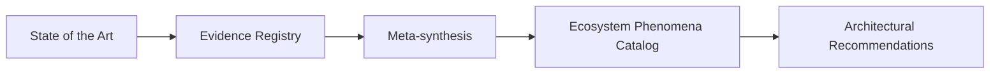

# RP-001 — Research Protocol

## Pergunta de pesquisa

> Quais condições permanentes aparecem repetidamente em ecossistemas complexos capazes de gerar valor sustentável para seus participantes?

## Objetivo

Definir o método de mapeamento do estado da arte, seleção de fontes, coleta de evidências, síntese interdisciplinar e produção de recomendações arquiteturais utilizadas pelo RP-001.

## Princípios aplicáveis

### Neutralidade arquitetural

O programa não busca confirmar hipóteses previamente aceitas pela Guivos. Evidências contrárias devem ser registradas e consideradas com o mesmo rigor.

### Suficiência arquitetural

A investigação utilizará o menor nível de abstração suficiente para explicar o domínio e apoiar decisões arquiteturais, evitando deriva filosófica ou universalização desnecessária.

### Compreensão antes da prescrição

O programa deve primeiro compreender como o domínio é explicado pelas disciplinas relevantes. Recomendações arquiteturais somente serão produzidas após síntese explícita das evidências.

## Etapa 1 — Estado da arte

Antes da coleta sistemática de fenômenos, o programa deverá mapear:

1. modelos explicativos existentes;
2. convergências entre disciplinas;
3. divergências conceituais;
4. limitações dos modelos atuais;
5. lacunas relevantes para a arquitetura da Guivos.

O estado da arte não cria Canon. Ele define o terreno conceitual sobre o qual a pesquisa será conduzida.

## Critérios de inclusão

Serão priorizadas disciplinas que estudam sistemas complexos, redes, ecossistemas, plataformas, organizações, conhecimento e geração sustentável de valor entre múltiplos participantes.

Fontes elegíveis devem apresentar relação direta com a pergunta de pesquisa e permitir extração de princípios, mecanismos, condições ou modelos explicativos.

## Critérios de exclusão

Serão excluídas fontes cujo foco seja exclusivamente:

- implementação tecnológica;
- gestão operacional;
- metodologias ágeis;
- marketing ou vendas;
- tendências temporárias;
- reflexões filosóficas sem impacto arquitetural concreto;
- opiniões sem fundamentação verificável;
- casos isolados sem possibilidade de generalização ou comparação.

## Unidade de observação

Condição permanente, mecanismo, propriedade ou relação apresentada como necessária, recorrente ou relevante para a geração sustentável de valor em ecossistemas complexos.

## Critérios de qualidade das fontes

Cada fonte deverá ser avaliada pelos seguintes critérios:

| Critério | Pergunta |
|---|---|
| Relevância | A fonte responde diretamente à pergunta de pesquisa? |
| Autoridade | O autor, instituição ou publicação possui reconhecimento no campo? |
| Rigor | O argumento ou resultado apresenta método, evidência ou fundamentação explícita? |
| Generalidade | O conteúdo permite inferências além de um caso isolado? |
| Permanência | O conhecimento tende a permanecer válido além de tendências temporárias? |
| Aplicabilidade | A fonte pode reduzir incerteza arquitetural concreta? |
| Transparência | Limitações, escopo e pressupostos estão identificáveis? |

## Níveis de evidência

| Nível | Definição |
|---|---|
| E0 | Hipótese interna ainda sem evidência externa |
| E1 | Evidência isolada ou caso único relevante |
| E2 | Evidência consistente em múltiplas fontes da mesma disciplina |
| E3 | Convergência em múltiplas disciplinas ou referenciais independentes |
| E4 | Princípio amplamente consolidado, com alta recorrência e baixa controvérsia no escopo analisado |

O nível de evidência não determina sozinho uma decisão arquitetural. Ele informa a força do suporte disponível.

## Extração de evidências

Cada fonte deverá responder, quando aplicável:

1. qual fenômeno, condição, propriedade ou mecanismo é identificado;
2. como ele é definido;
3. qual papel exerce no sistema estudado;
4. se é essencial, desejável, contextual ou emergente;
5. quais relações mantém com outros fenômenos;
6. quais limitações ou controvérsias são reconhecidas;
7. qual implicação potencial possui para a arquitetura da Guivos.

## Método de síntese

1. mapear o estado da arte;
2. registrar as fontes no Evidence Registry;
3. extrair os fenômenos, condições, propriedades e mecanismos identificados;
4. agrupar conceitos semanticamente equivalentes;
5. comparar convergências, divergências e limitações entre disciplinas;
6. atribuir níveis de evidência;
7. consolidar os fenômenos no Ecosystem Phenomena Catalog;
8. construir meta-síntese e modelos explicativos provisórios;
9. produzir recomendações para o BA-STR-002.

## Critérios de maturidade dos modelos

Um modelo explicativo somente será considerado suficientemente maduro quando:

- explicar de forma coerente o fenômeno estudado;
- orientar decisões arquiteturais concretas;
- permitir previsões coerentes dentro de limites declarados;
- manter consistência em contextos distintos ou explicitar seus limites de generalização;
- possuir rastreabilidade até evidências registradas.

## Critério de saturação

A pesquisa poderá ser encerrada quando novas fontes qualificadas deixarem de produzir fenômenos estruturalmente distintos e passarem predominantemente a reforçar os já registrados.

A saturação deverá ser justificada por registro explícito, não presumida apenas por volume de fontes consultadas.

## Fluxo do programa

O Candidate Outcome Register — COR é criado posteriormente pela Business Architecture a partir do EPC e das recomendações produzidas pelo Research.

## Regra de governança

Nenhuma evidência, hipótese, classificação, fenômeno ou modelo registrado neste programa integra automaticamente a Canon. A decisão arquitetural permanece sob responsabilidade da arquitetura proprietária.

## Hipóteses preservadas fora da Canon

Permanecem como hipóteses de pesquisa, sem promoção automática:

- Sistema Humano de Evolução;
- transformação como fenômeno fundamental;
- mudança de estado como unidade mínima;
- Worldview como possível elemento explícito da Foundation;
- Knowledge-Centric Enterprise;
- modelo explicativo definitivo do domínio.

## Situação

O protocolo está conceitualmente estruturado. A próxima etapa é iniciar o mapeamento do estado da arte e registrar as primeiras fontes qualificadas no Evidence Registry.
