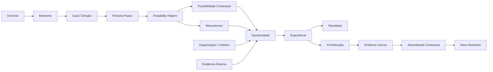

# RP-002 — Possibilidades, Oportunidades, Supply e Evidência de Contribuição

## 1. Finalidade

O `RP-002` consolida a investigação conduzida para responder a uma das perguntas mais importantes ainda abertas no ecossistema Guivos:

> **Se compreendermos o Momento de uma Pessoa, existem no mundo possibilidades e oportunidades concretas suficientemente relevantes para ajudá-la a avançar?**

A investigação surgiu de uma preocupação estratégica real: a Guivos poderia possuir uma arquitetura sofisticada de Jornada, Inteligência e evolução humana, mas ainda assim falhar se o mundo concreto não oferecesse supply suficiente, legítimo, acessível e contextualizável para transformar Próximos Passos em experiências possíveis.

O programa examina simultaneamente cinco problemas:

1. **semântico** — distinguir Possibilidade, Oportunidade, Próximo Passo, mecanismo, experiência, resultado e contribuição;
2. **supply** — verificar se existe oferta real, diversa e global nos Domínios de Evolução;
3. **governança** — definir como descobrir, admitir, verificar, atualizar e explicar oportunidades sem vender relevância;
4. **ecossistema** — compreender o papel de Organizações, Coletivos e demais agentes na criação, habilitação e melhoria do supply;
5. **valor e validação** — testar se a Guivos gera valor real para Pessoas além de busca, IA generalista e marketplaces e como essa tese deverá ser falsificada empiricamente.

## 2. Natureza deste programa

O `RP-002` pertence a **Research**.

Ele não cria Canon diretamente e não substitui as autoridades arquiteturais existentes. Seu papel é reduzir incerteza e registrar, com rastreabilidade, o que foi:

- previamente canônico;
- sustentado por evidência externa;
- convergido conceitualmente durante a investigação;
- apenas simulado;
- proposto como hipótese;
- deixado explicitamente para validação de campo.

A regra de interpretação é:

> **Pesquisa reduz incerteza. Arquitetura decide. Evidência de campo pode confirmar, reformular ou rejeitar a hipótese.**

## 3. Pergunta principal

> **Quais caminhos potenciais e quais meios reais, disponíveis, legítimos e compatíveis podem apoiar uma Pessoa em seu contexto atual — e como a Guivos pode aprender, sem fabricar causalidade, o que aconteceu depois que esses meios foram efetivamente vividos?**

## 4. Perguntas derivadas

O programa investiga:

- Existe supply suficiente em todos os nove Domínios de Evolução?
- Supply abundante globalmente continua abundante quando filtrado por contexto, território, horário, custo, acessibilidade, elegibilidade e segurança?
- O que é uma Possibilidade e quando essa abstração agrega valor?
- Qual a diferença entre Possibilidade e Oportunidade?
- Como Organizações e Coletivos materializam ou habilitam caminhos?
- Como descobrir oportunidades sem depender de cadastro prévio do fornecedor?
- Como preservar proveniência, autoridade da fonte, temporalidade e conflitos entre fontes?
- Como admitir oportunidades sem transformar disponibilidade comercial em relevância humana?
- Como tratar evidence externa e Evidence Guivos sem confundir correlação, relato, resultado e causalidade?
- Como Organizações e Coletivos recebem valor sem comprar prioridade, autoridade ou força de evidência?
- Como monetizar infraestrutura, operação, transação e Intelligence sem monetizar fit, dignidade, vulnerabilidade ou decisão humana?
- Qual é o valor específico da Guivos em um mundo em que Google e IA generalista já pesquisam, conversam, lembram e personalizam?
- Que evidência seria necessária para declarar PMF ou rejeitar a tese?

## 5. Autoridades existentes preservadas

Este programa não redefine os seguintes contratos canônicos:

### 5.1 Jornada fundamental

A Jornada continua organizada por:

```text
Participante
→ Momento Atual
→ Objetivos
→ Próximo Passo
→ Oportunidades Compatíveis
→ Experiência
→ Evidência de Evolução
→ Novo Momento Atual
→ loop
```

`Próximo Passo` continua sendo uma **decisão ou hipótese de movimento relevante**, e não uma oportunidade.

`Oportunidade` continua sendo um meio potencialmente disponível.

`Experiência` continua sendo o que foi efetivamente vivido.

### 5.2 Quatro naturezas fundamentais

O `RP-002` não propõe uma quinta natureza fundamental.

As quatro naturezas permanecem:

- **Estado** — Participante, Momento Atual, Objetivos;
- **Decisão** — Próximo Passo;
- **Transição** — Oportunidades Compatíveis e Experiência;
- **Resultado** — Evidência de Evolução e Novo Momento Atual.

`Possibilidade`, quando útil, funciona como **ponte semântica de descoberta**, não como nova natureza fundamental.

### 5.3 Oportunidades Ativas

A autoridade normativa de Oportunidades Ativas continua em `PAS-001` e suas extensões.

A investigação reforça, sem substituir, a pergunta canônica:

> **Quais meios disponíveis, legítimos e compatíveis podem apoiar este participante em seu contexto atual?**

### 5.4 Organizações e Coletivos

`UXA-014` permanece autoridade funcional para Organizações e Coletivos.

O `RP-002` aprofunda empiricamente e economicamente seus papéis no supply, sem reduzi-los a anunciantes, páginas, contas comerciais ou canais de distribuição.

### 5.5 Modelo Econômico

`GEM-001` e `GEM-002` permanecem autoridades para geração, captura, compartilhamento e reinvestimento de valor.

O `RP-002` testa implicações específicas do supply e formula hipóteses econômicas subordinadas a esses limites.

## 6. Conclusões centrais da investigação

### 6.1 Não foi encontrada escassez estrutural de supply

O corpus real pesquisado encontrou oportunidades concretas em todos os nove Domínios de Evolução.

A conclusão não é que toda Pessoa sempre possui uma boa oportunidade disponível.

A conclusão mais precisa é:

> **A abundância global e a escassez contextual podem coexistir.**

Supply bruto diminui quando passa pelos filtros de legitimidade, disponibilidade, acesso, elegibilidade, segurança, restrições, fit contextual e evidência.

### 6.2 Possibilidade e Oportunidade são conceitos distintos

A formulação convergida é:

> **Possibilidade é um caminho potencial de evolução compatível com um Momento.**

> **Oportunidade é uma materialização concreta desse caminho, oferecida ou viabilizada por um agente legítimo, com condições reais de acesso.**

Forma operacional:

```text
POSSIBILIDADE
“O que poderia ajudar esta Pessoa a avançar?”

OPORTUNIDADE
“Quem oferece isso, onde, quando, para quem e sob quais condições?”
```

### 6.3 Relevância não é propriedade absoluta da oportunidade

A investigação converge para:

> **A relevância pertence à relação Pessoa ↔ Oportunidade.**

Uma oportunidade excelente pode ser incompatível com uma Pessoa específica.

Um programa gratuito, reconhecido e eficaz pode falhar por horário, território, elegibilidade, acessibilidade ou custo indireto.

### 6.4 Fit e evidência são dimensões diferentes

```text
FIT
→ isso faz sentido agora para esta Pessoa?

EVIDÊNCIA
→ quão sustentada é a expectativa de contribuição?
```

Evidência forte não produz fit universal.

Fit elevado não autoriza promessa de transformação.

### 6.5 Experiência não deve ser reduzida a transação

A investigação preserva:

```text
COMPRA ≠ EXPERIÊNCIA
INSCRIÇÃO ≠ PARTICIPAÇÃO
PARTICIPAÇÃO ≠ CONTRIBUIÇÃO
CONTRIBUIÇÃO ≠ TRANSFORMAÇÃO
POPULARIDADE ≠ ADERÊNCIA
```

### 6.6 A Guivos não deve depender de parceiros para descobrir supply

A descoberta pode ocorrer antes de parceria, cadastro ou claim do fornecedor.

Princípio:

```text
DISCOVERY ≠ ADMISSION ≠ PARTNERSHIP ≠ RECOMMENDATION ≠ SPONSORSHIP
```

Uma oportunidade legítima de uma pequena ONG não parceira pode ser mais relevante que uma oferta paga de uma grande empresa.

### 6.7 O risco principal migra de “falta de supply” para operação do supply

A investigação desloca o risco estratégico para:

- normalização;
- deduplicação;
- entity resolution;
- proveniência;
- freshness;
- disponibilidade;
- elegibilidade;
- matching;
- explicabilidade;
- governança de evidência;
- execução em escala.

### 6.8 O diferencial Guivos não pode ser apenas IA, busca ou memória

Busca atual, IA conversacional, memória, personalização e agentes estão rapidamente se tornando capacidades amplamente disponíveis.

A hipótese de diferenciação mais forte é a combinação de:

```text
Momento
+ Possibilidade
+ Opportunity Graph
+ gates
+ experiência efetivamente vivida
+ contribuição
+ evidência contextual
+ continuidade longitudinal
```

### 6.9 O diferencial ainda não está empiricamente provado

Nenhuma das seguintes afirmações é promovida por este programa como fato validado:

- Pessoas compreenderão e preferirão a estrutura de Possibilidades;
- a Guivos compreenderá Momentos com precisão suficiente;
- o matching superará Google ou IA generalista;
- Pessoas agirão;
- Pessoas retornarão após experiências;
- a trajetória longitudinal produzirá lift;
- Pessoas pagarão;
- Organizações pagarão pelas capacidades propostas;
- efeitos de rede ocorrerão em escala.

Essas são hipóteses de campo.

## 7. Modelo consolidado de pesquisa



Esse grafo é **modelo de pesquisa**, não promoção automática à Canon.

## 8. Classes de supply estudadas

O programa distingue quatro classes operacionais de investigação:

- **A — Direct Supply**: materializa diretamente uma Possibilidade;
- **B — Enabling Supply**: remove barreiras para que outra oportunidade possa ser vivida;
- **C — Regulated / Sensitive Supply**: pode materializar Possibilidades, mas exige governança proporcional adicional;
- **D — Incompatible Supply**: não deve ser admitido como mecanismo Guivos de evolução por ilegitimidade, risco, exploração, coerção ou ausência de relação plausível com uma Possibilidade legítima.

## 9. Supply Ecosystems

A investigação rejeita a premissa de que todo supply relevante pertença a um mercado comercial.

O universo observado inclui:

- mercados comerciais;
- sistemas públicos;
- terceiro setor;
- universidades;
- redes profissionais;
- comunidades;
- Coletivos;
- organizações religiosas em contexto opt-in;
- programas governamentais;
- voluntariado;
- plataformas digitais;
- produtos Guivos;
- infraestrutura habilitadora.

O termo de pesquisa utilizado é **Guivos Supply Ecosystem**.

## 10. Evidência dual

### 10.1 External Transformation Evidence

Evidência produzida fora da Guivos sobre mecanismos, programas, intervenções ou tipos de experiência.

Deve preservar:

- fonte;
- independência;
- qualidade;
- especificidade;
- população/contexto;
- limitações;
- força da inferência.

### 10.2 Guivos Transformation Evidence

Conhecimento produzido depois que uma Pessoa descobre, escolhe e vive uma oportunidade e retorna à Guivos.

A formulação aprovada para investigação é:

> **Essa experiência contribuiu para o seu Momento Atual?**

seguida de:

> **De que forma ela contribuiu?**

O objetivo é registrar **contribuição**, não fabricar causalidade ou transformação isolada.

## 11. Princípio econômico emergente

A principal hipótese de governança econômica produzida pela investigação é denominada, neste programa, **Neutralidade Econômica da Relevância**:

> **Plano, comissão, patrocínio, advertising, taxa, volume transacional ou receita não devem funcionar como sinais positivos de fit funcional.**

Informação factual melhor — por exemplo freshness ou disponibilidade confirmada por integração — pode aumentar confiança factual.

O pagamento pela integração não aumenta relevância por si só.

## 12. Valor potencial para os quatro lados principais

### Pessoa

> Encontrar oportunidades que façam sentido para seu Momento e compreender por que elas podem contribuir.

### Organização

> Compreender onde aquilo que oferece realmente apresenta fit, reduzir barreiras, alcançar contextos compatíveis e aprender com experiências agregadas sem comprar relevância.

### Coletivo

> Encontrar Pessoas, capacidades e recursos compatíveis com seu propósito compartilhado, organizar participação e compreender contribuição sem ser reduzido a popularidade.

### Guivos

> Compreender e conectar contexto humano, Possibilidades e oportunidades reais, aprendendo continuamente com o que acontece depois da experiência.

## 13. Hipótese de ativo estratégico

A investigação formula, ainda como hipótese:

> **O ativo estratégico da Guivos pode ser sua capacidade de compreender quais oportunidades fazem sentido para quais contextos humanos e aprender, por evidência, o que aconteceu depois que essas oportunidades foram vividas.**

Síntese de trabalho:

```text
CONTEXTO
+ POSSIBILIDADE
+ OPORTUNIDADE
+ EXPERIÊNCIA
+ EVIDÊNCIA
=
CONTRIBUTION INTELLIGENCE
```

`Contribution Intelligence` permanece expressão de pesquisa, não nome canônico aprovado de produto ou capacidade.

## 14. Mapa das 16 rodadas consolidadas

| Rodadas | Foco principal |
|---|---|
| 1–2 | problema de supply, Possibilidade × Oportunidade, fit e evidência |
| 3–5 | gramática semântica, mecanismos, Possibility Pattern e Possibilidade Contextual |
| 6 | densidade real do supply nos nove Domínios |
| 7 | Supply Ecosystems, supply direto/habilitador/regulado/incompatível |
| 8 | discovery, admission, provenance, freshness, claim e Source Coverage |
| 9 | proposta de valor para Organizações e Coletivos, Demand Intelligence e network effects |
| 10 | efeito de rede e modelo econômico do supply |
| 11 | valor real para a Pessoa e diferenciação contra Google, IA e marketplaces |
| 12 | protocolo de validação de PMF |
| 13 | desenho do primeiro piloto real |
| 14 | Field Kit v0 |
| 15 | simulação integral e identificação de falhas metodológicas |
| 16 | Field Kit v0.1, Pilot Readiness Gate e preflight operacional |

## 15. Ativos do programa

- [Modelo Conceitual](conceptual-model.md)
- [Corpus Real e Supply Ecosystems](real-world-supply-corpus.md)
- [Discovery, Admission, Proveniência e Freshness](discovery-admission-and-freshness.md)
- [Organizações, Coletivos, Rede e Modelo Econômico](organizations-collectives-and-economic-model.md)
- [Valor para a Pessoa e Diferenciação Competitiva](person-value-and-competitive-differentiation.md)
- [Validação de PMF, Field Kit e Prontidão do Piloto](pmf-validation-and-pilot-readiness.md)
- [Registro de Evidências e Estado das Claims](evidence-and-claim-status-register.md)

## 16. Limites de promoção

O `RP-002` não autoriza automaticamente:

- implementação técnica;
- criação de novo tipo canônico de entidade;
- alteração do modelo fundamental;
- criação de score de evolução;
- priorização comercial;
- monetização de dados pessoais;
- uso de Evidence Guivos como prova causal;
- exposição de Journey individual a Organizações;
- lançamento do Field Kit com Pessoas reais sem controles operacionais adequados;
- promoção dos quatro modos experimentais de Episódio à arquitetura oficial.

## 17. Estado atual

A investigação conceitual e de supply está **consolidada para Research**.

O estado correto das hipóteses de PMF é **pre-field validation**.

O próximo conhecimento de maior valor não virá de adicionar teoria, mas de execução controlada de dry runs e piloto real, preservando critérios de falsificação definidos previamente.

## 18. Regra de continuidade

Toda futura atualização deste programa deverá preservar três separações:

```text
EVIDÊNCIA EXTERNA
≠
SIMULAÇÃO
≠
VALIDAÇÃO GUIVOS REAL
```

E:

```text
CONCLUSÃO DE RESEARCH
≠
DECISÃO CANÔNICA
```
