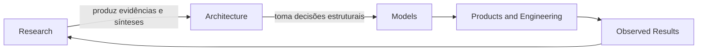

# Research

## Definição

Research é o domínio do Guivos Knowledge Repository responsável por produzir, organizar e sintetizar evidências que reduzam incertezas antes de decisões arquiteturais relevantes.

Research não cria arquitetura nem substitui a responsabilidade decisória da GEA. Seu papel é fornecer conhecimento rastreável para que as arquiteturas da Guivos tomem decisões mais consistentes.

## Princípio central

> A pesquisa reduz incerteza. A arquitetura toma decisões.

## Escopo

O domínio Research pode produzir:

- Research Programs;
- Research Protocols;
- Evidence Registries;
- Phenomena Catalogs;
- Meta-sínteses;
- Research Reports;
- Architectural Recommendations.

## Relação com a GEA

## Limites

Research:

- não define a Canon diretamente;
- não cria novas camadas arquiteturais por conta própria;
- não substitui ADRs, AVs ou ownership arquitetural;
- não conduz investigações filosóficas sem impacto arquitetural concreto;
- não bloqueia a evolução da GEA sem dependência comprovada.

## Primeiro programa

O primeiro programa oficial é o [RP-001 — Ecosystem Research Program](RP-001/index.md).

Seu objetivo é identificar condições permanentes recorrentes em ecossistemas complexos capazes de gerar valor sustentável para seus participantes e apoiar o `BA-STR-002 — Business Outcomes`.
