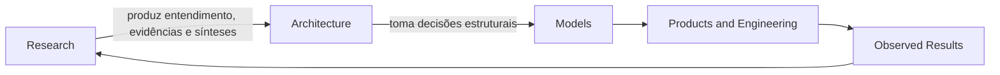

# Research

## Definição

Research é o domínio do Guivos Knowledge Repository responsável por reduzir incertezas arquiteturais por meio da construção de entendimento compartilhado, rastreável e interdisciplinar sobre o domínio da Guivos.

Research não cria arquitetura nem substitui a responsabilidade decisória da GEA. Seu papel é produzir evidências, sínteses e modelos explicativos que permitam às arquiteturas da Guivos tomar decisões mais consistentes.

## Princípio central

> A pesquisa reduz incerteza. A arquitetura toma decisões.

## Missão

Construir, validar, preservar e evoluir entendimento compartilhado sobre o domínio da Guivos, utilizando o melhor conhecimento disponível como fundamento para decisões arquiteturais.

## Princípios

### Neutralidade arquitetural

Research não busca confirmar hipóteses previamente aceitas pela Guivos. Seu compromisso é produzir a melhor síntese possível das evidências disponíveis, mesmo quando isso exigir revisar ou rejeitar hipóteses existentes.

### Suficiência arquitetural

A pesquisa deve trabalhar no menor nível de abstração capaz de explicar adequadamente o domínio e apoiar decisões corretas, evitando abstrações universais sem necessidade arquitetural demonstrada.

### Compreensão antes da prescrição

Evidências e referências são meios. O objetivo é construir entendimento suficientemente sólido para explicar o fenômeno, orientar decisões e sustentar modelos arquiteturais.

### Separação de responsabilidades

Research produz conhecimento e recomendações. A arquitetura proprietária decide, consolida e governa a Canon.

## Escopo

O domínio Research pode produzir:

- Research Programs;
- Research Protocols;
- State-of-the-Art Reviews;
- Evidence Registries;
- Phenomena Catalogs;
- Meta-sínteses;
- Explanatory Models;
- Research Reports;
- Architectural Recommendations.

## Relação com a GEA

## Limites

Research:

- não define a Canon diretamente;
- não cria novas camadas arquiteturais por conta própria;
- não substitui ADRs, AVs ou ownership arquitetural;
- não conduz investigações filosóficas sem impacto arquitetural concreto;
- não bloqueia a evolução da GEA sem dependência comprovada;
- não mede progresso apenas por volume de documentos ou referências.

## Critérios de maturidade de modelos

Um modelo produzido por Research somente será considerado suficientemente maduro quando demonstrar capacidade de:

1. explicar o fenômeno estudado;
2. orientar decisões arquiteturais;
3. sustentar previsões coerentes dentro dos limites declarados;
4. manter consistência em contextos distintos ou explicitar claramente seus limites de generalização.

## Primeiro programa

O primeiro programa oficial é o [RP-001 — Ecosystem Research Program](RP-001/index.md).

Seu objetivo é investigar o estado da arte, identificar condições permanentes recorrentes em ecossistemas complexos capazes de gerar valor sustentável para seus participantes e apoiar o `BA-STR-002 — Business Outcomes`.
