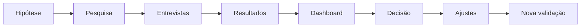

# Guivos Market Validation System

Este domínio organiza a validação de mercado da Guivos antes do lançamento e durante a evolução dos produtos.

## Objetivo

Transformar hipóteses internas em perguntas testáveis, coletar evidências de mercado e orientar decisões de produto com critérios explícitos.

## Princípios centrais

> A pesquisa não existe para provar que a Guivos é uma boa ideia. Ela existe para descobrir onde a proposta é forte, onde é fraca e o que precisa ser ajustado.

> A Guivos será construída com base em evidências e na participação das pessoas.

## Documentos

- [VAL-001 — Framework de Validação de Mercado](VAL-001-framework-de-validacao-de-mercado.md) — versão 1.1.0;
- [VAL-002 — Pesquisa Conceitual B2C](VAL-002-pesquisa-oficial-da-guivos.md) — versão 1.1.0, título público `Construindo a Guivos`;
- [VAL-003 — Guia do Entrevistador](VAL-003-guia-do-entrevistador.md);
- [VAL-004 — Modelo de Consolidação e Análise](VAL-004-modelo-de-consolidacao-e-analise.md);
- [VAL-005 — Plano de Amostragem](VAL-005-plano-de-amostragem.md);
- [VAL-006 — Dashboard de Indicadores](VAL-006-dashboard-de-indicadores.md) — versão 1.1.0;
- [VAL-007 — Critérios de Decisão](VAL-007-criterios-de-decisao.md) — versão 1.1.0;
- [VAL-008 — Sinais Comportamentais](VAL-008-sinais-comportamentais.md).

## Sequência oficial

## Escopo inicial

A primeira aplicação valida a proposta B2C da Guivos, com foco em:

- dor relacionada à descoberta de oportunidades;
- compreensão da proposta;
- valor percebido;
- transformação percebida;
- confiança;
- intenção de uso;
- potencial de recorrência;
- interesse em participar do beta;
- sinais iniciais de monetização;
- barreiras e diferenças entre segmentos.

## Estado operacional

- instrumento oficial revisado para 5 a 7 minutos;
- 23 perguntas principais;
- apenas duas perguntas abertas centrais;
- alternativas codificadas no padrão `n.x`;
- dashboard vinculado diretamente às perguntas;
- critérios formais de `Go`, `Go com ajustes`, `Pivot parcial` e `No-Go temporário`;
- mínimo de 200 respostas válidas para decisão inicial;
- meta preferencial de 500 respostas válidas.