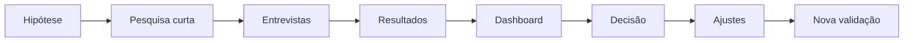

# Guivos Market Validation System

Este domínio organiza a validação de mercado da Guivos antes do lançamento e durante a evolução dos produtos.

## Objetivo

Transformar hipóteses internas em perguntas testáveis, coletar evidências de mercado e orientar decisões de produto com critérios explícitos.

## Princípios centrais

> A pesquisa não existe para provar que a Guivos é uma boa ideia. Ela existe para descobrir onde a proposta é forte, onde é fraca e o que precisa ser ajustado.

> A Guivos será construída com base em evidências e na participação das pessoas.

> Uma pergunta somente integra uma rodada quando a pessoa possui informação suficiente para avaliá-la de forma consciente.

> A validação não pressupõe que a pessoa já possua objetivo, plano ou próximo passo definido.

> O questionário público deve coletar o necessário com o menor esforço possível para quem participa.

## Documentos

- [VAL-001 — Framework de Validação de Mercado](VAL-001-framework-de-validacao-de-mercado.md) — versão 1.3.1;
- [VAL-002 — Pesquisa Oficial B2C](VAL-002-pesquisa-oficial-da-guivos.md) — versão 2.1.0, título público `Construindo a Guivos`;
- [VAL-003 — Guia do Entrevistador](VAL-003-guia-do-entrevistador.md) — versão 1.2.1;
- [VAL-004 — Modelo de Consolidação e Análise](VAL-004-modelo-de-consolidacao-e-analise.md) — versão 1.3.1;
- [VAL-005 — Plano de Amostragem](VAL-005-plano-de-amostragem.md) — versão 1.2.1;
- [VAL-006 — Dashboard de Indicadores](VAL-006-dashboard-de-indicadores.md) — versão 1.3.1;
- [VAL-007 — Critérios de Decisão](VAL-007-criterios-de-decisao.md) — versão 1.3.1;
- [VAL-008 — Sinais Comportamentais](VAL-008-sinais-comportamentais.md) — versão 1.1.1.

## Sequência oficial

## Estado operacional

- instrumento público em versão `2.1.0`;
- duração estimada de 3 a 5 minutos;
- 19 perguntas;
- uma pergunta aberta obrigatória e uma opcional;
- linguagem direta ao participante;
- alternativas em primeira pessoa quando aplicável;
- no máximo duas escolhas em perguntas de seleção múltipla;
- apresentação oficial curta, com exemplos de saúde, carreira e espiritualidade;
- descoberta tardia e busca sem opção adequada medidas separadamente;
- IFO composto por `Q8` e `Q9`;
- compreensão medida pela resposta aberta `Q11`;
- relevância medida por `Q12`;
- contribuição medida por `Q15`;
- intenção medida por `Q16`;
- interesse em primeira experiência medido por `Q17`;
- barreiras medidas por `Q18`;
- coleta geográfica por estado ou Distrito Federal;
- mínimo de 200 respostas válidas para decisão inicial;
- meta preferencial de 500 respostas válidas.

## Decisões editoriais da versão 2.1.0

- perguntas `8` e `9` foram encurtadas;
- apresentação oficial foi condensada;
- perguntas passaram a conversar diretamente com “você”;
- alternativas redundantes foram consolidadas;
- antigas `Q14` e `Q15` foram unificadas;
- o instrumento foi reduzido de 20 para 19 perguntas;
- preço permanece fora da pesquisa conceitual;
- carga cognitiva passa a ser observada no pré-teste e no dashboard.

## Escopo inicial

A primeira aplicação valida a proposta B2C da Guivos, com foco em:

- momento atual e mudança desejada;
- descoberta tardia de oportunidades;
- busca sem opção adequada;
- esforço para encontrar algo relevante;
- compreensão da proposta;
- relevância contextual;
- situação de primeiro uso;
- utilidade esperada;
- contribuição percebida;
- intenção de experimentar;
- interesse em participar de primeira experiência;
- barreiras e diferenças entre segmentos.

Confiança operacional, recorrência, retenção, recomendação e pagamento serão validados posteriormente por protótipos, beta e comportamento real.

## Entregáveis operacionais pendentes

- pré-teste do VAL-002 2.1.0 com 10 a 15 participantes;
- ajuste somente de problemas comprovados pelo pré-teste;
- formulário definitivo para aplicação;
- planilha automática para recepção, tratamento e cálculo dos KPIs, IGV e gates.
