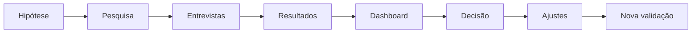

# Guivos Market Validation System

Este domínio organiza a validação de mercado da Guivos antes do lançamento e durante a evolução dos produtos.

## Objetivo

Transformar hipóteses internas em perguntas testáveis, coletar evidências de mercado e orientar decisões de produto com critérios explícitos.

## Princípios centrais

> A pesquisa não existe para provar que a Guivos é uma boa ideia. Ela existe para descobrir onde a proposta é forte, onde é fraca e o que precisa ser ajustado.

> A Guivos será construída com base em evidências e na participação das pessoas.

> Uma pergunta somente integra uma rodada quando o participante possui informação suficiente para avaliá-la de forma consciente.

> A validação não pressupõe que a pessoa já possua objetivo, plano ou próximo passo definido.

## Documentos

- [VAL-001 — Framework de Validação de Mercado](VAL-001-framework-de-validacao-de-mercado.md) — versão 1.3.0;
- [VAL-002 — Pesquisa Oficial B2C](VAL-002-pesquisa-oficial-da-guivos.md) — versão 2.0.0, título público `Construindo a Guivos`;
- [VAL-003 — Guia do Entrevistador](VAL-003-guia-do-entrevistador.md) — versão 1.2.0;
- [VAL-004 — Modelo de Consolidação e Análise](VAL-004-modelo-de-consolidacao-e-analise.md) — versão 1.3.0;
- [VAL-005 — Plano de Amostragem](VAL-005-plano-de-amostragem.md) — versão 1.2.0;
- [VAL-006 — Dashboard de Indicadores](VAL-006-dashboard-de-indicadores.md) — versão 1.3.0;
- [VAL-007 — Critérios de Decisão](VAL-007-criterios-de-decisao.md) — versão 1.3.0;
- [VAL-008 — Sinais Comportamentais](VAL-008-sinais-comportamentais.md) — versão 1.1.0.

## Sequência oficial

## Escopo inicial

A primeira aplicação valida a proposta B2C da Guivos, com foco em:

- área da vida que merece atenção;
- momento atual e nível de clareza;
- mudança ou resultado desejado;
- dificuldades;
- descoberta tardia de oportunidades;
- busca sem encontro de opção adequada;
- esforço atual;
- compreensão da proposta;
- relevância contextual;
- situação prática de primeiro uso;
- expectativas sobre o que encontrar ou fazer;
- resultado concreto considerado valioso;
- contribuição percebida;
- intenção de experimentar;
- interesse em primeira experiência;
- barreiras e diferenças entre segmentos.

Confiança operacional, recorrência, retenção, recomendação e monetização serão validadas posteriormente por protótipos, beta, demonstração de valor e comportamento real.

## Estado operacional

- instrumento oficial reconstruído para 4 a 6 minutos;
- 20 perguntas principais;
- uma pergunta aberta obrigatória e uma opcional;
- área, momento atual e mudança desejada medidos separadamente;
- pessoas sem objetivo definido reconhecidas como segmento legítimo;
- apresentação da proposta sem exigir planejamento prévio;
- comportamento atual aprofundado nas entrevistas qualitativas;
- monetização retirada da primeira pesquisa conceitual;
- descoberta tardia e ausência de opção adequada medidas separadamente;
- IFO composto por `Q8` e `Q9`;
- alternativas codificadas no padrão `n.x`;
- coleta geográfica por estado ou Distrito Federal;
- cidade ou município como campo complementar opcional;
- dashboard vinculado diretamente às perguntas;
- IGV composto por problema, compreensão, relevância, contribuição, intenção e primeira experiência;
- critérios formais de `Go`, `Go com ajustes`, `Pivot parcial` e `No-Go temporário`;
- mínimo de 200 respostas válidas para decisão inicial;
- meta preferencial de 500 respostas válidas.

## Entregáveis operacionais pendentes

- pré-teste da versão 2.0.0 com 10 a 15 participantes;
- formulário definitivo para aplicação;
- planilha automática para recepção, tratamento e cálculo dos KPIs, IGV e gates;
- protocolo posterior de monetização baseado em experiência real.
