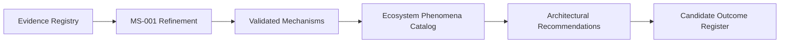

# Roadmap Arquitetural

Este roadmap acompanha a evolução do Guivos Knowledge Repository e da Guivos Enterprise Architecture.

## Baseline vigente

`M1 — Research Foundation Complete` — estado `frozen`.

## Fase M1 — Fundamentos concluídos

### Infraestrutura do GKR

- [x] Inicializar o repositório no GitHub.
- [x] Criar README e CHANGELOG.
- [x] Criar página inicial da documentação.
- [x] Configurar MkDocs.
- [x] Configurar Mermaid.
- [x] Configurar GitHub Pages.
- [x] Configurar geração de PDF como publicação derivada.
- [x] Criar Baseline M1.
- [ ] Consolidar governança completa do GKR.

### Foundation e Ecosystem Architecture

- [x] Consolidar Parte I — Fundação.
- [x] Consolidar Parte II — Modelo Fundamental.
- [ ] Consolidar Modelo dos Participantes.
- [ ] Consolidar Modelo das Oportunidades.
- [ ] Consolidar Modelo das Experiências.
- [ ] Consolidar Modelo dos Relacionamentos.
- [ ] Consolidar Modelo do Conhecimento do Ecossistema.

### Product Architecture

- [x] Consolidar estrutura superior do Ecossistema Guivos.
- [x] Consolidar Guivos Journey.
- [x] Consolidar Guivos Marketplace como produto com nome provisório.
- [x] Consolidar Guivos Travel.
- [x] Consolidar Guivos Business.
- [x] Consolidar Guivos Media.
- [x] Consolidar Guivos Intelligence.
- [x] Consolidar Guivos Ads.
- [ ] Revisar nome definitivo do Guivos Marketplace.

### Business Architecture

A ordem segue dependências arquiteturais, conforme o ADR-004.

1. [x] `BA-FND-001` — Business Architecture Foundations.
2. [x] `BA-STR-001` — Business Transformation Model.
3. [ ] `BA-STR-002` — Business Outcomes.
   - [x] Pergunta arquitetural.
   - [x] Modelo conceitual.
   - [x] Propriedades, limites e governança inicial.
   - [x] Validar provisoriamente a necessidade de uma camada anterior aos Outcomes.
   - [x] Definir Outcome Governance Method.
   - [x] Definir estrutura do COR, External Validation, COEM e AQS-O01.
   - [ ] Construir Candidate Outcome Register — COR.
   - [ ] Realizar validação externa dos grupos candidatos.
   - [ ] Aplicar Candidate Outcome Evaluation Matrix — COEM.
   - [ ] Validar e estabilizar AQS-O01.
   - [ ] Definir catálogo de Ecosystem Outcomes.
   - [ ] Definir catálogo de Business Outcomes.
   - [ ] Consolidar matriz de sustentação.
4. [ ] `BA-CAP-001` — Core Business Capabilities.
5. [ ] `BA-CAP-002` — Capability Map.
6. [ ] `BA-STR-003` — Value Chains.
7. [ ] `BA-ORG-001` — Organizational Model.
8. [ ] `BA-ORG-002` — Operating Model.
9. [ ] `BA-EXE-001` — Business Processes.
10. [ ] `BA-EXE-002` — KPIs & Metrics.

### Research Foundation

- [x] Criar o domínio `Research` no GKR.
- [x] Criar a estrutura do `RP-001 — Ecosystem Research Program`.
- [x] Consolidar conceitualmente o Research Protocol.
- [x] Definir critérios de qualidade das fontes.
- [x] Definir níveis de evidência.
- [x] Registrar princípios de neutralidade e suficiência arquitetural.
- [x] Encerrar a fase de construção metodológica do RP-001.
- [x] Congelar o método para execução, sujeito apenas a limitações concretas identificadas na prática.
- [x] Concluir o Ciclo 1 conceitual do Estado da Arte com oito perspectivas.
- [x] Criar a MS-001 em estado `draft`.
- [x] Formalizar o princípio de rastreabilidade no ADR-005.

## Fase M2 — Validation & Refinement

Objetivo: confrontar a síntese conceitual do M1 com fontes rastreáveis, contraevidências, casos e resultados observáveis antes de qualquer promoção à Canon.

### M2.1 — Validação do RP-001

- [ ] Iniciar o Evidence Registry.
- [ ] Registrar fontes primárias, revisões qualificadas e padrões oficiais.
- [ ] Associar evidências e contraevidências aos MECs.
- [ ] Revisar equivalências terminológicas entre disciplinas.
- [ ] Identificar contraexemplos e limites de contexto.
- [ ] Reavaliar níveis de evidência.
- [ ] Refinar a MS-001.

### M2.2 — Tradução para o EPC

- [ ] Definir fenômenos candidatos sustentados pela MS-001 refinada.
- [ ] Construir o Ecosystem Phenomena Catalog — EPC.
- [ ] Registrar convergências, divergências e limitações por fenômeno.
- [ ] Aplicar critérios de saturação.

### M2.3 — Tradução arquitetural

- [ ] Produzir Architectural Recommendations para o BA-STR-002.
- [ ] Derivar o Candidate Outcome Register — COR a partir do EPC.
- [ ] Realizar External Validation.
- [ ] Aplicar COEM.
- [ ] Estabilizar AQS-O01.
- [ ] Definir catálogos de Ecosystem Outcomes e Business Outcomes.

### M2.4 — Validação empírica inicial

- [ ] Selecionar estudos de caso relevantes.
- [ ] Definir hipóteses observáveis para os MECs priorizados.
- [ ] Registrar resultados que confirmem ou contrariem os modelos.
- [ ] Revisar decisões arquiteturais quando necessário.

## Fase 6 — Data & Intelligence Architecture

- [ ] Definir Grafo Global da Guivos.
- [ ] Definir modelo de dados conceitual.
- [ ] Definir arquitetura de IA.
- [ ] Definir mecanismos de contexto, recomendação e aprendizado.
- [ ] Definir analytics e indicadores estratégicos.

## Fase 7 — Technology Architecture

- [ ] Definir arquitetura lógica.
- [ ] Definir front-end, back-end, APIs e integrações.
- [ ] Definir infraestrutura, segurança e DevOps.
- [ ] Definir estratégia de escalabilidade.

## Fase 8 — Governance e Knowledge Architecture

- [x] Consolidar princípio de Architectural Ownership.
- [x] Consolidar ordem por dependências arquiteturais.
- [x] Iniciar validações arquiteturais com o AV-001.
- [x] Iniciar Governance Framework do GKR com Outcome Governance Method.
- [x] Adotar o Architectural Traceability Principle.
- [x] Criar o Baseline M1.
- [ ] Consolidar governança de ADRs e AVs.
- [ ] Consolidar padrões do GKR.
- [ ] Consolidar versionamento arquitetural.
- [ ] Consolidar Knowledge Architecture.
- [ ] Consolidar processo de evolução contínua.

## Validação arquitetural ativa

`AV-001 — GEA Structure Validation`.

Resultado provisório: nenhuma lacuna estrutural comprovada e nenhuma justificativa suficiente para criar uma camada anterior aos Outcomes.

## Hipóteses preservadas fora da Canon

- Sistema Humano de Evolução;
- transformação como fenômeno fundamental;
- mudança de estado como unidade mínima;
- Worldview;
- Knowledge-Centric Enterprise;
- Modelo Explicativo Integrado — MEI;
- Enterprise Theory;
- Research Question Map;
- organização do conhecimento por perguntas;
- Knowledge Objects;
- Grafo de Conhecimento Arquitetural;
- Knowledge Twin;
- Expected Behaviors;
- Roadmap Epistemológico;
- pipeline de maturidade do conhecimento;
- catálogo definitivo de invariantes.

## Próxima Sprint

Iniciar o **Evidence Registry** e validar os Mecanismos Explicativos Candidatos da MS-001 com fontes rastreáveis, contraevidências e limites explícitos.
