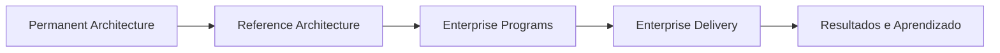

# Roadmap Arquitetural

Este roadmap acompanha a evolução do Guivos Knowledge Repository e da Guivos Enterprise Architecture.

## Estado atual

- **Baseline vigente:** `M1 — Research Foundation Complete` — `frozen`.
- **Checkpoint vigente:** `M2.0 — Architectural Evolution Hypothesis` — `experimental`.
- **Modelo institucional vigente:** `GEA-PLM-001 — Permanence Layer Model` — `validated`.
- **Marco concluído:** `A1 — Institutional Architecture Complete`.
- **Fase ativa:** `A2 — Functional Architecture Discovery`.
- **Entregável ativo:** `GCCM-001 — Guivos Core Capability Model` — `discovery`.

Consulte [Architectural Milestones](project/architectural-milestones.md).

## Direção estratégica

O GKR representa a Guivos em sua capacidade máxima e estado de maturidade. A realização ocorre progressivamente por Reference Architectures, Enterprise Programs e Enterprise Delivery.

## A0 — GKR Foundation

**Estado:** Completed.

- [x] Inicializar o repositório no GitHub.
- [x] Criar README e CHANGELOG.
- [x] Criar página inicial da documentação.
- [x] Configurar MkDocs, Mermaid e GitHub Pages.
- [x] Configurar geração de PDF como publicação derivada.
- [x] Criar Baseline M1.
- [x] Consolidar Foundation e Modelo Fundamental inicial.
- [x] Iniciar Product Architecture, Business Architecture, Research e governança.

## A1 — Institutional Architecture Complete

**Estado:** Completed.

- [x] Consolidar a macroestrutura da GEA.
- [x] Criar `GEA-PLM-001 — Permanence Layer Model`.
- [x] Definir Permanent Architecture.
- [x] Definir Reference Architecture.
- [x] Definir Enterprise Programs.
- [x] Definir Enterprise Delivery.
- [x] Formalizar Institutional Permanence.
- [x] Formalizar Vision First.
- [x] Formalizar Architectural Gravity.
- [x] Formalizar Progressive Realization.
- [x] Formalizar Downward Influence.
- [x] Formalizar Layer Integrity.
- [x] Formalizar o GKR como representação canônica da Guivos em seu estado de maturidade.
- [x] Registrar o marco A1.

### Itens preservados para evolução controlada

A conclusão de A1 não encerra o aprofundamento das arquiteturas existentes. Permanecem pendentes, entre outros:

- modelos de Participantes, Oportunidades, Experiências, Relacionamentos e Conhecimento do Ecossistema;
- Business Outcomes, Core Business Capabilities, Capability Map, Value Chains, Organizational Model e Operating Model;
- Data & Intelligence Architecture;
- Technology Architecture;
- Governance Architecture;
- Knowledge Architecture;
- validação empírica do RP-001.

Esses itens devem evoluir sem reabrir automaticamente a macroestrutura institucional.

## A2 — Functional Architecture Discovery

**Estado:** Active.

### Objetivo

Descobrir o conjunto mínimo e suficiente de Core Capabilities permanentes que explica aquilo que a Guivos deve ser capaz de realizar em sua maturidade.

### Entregável principal

`GCCM-001 — Guivos Core Capability Model`.

### A2.1 — Inicialização

- [x] Criar a página de Architectural Milestones.
- [x] Criar a estrutura inicial do GCCM-001.
- [x] Definir propósito, pergunta arquitetural e limites do GCCM.
- [x] Definir Core Capability Admission Rule.
- [x] Definir testes de destruição, irredutibilidade e cobertura da missão.
- [x] Registrar que nenhuma Core Capability está canônica na versão inicial.

### A2.2 — Evidence Extraction

- [ ] Inventariar fontes prioritárias do GKR.
- [ ] Extrair verbos institucionais, responsabilidades, objetivos, relações e decisões.
- [ ] Registrar cada evidência com referência à fonte e ao status do ativo.
- [ ] Separar evidência consolidada de hipótese, draft e experimento.

Fontes prioritárias:

1. Foundation Architecture;
2. Modelo Fundamental do GEB;
3. Product Architecture;
4. Business Architecture;
5. Research Domain;
6. ADRs e validações;
7. GEA e Permanence Layer Model.

### A2.3 — Semantic Clustering

- [ ] Agrupar evidências semanticamente equivalentes.
- [ ] Identificar redundâncias terminológicas.
- [ ] Registrar divergências e fronteiras provisórias.
- [ ] Evitar nomear Core Capabilities antes da formação de agrupamentos suficientes.

### A2.4 — Candidate Core Capabilities

- [ ] Formular candidatas provisórias.
- [ ] Associar evidências a cada candidata.
- [ ] Aplicar a Admission Rule.
- [ ] Aplicar os testes de destruição e irredutibilidade.
- [ ] Fundir ou rejeitar candidatas redundantes.

### A2.5 — Mission Coverage

- [ ] Verificar cobertura do propósito e da missão operacional.
- [ ] Verificar cobertura do Modelo Fundamental do GEB.
- [ ] Verificar cobertura dos produtos e da geração de valor.
- [ ] Identificar lacunas e sobreposições.
- [ ] Buscar o menor conjunto suficiente.

### A2.6 — Validation and Catalog

- [ ] Preparar validação arquitetural formal.
- [ ] Registrar decisões de retenção, fusão e rejeição.
- [ ] Consolidar o catálogo validado.
- [ ] Definir relações entre Core Capabilities.
- [ ] Atualizar status e versão do GCCM.
- [ ] Não promover à Canon sem base suficiente.

## A3 — Operational Architecture

**Estado:** Planned.

- [ ] Criar `PRA-001 — Platform Reference Architecture` após a validação mínima do GCCM.
- [ ] Descrever como as Core Capabilities cooperam.
- [ ] Definir fluxos conceituais, responsabilidades e fronteiras operacionais.
- [ ] Derivar Domain Reference Architectures.
- [ ] Consolidar identidade, conhecimento, IA, dados, grafo, integrações, segurança, experiência, observabilidade e escalabilidade em nível de referência.

## A4 — Platform Engineering

**Estado:** Planned.

- [ ] Definir portfólio executivo de Enterprise Programs.
- [ ] Definir programa de Platform Engineering.
- [ ] Definir programa de Product Portfolio.
- [ ] Definir programa de AI, Data & Knowledge.
- [ ] Definir programa de Business Growth.
- [ ] Definir programa de Global Expansion.
- [ ] Definir repositórios, backlogs, releases e ciclos de Enterprise Delivery.
- [ ] Garantir rastreabilidade entre arquitetura, programa e implementação.

## A5 — Canon 1.0

**Estado:** Planned.

Critério preliminar:

Primeira consolidação integrada da Foundation, GEA, GCCM, PRA e arquiteturas de referência essenciais, com rastreabilidade suficiente para orientar programas e implementações.

## Pesquisa e validação paralelas

As atividades abaixo permanecem válidas e podem ser retomadas quando necessárias às decisões da A2 e A3:

- [ ] iniciar o Evidence Registry do RP-001;
- [ ] registrar fontes primárias e contraevidências;
- [ ] refinar a MS-001;
- [ ] construir o Ecosystem Phenomena Catalog — EPC;
- [ ] produzir Architectural Recommendations;
- [ ] derivar e validar Candidate Outcomes.

## Hipóteses preservadas fora da Canon

- Sistema Humano de Evolução;
- transformação como fenômeno fundamental;
- mudança de estado como unidade mínima;
- Worldview;
- Knowledge-Centric Enterprise;
- Modelo Explicativo Integrado — MEI;
- Enterprise Theory;
- Research Question Map;
- organização do conhecimento por perguntas;
- Knowledge Objects;
- Grafo de Conhecimento Arquitetural;
- Knowledge Twin;
- Expected Behaviors;
- Roadmap Epistemológico;
- pipeline de maturidade do conhecimento;
- catálogo definitivo de invariantes;
- Guivos Meta-Model — GMM;
- Guivos Knowledge System — GKS;
- Knowledge Validation Framework — GKVF;
- Knowledge Validation Standards — KVS.

## Próxima sprint

Executar **A2.2 — Evidence Extraction**, iniciando pela Foundation, pelo Modelo Fundamental do GEB, pela Product Architecture e pela Business Architecture, sem nomear antecipadamente o catálogo final de Core Capabilities.
