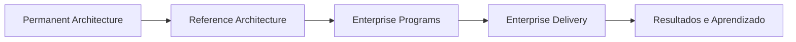

# Roadmap Arquitetural

Este roadmap acompanha a evolução do Guivos Knowledge Repository e da Guivos Enterprise Architecture.

## Estado atual

- **Baseline institucional vigente:** `M1 — Research Foundation Complete` — `frozen`.
- **Checkpoint experimental vigente:** `M2.0 — Architectural Evolution Hypothesis`.
- **Baseline vigente da Foundation:** `A2-B3 — Foundation Architecture Review Complete` — `frozen`.
- **Modelo institucional vigente:** `GEA-PLM-001 — Permanence Layer Model` — `validated`.
- **Marco concluído:** `A1 — Institutional Architecture Complete`.
- **Fase ativa:** `A2 — Functional Architecture Discovery`.
- **Revisão concluída:** `A2-R01 — Foundation Architecture Review`.
- **Próxima revisão autorizada:** `A2-R02 — Fundamental Model Review`.
- **Entregável ativo:** `GCCM-001 — Guivos Core Capability Model` — `discovery`, versão `0.4.0`.
- **Core Capabilities candidatas:** 0.
- **Core Capabilities canônicas:** 0.

Consulte [Architectural Milestones](project/architectural-milestones.md).

## Direção estratégica

O GKR representa a Guivos em sua capacidade máxima e estado de maturidade. A realização ocorre progressivamente por Reference Architectures, Enterprise Programs e Enterprise Delivery.



## Ciclo de revisão arquitetural vigente

```text
Evidence Analysis
  -> Evidence Matrix
  -> Canonical Consolidation
  -> Readiness Assessment
  -> Architectural Validation
  -> Architectural Audit
  -> Baseline
```

O método permanece estável e somente será alterado diante de limitação objetiva demonstrada por aplicação prática.

## A0 — GKR Foundation

**Estado:** Completed.

- [x] Inicializar o repositório e sua governança documental.
- [x] Configurar Markdown, Mermaid, MkDocs, GitHub Pages e PDF.
- [x] Consolidar a Foundation e o Modelo Fundamental inicial.
- [x] Iniciar Product Architecture, Business Architecture e Research.

## A1 — Institutional Architecture Complete

**Estado:** Completed.

- [x] Consolidar a macroestrutura da GEA.
- [x] Criar `GEA-PLM-001 — Permanence Layer Model`.
- [x] Formalizar Permanent Architecture, Reference Architecture, Enterprise Programs e Enterprise Delivery.
- [x] Formalizar os princípios de permanência, visão, gravidade arquitetural e realização progressiva.
- [x] Registrar o GKR como representação canônica da Guivos madura.

## A2 — Functional Architecture Discovery

**Estado:** Active.

### Objetivo

Descobrir o conjunto mínimo e suficiente de Core Capabilities permanentes que explica aquilo que a Guivos deve ser capaz de realizar em sua maturidade.

### Entregável principal

`GCCM-001 — Guivos Core Capability Model`.

### A2.1 — Inicialização

- [x] Criar a estrutura inicial do GCCM-001.
- [x] Definir propósito, pergunta arquitetural e limites.
- [x] Definir Admission Rule e testes de destruição.
- [x] Registrar que nenhuma Core Capability nasce canônica.
- [x] Estabilizar o método de descoberta.

### A2.2 — Foundation Evidence Extraction

- [x] Analisar F01 — Essência.
- [x] Analisar F02 — Propósito.
- [x] Analisar F03 — Missão Operacional.
- [x] Analisar F04 — Visão de Longo Prazo.
- [x] Analisar F05 — Constituição.
- [x] Analisar F06 — Princípios Permanentes.
- [x] Consolidar 173 assertions, 43 meanings, 50 invariants e 54 responsibilities em estado bruto.
- [x] Manter o registro de candidatas vazio.

### A2.3 — A2-R01 Foundation Architecture Review

**Estado:** Completed — Frozen in A2-B3.

- [x] Criar `A2-R01-FEM-001 — Foundation Evidence Matrix`.
- [x] Criar `A2-R01-CC-001 — Foundation Canonical Consolidation`.
- [x] Consolidar 50 invariantes em 18 invariantes da Foundation.
- [x] Consolidar 54 responsabilidades em 16 responsabilidades da Foundation.
- [x] Identificar lacunas, contradições, sobreposições e conceitos absorvidos.
- [x] Criar `A2-R01-RA-001 — Foundation Readiness Assessment`.
- [x] Registrar `AV-A2-001 — Foundation Architecture Validation`.
- [x] Criar e aplicar `GEA-AUDIT-001 — Architectural Audit Framework`.
- [x] Registrar `A2-R01-AUD-001` com resultado `PASS`.
- [x] Congelar `A2-B3 — Foundation Architecture Review Complete`.

### A2.4 — A2-R02 Fundamental Model Review

**Estado:** Authorized — Next.

- [ ] Abrir formalmente `A2-R02`.
- [ ] Analisar `KU-FM-001 — Fenômeno da Evolução`.
- [ ] Analisar `KU-FM-002 — Modelo Fundamental da Jornada`.
- [ ] Analisar `KU-FM-003 — Quatro Naturezas Fundamentais`.
- [ ] Construir a Fundamental Model Evidence Matrix.
- [ ] Executar Canonical Consolidation do Modelo Fundamental.
- [ ] Avaliar readiness, validar, auditar e congelar a próxima baseline.
- [ ] Confrontar os resultados com a Foundation A2-B3.

### A2.5 — Product e Business Architecture

- [ ] Analisar Product Architecture.
- [ ] Analisar Business Architecture.
- [ ] Concluir o inventário mínimo de fontes prioritárias.

### A2.6 — Semantic Clustering e Candidates

- [ ] Agrupar evidências equivalentes entre múltiplas arquiteturas.
- [ ] Identificar redundâncias terminológicas e fronteiras.
- [ ] Formular candidatas apenas quando houver convergência suficiente.
- [ ] Aplicar Admission Rule, testes de destruição e irredutibilidade.
- [ ] Fundir ou rejeitar candidatas redundantes.

### A2.7 — Mission Coverage, Validation and Catalog

- [ ] Verificar cobertura da missão e do Modelo Fundamental.
- [ ] Identificar lacunas e sobreposições.
- [ ] Preparar validação arquitetural formal.
- [ ] Consolidar o menor conjunto suficiente.
- [ ] Atualizar o catálogo canônico somente com base suficiente.

## A3 — Operational Architecture

**Estado:** Planned.

- [ ] Criar `PRA-001 — Platform Reference Architecture` após validação mínima do GCCM.
- [ ] Descrever cooperação, fluxos, responsabilidades e fronteiras das capacidades.
- [ ] Derivar Domain Reference Architectures.

## A4 — Platform Engineering

**Estado:** Planned.

- [ ] Definir Enterprise Programs de Platform Engineering, Product Portfolio, AI/Data/Knowledge, Business Growth e Global Expansion.
- [ ] Definir repositórios, backlogs, releases e ciclos de Enterprise Delivery.
- [ ] Garantir rastreabilidade entre arquitetura, programa e implementação.

## A5 — Canon 1.0

**Estado:** Planned.

Primeira consolidação integrada da Foundation, GEA, GCCM, PRA e arquiteturas de referência essenciais.

## Open Architecture Topics

| Tema | Estado | Dependências principais |
|---|---|---|
| Enterprise Economic Model | Planned / Deferred | GCCM, Business Outcomes e Core Business Capabilities |
| Global Governance Model | Planned | Governance Architecture e expansão global |
| Organizational Model | Planned | Outcomes, Capabilities e Value Chains |
| Operating Model | Planned | Organizational Model e PRA |
| AI Governance | Planned | AI Reference Architecture, Data Governance e Security |
| Knowledge Graph Logical Model | Planned | GCCM, PRA e Data & Intelligence Architecture |
| Enterprise Metrics Framework | Planned | Outcomes, Economic Model e Operating Model |

## Hipóteses preservadas fora da Canon

- Sistema Humano de Evolução;
- transformação como fenômeno fundamental;
- mudança de estado como unidade mínima;
- Worldview;
- Knowledge-Centric Enterprise;
- taxonomias metodológicas adicionais;
- GEA Manifesto;
- GMM, GKS, GKVF e KVS.

## Ponto exato de retomada

Abrir `A2-R02 — Fundamental Model Review` e iniciar a Evidence Analysis de `KU-FM-001 — Fenômeno da Evolução`, utilizando a Foundation A2-B3 como referência normativa.