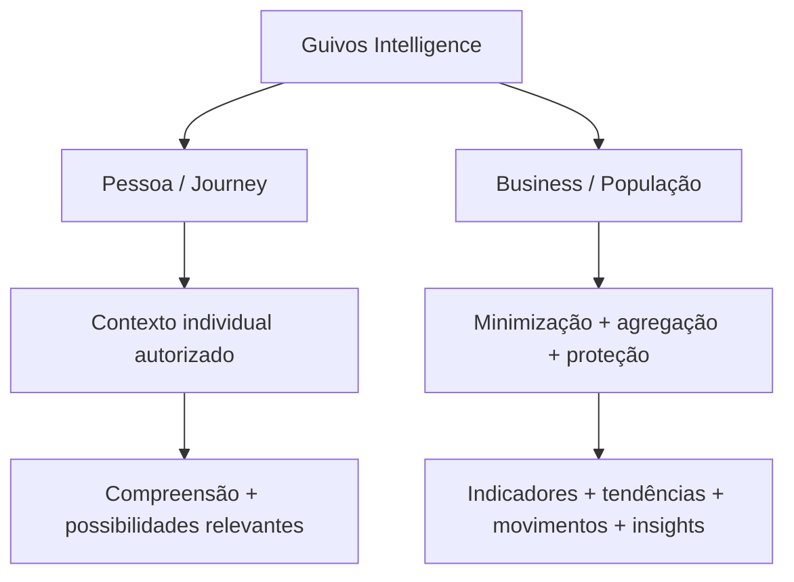

# Roadmap Arquitetural — Consolidação Documental P0–P9

## 1. Autoridade

Este roadmap registra o estado global após a ressincronização documental de agosto de 2026, a convergência das oito Homes públicas atualmente incorporadas ao handoff comum, a ressincronização da autoridade do Guivos Business em `GPA-004` v1.6.0, a convergência documental da Home Pública do Business, a convergência integral do Produto Especializado Guivos Intelligence em `GPA-006` v2.0.0, a convergência documental de sua Home Pública e a emissão externa v4 do handoff de Design. O estado oficial permanece em `GKR-STATE-001`.

A decisão pós-P5 de 2026-08-12 que afastava wireframe da continuidade da Home de Organizações e Coletivos permanece preservada como histórico em `GKR-HOME-DECISION-NO-WIREFRAME-001`, mas foi posteriormente superada **somente quanto à autorização procedimental da fase externa de Design** por `GKR-UX-HOMES-DESIGN-HANDOFF-001`. A sincronização pós-v4 não cria qualquer tela, wireframe, UI ou protótipo.

A ressincronização do Business é uma frente de autoridade de produto. Ela explicita o formato funcional já validado, corrige a leitura residual de “jornadas corporativas” e não inicia UXA-102 nem altera o marco M7.88.

A Home Business é uma frente separada de Experience Architecture. Arquitetura narrativa, contratos de autoridade, conversão global v2, Documento Mestre, Source Lock semântico e Source Lock Operacional + Prompt estão convergidos. Business integra `GKR-UX-HOMES-DESIGN-HANDOFF-001` v1.3.0 e a emissão externa v4; nenhum output visual é automaticamente canônico, implementado ou publicado.

A convergência do Guivos Intelligence permanece uma **frente de autoridade de produto** separada da fila UXA. `GPA-006 2.0.0` consolida os Checkpoints 1–12, incluindo identidade, duas frentes de geração de valor, capacidades, inputs, outputs, proteção populacional, contratos interproduto, arquitetura tecnológica subordinada, modos de entrega, Intelligence Serving, direção comercial, governança, maturidade, gaps e guardrails. Posteriormente, Product Source Lock, Narrative, Documento Mestre, Home Source Lock, Handoff e GENINPUT da Home Intelligence também foram convergidos e incorporados ao Design Delivery v4. Isso não cria Design nem comprova implementação técnica.

## 2. Estado vigente

| Elemento | Estado |
|---|---|
| Era | GE-2 — Knowledge |
| marco funcional | **M7.88** |
| última UXA | **UXA-101** |
| UXA-102/V5 | **não iniciada** |
| SVGs | **121** |
| associações | **121** |
| perfis | **34** |
| superfícies/estados/fronteiras | **57** |
| transições | **66** |
| Engenharia de Produto | pausada antes de W0-01 |
| programa P0–P9 | documentalmente consolidado após integração de P9 |
| Guivos Business — autoridade de produto | **GPA-004 v1.6.0; duas ofertas principais: Programas de Incentivo + Guivos Journey custeado pela Empresa; contrato parte da Empresa; Business distinto de Organização e independente de Ads** |
| Home Pública — Guivos Business | **convergida; Documento Mestre + conversão v2 + contratos de autoridade + Source Locks; incluída na emissão v4; nenhum output visual produzido no GKR** |
| Guivos Intelligence — autoridade de produto | **GPA-006 v2.0.0 convergido; Checkpoints 1–12 consolidados; duas frentes: Pessoa/Journey + Business/População; Product Source Lock v1.0.0 integrado** |
| Home Pública — Guivos Intelligence | **Narrative + Documento Mestre + Source Lock + Handoff + GENINPUT convergidos; incluída na emissão v4; wireframe, UI, protótipo e Design não iniciados** |
| Home Pública — Pessoa | Documento Mestre + reconciliação pós-Media + Source Lock; incluída no handoff v4 |
| Home Pública — Organizações e Coletivos | Documento Mestre + reconciliação pós-Media + Source Lock; P1–P5 preservados como histórico; incluída no handoff v4 |
| Home Pública — Guivos Mall | Documento Mestre + reconciliação pós-Media + Source Lock; incluída no handoff v4 |
| Home Pública — Guivos Travel | Documento Mestre + reconciliação pós-Media + Source Lock; incluída no handoff v4 |
| Home Pública — Guivos Media | Documento Mestre + GPA-005 + Source Lock; incluída no handoff v4 |
| Home Pública — Guivos Ads | Documento Mestre + GPA-007 + Source Lock; incluída no handoff v4 |
| handoff comum das oito Homes | **GKR-UX-HOMES-DESIGN-HANDOFF-001 v1.3.0 ativo** |
| pacote externo para Design | **GKR-UX-HOMES-DESIGN-DELIVERY-001 v4.0.0 — 31 fontes canônicas + 8 guias operacionais** |
| snapshot externo v4 | **`delivery/design-handoff-v4` @ `dfed980d8cfb39bbe4694e58d7c86ca0692266dc`; tree `270e404cf0b5bf0d5d543bbbb0c5bd6a1f4602df`; 39 arquivos** |
| snapshot externo v3 | **preservado em `delivery/design-handoff-v3` @ `7b2b20c035551e3b1206af987aaddda710757166`** |
| snapshot externo v2 | **preservado em `delivery/design-handoff-v2` @ `486f1c5e784be6cf3db9b2fbcbc47da39f9e9016`** |
| snapshot externo v1 | **preservado em `delivery/design-handoff-v1` @ `8e2a356ca84ba980e588258757800cde2a946f40`** |

## 3. Sequência funcional preservada

```text
UXA-097 — compreensão inicial → Tela Hoje
→ UXA-098 — publicação → descoberta → Mapa/Lista → Detalhe
→ UXA-099 — estados residuais Opportunity Boost
→ UXA-100 — Planos
→ UXA-101 — saída consciente → BND-001
→ UXA-102/V5 — PENDENTE, NÃO INICIADA
```

A convergência das Homes públicas, o handoff de Design, a ressincronização do Guivos Business, a convergência da Home Business, a convergência do `GPA-006 2.0.0`, a convergência da Home Intelligence e a emissão v4 constituem frentes separadas da sequência UXA e **não criam nova UXA, não alteram M7.88 e não retomam Engenharia de Produto**.

## 4. Consolidação temática

| Pacote | Resultado documental |
|---|---|
| P0 | intake/evidência preservado |
| P1/P1.1 | semântica e nomenclaturas integradas |
| P2 | Neo4j como referência de grafo |
| P3 | naming/marca/ativos governados |
| P4 | metodologia e gates de validação integrados |
| P5 | arquitetura institucional/jurídica integrada |
| P6 | privacidade e verdade operacional governadas |
| P7 | internacionalização e gates territoriais integrados |
| P8 | sete Produtos Especializados rebaselineados |
| P9 | estado transversal, matriz e Public Canon reconciliados |

Na Experience Architecture pública, oito Homes atingiram convergência documental suficiente para o handoff controlado:

1. Pessoa;
2. Organizações e Coletivos;
3. Guivos Mall;
4. Guivos Travel;
5. Guivos Media;
6. Guivos Ads;
7. Guivos Business;
8. Guivos Intelligence.

A inclusão da Home Intelligence no conjunto não autoriza automaticamente materialização visual. Seu pacote documental específico está convergido e incorporado à emissão v4.

A Home de Organizações e Coletivos preserva P1–P5 como histórico válido. `GKR-HOME-P5` registrou prontidão para decisão humana; a decisão pós-P5 inicialmente afastou wireframe; `GKR-UX-HOMES-DESIGN-HANDOFF-001`, posterior, passou a autorizar proceduralmente explorações de Design em frente externa. A superação é exclusivamente procedimental e não altera significado, narrativa ou produto; nenhuma exploração é iniciada por esta sincronização.

A reconciliação pós-Media estabeleceu que Guivos Media pode abastecer editorialmente outras superfícies sem assumir autoridade sobre a finalidade, narrativa ou operação dessas superfícies.

A Home Guivos Ads possui arquitetura própria, B2B e comercial, com `GKR-UX-HOME-ADS-MASTER-001`, `GPA-007` v1.3.0 e `GKR-UX-HOME-ADS-GENINPUT-001`. Ads preserva a autoridade das superfícies anfitriãs, organiza soluções por objetivo comercial e conduz a qualificação inteligente sem transformar contexto pessoal protegido em matéria-prima publicitária.

O Guivos Business está ressincronizado em `GPA-004` v1.6.0. O estado canônico preserva:

```text
Organização ≠ Guivos Business
Empresa no contrato Business ≠ novo tipo estrutural de participante
Guivos Business ≠ Guivos Ads
custeio empresarial da Journey ≠ propriedade ou controle da Journey
Programa de Pontos ≠ identidade do Business ≠ medida de evolução
Intelligence apoiando Business ≠ Intelligence como módulo Business
```

A arquitetura comercial do Business parte da **Empresa**, enquanto `Organização` permanece o tipo estrutural de participante na ontologia global. A direção humana validada é “Como podemos ajudar os seres humanos a terem uma vida melhor?”: a empresa amplia condições e possibilidades; não define evolução individual nem adquire autoridade sobre a Journey da pessoa.

### 4.1 Formato vigente do Guivos Business

O produto possui **duas ofertas principais**:

```text
GUIVOS BUSINESS
├── PROGRAMAS DE INCENTIVO
└── GUIVOS JOURNEY CUSTEADO PELA EMPRESA
```

Pontos Guivos, Guivos Intelligence, integrações/eventos, transações/liquidação e governança/gestão empresarial são capacidades relacionadas. Elas apoiam as ofertas sem criar automaticamente novas famílias comerciais.

**Programas de Incentivo** utilizam um núcleo comum de programa, campanha, participante, evento, regra, resultado, orçamento/financiamento e Intelligence. O mesmo núcleo pode atender recortes de funcionários/pessoas vinculadas e clientes sem exigir dois motores de produto distintos.

A segunda oferta é o **Guivos Journey existente, custeado pela empresa**. A empresa viabiliza acesso; a pessoa preserva voluntariedade, escolha, privacidade, pertinência e autoridade sobre a própria Journey. Não são formatos vigentes Journey para Empresas, Journey Business, Journey Corporativo, Journey Patrocinado, jornadas corporativas criadas pela empresa, trilhas obrigatórias ou cursos corporativos bonificados dentro do Journey.

### 4.2 Planos, contratação e implementação/operação

Os planos vigentes permanecem:

```text
Start
Growth
Scale
Enterprise
```

O plano não define qual oferta pode ser contratada. Sua função é governar profundidade de capacidade, Intelligence, integração, governança, escala e serviço.

A leitura funcional de referência permanece:

```text
START → operar
GROWTH → acompanhar e compreender
SCALE → interpretar e integrar
ENTERPRISE → governar em alta complexidade e escala
```

A arquitetura diferencia:

```text
OFERTA
≠ PLANO BUSINESS
≠ ESCALA / PARTICIPANTES / ACESSOS
≠ ORÇAMENTO PRÉ-PAGO DE INCENTIVO
≠ MODELO DE IMPLEMENTAÇÃO / OPERAÇÃO
```

A composição econômica de referência pode combinar plano Business, escala, ofertas contratadas, orçamento pré-pago e serviços adicionais. Preços, limites e entitlements finais permanecem abertos.

A conversão global vigente separa contratação e operação:

```text
CONTRATAÇÃO
→ ONLINE

MODELO DE IMPLEMENTAÇÃO / OPERAÇÃO
→ SELF-SERVICE
→ COM APOIO DO SUPORTE
→ GERENCIADO
```

No modelo `Com apoio do suporte`, a empresa conclui contratação e pagamento online; o suporte entra depois para continuidade da implementação. Os modelos não devem ser confundidos com os planos Start / Growth / Scale / Enterprise.

### 4.3 Pontos, impacto e Intelligence

O Programa de Pontos permanece capacidade Business. A equivalência econômica entre pontos e reais já validada permanece preservada e **não é reaberta** nesta frente. Journey permanece voluntário e com seus planos normais; pontos Business não pagam plano Journey e podem ser usados somente em possibilidades pagas elegíveis de Mall, Travel e Journey sem comprar pertinência, recomendação ou prioridade.

Na **Home Pública do Guivos Business**, Pontos foram deliberadamente retirados da narrativa. Isso não remove a capacidade funcional do produto; apenas impede que o mecanismo transacional se torne protagonista público da proposta de evolução e possibilidades.

A empresa carrega/financia o orçamento de pontos; a concessão à pessoa constitui consumo/alocação do orçamento empresarial, enquanto o uso posterior é evento distinto. A distribuição de onde os pontos foram **efetivamente utilizados** considera apenas usos realizados e fecha 100% entre Mall, Travel e Journey, excluindo não utilizados e expirados dessa métrica percentual.

Quando uma solução Business expressar recursos disponibilizados a uma ação de impacto, utiliza-se **VALOR DE IMPACTO LIBERADO**. O termo não equivale a impacto realizado, comprovado ou causado.

Guivos Intelligence apoia Business a partir de **dados e eventos gerados ou legitimamente conhecidos dentro do Ecossistema Guivos**. A empresa pode combinar externamente essas saídas com seus indicadores internos, inclusive por exportação estruturada/API quando contratualmente disponível. A Guivos não depende de importar bases internas da empresa para produzir o Intelligence Business e não utiliza comparação interna antes/depois como atalho para declarar causalidade.

Quando Journey é custeado pela empresa, Intelligence pode produzir leitura agregada e protegida de interesses, tendências, temas e movimentos autorizados. A empresa não recebe score individual de evolução, Journey individual ou explicação individual de pertinência.

### 4.4 Relações econômicas e fronteiras

Uma empresa pode contratar Business e Ads simultaneamente, mas como **relações comerciais independentes**. Business governa capacidades B2B próprias; Ads governa publicidade, patrocínio, impulsionamento e exposição comercial paga. Nenhuma contratação concede automaticamente autoridade, inventário, capacidades ou direitos do outro produto.

Business pode aumentar circulação econômica em Mall, Travel e possibilidades pagas apresentadas pelo Journey, mas cada produto preserva sua autoridade e sua receita própria. Esse efeito é upside do ecossistema; o Business deve ser economicamente sustentável por si.

### 4.5 Home Pública do Guivos Business — convergência e handoff

A Home Business alcançou convergência documental suficiente para handoff controlado.

A cadeia vigente é:

```text
ARQUITETURA NARRATIVA
→ GKR-UX-HOME-BUSINESS-NARRATIVE-001

CONTRATOS DE AUTORIDADE
→ GKR-UX-HOME-BUSINESS-AUTHORITY-001

CONVERSÃO GLOBAL VIGENTE
→ GKR-UX-HOME-BUSINESS-CONVERSION-002

DOCUMENTO MESTRE
→ GKR-UX-HOME-BUSINESS-MASTER-001

SOURCE LOCK SEMÂNTICO
→ GKR-UX-HOME-BUSINESS-SOURCELOCK-001

SOURCE LOCK OPERACIONAL + PROMPT
→ GKR-UX-HOME-BUSINESS-GENINPUT-001

HANDOFF CANÔNICO
→ GKR-UX-HOMES-DESIGN-HANDOFF-001 v1.3.0

EMISSÃO EXTERNA
→ DESIGN HANDOFF v4
```

A pergunta-mãe vigente é:

> **O que sua empresa pode tornar possível para as pessoas?**

A promessa é:

> **Mais possibilidades para as pessoas. Mais capacidade para sua empresa.**

A arquitetura pública preserva Journey antes de Incentivos, autonomia da pessoa, Pontos fora da Home, Intelligence visual e limitado àquilo que acontece dentro da Guivos, comparativo Start / Growth / Scale / Enterprise, configurador comercial e contratação online com três modelos de implementação/operação.

`GKR-BUSINESS-HOME-CONTINUITY-005` permanece histórico recuperável da convergência Business. A inclusão posterior no Design Delivery v4 não altera suas autoridades e não inicia materialização visual por esta sincronização.

O pacote de entrega v4 é governado por `GKR-UX-HOMES-DESIGN-DELIVERY-001`: 31 fontes canônicas separadas por Home, acrescidas de oito guias operacionais `LEIA-PRIMEIRO`, totalizando 39 arquivos no snapshot externo `dfed980d8cfb39bbe4694e58d7c86ca0692266dc`, tree `270e404cf0b5bf0d5d543bbbb0c5bd6a1f4602df`.

A emissão v3 continua preservada no snapshot `7b2b20c035551e3b1206af987aaddda710757166`, a emissão v2 no snapshot `486f1c5e784be6cf3db9b2fbcbc47da39f9e9016` e a emissão v1 no snapshot `8e2a356ca84ba980e588258757800cde2a946f40`. Nenhuma foi reescrita pela v4.

### 4.6 Guivos Intelligence — Produto e Home Pública convergidos

`GPA-006 2.0.0` encerrou a fase de estruturação conceitual do Produto Especializado e permanece sua autoridade superior.

A arquitetura consolidada reconhece:


```mermaid
flowchart TD
    I[Guivos Intelligence]
    I --> P[Pessoa / Journey]
    I --> B[Business / População]

    P --> P1[Contexto individual autorizado]
    P1 --> P2[Compreensão + possibilidades relevantes]

    B --> B1[Minimização + agregação + proteção]
    B1 --> B2[Indicadores + tendências + movimentos + insights]
```

O produto possui um único núcleo de Intelligence, duas frentes superiores e contratos claros com Journey, Business, Mall, Travel, Media e Ads.

Guardrails centrais:

```text
INTELLIGENCE ≠ JOURNEY
INTELLIGENCE ≠ BUSINESS
COMPREENDER ≠ DECIDIR
CONHECER ≠ UTILIZAR ≠ COMPARTILHAR
PERSONALIZAR ≠ EXPOR
ENTITLEMENT ≠ AUTORIDADE
PAGAMENTO ≠ PERTINÊNCIA
INFERÊNCIA ≠ FATO
SINAL ≠ CERTEZA
TENDÊNCIA ≠ DESTINO
PERCEBER ANTES ≠ PREVER O FUTURO
TECNOLOGIA ≠ PRODUTO
```

`GIA-000 1.5.0` preserva CIE, LPM, GPMA e família de Intelligence Engines como candidatos técnicos/arquiteturais. `GPA-006 2.0.0` não declara microserviços, modelo físico de dados, ontologia física, Neo4j provisionado, GraphRAG/GDS operacional, modelo de IA selecionado, API operacional ou Power BI integrado.

Após o produto, foram integrados `GKR-INTELLIGENCE-PRODUCT-SOURCELOCK-001`, `GKR-UX-HOME-INTELLIGENCE-NARRATIVE-001`, `GKR-UX-HOME-INTELLIGENCE-MASTER-001`, `GKR-UX-HOME-INTELLIGENCE-SOURCELOCK-001`, `GKR-UX-HOME-INTELLIGENCE-HANDOFF-001` e `GKR-UX-HOME-INTELLIGENCE-GENINPUT-001`. A Home Intelligence está documentalmente convergida e incluída no snapshot externo v4, sem tela, wireframe, UI, protótipo ou Design produzido.

## 5. Lacunas não fechadas por documentação

Continuam dependentes de evidência ou autorização própria:

- resultados reais de mercado e PMF;
- implementação tecnológica e grafo em produção;
- fatos registrários de marca/domínios;
- constituição jurídica de eventual veículo social;
- controles legais/privacidade em produção;
- piloto e operação internacional;
- cobrança/gateway real;
- handoffs especializados ainda não materializados;
- seleção e validação humana de eventuais direções visuais das Homes, caso uma frente visual seja futuramente autorizada;
- promoção de qualquer output de Design a estado canônico;
- implementação operacional da experiência inteligente de qualificação do Guivos Ads;
- implementação operacional de campanhas, inventário, pricing e mensuração do Guivos Ads;
- preços, limites quantitativos, SLA e entitlements finais dos planos Business;
- preço/faixa de escala e preço de acessos Journey custeados pela empresa;
- detalhamento operacional final dos modelos `Self-service / Com apoio do suporte / Gerenciado`;
- regras econômicas/operacionais ainda abertas do Programa de Pontos Business que não tenham autoridade própria já aprovada;
- arquitetura técnica de analytics/Intelligence Business, exportação/API e seus contratos;
- thresholds mínimos de agregação/coorte do Intelligence Business;
- modelo físico de dados do Guivos Intelligence;
- ontologia lógica completa e ontologia física;
- contrato operacional de inferência, explicabilidade e aprendizado;
- governança operacional de benchmarks e evidência causal;
- stack de IA, MLOps, Serving técnico e APIs do Intelligence;
- integração Power BI do Intelligence;
- pricing final ou oferta B2B autônoma do Intelligence;
- output visual validado/canônico da Home Pública do Guivos Intelligence;
- direção visual validada e output canônico da Home Pública do Guivos Business;
- UXA-102/V5;
- Product Engineering.

A equivalência econômica de pontos já validada **não é classificada como lacuna por este roadmap**; esta versão apenas não redefine seu parâmetro numérico.

## 6. Próximos caminhos possíveis

Após P9, não existe “P10” automático.

O próximo ato deve nascer de uma necessidade concreta e autoridade própria. Exemplos:

- evidência de pesquisa → VAL;
- decisão de implantação → ADR/Engineering;
- fato jurídico/institucional → gates P5;
- controle operacional/privacy → gates P6;
- readiness/piloto territorial → gates P7;
- nova continuidade funcional → UXA-102 somente por autorização humana separada;
- implementação → Product Engineering somente por reativação explícita;
- oito Homes convergidas → nenhuma frente visual é iniciada automaticamente pela existência do handoff;
- Guivos Ads → qualquer próxima frente comercial, visual ou inteligente exige ato próprio, sem inferir implementação automática;
- Guivos Business → qualquer materialização visual futura exige autorização própria e deve preservar exclusivamente seu contexto e Source Lock;
- **Guivos Intelligence → Produto e Home estão documentalmente convergidos e incluídos no v4; qualquer próximo movimento visual ou técnico exige autorização própria e deve preservar Product Source Lock, Narrative, Documento Mestre, Home Source Lock, Handoff e GENINPUT.**

## 7. Handoff e entrega para Design

O estado governado é:

```text
GKR
→ fonte de verdade e arquitetura

GKR-UX-HOMES-DESIGN-HANDOFF-001 v1.3.0
→ regras procedimentais de handoff para oito Homes

SOURCE LOCK DE CADA HOME
→ contexto permitido por execução futura

GKR-UX-HOMES-DESIGN-DELIVERY-001 v4.0.0
→ composição e integridade do pacote externo

GKR-UX-HOMES-DESIGN-DELIVERY-V4-SNAPSHOT-001
→ registro factual do snapshot emitido

branch delivery/design-handoff-v4
→ snapshot de distribuição vigente
→ 31 fontes canônicas + 8 guias = 39 arquivos
→ não é fonte canônica paralela

branch delivery/design-handoff-v3
→ snapshot histórico preservado

branch delivery/design-handoff-v2
→ snapshot histórico preservado

branch delivery/design-handoff-v1
→ snapshot histórico preservado

OUTPUT VISUAL
→ não produzido por esta continuidade
→ qualquer output futuro requer autorização e validação humanas
```

As branches de entrega não devem ser mescladas na `main` para duplicar documentos canônicos. Se qualquer fonte obrigatória evoluir materialmente, deve ser avaliada nova emissão do pacote em vez de substituição silenciosa de arquivos dentro de um snapshot já distribuído.

A Home do Guivos Business integra explicitamente a emissão v4. Seu contexto de trabalho é isolado e usa o Handoff Canônico comum, Source Lock semântico, Documento Mestre, Conversão Global v2, Contratos de Autoridade, `GPA-004` e Source Lock Operacional + Prompt. Documentos específicos das demais Homes não devem ser misturados na mesma execução generativa.

A Home do Guivos Intelligence também integra explicitamente a emissão v4. Seu contexto isolado usa GENINPUT, Handoff específico, Home Source Lock, Documento Mestre, Product Source Lock e `GPA-006`, além do Handoff Canônico comum. A inclusão não produz Design e não transfere autoridade de Journey ou Business para Intelligence.

## 8. Preservação

`ressincronização documental concluída ≠ produto implementado ≠ operação comprovada`.

`handoff emitido ≠ Design produzido ≠ solução aprovada ≠ output canônico ≠ implementação ≠ publicação`.

Para Organizações e Coletivos:

`decisão histórica sem wireframe ≠ proibição procedimental vigente`, pois o handoff posterior governa esse limite específico; nesta continuidade, porém, nenhum wireframe é criado.

Para Guivos Ads:

`Home convergida ≠ campanha operacional ≠ inventário disponível ≠ pricing público ≠ Intelligence implementado ≠ contratação automática`.

Para Guivos Business:

`Organização ≠ Business ≠ Ads`.

`Empresa como início do contrato Business ≠ novo tipo estrutural de participante`.

`duas ofertas principais = Programas de Incentivo + Guivos Journey custeado pela Empresa`.

`oferta ≠ plano ≠ escala ≠ orçamento pré-pago ≠ modelo de implementação/operação`.

`contratação = online ≠ modelo de implementação/operação`.

`Self-service / Com apoio do suporte / Gerenciado ≠ Start / Growth / Scale / Enterprise`.

`custeio da Journey ≠ propriedade da Journey ≠ acesso ao contexto pessoal protegido`.

`pontos em possibilidade Journey elegível ≠ pagamento de plano Journey ≠ compra de pertinência`.

`Programa de Pontos reconhecido arquiteturalmente ≠ presença obrigatória na narrativa pública da Home ≠ medida de evolução`.

`equivalência econômica preservada ≠ redefinição da equivalência nesta frente`.

`VALOR DE IMPACTO LIBERADO ≠ impacto realizado ≠ impacto comprovado`.

`Intelligence Business = dados/eventos gerados na Guivos ≠ ingestão obrigatória de KPIs internos da empresa`.

`Intelligence apoiando Business ≠ módulo Business ≠ acesso irrestrito a dados pessoais`.

`Home Business convergida + Source Lock + inclusão no v4 ≠ output visual aprovado ≠ implementação ≠ publicação`.

`GPA-004 v1.6.0 ressincronizado ≠ autorização para alterar a autoridade funcional durante eventual Design`.

Para Guivos Intelligence:

`GPA-006 2.0.0 convergido ≠ Intelligence implementado ≠ modelo de IA selecionado ≠ grafo em produção`.

`Produto Especializado próprio ≠ assinatura própria obrigatória`.

`Intelligence embutido ≠ Intelligence Direto`.

`entitlement ≠ autoridade`.

`maior plano ≠ menor privacidade`.

`Graph / Knowledge / Analytics / AI = arquiteturas/capacidades subordinadas ≠ identidade do produto`.

`Neo4j = reference_selected ≠ POC ≠ provisioned ≠ production`.

`GraphRAG = padrão candidato ≠ implementação`.

`Power BI = consumidor possível ≠ fonte de verdade`.

`Guivos.ai = possível superfície ≠ Guivos Intelligence`.

`Product Source Lock + Home Source Lock + Documento Mestre + Handoff + GENINPUT + snapshot v4 ≠ Design produzido ≠ implementação`.

`PERCEBER ANTES ≠ PREVER O FUTURO`.