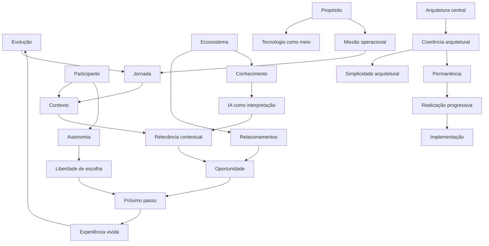

# A2-R01-FEM-001 — Foundation Evidence Matrix

## Finalidade

Consolidar a convergência das evidências extraídas das seis unidades da Foundation Architecture, organizando-as por conceito permanente, e não por documento.

A matriz é o principal insumo para:

1. `A2-R01-CC-001 — Canonical Consolidation`;
2. `A2-R01-RA-001 — Readiness Assessment`;
3. `AV-A2-001 — Foundation Architecture Validation`;
4. continuidade da A2 no Modelo Fundamental do GEB.

## Escopo

Fontes analisadas:

| Código | Fonte |
|---|---|
| F01 | Essência |
| F02 | Propósito |
| F03 | Missão Operacional |
| F04 | Visão de Longo Prazo |
| F05 | Constituição |
| F06 | Princípios Permanentes |

## Regra metodológica

A unidade de análise da Evidence Matrix é o **conceito permanente**, não o documento que originou a evidência.

Documentos são fontes. Conceitos permanentes são unidades de convergência. Decisões arquiteturais são unidades de governança.

| Artefato | Unidade de análise |
|---|---|
| Evidence Analysis | Documento |
| Evidence Matrix | Conceito permanente |
| Canonical Consolidation | Conceito permanente consolidado |
| Architecture Review | Arquitetura |
| ADR / AV | Decisão ou validação |

## Critérios de avaliação

### Frequência

Quantidade de fontes da Foundation em que o conceito aparece direta ou indiretamente.

### Centralidade

Grau de importância do conceito para explicar a identidade, finalidade, funcionamento ou governança permanente da Guivos.

Escala:

- Crítica;
- Muito Alta;
- Alta;
- Média;
- Baixa.

### Dependência arquitetural

Grau em que outros conceitos da Foundation dependem desse conceito para permanecer coerentes.

Escala:

- Crítica;
- Alta;
- Média;
- Baixa.

### Consistência

Grau de ausência de conflito entre as fontes.

Escala:

- Muito Alta;
- Alta;
- Média;
- Baixa.

### Maturidade

Estágio atual do conceito na Foundation.

| Estado | Definição |
|---|---|
| Emergente | Aparece de forma inicial ou localizada |
| Recorrente | Aparece em mais de uma fonte, ainda sem centralidade elevada |
| Consolidado | Possui recorrência, coerência e função arquitetural clara |
| Estrutural | Explica a arquitetura permanente e condiciona outros conceitos |

### Status

| Status | Definição |
|---|---|
| Observado | Evidência localizada |
| Corroborado | Evidência confirmada por múltiplas fontes |
| Consolidado | Conceito estabilizado dentro da Foundation |
| Validado | Conceito aprovado em Architecture Review |
| Canônico | Conceito incorporado formalmente à Canon |
| Rejeitado | Conceito rejeitado com justificativa |

## Regra de interpretação

Frequência não define importância isoladamente. Um conceito com menor frequência pode ser estrutural se tiver centralidade e dependência arquitetural elevadas.

A matriz deve ser interpretada pela combinação de:

```text
Frequência + Centralidade + Dependência + Consistência + Maturidade
```

## Foundation Evidence Matrix

| Conceito Permanente | Domínio | F01 | F02 | F03 | F04 | F05 | F06 | Frequência | Centralidade | Dependência | Consistência | Maturidade | Status |
|---|---|:---:|:---:|:---:|:---:|:---:|:---:|---:|---|---|---|---|---|
| Evolução | Identidade | ✓ | ✓ | ✓ | ✓ | ✓ | ✓ | 6/6 | Crítica | Crítica | Muito Alta | Estrutural | Consolidado |
| Participante | Identidade | ✓ | ✓ | ✓ | ✓ | ✓ | ✓ | 6/6 | Crítica | Crítica | Muito Alta | Estrutural | Consolidado |
| Ecossistema | Identidade | ✓ | ✓ | ✓ | ✓ | ✓ | ✓ | 6/6 | Muito Alta | Alta | Muito Alta | Estrutural | Consolidado |
| Propósito | Identidade | ✓ | ✓ | ✓ | ✓ | ✓ | ✓ | 6/6 | Crítica | Crítica | Muito Alta | Estrutural | Consolidado |
| Jornada | Orientação | ✓ | ✓ | ✓ | ✓ | ✓ | ✓ | 6/6 | Crítica | Crítica | Muito Alta | Estrutural | Consolidado |
| Contexto | Orientação | ✓ | ✓ | ✓ | ✓ | ✓ | ✓ | 6/6 | Crítica | Crítica | Muito Alta | Estrutural | Consolidado |
| Próximo passo | Orientação | ✓ | ✓ | ✓ | ✓ | ✓ | ✓ | 6/6 | Crítica | Crítica | Muito Alta | Estrutural | Consolidado |
| Oportunidade | Orientação | ✓ | ✓ | ✓ | ✓ | ✓ | ✓ | 6/6 | Crítica | Crítica | Muito Alta | Estrutural | Consolidado |
| Relevância contextual | Orientação | ✓ | ✓ | ✓ | ✓ | ✓ | ✓ | 6/6 | Muito Alta | Alta | Muito Alta | Estrutural | Consolidado |
| Autonomia | Experiência | ✓ | ✓ | ✓ | — | ✓ | ✓ | 5/6 | Muito Alta | Alta | Muito Alta | Consolidado | Consolidado |
| Liberdade de escolha | Experiência | ✓ | ✓ | ✓ | — | ✓ | ✓ | 5/6 | Muito Alta | Alta | Muito Alta | Consolidado | Consolidado |
| Experiência vivida | Experiência | ✓ | — | ✓ | ✓ | ✓ | ✓ | 5/6 | Alta | Alta | Alta | Consolidado | Consolidado |
| Relacionamentos | Experiência | ✓ | ✓ | — | ✓ | ✓ | ✓ | 5/6 | Alta | Média | Alta | Consolidado | Consolidado |
| Conhecimento | Conhecimento | ✓ | — | — | ✓ | ✓ | ✓ | 4/6 | Muito Alta | Alta | Muito Alta | Consolidado | Consolidado |
| Dados como registro | Conhecimento | — | — | — | — | ✓ | ✓ | 2/6 | Média | Média | Muito Alta | Recorrente | Corroborado |
| Conhecimento como compreensão | Conhecimento | — | — | — | — | ✓ | ✓ | 2/6 | Alta | Alta | Muito Alta | Recorrente | Corroborado |
| IA como interpretação | Tecnologia | — | ✓ | ✓ | ✓ | ✓ | ✓ | 5/6 | Alta | Média | Muito Alta | Consolidado | Consolidado |
| Tecnologia como meio | Tecnologia | ✓ | ✓ | ✓ | ✓ | ✓ | ✓ | 6/6 | Muito Alta | Alta | Muito Alta | Estrutural | Consolidado |
| Independência tecnológica | Tecnologia | — | ✓ | ✓ | ✓ | ✓ | ✓ | 5/6 | Alta | Alta | Muito Alta | Consolidado | Consolidado |
| Arquitetura central | Governança | — | — | ✓ | ✓ | ✓ | ✓ | 4/6 | Muito Alta | Alta | Muito Alta | Consolidado | Consolidado |
| Coerência arquitetural | Governança | — | — | ✓ | ✓ | ✓ | ✓ | 4/6 | Muito Alta | Alta | Muito Alta | Consolidado | Consolidado |
| Simplicidade arquitetural | Governança | — | — | — | ✓ | ✓ | ✓ | 3/6 | Alta | Média | Muito Alta | Consolidado | Consolidado |
| Suficiência arquitetural | Governança | — | — | — | ✓ | ✓ | ✓ | 3/6 | Alta | Média | Muito Alta | Consolidado | Consolidado |
| Validade global | Governança | — | ✓ | — | ✓ | ✓ | ✓ | 4/6 | Alta | Alta | Muito Alta | Consolidado | Consolidado |
| Permanência | Governança | — | ✓ | ✓ | ✓ | ✓ | ✓ | 5/6 | Muito Alta | Alta | Muito Alta | Estrutural | Consolidado |
| Maturidade institucional | Governança | — | — | — | ✓ | ✓ | ✓ | 3/6 | Alta | Alta | Muito Alta | Consolidado | Consolidado |
| Visão antes da execução | Governança | — | — | — | ✓ | ✓ | ✓ | 3/6 | Alta | Alta | Muito Alta | Consolidado | Consolidado |
| Realização progressiva | Governança | — | — | ✓ | ✓ | ✓ | ✓ | 4/6 | Alta | Alta | Muito Alta | Consolidado | Consolidado |
| Governança proporcional à permanência | Governança | — | — | — | ✓ | ✓ | ✓ | 3/6 | Alta | Alta | Muito Alta | Consolidado | Consolidado |
| Espiritualidade não coercitiva | Universalidade | — | ✓ | — | — | — | — | 1/6 | Média | Baixa | Alta | Emergente | Observado |
| Universalidade contextual | Universalidade | — | ✓ | — | ✓ | ✓ | ✓ | 4/6 | Alta | Média | Muito Alta | Consolidado | Consolidado |
| Extensibilidade futura | Evolução arquitetural | — | — | — | ✓ | ✓ | ✓ | 3/6 | Alta | Média | Muito Alta | Consolidado | Consolidado |
| Escalabilidade global | Evolução arquitetural | — | — | — | ✓ | ✓ | ✓ | 3/6 | Alta | Média | Muito Alta | Consolidado | Consolidado |

## Domínios semânticos observados

| Domínio | Conceitos principais | Interpretação |
|---|---|---|
| Identidade | Evolução, Participante, Ecossistema, Propósito | Define quem a Guivos é e por que existe |
| Orientação | Jornada, Contexto, Próximo Passo, Oportunidade, Relevância | Define como a Guivos organiza a progressão |
| Experiência | Autonomia, Liberdade, Experiência, Relacionamentos | Define como o valor se concretiza no ecossistema |
| Conhecimento | Conhecimento, Dados, Compreensão | Define o ativo informacional permanente |
| Tecnologia | IA, Tecnologia como meio, Independência tecnológica | Define a subordinação da implementação ao propósito |
| Governança | Arquitetura, Simplicidade, Permanência, Maturidade, Realização Progressiva | Define como a arquitetura preserva coerência no tempo |
| Universalidade | Universalidade contextual, espiritualidade não coercitiva | Define abertura a múltiplos contextos humanos |
| Evolução arquitetural | Escala global, extensibilidade futura | Define capacidade de crescimento sem perda de identidade |

## Grafo conceitual de convergência



## Interpretação preliminar

A Foundation apresenta alta convergência em torno de quatro eixos estruturais:

1. **Evolução do participante** — finalidade central.
2. **Relevância contextual** — mecanismo de orientação.
3. **Autonomia e experiência vivida** — limite e realização de valor.
4. **Conhecimento, arquitetura e permanência** — base de governança e continuidade.

A matriz confirma que a Foundation não produz Core Capabilities diretamente. Ela produz o ambiente conceitual e constitucional no qual capacidades poderão ser descobertas nas próximas fontes.

## Conceitos com centralidade crítica

| Conceito | Justificativa |
|---|---|
| Evolução | Finalidade central e critério de identidade |
| Participante | Sujeito da jornada e titular da decisão |
| Propósito | Justifica a existência institucional |
| Jornada | Estrutura a progressão contínua |
| Contexto | Condiciona relevância e próximos passos |
| Próximo passo | Unidade operacional de orientação |
| Oportunidade | Meio para evolução e experiência |

## Conceitos que exigem atenção na Canonical Consolidation

| Conceito | Motivo |
|---|---|
| Dados / Conhecimento | Exigem distinção rigorosa entre registro e compreensão |
| IA como interpretação | Deve permanecer subordinada à arquitetura e ao conhecimento |
| Espiritualidade não coercitiva | Baixa frequência, mas relevância identitária localizada |
| Simplicidade / Suficiência | Podem ser fundidas ou separadas conforme responsabilidade final |
| Permanência / Realização Progressiva | Devem ser reconciliadas com o Permanence Layer Model |
| Experiência / Valor | Devem ser avaliadas com cuidado antes de qualquer relação com modelo econômico |

## Resultado da matriz

A Foundation Evidence Matrix está suficientemente estruturada para iniciar a `A2-R01-CC-001 — Canonical Consolidation`.

A próxima etapa deverá deduplicar os 50 invariantes provisórios e as 54 responsabilidades provisórias, usando esta matriz como referência de convergência.